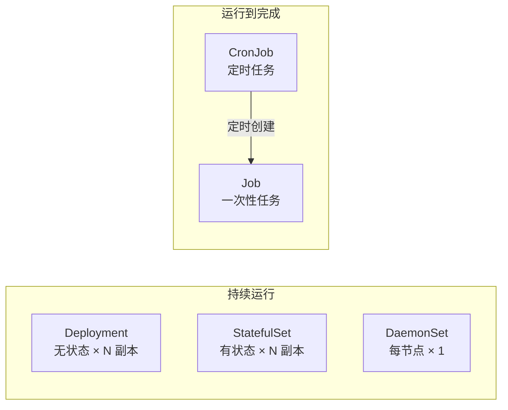
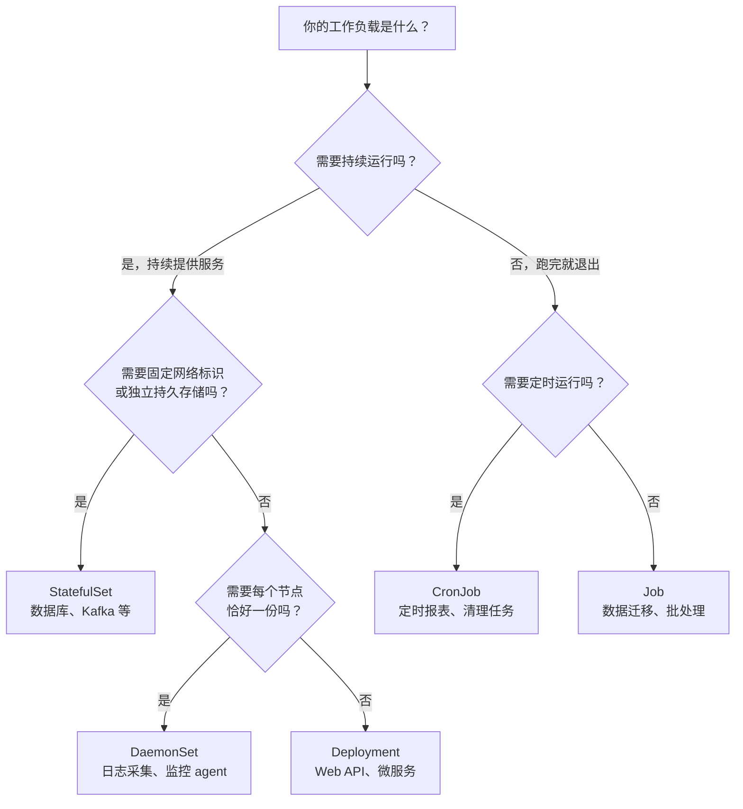

# K8s 工作负载类型

> 前置知识：了解 [[02-k8s-core-concepts|K8s 核心概念]]（Pod、Deployment、Service）。本文介绍 Deployment 之外的其他工作负载类型——它们解决 Deployment 解决不了的问题。
>
> 在 [[05-k8s-architecture#3.4 Controller Manager — "确保现实 = 期望"|K8s 架构]]中我们知道，每种工作负载类型背后都有一个对应的控制器在做 Reconciliation Loop（不了解也不影响本文阅读）。
>
> **学习建议**：各节概念介绍（3.1、4.1）和选型参考（3.3–3.4、4.4、五–六节）为基础。StatefulSet 详细机制（3.2）和 DaemonSet 配置细节（4.2–4.3）为进阶。

---

## 一、工作负载类型全景

K8s 提供四种内置的工作负载控制器，分别面向不同场景：

| 工作负载 | 一句话描述 | 典型应用 |
|------|------|------|
| **Deployment** | 无状态应用，副本可互换 | Web API、微服务 |
| **StatefulSet** | 有状态应用，每个副本有固定身份 | 数据库、消息队列、ZooKeeper |
| **DaemonSet** | 每个节点恰好运行一份 | 日志采集、监控 agent、CNI 插件 |
| **Job / CronJob** | 运行到完成 / 定时运行 | 数据迁移、定时报表、批处理 |



---

## 二、Deployment（回顾）

你已经在 [[10-helm-argocd-deployment|Helm 笔记]]中深入了解了 Deployment。这里只强调它的核心假设：

**Deployment 的核心假设：Pod 是无状态且可互换的。**

- 任何 Pod 被杀掉，新建一个完全等价的即可
- Pod 的名称是随机的（如 `api-7d8f9b6c4-xk2pq`）
- Pod 没有固定的网络标识（IP 会变）
- Pod 没有固定的存储（用 emptyDir，Pod 死了数据就没了）

当这些假设不成立时，就需要其他工作负载类型。

#### 🔗 实战链接：generic-deployer 的 Deployment 模板

项目中 80+ 微服务共用一个 Helm Chart 模板 `generic-deployer`，其核心就是 Deployment：

```yaml
# generic-deployer/templates/deployment.yaml（简化）
apiVersion: apps/v1
kind: Deployment
metadata:
  name: {{ include "generic-deployer.fullname" . }}
spec:
  replicas: {{ .Values.replicaCount }}
  strategy:
    type: RollingUpdate
    rollingUpdate:
      maxUnavailable: {{ .Values.updateStrategy.maxUnavailable | default 0 }}
      maxSurge: {{ .Values.updateStrategy.maxSurge | default "25%" }}
  template:
    spec:
      terminationGracePeriodSeconds: {{ .Values.terminationGracePeriodSeconds | default 45 }}
      containers:
        - name: {{ .Chart.Name }}
          image: "{{ .Values.image.repository }}:{{ .Values.image.tag }}"
```

以 `plaud-project-summary`（日本区生产环境）为例，它的 values 文件配置了 HPA 自动扩缩：

```yaml
# plaud-project-summary/values/ap-northeast-1/prod/main.yaml（摘录）
deployer:
  replicaCount: 2            # HPA 启用后此值为初始值
  autoscaling:
    enabled: true             # ✅ 开启 HPA
    minReplicas: 2            # 最少 2 个 Pod
    maxReplicas: 10           # 最多 10 个 Pod
    targetCPUUtilizationPercentage: 75
  resources:
    limits:
      cpu: 8
      memory: 16Gi
    requests:
      cpu: 8                  # requests = limits → Guaranteed QoS
      memory: 16Gi
  service:
    type: ClusterIP
    ports:
      - port: 8001
        name: api
        targetPort: 8001
      - port: 8889
        name: frontend
        targetPort: 8889
      - port: 8000
        name: health
        targetPort: 8000
```

> 这正是 Deployment 的典型场景：**无状态 AI 总结服务**，Pod 可互换，通过 HPA 自动扩缩容应对流量变化。三个端口分别服务 API、NiceGUI 前端和健康检查。

---

## 三、StatefulSet — 有状态应用

### 3.1 解决什么问题

假设你要在 K8s 上跑一个 3 节点的 PostgreSQL 集群（1 主 2 从）：

| 需求 | Deployment 能满足吗 | 为什么 |
|------|------|------|
| 每个实例有固定名称（主库 = pg-0） | 不能 | Deployment 的 Pod 名随机 |
| 每个实例有独立的持久存储 | 不能 | Deployment 共享 Volume 模板 |
| 实例按顺序启动（先启主库再启从库） | 不能 | Deployment 并行启动所有 Pod |
| 实例有固定的 DNS 名称 | 不能 | Deployment Pod IP 随时变 |

**StatefulSet 就是为这些需求设计的。**

### 3.2 StatefulSet 的三大保证（进阶）

#### 保证 1：稳定的网络标识

```yaml
apiVersion: apps/v1
kind: StatefulSet
metadata:
  name: postgres
spec:
  serviceName: postgres-headless    # 关联 Headless Service
  replicas: 3
  template:
    spec:
      containers:
        - name: postgres
          image: postgres:15
```

Pod 名称固定且有序：

```
postgres-0    ← 第一个创建，通常是主节点
postgres-1    ← 第二个
postgres-2    ← 第三个
```

配合 **Headless Service**（`clusterIP: None`），每个 Pod 有固定的 DNS：

```
postgres-0.postgres-headless.default.svc.cluster.local
postgres-1.postgres-headless.default.svc.cluster.local
postgres-2.postgres-headless.default.svc.cluster.local
```

> Pod 重启后名称和 DNS 不变（IP 可能变，但 DNS 不变），其他服务可以稳定地连接到特定实例。

#### 保证 2：独立的持久存储

```yaml
spec:
  volumeClaimTemplates:          # 每个 Pod 自动创建独立的 PVC
    - metadata:
        name: data
      spec:
        accessModes: ["ReadWriteOnce"]
        storageClassName: gp3
        resources:
          requests:
            storage: 100Gi
```

效果：

```
postgres-0 → PVC: data-postgres-0 → PV: ebs-vol-xxx (100Gi)
postgres-1 → PVC: data-postgres-1 → PV: ebs-vol-yyy (100Gi)
postgres-2 → PVC: data-postgres-2 → PV: ebs-vol-zzz (100Gi)
```

**Pod 被删除重建后，会重新绑定到同一个 PVC**，数据不丢失。详见 [[06-k8s-storage|K8s 存储]]。

#### 保证 3：有序部署与终止

```
创建顺序：postgres-0 → (Ready 后) → postgres-1 → (Ready 后) → postgres-2
删除顺序：postgres-2 → postgres-1 → postgres-0（反序）
更新顺序：postgres-2 → postgres-1 → postgres-0（反序，默认策略）
```

> 有序性保证了主从关系：先启动主节点，等它 Ready 后再启动从节点配置复制。

### 3.3 StatefulSet vs Deployment 对比

| 特性 | Deployment | StatefulSet |
|------|------|------|
| Pod 名称 | 随机（`api-7d8f9b6c4-xk2pq`） | 有序固定（`postgres-0`） |
| 网络标识 | 无固定 DNS | 每个 Pod 有固定 DNS |
| 存储 | 共享 Volume 模板 | 每个 Pod 独立 PVC |
| 启动顺序 | 并行 | 有序（0→1→2） |
| 更新策略 | 滚动更新（任意顺序） | 反序滚动（2→1→0） |
| 扩容 | 随机创建新 Pod | 追加序号最大的（如 3→4→5） |
| 缩容 | 随机删除 | 删除序号最大的（5→4→3） |

### 3.4 适用场景

- 数据库集群：PostgreSQL、MySQL、MongoDB
- 消息队列：Kafka、RabbitMQ
- 分布式协调：ZooKeeper、etcd
- 搜索引擎：Elasticsearch

> **实际生产中的建议**：大多数团队不直接写 StatefulSet YAML，而是使用 **Operator**（如 CloudNativePG for PostgreSQL、Strimzi for Kafka），Operator 封装了复杂的有状态运维逻辑。详见 [[11-k8s-extension-mechanisms#三、Operator 模式（进阶）|Operator 模式]]。

#### 🔗 实战链接：Strimzi Kafka（Operator 管理的 StatefulSet）

项目使用 Strimzi Operator 管理 Kafka 集群。虽然我们不直接写 StatefulSet，但 Operator 底层创建的就是 StatefulSet：

```yaml
# infra/values/strimzi-kafka/base/Kafka.yaml（简化）
apiVersion: kafka.strimzi.io/v1
kind: Kafka
metadata:
  name: kafka-log
spec:
  kafka:
    version: 4.1.1
    listeners:
      - name: plain
        port: 9092
        type: internal
        tls: false
    config:
      default.replication.factor: 3
      min.insync.replicas: 2
      num.partitions: 3

# infra/values/strimzi-kafka/base/KafkaNodePool.yaml（简化）
apiVersion: kafka.strimzi.io/v1
kind: KafkaNodePool
metadata:
  name: dual-role
spec:
  replicas: 3
  roles:
    - controller
    - broker
  storage:
    type: jbod
    volumes:
      - id: 0
        type: persistent-claim
        size: 100Gi          # 基础配置 100Gi
        deleteClaim: false    # 删除 Pod 时不删除 PVC！
        kraftMetadata: shared
```

生产环境通过 Kustomize overlay 覆盖资源和存储：

```yaml
# infra/values/strimzi-kafka/overlays/ap-northeast-1/prod/kafka-nodepool-patch.yaml
spec:
  resources:
    requests:
      cpu: 1
      memory: 32Gi
  storage:
    volumes:
      - id: 0
        size: 1Ti            # 生产环境 1TB 存储
```

> Strimzi Operator 会将这些配置转化为 StatefulSet，自动保证每个 Kafka Broker 有固定身份（`kafka-log-dual-role-0/1/2`）和独立的持久存储。这正是 3.2 节中提到的三大保证在实际项目中的体现。

#### 🔗 实战链接：MongoDB 集群（KubeBlocks Operator + volumeClaimTemplates）

项目使用 KubeBlocks Operator 管理 MongoDB ReplicaSet，配置中可以清晰看到 StatefulSet 的核心特征——`volumeClaimTemplates`：

```yaml
# infra/values/mongodb-prod/prod-plaud-features/base/Cluster.yaml（简化）
apiVersion: apps.kubeblocks.io/v1
kind: Cluster
metadata:
  name: mongo-cluster
  namespace: plaud-features
spec:
  terminationPolicy: DoNotTerminate   # 防止误删！
  clusterDef: mongodb
  topology: replicaset                # 3 节点副本集
  componentSpecs:
    - name: mongodb
      replicas: 3
      resources:
        limits:
          cpu: 16
          memory: 128Gi
      volumeClaimTemplates:           # 每个副本独立 PVC
        - name: data
          spec:
            storageClassName: gp3-encrypted
            accessModes:
              - ReadWriteOnce
            resources:
              requests:
                storage: 3Ti          # 每个副本 3TB！
```

> 这里的 `volumeClaimTemplates` 就是 StatefulSet 的保证 2——每个 MongoDB 副本（mongo-0/1/2）有自己独立的 3TB EBS 卷，Pod 重建后数据不丢失。`terminationPolicy: DoNotTerminate` 则是运维层面的额外保护。

#### 🔗 实战链接：OpenSearch 集群（Helm Chart 管理的 StatefulSet）

OpenSearch 使用官方 Helm Chart 直接创建 StatefulSet，分为 master 和 data 两种角色：

```yaml
# infra/values/opensearch-master/default.yaml（简化）
nodeGroup: master
roles:
  - master
replicas: 3
resources:
  limits:
    cpu: 1
    memory: 4Gi
persistence:
  enabled: true
  accessModes:
    - ReadWriteOnce
  size: 20Gi

# infra/values/opensearch-data/global/prod/values.yaml
resources:
  limits:
    cpu: 3
    memory: 32Gi
persistence:
  size: 2048Gi                # data 节点需要 2TB 存储
```

> 这展示了 StatefulSet 的典型分层部署：master 节点负责集群管理（资源需求小），data 节点负责数据存储（需要大量存储和内存）。两组 StatefulSet 各自独立管理。

---

## 四、DaemonSet — 每个节点一份

### 4.1 解决什么问题

有些工作负载需要在**每个节点**上恰好运行一份，不多不少：

- 日志采集器（Fluent Bit）：需要收集每个节点上所有 Pod 的日志
- 监控 Agent（node-exporter）：需要采集每个节点的系统指标
- 网络插件（aws-vpc-cni）：需要管理每个节点的网络接口
- 存储插件（ebs-csi-driver）：需要管理每个节点的卷挂载

Deployment 无法做到"每个节点恰好一个"——它只管副本总数，不管分布。

### 4.2 工作原理（进阶）

```yaml
apiVersion: apps/v1
kind: DaemonSet
metadata:
  name: fluent-bit
  namespace: logging
spec:
  selector:
    matchLabels:
      app: fluent-bit
  template:
    spec:
      containers:
        - name: fluent-bit
          image: fluent/fluent-bit:latest
          volumeMounts:
            - name: varlog
              mountPath: /var/log          # 挂载节点的 /var/log
      volumes:
        - name: varlog
          hostPath:
            path: /var/log                 # hostPath 直接访问节点文件系统
```

DaemonSet Controller 的行为：

```
节点变化 → DaemonSet 自动响应：
├── 新节点加入集群 → 自动在新节点上创建 Pod
├── 节点被移除     → 对应 Pod 自动删除
└── 更新 DaemonSet → 滚动更新所有节点上的 Pod
```

### 4.3 限定节点范围（进阶）

不是每个 DaemonSet 都要跑在所有节点上。通过 `nodeSelector` 或 `affinity` 限定：

```yaml
spec:
  template:
    spec:
      nodeSelector:
        node-type: gpu              # 只在 GPU 节点上运行
      tolerations:
        - key: nvidia.com/gpu       # 容忍 GPU 节点的 taint
          operator: Exists
          effect: NoSchedule
```

### 4.4 EKS 中常见的 DaemonSet

```bash
# 查看集群中的 DaemonSet
kubectl get daemonset -A

# 常见输出：
# NAMESPACE     NAME                  DESIRED   CURRENT   READY
# kube-system   aws-node              6         6         6     ← VPC CNI 网络插件
# kube-system   kube-proxy            6         6         6     ← Service 网络代理
# kube-system   ebs-csi-node          6         6         6     ← EBS 存储驱动
# monitoring    prometheus-node-exp   6         6         6     ← 节点指标采集
# logging       fluent-bit            6         6         6     ← 日志采集
```

#### 🔗 实战链接：node-exporter DaemonSet（监控指标采集）

项目中 kube-prometheus 部署了 node-exporter DaemonSet，在每个节点上采集系统指标：

```yaml
# infra/values/kube-prometheus/base/manifests/nodeExporter-daemonset.yaml（简化）
apiVersion: apps/v1
kind: DaemonSet
metadata:
  name: node-exporter
  namespace: monitoring
spec:
  template:
    spec:
      hostNetwork: true               # 使用节点网络（直接暴露指标端口）
      hostPID: true                    # 访问节点进程信息
      nodeSelector:
        kubernetes.io/os: linux        # 只在 Linux 节点运行
      tolerations:
        - operator: Exists             # 容忍所有 Taint（确保每个节点都有）
      containers:
        - name: node-exporter
          image: quay.io/prometheus/node-exporter:v1.9.1
          args:
            - --path.sysfs=/host/sys
            - --path.rootfs=/host/root
          volumeMounts:
            - mountPath: /host/sys
              name: sys
              readOnly: true
            - mountPath: /host/root
              name: root
              readOnly: true
      volumes:
        - hostPath:
            path: /sys
          name: sys
        - hostPath:
            path: /
          name: root
  updateStrategy:
    rollingUpdate:
      maxUnavailable: 10%              # 滚动更新时最多 10% 节点不可用
    type: RollingUpdate
```

> 注意三个关键配置：`tolerations: [operator: Exists]` 确保即使有 Taint 的节点也会运行（4.3 节内容）；`hostNetwork: true` 和 `hostPath` 让 Pod 直接访问节点的网络和文件系统——这是 DaemonSet 的典型模式。

#### 🔗 实战链接：plaud-file 临时文件清理 DaemonSet

项目中有个实际的 DaemonSet + CronJob 组合方案——通过 CronJob 自动给节点打标签，DaemonSet 利用 `nodeSelector` 只在目标节点上清理临时文件：

```yaml
# plaud-file/cronjob/tmp_cleanup.yaml（简化，DaemonSet 部分）
apiVersion: apps/v1
kind: DaemonSet
metadata:
  name: plaud-file-tmp-cleaner
  namespace: plaud-file
spec:
  template:
    spec:
      nodeSelector:
        plaud-file/enabled: "true"     # 只在有 plaud-file Pod 的节点上运行
      containers:
        - name: cleaner
          image: busybox
          command:
            - /bin/sh
            - -c
            - |
              while true; do
                find /data/plaud-file/tmp/ -type f -mmin +60 -print -delete
                sleep 1800             # 每 30 分钟清理一次
              done
          volumeMounts:
            - name: tmp-file-data
              mountPath: /data/plaud-file/tmp
      volumes:
        - name: tmp-file-data
          hostPath:
            path: /data/plaud-file/tmp
```

> 这是 4.3 节"限定节点范围"的实战例子：不是所有节点都需要清理，通过 `nodeSelector` 只在实际运行 plaud-file 服务的节点上部署清理 Pod。

---

## 五、Job / CronJob — 运行到完成的任务

### 5.1 Job：一次性任务

Job 适合"执行完就退出"的场景，与 Deployment 的"永远运行"形成对比：

```yaml
apiVersion: batch/v1
kind: Job
metadata:
  name: db-migration
spec:
  backoffLimit: 3              # 最多重试 3 次
  activeDeadlineSeconds: 600   # 超过 10 分钟强制终止
  template:
    spec:
      restartPolicy: Never     # Job 的 Pod 不自动重启（与 Deployment 不同！）
      containers:
        - name: migrate
          image: myapp:latest
          command: ["python", "manage.py", "migrate"]
```

**Job Controller 的行为**：

| Pod 结果 | Job 的动作 |
|------|------|
| 正常退出（exit 0） | Job 标记为 Completed |
| 异常退出（exit ≠ 0） | 重新创建 Pod（直到 backoffLimit） |
| 超过 activeDeadlineSeconds | 强制终止，标记为 Failed |

**并行 Job**：

```yaml
spec:
  completions: 10       # 需要 10 个 Pod 成功完成
  parallelism: 3        # 同时最多跑 3 个 Pod
```

### 5.2 CronJob：定时任务

CronJob 按 Cron 表达式定时创建 Job：

```yaml
apiVersion: batch/v1
kind: CronJob
metadata:
  name: daily-report
spec:
  schedule: "0 2 * * *"          # 每天凌晨 2 点
  concurrencyPolicy: Forbid       # 上一个还没跑完，不启动新的
  successfulJobsHistoryLimit: 3   # 保留最近 3 个成功 Job
  failedJobsHistoryLimit: 3       # 保留最近 3 个失败 Job
  jobTemplate:
    spec:
      template:
        spec:
          restartPolicy: OnFailure
          containers:
            - name: report
              image: myapp:latest
              command: ["python", "generate_report.py"]
```

**concurrencyPolicy 策略**：

| 策略 | 行为 |
|------|------|
| `Allow`（默认） | 允许并发，上一个没跑完也启动新的 |
| `Forbid` | 禁止并发，跳过这次调度 |
| `Replace` | 取消正在运行的 Job，启动新的 |

#### 🔗 实战链接：SpiceDB 数据库迁移 Job

项目中 SpiceDB（权限服务）使用 Job 在每次部署时执行数据库 schema 迁移：

```yaml
# plaud-spicedb/kustomize/base/migrate-job.yaml
apiVersion: batch/v1
kind: Job
metadata:
  name: spicedb-migrate
  annotations:
    argocd.argoproj.io/sync-wave: "-1"   # ArgoCD 部署顺序：先跑迁移，再部署服务
spec:
  ttlSecondsAfterFinished: 300            # 完成后 5 分钟自动清理
  backoffLimit: 3                          # 最多重试 3 次
  template:
    spec:
      restartPolicy: OnFailure
      containers:
        - name: spicedb-migrate
          image: authzed/spicedb:latest
          command: ["spicedb"]
          args: ["datastore", "migrate", "head",
                 "--datastore-conn-uri=$(SPICEDB_DATASTORE_URI)"]
          resources:
            requests:
              cpu: "100m"
              memory: "128Mi"
```

> 这是 Job 的经典用法——**数据库迁移**。`sync-wave: "-1"` 配合 ArgoCD 确保迁移先于服务 Deployment 执行；`ttlSecondsAfterFinished: 300` 避免已完成的 Job 堆积。

#### 🔗 实战链接：plaud-api 临时文件清理 CronJob

项目中多个服务使用 CronJob 定时清理处理过程中产生的临时文件：

```yaml
# plaud-api/cronjob/clean_tmp.yaml
apiVersion: batch/v1
kind: CronJob
metadata:
  name: cleanup-cronjob-plaud-api
spec:
  schedule: "*/30 * * * *"                # 每 30 分钟执行一次
  jobTemplate:
    spec:
      template:
        spec:
          affinity:
            podAffinity:
              requiredDuringSchedulingIgnoredDuringExecution:
                - labelSelector:
                    matchLabels:
                      app_name: plaud-api  # 必须调度到有 plaud-api Pod 的节点
                  topologyKey: kubernetes.io/hostname
          containers:
            - name: cleanup-container
              image: busybox
              command:
                - /bin/sh
                - -c
                - |
                  find /data/fsx/ai-speech01 -name "*.tmp" -mmin +10080 -exec rm -rf {} \;
                  find /data/fsx/ai-speech01 -name "*.mp3" -mmin +120 -exec rm -rf {} \;
                  find /data/fsx/ai-speech01 -name "*.wav" -mmin +120 -exec rm -rf {} \;
          restartPolicy: OnFailure
```

> 注意 `podAffinity` 的用法——清理 Job 必须跑在和 plaud-api 相同的节点上，因为临时文件存在节点本地磁盘（`hostPath`）。这是 CronJob + 调度亲和性的组合实战。

**Cron 表达式速查**：

```
┌──── 分钟 (0-59)
│ ┌──── 小时 (0-23)
│ │ ┌──── 日 (1-31)
│ │ │ ┌──── 月 (1-12)
│ │ │ │ ┌──── 星期 (0-6, 0=周日)
│ │ │ │ │
* * * * *

0 2 * * *       每天凌晨 2:00
*/5 * * * *     每 5 分钟
0 0 * * 1       每周一凌晨
0 0 1 * *       每月 1 号凌晨
```

### 5.3 Job vs Deployment 中的后台任务

在本项目中，AI 摘要任务是通过 [[12-k8s-pod-graceful-shutdown|优雅终止]]机制在 Deployment 的 Pod 中作为后台 asyncio Task 运行的。这种方式和 Job 各有适用场景：

| 方式 | 优点 | 缺点 | 适用场景 |
|------|------|------|------|
| **Deployment + 后台任务** | 响应快（不用创建新 Pod）、架构简单 | 滚动更新时需要优雅终止、资源常驻 | 高频、低延迟任务 |
| **Job / 外部任务系统（Temporal）** | 任务与服务解耦、天然支持重试/超时 | 冷启动开销、架构更复杂 | 低频、长耗时、需要严格保证的任务 |

---

## 六、选型决策树



---

## 延伸阅读

- [[10-helm-argocd-deployment|Helm 与 EKS 部署体系]] — Deployment 在实际项目中的完整配置
- [[12-k8s-pod-graceful-shutdown|Pod 优雅终止完全指南]] — Deployment 滚动更新时的任务保护
- [[06-k8s-storage|K8s 存储]] — StatefulSet 依赖的 PV/PVC 机制
- [[07-k8s-scheduling-resources|调度与资源管理]] — DaemonSet 与 Taints/Tolerations 的配合
- [[11-k8s-extension-mechanisms|K8s 扩展机制]] — 管理有状态应用的 Operator 模式
