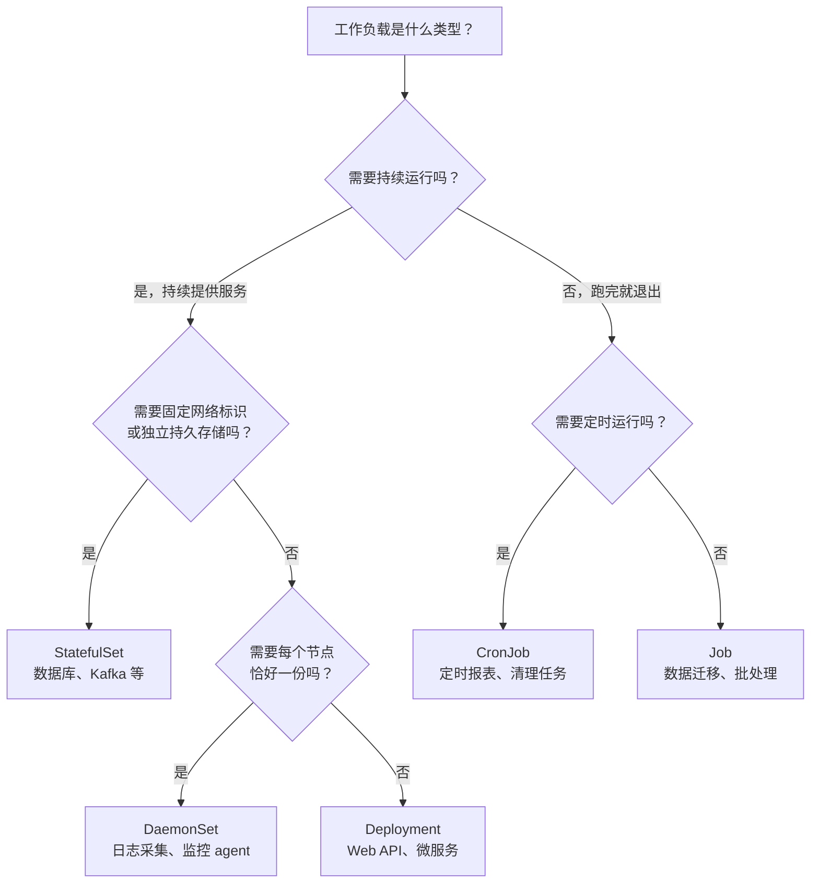

# K8s 工作负载类型——Deployment 不够用怎么办

> 前置知识：[[02-k8s-core-concepts|K8s 核心概念]] 中已经介绍了 Deployment——声明"需要 N 个副本"，K8s 自动维持。本文继续问：**如果工作负载不是"无状态 Web API"呢？**
>
> 以 plaud-project-summary 的技术栈为线索：它本身是 Deployment，但它依赖的 Kafka 是 StatefulSet，日志采集用 DaemonSet，数据库迁移用 Job，临时文件清理用 CronJob。每种工作负载类型都解决了 Deployment 解决不了的问题。

---

## 一、Deployment 的局限——什么时候不够用

Deployment 的核心假设是 **Pod 无状态且可互换**：

- 任何 Pod 被杀掉，新建一个完全等价的即可
- Pod 名称是随机的（如 `api-7d8f9b6c4-xk2pq`）
- Pod 没有固定网络标识（IP 会变）
- Pod 没有绑定的持久存储

plaud-project-summary 本身完美契合这些假设——无状态 AI 总结服务，2 个副本可互换，通过 HPA 自动扩缩：

```yaml
# 来源：deploy/plaud-project-summary/values/ap-northeast-1/prod/main.yaml（摘录）
deployer:
  replicaCount: 2
  autoscaling:
    enabled: true
    minReplicas: 2
    maxReplicas: 10
    targetCPUUtilizationPercentage: 75
  resources:
    limits:
      cpu: 8
      memory: 16Gi
```

但 plaud-project-summary 背后的技术栈中，有好几类工作负载打破了这些假设：

| 组件 | 为什么 Deployment 不行 | 需要什么 |
|------|----------------------|---------|
| Kafka（消息队列） | 每个 Broker 要固定名称、独立存储、有序启动 | StatefulSet |
| Fluent Bit（日志采集） | 需要在每个节点上恰好跑一份 | DaemonSet |
| SpiceDB 迁移（数据库 schema） | 跑完就退出，不需要"永远运行" | Job |
| plaud-api 清理（临时文件） | 每 30 分钟跑一次，跑完退出 | CronJob |

接下来按"遇到什么问题 -> 用什么类型解决"的顺序，逐一展开。

---

## 二、StatefulSet——有状态应用

### 2.1 问题：Kafka 需要固定身份 + 独立存储 + 有序启动

plaud-project-summary 通过 Kafka 接收和发送消息。一个 3 节点 Kafka 集群对 K8s 提出了 Deployment 无法满足的要求：

| 需求 | Deployment 能满足吗 | 原因 |
|------|-------------------|------|
| 每个 Broker 有固定名称（kafka-0, kafka-1, kafka-2） | 不能 | Deployment 的 Pod 名随机 |
| 每个 Broker 有独立的持久存储（互不共享） | 不能 | Deployment 的 Pod 共享 Volume 模板 |
| Broker 按顺序启动（先启 controller 再启 broker） | 不能 | Deployment 并行启动所有 Pod |
| 其他组件能通过固定 DNS 连接到特定 Broker | 不能 | Deployment Pod 的 IP 随时变 |

这不是 Kafka 的特殊需求——PostgreSQL、MongoDB、Elasticsearch 等有状态应用都有类似要求。

### 2.2 解决：StatefulSet 的三大保证（进阶）

StatefulSet 就是为这些需求设计的。它提供三个 Deployment 没有的保证：

**保证 1：稳定的网络标识**

Pod 名称固定且有序，配合 Headless Service 提供固定 DNS：

```yaml
apiVersion: apps/v1
kind: StatefulSet
metadata:
  name: postgres
spec:
  serviceName: postgres-headless    # 关联 Headless Service
  replicas: 3
  template:
    spec:
      containers:
        - name: postgres
          image: postgres:15
```

```
Pod 名称（固定有序）：
  postgres-0    <- 第一个创建，通常是主节点
  postgres-1
  postgres-2

对应的固定 DNS：
  postgres-0.postgres-headless.default.svc.cluster.local
  postgres-1.postgres-headless.default.svc.cluster.local
  postgres-2.postgres-headless.default.svc.cluster.local
```

> Pod 重启后名称和 DNS 不变（IP 可能变，但 DNS 不变），其他服务可以稳定连接到特定实例。

**保证 2：独立的持久存储**

通过 `volumeClaimTemplates` 为每个 Pod 自动创建独立的 PVC：

```yaml
spec:
  volumeClaimTemplates:
    - metadata:
        name: data
      spec:
        accessModes: ["ReadWriteOnce"]
        storageClassName: gp3
        resources:
          requests:
            storage: 100Gi
```

```
postgres-0 -> PVC: data-postgres-0 -> PV: ebs-vol-xxx (100Gi)
postgres-1 -> PVC: data-postgres-1 -> PV: ebs-vol-yyy (100Gi)
postgres-2 -> PVC: data-postgres-2 -> PV: ebs-vol-zzz (100Gi)
```

**Pod 被删除重建后，会重新绑定到同一个 PVC**，数据不丢失。详见 [[06-k8s-storage|K8s 存储]]。

**保证 3：有序部署与终止**

```
创建顺序：postgres-0 -> (Ready 后) -> postgres-1 -> (Ready 后) -> postgres-2
删除顺序：postgres-2 -> postgres-1 -> postgres-0（反序）
更新顺序：postgres-2 -> postgres-1 -> postgres-0（反序，默认策略）
```

> 有序性保证了主从关系：先启动主节点，等它 Ready 后再启动从节点配置复制。

### 2.3 实战：plaud-project-summary 依赖的 Kafka（Strimzi Operator）

项目使用 Strimzi Operator 管理 Kafka，Operator 底层创建的就是 StatefulSet：

```yaml
# 来源：infra/values/strimzi-kafka/base/KafkaNodePool.yaml（简化）
apiVersion: kafka.strimzi.io/v1
kind: KafkaNodePool
metadata:
  name: dual-role
spec:
  replicas: 3                   # 3 个 Broker 节点
  roles:
    - controller
    - broker
  storage:
    type: jbod
    volumes:
      - id: 0
        type: persistent-claim
        size: 100Gi             # 每个节点独立的持久存储（生产环境 1Ti）
        deleteClaim: false      # 删除 Pod 时不删除 PVC
```

对照三大保证：
- **固定身份**：每个 Broker 名称固定（`kafka-log-dual-role-0/1/2`），集群成员通过名称互相发现
- **独立存储**：每个 Broker 有独立的 100Gi（生产 1Ti）持久卷，`deleteClaim: false` 确保 Pod 删除后数据保留
- **有序启动**：controller 角色先启动，broker 角色后启动，保证集群初始化顺序正确

> [!tip] 生产建议
> 大多数团队不直接写 StatefulSet YAML，而是使用 **Operator**（如 Strimzi for Kafka、CloudNativePG for PostgreSQL、KubeBlocks for MongoDB）。Operator 封装了复杂的有状态运维逻辑（主从切换、备份恢复等）。详见 [[11-k8s-extension-mechanisms#三、Operator 模式（进阶）|Operator 模式]]。

### 2.4 StatefulSet vs Deployment 速查

| 特性 | Deployment | StatefulSet |
|------|-----------|-------------|
| Pod 名称 | 随机（`api-7d8f9b6c4-xk2pq`） | 有序固定（`postgres-0`） |
| 网络标识 | 无固定 DNS | 每个 Pod 有固定 DNS |
| 存储 | 共享 Volume 模板 | 每个 Pod 独立 PVC |
| 启动顺序 | 并行 | 有序（0->1->2） |
| 更新策略 | 滚动更新（任意顺序） | 反序滚动（2->1->0） |
| 扩容 | 随机创建新 Pod | 追加序号最大的（如 3->4->5） |
| 缩容 | 随机删除 | 删除序号最大的（5->4->3） |

---

## 三、DaemonSet——每个节点一份

### 3.1 问题：日志采集器需要在每个节点上跑一份

plaud-project-summary 的 Pod 日志是怎么被收集到 OpenSearch 的？

每个 K8s 节点上可能跑着几十个 Pod，日志文件散落在节点的 `/var/log` 目录下。要收集这些日志，需要在**每个节点**上部署一个采集器（Fluent Bit），读取本节点的日志文件并转发到 OpenSearch。

Deployment 做不到"每个节点恰好一个"——它只管副本总数，不管分布在哪些节点上。设 `replicas: 6`（假设 6 个节点），调度器可能把 3 个都放到同一个节点，另外 3 个节点没有采集器。

同样的问题还出现在：
- **监控 Agent**（node-exporter）：需要采集每个节点的 CPU/内存/磁盘指标
- **网络插件**（aws-vpc-cni）：需要管理每个节点的网络接口
- **存储驱动**（ebs-csi-node）：需要管理每个节点的卷挂载

### 3.2 解决：DaemonSet 保证每节点恰好一个 Pod

DaemonSet 的调度逻辑和 Deployment 完全不同：不是"一共要几个副本"，而是"每个（符合条件的）节点恰好一份"。节点增减时自动响应：

```
节点变化 -> DaemonSet 自动响应：
  新节点加入集群 -> 自动在新节点上创建 Pod
  节点被移除     -> 对应 Pod 自动删除
  更新 DaemonSet -> 滚动更新所有节点上的 Pod
```

DaemonSet 的 Pod 通常需要两个特殊配置——`hostPath`（直接访问节点文件系统）和 `tolerations`（确保有 Taint 的节点也能运行）：

```yaml
apiVersion: apps/v1
kind: DaemonSet
metadata:
  name: fluent-bit
  namespace: logging
spec:
  template:
    spec:
      tolerations:
        - operator: Exists        # 容忍所有 Taint，确保每个节点都有
      containers:
        - name: fluent-bit
          image: fluent/fluent-bit:latest
          volumeMounts:
            - name: varlog
              mountPath: /var/log
      volumes:
        - name: varlog
          hostPath:
            path: /var/log        # 直接访问节点的 /var/log
```

如果不需要跑在所有节点上，可以通过 `nodeSelector` 限定范围：

```yaml
spec:
  template:
    spec:
      nodeSelector:
        node-type: gpu            # 只在 GPU 节点上运行
```

### 3.3 实战：采集 plaud-project-summary 日志的 node-exporter

项目中的 node-exporter DaemonSet 负责采集每个节点的系统指标（CPU、内存、磁盘等），供 Prometheus 抓取：

```yaml
# 来源：infra/values/kube-prometheus/base/manifests/nodeExporter-daemonset.yaml（简化）
apiVersion: apps/v1
kind: DaemonSet
metadata:
  name: node-exporter
  namespace: monitoring
spec:
  template:
    spec:
      hostNetwork: true               # 使用节点网络（直接暴露节点端口）
      nodeSelector:
        kubernetes.io/os: linux
      tolerations:
        - operator: Exists            # 容忍所有 Taint
      containers:
        - name: node-exporter
          image: quay.io/prometheus/node-exporter:v1.9.1
          volumeMounts:
            - mountPath: /host/sys
              name: sys
              readOnly: true          # 只读挂载，采集指标不需要写入
      volumes:
        - hostPath:
            path: /sys
          name: sys
```

### 3.4 EKS 集群中常见的 DaemonSet（深入）

```bash
kubectl get daemonset -A

# 典型输出：
# NAMESPACE     NAME                  DESIRED   CURRENT   READY
# kube-system   aws-node              6         6         6     <- VPC CNI 网络插件
# kube-system   kube-proxy            6         6         6     <- Service 网络代理
# kube-system   ebs-csi-node          6         6         6     <- EBS 存储驱动
# monitoring    prometheus-node-exp   6         6         6     <- 节点指标采集
# logging       fluent-bit            6         6         6     <- 日志采集
```

> DESIRED = CURRENT = READY = 6，说明集群有 6 个节点，每个节点上恰好运行了一份——这正是 DaemonSet 的核心语义。

---

## 四、Job / CronJob——运行到完成

### 4.1 问题：数据库迁移只需要跑一次

Deployment 和 DaemonSet 管理的都是"持续运行"的服务——Pod 退出了会被自动重建。但有些任务"跑完就该退出"：

- **数据库 Schema 迁移**：部署新版本前执行一次 `migrate`，成功后不需要再跑
- **批量数据处理**：导入一批历史数据，处理完就结束
- **临时文件清理**：每 30 分钟扫一次过期文件，删完就退出

如果把这些任务放进 Deployment，Pod 正常退出（exit 0）后 K8s 会把它重建——因为 Deployment 认为"Pod 退出 = 异常，必须恢复"。

### 4.2 解决：Job（一次性）和 CronJob（定时）

**Job** 的语义是"运行到成功完成"——Pod 正常退出后不再重建，异常退出则按策略重试：

```yaml
apiVersion: batch/v1
kind: Job
metadata:
  name: db-migration
spec:
  backoffLimit: 3              # 最多重试 3 次
  activeDeadlineSeconds: 600   # 超过 10 分钟强制终止
  ttlSecondsAfterFinished: 300 # 完成后 5 分钟自动清理 Job 对象
  template:
    spec:
      restartPolicy: Never     # 不自动重启（与 Deployment 不同）
      containers:
        - name: migrate
          image: myapp:latest
          command: ["python", "manage.py", "migrate"]
```

| Pod 结果 | Job 的动作 |
|---------|-----------|
| 正常退出（exit 0） | Job 标记为 Completed，不再创建新 Pod |
| 异常退出（exit != 0） | 重新创建 Pod（直到 backoffLimit） |
| 超过 activeDeadlineSeconds | 强制终止，标记为 Failed |

**CronJob** 在 Job 之上增加定时调度——按 Cron 表达式定时创建 Job：

```yaml
apiVersion: batch/v1
kind: CronJob
metadata:
  name: tmp-cleanup
spec:
  schedule: "*/30 * * * *"          # 每 30 分钟
  concurrencyPolicy: Forbid          # 上一个还没跑完，不启动新的
  successfulJobsHistoryLimit: 3      # 保留最近 3 个成功 Job 记录
  failedJobsHistoryLimit: 3
  jobTemplate:
    spec:
      template:
        spec:
          restartPolicy: OnFailure
          containers:
            - name: cleanup
              image: busybox
              command: ["/bin/sh", "-c", "find /data -name '*.tmp' -mmin +10080 -delete"]
```

> [!tip] Cron 表达式速查
> ```
> ┌──── 分钟 (0-59)
> │ ┌──── 小时 (0-23)
> │ │ ┌──── 日 (1-31)
> │ │ │ ┌──── 月 (1-12)
> │ │ │ │ ┌──── 星期 (0-6, 0=周日)
> │ │ │ │ │
> * * * * *
>
> 0 2 * * *       每天凌晨 2:00
> */30 * * * *    每 30 分钟
> 0 0 * * 1       每周一凌晨
> 0 0 1 * *       每月 1 号凌晨
> ```

concurrencyPolicy 控制"上一个 Job 还没跑完时怎么办"：

| 策略 | 行为 |
|------|------|
| `Allow`（默认） | 允许并发，上一个没跑完也启动新的 |
| `Forbid` | 禁止并发，跳过这次调度 |
| `Replace` | 取消正在运行的 Job，启动新的 |

### 4.3 实战：SpiceDB 迁移 Job 和 plaud-api 清理 CronJob

**SpiceDB 数据库迁移（Job）**——每次部署前自动执行 schema 迁移：

```yaml
# 来源：plaud-spicedb/kustomize/base/migrate-job.yaml（简化）
apiVersion: batch/v1
kind: Job
metadata:
  name: spicedb-migrate
  annotations:
    argocd.argoproj.io/sync-wave: "-1"   # ArgoCD 部署顺序：先跑迁移，再部署服务
spec:
  ttlSecondsAfterFinished: 300            # 完成后 5 分钟自动清理
  backoffLimit: 3
  template:
    spec:
      restartPolicy: OnFailure
      containers:
        - name: spicedb-migrate
          image: authzed/spicedb:latest
          command: ["spicedb"]
          args: ["datastore", "migrate", "head"]
```

关键设计：`sync-wave: "-1"` 让 ArgoCD 在部署应用服务之前先跑迁移 Job。这保证了数据库 schema 与代码版本一致——如果迁移失败，ArgoCD 不会继续部署新版本服务。

**plaud-api 临时文件清理（CronJob）**——每 30 分钟清理过期临时文件：

```yaml
# 来源：plaud-api/cronjob/clean_tmp.yaml（简化）
apiVersion: batch/v1
kind: CronJob
spec:
  schedule: "*/30 * * * *"
  jobTemplate:
    spec:
      template:
        spec:
          restartPolicy: OnFailure
          containers:
            - name: cleanup-container
              command: ["/bin/sh", "-c", "find /data -name '*.tmp' -mmin +10080 -delete"]
```

### 4.4 Job vs Deployment 中的后台任务（进阶）

plaud-project-summary 的 AI 摘要任务是在 Deployment 的 Pod 中作为后台 asyncio Task 运行的，而不是用 Job。两种方式各有适用场景：

| 方式 | 优点 | 缺点 | 适用场景 |
|------|-----|------|---------|
| **Deployment + 后台任务** | 响应快、架构简单 | 滚动更新时需要[[12-k8s-pod-graceful-shutdown|优雅终止]]、资源常驻 | 高频、低延迟任务 |
| **Job / 外部任务系统** | 任务与服务解耦、天然支持重试和超时 | 冷启动开销、架构更复杂 | 低频、长耗时、需要严格完成保证的任务 |

---

## 五、选型决策树

回顾全文，四种工作负载类型解决了四类不同的问题：

| 工作负载 | 核心语义 | plaud 生态中的例子 |
|---------|---------|------------------|
| **Deployment** | 无状态 x N 副本，永远运行 | plaud-project-summary（API 服务） |
| **StatefulSet** | 有状态 x N 副本，固定身份 + 独立存储 | Kafka、MongoDB、OpenSearch |
| **DaemonSet** | 每个节点恰好一份 | Fluent Bit、node-exporter |
| **Job / CronJob** | 运行到完成 / 定时运行 | SpiceDB 迁移、临时文件清理 |

面对新的工作负载，可以按下面的决策树选型：



> [!tip] 实际选型提醒
> 在 [[05-k8s-architecture#3.4 Controller Manager|K8s 架构]] 中可以看到，每种工作负载类型背后都有一个对应的控制器在做 Reconciliation Loop——不断对比期望状态与实际状态并自动修正。理解这一点有助于排查工作负载异常时的问题。

---

## 延伸阅读

- [[02-k8s-core-concepts|K8s 核心概念]] -- Deployment、Service、Ingress 等基础概念
- [[06-k8s-storage|K8s 存储]] -- StatefulSet 依赖的 PV/PVC 机制
- [[07-k8s-scheduling-resources|调度与资源管理]] -- DaemonSet 与 Taints/Tolerations 的配合
- [[11-k8s-extension-mechanisms|K8s 扩展机制]] -- 管理有状态应用的 Operator 模式
- [[12-k8s-pod-graceful-shutdown|Pod 优雅终止]] -- Deployment 滚动更新时的任务保护
- [[10-helm-argocd-deployment|Helm 与 ArgoCD 部署体系]] -- Deployment 在实际项目中的完整配置
