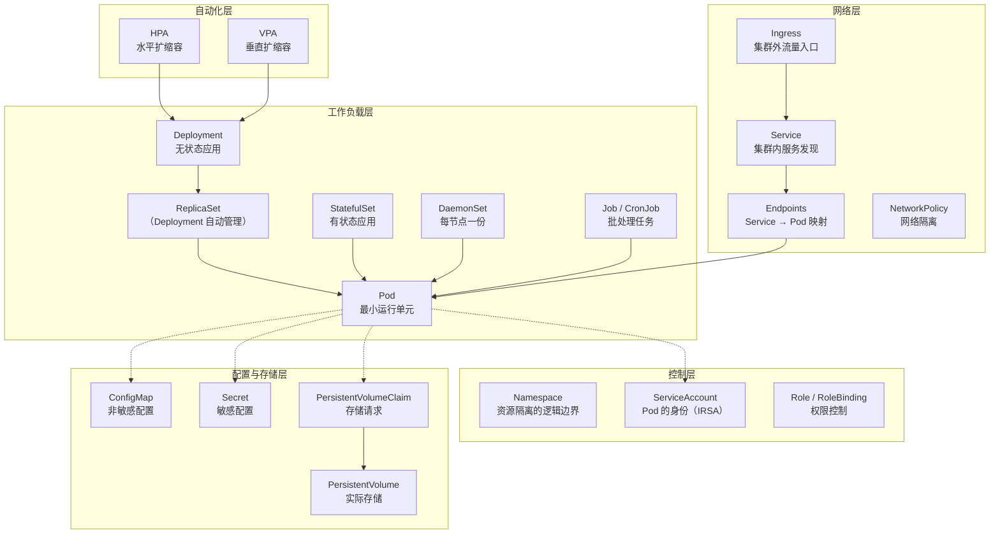

# Kubernetes 架构原理

> 前置知识：了解 [[02-k8s-core-concepts|K8s 核心概念]]（Pod、Deployment、Service、Namespace）。本文从"K8s 内部是怎么运转的"这个角度，解释你日常使用的 kubectl、Helm、ArgoCD 背后发生了什么。
>
> 延伸阅读：理解架构后，可以深入学习 [[10-helm-argocd-deployment|Helm 与 EKS 部署体系]]、[[07-k8s-scheduling-resources|调度与资源管理]]、[[11-k8s-extension-mechanisms|扩展机制（CRD 与 Operator）]]。


---

## 一、K8s 解决什么问题

Docker 解决了"把应用打包成容器"的问题，但当你有几十个微服务、几百个容器分布在多台机器上时，新的问题出现了：

| 问题 | 手动运维 | K8s 自动化 |
|------|------|------|
| 容器挂了怎么办 | 人工发现、手动重启 | 自动检测、自动重启 |
| 流量增大要扩容 | 手动 ssh 到服务器启动新容器 | HPA 自动扩缩容 |
| 容器应该跑在哪台机器 | 人工分配、容易不均衡 | Scheduler 自动调度 |
| 更新版本不停机 | 手动逐个替换、容易出错 | 滚动更新、自动回滚 |
| 服务间怎么互相找到 | 硬编码 IP / 手动配 DNS | Service 自动服务发现 |

**K8s 与 `docker run` 的关系**：`docker run` 解决的是"在一台机器上启动一个容器"，K8s 则是在此之上的**自动化编排层**——底层仍然通过 containerd/runc 启动容器，但上层叠加了调度（容器跑在哪台机器）、自愈（挂了自动重启）、扩缩容（流量大了自动加副本）、滚动更新（不停机发版）、服务发现（容器间通过名字互访）等能力。

**K8s 的本质**：一个声明式的容器编排平台。你告诉它"我要什么状态"（3 个副本、8G 内存、对外暴露 8001 端口），它负责让现实达到并维持这个状态。`docker run` 是命令式地启动一个容器；K8s 是声明式地描述期望状态，然后自动达到并维持它。

---

## 二、整体架构

K8s 集群由两部分组成：**控制平面**（Control Plane，大脑）和**数据平面**（Data Plane，手脚）。

```
┌─────────────────────────────────────────────────────────────────────────┐
│                         Control Plane（控制平面）                         │
│                                                                         │
│  ┌──────────────┐  ┌─────────────┐  ┌───────────┐  ┌────────────────┐  │
│  │  API Server   │  │    etcd     │  │ Scheduler │  │   Controller   │  │
│  │  (唯一入口)    │  │  (状态存储)  │  │  (调度器)  │  │   Manager      │  │
│  │              │  │             │  │           │  │  (控制器管理器)  │  │
│  └──────┬───────┘  └──────┬──────┘  └─────┬─────┘  └──────┬─────────┘  │
│         │                 │               │                │            │
│         └────────── 所有组件通过 API Server 通信 ─────────────┘            │
└─────────────────────────────────┬───────────────────────────────────────┘
                                  │ HTTPS（API 调用）
                                  │
┌─────────────────────────────────┼───────────────────────────────────────┐
│                         Data Plane（数据平面）                            │
│                                 │                                       │
│  ┌─── Node 1 ──────────────┐   │   ┌─── Node 2 ──────────────┐        │
│  │  ┌─────────┐ ┌────────┐ │   │   │  ┌─────────┐ ┌────────┐ │        │
│  │  │ kubelet │ │kube-   │ │   │   │  │ kubelet │ │kube-   │ │        │
│  │  │         │ │proxy   │ │   │   │  │         │ │proxy   │ │        │
│  │  └────┬────┘ └────────┘ │   │   │  └────┬────┘ └────────┘ │        │
│  │       │                  │   │   │       │                  │        │
│  │  ┌────┴──────────────┐  │   │   │  ┌────┴──────────────┐  │        │
│  │  │   containerd      │  │   │   │  │   containerd      │  │        │
│  │  │  ┌─────┐ ┌─────┐  │  │   │   │  │  ┌─────┐ ┌─────┐  │  │        │
│  │  │  │Pod A│ │Pod B│  │  │   │   │  │  │Pod C│ │Pod D│  │  │        │
│  │  │  └─────┘ └─────┘  │  │   │   │  │  └─────┘ └─────┘  │  │        │
│  │  └───────────────────┘  │   │   │  └───────────────────┘  │        │
│  └─────────────────────────┘   │   └─────────────────────────┘        │
└─────────────────────────────────────────────────────────────────────────┘
```

---

## 三、控制平面组件详解

在 EKS 中，控制平面由 AWS 托管，你不需要自己维护这些组件。但理解它们对排障和架构设计至关重要。

### 3.1 API Server — 唯一的入口

API Server 是 K8s 的"前台接待"，**所有操作都必须经过它**——无论是你手动用 kubectl，还是 ArgoCD 自动部署。

以 plaud-project-summary 的一次部署为例，完整流程是这样的：

```
你修改 values/ap-northeast-1/prod/main.yaml（比如改 image tag）→ git push
    ↓
ArgoCD 检测到 Git 仓库有变化
    ↓
ArgoCD 执行四个步骤：
    1. git pull      — 拉取最新代码
    2. helm template — 把 Chart + values 渲染成完整的 K8s YAML
    3. diff          — 对比渲染结果和集群当前状态
    4. apply         — 有差异则通过 K8s API 发请求更新
    ↓
API Server 接收请求
    ├── 1. 认证（Authentication）：ArgoCD 是谁？
    ├── 2. 授权（Authorization）：它有权限部署吗？（RBAC）
    ├── 3. 准入控制（Admission Control）：请求合法吗？
    ├── 4. 写入 etcd：持久化存储新的期望状态
    └── 5. 通知 watch 者：Controller 感知变更 → 开始滚动更新 Pod
```

> [!info] ArgoCD 与 kubectl 的关系
> ArgoCD 并不是在后台跑 `kubectl apply`，而是用 Go 语言的 K8s 客户端库直接发 HTTP 请求。但到了 API Server 这一端，收到的东西完全一样——都是一段 YAML/JSON 格式的资源定义。
>
> ```
> 手动部署：你的电脑 → kubectl（命令行工具）→ HTTP 请求 → API Server
> 自动部署：ArgoCD   → K8s SDK（Go 客户端库）→ HTTP 请求 → API Server
>                                                ↑ 到这里完全一样
> ```
>
> 类比：去银行转账，可以去柜台填单子（kubectl），也可以用手机 App（ArgoCD），银行系统收到的都是同一笔转账指令。

**关键特性**：
- **唯一的 etcd 访问者**：其他组件（Scheduler、kubelet）都不直接读写 etcd，全部通过 API Server
- **Watch 机制**：组件可以 watch API Server 上的资源变更（"有新 Pod 待调度了"、"有 Deployment 副本数变了"），这是 K8s 事件驱动架构的核心
- **无状态**：API Server 本身不保存状态，可以水平扩展（EKS 自动做了这件事）

> 在 [[12-k8s-pod-graceful-shutdown#第二层：Pod 终止流程 — 两条并行路径|Pod 优雅终止]]中提到的"API Server 立即从 Endpoints 中删除该 Pod"，就是 API Server 修改 Endpoints 资源后，kube-proxy 通过 watch 感知到变更再更新 iptables。

> [!example] 🔗 实战：ApplicationSet 中的 API Server 地址
> 每个 EKS 集群都有独立的 API Server 地址，ArgoCD 通过 `server` 字段知道该往哪个集群发请求：
> ```yaml
> # deploy/plaud-project-summary/applicationsets/applicationsets.yaml
> generators:
>   - list:
>       elements:
>         - cluster: jp-staging
>           server: https://0AE3C052...gr7.ap-northeast-1.eks.amazonaws.com
>           env: staging
>           region: ap-northeast-1
>
>         - cluster: us-staging
>           server: https://C85149DE...gr7.us-west-2.eks.amazonaws.com
>           env: staging
>           region: us-west-2
>
>         - cluster: cn-staging
>           server: https://4F8B0222...yl4.cn-northwest-1.eks.amazonaws.com.cn
>           env: staging
>           region: cn-northwest-1
> ```
> 每个 EKS 集群都有独立的 API Server 地址（注意中国区域名后缀是 `.amazonaws.com.cn`）。
>
> **"通过这个地址部署应用"具体是怎么回事？** 用你部署 plaud-project-summary 的真实流程来说：
>
> ```
> 1. 你修改 values/ap-northeast-1/prod/main.yaml（比如改 image tag）→ git push
> 2. ArgoCD 检测到 Git 仓库有变化
> 3. ArgoCD 把 Helm Chart + values 渲染成最终的 K8s YAML（Deployment、Service、Ingress 等）
> 4. ArgoCD 拿着这些 YAML，发 HTTPS 请求给日本区的 API Server：
>    "喂，https://0AE3C052...gr7，帮我更新这个 Deployment 的镜像"
> 5. API Server 收到后更新 etcd 中的期望状态
> 6. 集群里的 Controller 发现期望状态变了，开始滚动更新 Pod
> ```
>
> 其中 ArgoCD 内部更精确地说是四个子步骤：
>
> ```
> 1. git pull      — 拉取你 push 的最新代码
> 2. helm template — 把 Chart + values 渲染成完整的 K8s YAML
> 3. diff          — 对比渲染结果和集群中的当前状态（ArgoCD UI 上可以看到这个 diff）
> 4. apply         — 通过 K8s API 发请求更新（≈ kubectl apply 的效果）
> ```
>
> 第 3→4 步之间是否需要人工确认，取决于 ApplicationSet 中的 `syncPolicy` 配置：
>
> - **手动 Sync（生产环境）**：`syncPolicy` 被注释掉，ArgoCD 只显示 "OutOfSync" 和 diff，需要在 UI 上手动点击 "Sync" 才执行 apply
> - **自动 Sync（staging 环境）**：开启 `syncPolicy.automated` + `selfHeal: true`，检测到差异后自动 apply，不需要人工介入
>
> 以 plaud-project-summary 的两个 ApplicationSet 为例：
>
> ```yaml
> # applicationsets.yaml（staging）— 自动同步
> syncPolicy:
>   automated:
>     prune: false
>     selfHeal: true        # 集群状态偏离时自动恢复
>   syncOptions:
>     - CreateNamespace=true
>     - ServerSideApply=true
>
> # applicationsets-prod.yaml（生产）— 手动同步
> # syncPolicy:             # 整段被注释掉
> #   automated:
> #     prune: false
> #     selfHeal: false
> ```
>
> 其中 `automated` 下的两个开关：
>
> - **`prune: false`**（安全优先）：当 values 文件的改动导致 Helm 渲染结果中**少了**某个 K8s 资源（比如从 `values/ap-northeast-1/staging/main.yaml` 中删掉了 `ingresses.public` 整块配置，Helm 不再渲染出 public Ingress），ArgoCD **不会**自动删除集群中已有的 public Ingress，只标记 "out of sync"。防止误改 values 导致线上资源被连带删除。
> - **`selfHeal: true`**（防配置漂移）：有人用 `kubectl edit` 或 `kubectl scale` 手动修改了集群中的资源（比如把副本数从 2 改成 5），ArgoCD 会自动改回 Git 中 values 文件定义的值，确保 Git 是唯一事实来源。
>
> 这样设计的原因：staging 环境追求快速迭代，自动同步减少人工操作；生产环境需要人工审核 diff 后再确认发布，降低风险。详见 [[10-helm-argocd-deployment#3.3 ② application.yaml — ArgoCD 入口|Helm 笔记中的 syncPolicy 详解]]。
>
> ```
> 手动部署：你的电脑 → kubectl apply（命令行工具）→ HTTP 请求 → API Server
> 自动部署：ArgoCD   → K8s SDK（Go 客户端库）    → HTTP 请求 → API Server
>                                                   ↑ 到这里完全一样
> ```
>
> 所以 ApplicationSet 里写 `server: https://aaa.eks.amazonaws.com`，就是告诉 ArgoCD："你要部署到日本区的时候，把请求发到这个地址。" **所有操作——创建 Deployment、Service、Ingress——都经过 API Server 这个唯一入口。**

### 3.2 etcd — 集群的"数据库"

etcd 是一个分布式键值存储，保存了集群的**全部状态**：

```
etcd 中存了什么：
├── /registry/deployments/plaud-project-summary/...    ← Deployment 定义
├── /registry/pods/plaud-project-summary/...           ← 所有 Pod 的状态
├── /registry/services/plaud-project-summary/...       ← Service 定义
├── /registry/secrets/plaud-project-summary/...        ← Secret 数据
├── /registry/configmaps/...                           ← ConfigMap
└── ...（所有 K8s 资源都在这里）
```

**核心特性**：
- **强一致性**（Raft 共识算法）：多副本之间数据一致，不会出现"这个节点看到 3 个 Pod、那个节点看到 2 个"
- **Watch 支持**：API Server watch etcd 的变更，再转发给其他组件
- **单点故障风险**：etcd 挂了 = 整个集群瘫痪（EKS 帮你做了高可用，不用担心）

> 性能提示：etcd 对磁盘 IO 敏感，大量 CRD 或频繁 watch 会给 etcd 带来压力。这是为什么 K8s 建议单个集群不超过 5000 个节点。

### 3.3 Scheduler — "Pod 应该跑在哪个节点"

当一个新 Pod 被创建但还没分配节点时（`spec.nodeName` 为空），Scheduler 负责选一个合适的节点：

```
Scheduler 的决策流程：

1. 过滤（Filtering）— 排除不满足条件的节点
   ├── 节点资源不够（CPU/内存不满足 Pod 的 requests）
   ├── 节点有 taint，Pod 没有对应 toleration
   ├── Pod 指定了 nodeSelector / nodeAffinity，节点不匹配
   └── 节点磁盘压力、内存压力、PID 压力
   
2. 打分（Scoring）— 在剩余节点中选最优
   ├── 资源均衡度（尽量让各节点负载均匀）
   ├── Pod 亲和/反亲和偏好
   ├── 拓扑分散约束（TopologySpreadConstraints）
   └── 镜像是否已缓存在该节点

3. 绑定（Binding）— 写入 Pod 的 spec.nodeName
```

> 在 [[10-helm-argocd-deployment#3.5 ⑤⑥⑦ Values 文件详解 — 参数逐项说明|values 文件]]中配置的 `resources.requests` 就是给 Scheduler 看的——"这个 Pod 至少需要多少资源"。详细调度策略见 [[07-k8s-scheduling-resources|调度与资源管理]]。

> [!example] 🔗 实战链接：Scheduler 依据的 resources.requests 配置
> 在 deploy 项目中，同一个服务在 staging 和 prod 环境配置了不同的资源请求，Scheduler 根据这些值决定 Pod 应该调度到哪个节点：
> ```yaml
> # Staging 环境 — 资源需求较小
> # deploy/plaud-project-summary/values/us-west-2/staging/main.yaml
> resources:
>   requests:
>     cpu: 1        # Scheduler 为该 Pod 预留 1 核 CPU
>     memory: 4Gi   # Scheduler 为该 Pod 预留 4GB 内存
>   limits:
>     cpu: 1
>     memory: 4Gi
>
> # Production 环境 — 资源需求更大
> # deploy/plaud-project-summary/values/us-west-2/prod/main.yaml
> resources:
>   requests:
>     cpu: 8        # 生产环境需要 8 核
>     memory: 16Gi  # 生产环境需要 16GB 内存
>   limits:
>     cpu: 8
>     memory: 16Gi
> ```
> Scheduler 的过滤阶段会检查：节点剩余资源是否 >= Pod 的 `requests`。一个 16Gi 内存的 Pod 不会被调度到只剩 8Gi 可用的节点上。注意这里 requests = limits，意味着获得 **Guaranteed QoS**，资源紧张时最后被驱逐。

### 3.4 Controller Manager — "确保现实 = 期望"

Controller Manager 运行着一组**控制器（Controller）**，每个控制器负责一种资源类型，不断执行 **Reconciliation Loop**（调谐循环）：

```
控制器的工作模式（以 Deployment Controller 为例）：

while true:
    当前状态 = 观察集群中实际的 Pod 数量
    期望状态 = 读取 Deployment 的 spec.replicas
    
    if 当前状态 != 期望状态:
        if 实际 Pod 数 < 期望数:
            创建新 Pod
        if 实际 Pod 数 > 期望数:
            删除多余 Pod
    
    sleep（实际是 watch 事件驱动，不是轮询）
```

**常见控制器**：

| 控制器 | 职责 |
|------|------|
| **Deployment Controller** | 管理 ReplicaSet，确保副本数正确，执行滚动更新 |
| **ReplicaSet Controller** | 确保指定数量的 Pod 副本在运行 |
| **Node Controller** | 监控节点健康状态，节点失联后驱逐 Pod |
| **Job Controller** | 管理一次性任务的 Pod |
| **Endpoint Controller** | 维护 Service 和 Pod 的映射关系（Endpoints） |
| **ServiceAccount Controller** | 为新 namespace 创建默认 ServiceAccount |

> **ArgoCD 也是一种控制器**——它 watch Git 仓库的变更，然后"调谐"集群状态与 Git 中的声明一致。这就是 K8s 控制器模式的强大之处：任何人都可以写自定义控制器来扩展 K8s 的能力。详见 [[11-k8s-extension-mechanisms|CRD 与 Operator 模式]]。

> [!example] 🔗 实战链接：ArgoCD 的 syncPolicy 就是控制器的 Reconciliation 配置
> 在 deploy 项目的 ApplicationSet 中，`syncPolicy` 配置了 ArgoCD 控制器的"调谐行为"——它决定 ArgoCD 多主动地保持集群状态与 Git 一致：
> ```yaml
> # deploy/plaud-project-summary/applicationsets/applicationsets.yaml (Staging)
> syncPolicy:
>   automated:
>     prune: false      # 不自动删除 Git 中已移除的资源（安全优先）
>     selfHeal: true    # ← 关键！有人手动改了集群资源，ArgoCD 会自动改回来
>   syncOptions:
>     - CreateNamespace=true
>     - ServerSideApply=true
>
> # deploy/plaud-project-summary/applicationsets/applicationsets-prod.yaml (Prod)
> # syncPolicy:          ← 生产环境注释掉了 automated，需要手动触发同步
> #   automated:
> #     prune: false
> #     selfHeal: false
> ```
> 这两个配置正好对应控制器模式的两种"调谐"场景：
>
> - **`selfHeal: true`**：有人用 `kubectl scale` 把副本数改成了 5，但 values 文件中写的是 2（当前状态偏离期望状态）→ ArgoCD 自动改回 2。这是经典的 Reconciliation Loop。
> - **`prune: false`**：有人从 `values/ap-northeast-1/staging/main.yaml` 中删掉了 `ingresses.public` 配置，Helm 不再渲染 public Ingress（期望状态变了）→ ArgoCD **不**自动删除集群中已有的 public Ingress。这是对 Reconciliation 的一种"安全制动"——删除操作风险更大，交给人工确认。
>
> Staging 开启 `selfHeal`（快速迭代、防配置漂移），Prod 整个 `automated` 被注释掉（所有变更需人工触发），这是安全与效率的 tradeoff。

---

## 四、数据平面组件详解

数据平面由一组 **Worker Node**（工作节点）组成，每个节点上运行三个关键组件。

### 4.1 kubelet — 节点上的"管家"

kubelet 是运行在每个节点上的代理进程，负责：

```
kubelet 的职责：

1. Pod 管理
   ├── watch API Server 获取分配到本节点的 Pod
   ├── 调用 containerd 创建/销毁容器
   └── 报告 Pod 状态给 API Server

2. 健康检查
   ├── 执行 livenessProbe → 失败则重启容器
   ├── 执行 readinessProbe → 失败则从 Service 摘除
   └── 执行 startupProbe → 启动期间暂缓其他探针

3. 资源管理
   ├── 向 API Server 报告节点可用资源
   ├── 在资源紧张时驱逐低优先级 Pod（Eviction）
   └── 确保 Pod 不超过 limits（通过 cgroups）

4. 卷挂载
   ├── 调用 CSI 驱动挂载 PV
   └── 管理 emptyDir、hostPath 等本地卷
```

> kubelet 调用的 containerd 就是 [[01-docker-basics#10.1 Docker 不是唯一的容器运行时|容器运行时]]，替代了早期的 dockershim。EKS 默认使用 containerd。

> [!example] 🔗 实战链接：kubelet 执行的完整 Pod 规格来自 Deployment 模板
> 在 deploy 项目中，`generic-deployer` 的 Deployment 模板定义了 kubelet 需要执行的所有信息——拉什么镜像、分配多少资源、怎么做健康检查：
> ```yaml
> # deploy/generic-deployer/templates/deployment.yaml（Helm 模板渲染后的效果）
> spec:
>   terminationGracePeriodSeconds: 600       # kubelet 等待优雅终止的时间
>   containers:
>     - name: deployer
>       image: "<account-id>.dkr.ecr.us-west-2.amazonaws.com/plaud/plaud-project-summary:4548edf"
>       imagePullPolicy: IfNotPresent         # kubelet 检查本地是否有镜像
>       resources:
>         requests: { cpu: 1, memory: 4Gi }   # kubelet 通过 cgroups 保证的资源
>         limits: { cpu: 1, memory: 4Gi }     # kubelet 通过 cgroups 限制的上限
>       livenessProbe:                        # kubelet 定期执行健康检查
>         httpGet: { path: /health, port: 8000 }
>       readinessProbe:                       # kubelet 判断 Pod 是否可接收流量
>         httpGet: { path: /health, port: 8000 }
> ```
> kubelet 收到这个 Pod spec 后，会依次：**调用 containerd 拉取 ECR 镜像 → 创建容器并设置 cgroups 资源限制 → 启动健康检查 → 报告 Pod 状态给 API Server**。

### 4.2 kube-proxy — 节点上的"网络管理员"

kube-proxy 负责实现 K8s 的 **Service 网络**——让 Pod 可以通过 Service 名称互相访问：

```
请求流程：Pod A 访问 plaud-api-service:8001
    │
    ├── CoreDNS 解析：plaud-api-service → ClusterIP 10.100.50.23
    │
    ├── kube-proxy 维护的 iptables/IPVS 规则：
    │   10.100.50.23:8001 → {
    │       Pod-1 (172.16.0.5:8001)  ← 随机选一个（或轮询）
    │       Pod-2 (172.16.0.8:8001)
    │       Pod-3 (172.16.1.3:8001)
    │   }
    │
    └── 请求被转发到 Pod-2 的实际 IP
```

**两种代理模式**：

| 模式 | 实现 | 性能 | 适用 |
|------|------|------|------|
| **iptables**（默认） | 用 iptables 规则做 DNAT | Service 多时规则链长，O(n) | 中小集群 |
| **IPVS** | 用 Linux IPVS（内核级负载均衡） | O(1) 查找，支持多种负载均衡算法 | 大集群（>1000 Service） |

> 在 [[12-k8s-pod-graceful-shutdown#第二层：Pod 终止流程 — 两条并行路径|Pod 优雅终止]]中，kube-proxy watch 到 Endpoints 变更后更新 iptables 规则需要 1~2 秒——这就是为什么需要 preStop hook 来争取时间。

### 4.3 容器运行时（Container Runtime）

kubelet 通过 **CRI（Container Runtime Interface）** 调用容器运行时来管理容器：

```
kubelet
  ↓ CRI gRPC 调用
containerd
  ↓
runc（创建 Linux namespace + cgroups → 隔离的容器进程）
```

详见 [[01-docker-basics#10. 容器运行时（深入）|Docker 笔记的容器运行时章节]]。

---

## 五、声明式 API 与控制器模式

这是 K8s 最核心的设计哲学，理解它就理解了 K8s 为什么要这样设计。

### 5.1 命令式 vs 声明式

```bash
# 命令式（Imperative）—— 告诉系统"怎么做"
docker run -d --name api -p 8001:8001 myimage      # 启动一个容器
docker run -d --name api2 -p 8002:8001 myimage     # 再启动一个
# 问题：如果 api 挂了，没人知道，也没人重启

# 声明式（Declarative）—— 告诉系统"我要什么"
apiVersion: apps/v1
kind: Deployment
spec:
  replicas: 2          # "我要 2 个副本"
  template:
    spec:
      containers:
        - image: myimage
          ports:
            - containerPort: 8001
# K8s 负责：创建 2 个 Pod，挂了自动重建，更新时滚动替换
```

> [!example] 🔗 实战链接：声明式配置的真实体现——replicaCount 与 HPA
> 在 deploy 项目中，不需要手动 `docker run` 启动容器，只需在 values 文件中声明"我要几个副本"，K8s 自动达到并维持：
> ```yaml
> # Staging 环境 — 固定 2 个副本（声明式，不用手动启停）
> # deploy/plaud-project-summary/values/us-west-2/staging/main.yaml
> replicaCount: 2
> autoscaling:
>   enabled: false      # 不自动伸缩，固定 2 个 Pod
>
> # Production 环境 — 声明弹性范围，K8s 自动调整
> # deploy/plaud-project-summary/values/us-west-2/prod/main.yaml
> replicaCount: 2       # 初始副本数
> autoscaling:
>   enabled: true       # 开启 HPA
>   minReplicas: 2      # "最少保持 2 个"
>   maxReplicas: 10     # "最多扩到 10 个"
>   targetCPUUtilizationPercentage: 75   # "CPU 超 75% 就扩容"
>   targetMemoryUtilizationPercentage: 70
> ```
> 这就是命令式 vs 声明式的区别：你不用写脚本"当 CPU 高时 ssh 到服务器启动新容器"，只需要声明 `maxReplicas: 10` + `targetCPU: 75%`，HPA 控制器会自动观察指标并调整副本数。

### 5.2 控制器模式（Controller Pattern）

```
                    ┌──────────────────────────────┐
                    │         期望状态               │
                    │  （etcd 中存储的资源 spec）      │
                    │  例：replicas: 3               │
                    └──────────┬───────────────────┘
                               │
                    ┌──────────┴───────────────────┐
                    │      Reconciliation Loop      │
                    │                               │
                    │   观察当前状态                   │
                    │        ↓                       │
                    │   对比期望状态                   │
                    │        ↓                       │
                    │   当前 != 期望 → 执行动作         │
                    │   当前 == 期望 → 什么都不做        │
                    │                               │
                    └──────────┬───────────────────┘
                               │
                    ┌──────────┴───────────────────┐
                    │         当前状态               │
                    │  （集群中实际运行的资源）          │
                    │  例：实际有 2 个 Pod 在跑         │
                    └──────────────────────────────┘
```

**为什么这种模式如此强大**：
1. **自愈**：Pod 被意外删除 → Controller 发现实际数 < 期望数 → 自动创建新 Pod
2. **幂等**：多次 `kubectl apply` 同一个 YAML，结果一样（不会创建重复资源）
3. **可组合**：不同 Controller 管不同层级，彼此独立运行
4. **可扩展**：任何人都可以写自定义 Controller（ArgoCD、Prometheus Operator 都是）

### 5.3 一次 `kubectl apply` 的完整链路

以声明一个 3 副本的 Deployment 为例，无论通过哪种方式触发，从 API Server 开始的链路完全一样：

```
1. 请求到达 API Server（入口不同，后续链路完全一致）

   方式 A — 手动部署：
   kubectl apply -f deployment.yaml → kubectl 读取 YAML，发送 POST 请求到 API Server

   方式 B — ArgoCD 自动部署（项目实际使用的方式）：
   git push 修改 values 文件（如改 image.tag）
     → ArgoCD 检测到 Git 变更
     → helm template 渲染出完整 K8s YAML
     → diff 对比集群当前状态
     → 通过 K8s Go SDK 发送 POST 请求到 API Server
   
2. API Server 处理请求（从这里开始，方式 A 和 B 完全一样）：
   ├── 认证：kubectl 的 kubeconfig 证书 / ArgoCD 的 ServiceAccount token
   ├── 授权：RBAC 检查用户是否有权创建 Deployment
   ├── 准入控制：Mutating Webhook（注入 sidecar？）→ Validating Webhook（资源合法？）
   └── 写入 etcd

3. Deployment Controller（watch 到新 Deployment）：
   └── 创建 ReplicaSet（replicas=3）

4. ReplicaSet Controller（watch 到新 ReplicaSet）：
   └── 创建 3 个 Pod（spec.nodeName 为空）

5. Scheduler（watch 到 3 个未调度的 Pod）：
   ├── 为 Pod-1 选择 Node-A → 写入 pod.spec.nodeName = Node-A
   ├── 为 Pod-2 选择 Node-B → 写入 pod.spec.nodeName = Node-B
   └── 为 Pod-3 选择 Node-A → 写入 pod.spec.nodeName = Node-A

6. kubelet on Node-A（watch 到 2 个 Pod 被分配到自己）：
   ├── 调用 containerd 拉取镜像
   ├── 创建容器
   ├── 启动 readinessProbe
   └── Pod Ready → 报告状态给 API Server

7. Endpoint Controller（watch 到 Pod Ready）：
   └── 将 Pod IP 添加到 Service 的 Endpoints

8. kube-proxy（watch 到 Endpoints 变更）：
   └── 更新 iptables 规则，新 Pod 开始接收流量
```

---

## 六、EKS 托管架构（进阶）

AWS EKS（Elastic Kubernetes Service）是托管的 K8s 服务。理解 EKS 帮你管了什么、你需要管什么：

### 6.1 EKS 的责任划分

```
┌──────────────────────────────────────────────────────┐
│                AWS 管理（你不用碰）                     │
│  ┌────────────────────────────────────────────────┐  │
│  │  API Server（高可用，跨 3 个 AZ）                 │  │
│  │  etcd（自动备份、加密）                            │  │
│  │  Controller Manager                             │  │
│  │  Scheduler                                      │  │
│  │  CoreDNS（托管插件）                              │  │
│  │  kube-proxy（托管插件）                            │  │
│  └────────────────────────────────────────────────┘  │
├──────────────────────────────────────────────────────┤
│                你管理                                 │
│  ┌────────────────────────────────────────────────┐  │
│  │  Worker Nodes（EC2 实例 / Fargate）              │  │
│  │  应用部署（Deployment / Service / Ingress）       │  │
│  │  Ingress Controller（nginx-ingress 等）          │  │
│  │  监控（Prometheus / Grafana）                    │  │
│  │  日志收集（Fluent Bit / CloudWatch）              │  │
│  │  网络策略（SecurityGroup / NetworkPolicy）        │  │
│  │  IAM 权限（IRSA）                                │  │
│  └────────────────────────────────────────────────┘  │
└──────────────────────────────────────────────────────┘
```

> [!example] 🔗 实战链接：ApplicationSet 体现的多集群 EKS 架构
> 在 deploy 项目中，一个 ApplicationSet 就能看到公司的 EKS 集群全景——AWS 托管了多个区域的控制平面，你只需要声明"部署到哪些集群"：
> ```yaml
> # deploy/plaud-project-summary/applicationsets/applicationsets-prod.yaml
> generators:
>   - list:
>       elements:
>         - cluster: jp-prod                    # 日本 Production
>           server: https://686061FA...yl4.ap-northeast-1.eks.amazonaws.com
>         - cluster: eu-prod                    # 欧洲 Production
>           server: https://055042787C...gr7.eu-central-1.eks.amazonaws.com
>         - cluster: sg-prod                    # 新加坡 Production
>           server: https://96C04C1F...yl4.ap-southeast-1.eks.amazonaws.com
>         - cluster: us-prod                    # 美国 Production
>           server: https://3F1BDD32...sk1.us-west-2.eks.amazonaws.com
>         - cluster: cn-prod                    # 中国 Production
>           server: https://D2572EA5...yl4.cn-northwest-1.eks.amazonaws.com.cn
> ```
> 5 个区域、5 个独立的 EKS 集群，每个集群的控制平面（API Server、etcd、Scheduler、Controller Manager）都由 AWS 独立托管。你不需要管任何一个控制平面组件，只需要管理 Worker Node 上跑的应用。这就是 EKS 托管架构的核心价值。

### 6.2 EKS Node 类型

| 类型 | 特点 | 适用场景 |
|------|------|------|
| **Managed Node Group** | AWS 管理 EC2 实例的生命周期（升级、补丁） | 大多数工作负载 |
| **Self-Managed Nodes** | 你完全控制 EC2 实例 | 需要自定义 AMI 或特殊实例类型 |
| **Fargate** | 无服务器，按 Pod 计费，无需管理节点 | 批处理、低频服务 |
| **Karpenter** | 自动根据 Pod 需求创建最优节点 | 动态负载（详见 [[07-k8s-scheduling-resources#六、Cluster Autoscaler 与 Karpenter（深入）|调度与资源管理]]） |

### 6.3 EKS 网络模型

EKS 使用 **AWS VPC CNI**，每个 Pod 直接获得 VPC 子网内的真实 IP：

```
VPC: 10.0.0.0/16
├── Subnet A: 10.0.1.0/24
│   ├── Node-1 (EC2): 10.0.1.10
│   │   ├── Pod-A: 10.0.1.11    ← Pod 有真实 VPC IP！
│   │   └── Pod-B: 10.0.1.12
│   └── Node-2 (EC2): 10.0.1.20
│       └── Pod-C: 10.0.1.21
└── Subnet B: 10.0.2.0/24
    └── Node-3 (EC2): 10.0.2.10
        └── Pod-D: 10.0.2.11
```

> **优势**：Pod 可以直接与 VPC 内的其他 AWS 资源（RDS、ElastiCache）通信，不需要额外的网络跳转。
>
> **限制**：每个 EC2 实例的 ENI（网络接口）数量有限，决定了单节点最多能跑多少 Pod。详见 [[04-k8s-networking#2.2 AWS VPC CNI（EKS 默认）（进阶）|K8s 网络深入]]。

---

## 七、K8s 资源层级关系（进阶）

最后，梳理一下 K8s 中各种资源的层级关系，帮助你建立全局视角：



这张图对应到你的项目：
- [[10-helm-argocd-deployment|Helm 笔记]]中的 `generic-deployer` 模板生成的就是 Deployment、Service、Ingress、HPA、ServiceAccount 这些资源
- [[13-k8s-lane-mechanism|泳道机制]]利用的是 Ingress 的 canary 能力
- [[12-k8s-pod-graceful-shutdown|优雅终止]]涉及的是 Pod → Endpoints → kube-proxy 这条链路

---

## 延伸阅读

- [[10-helm-argocd-deployment|Helm 与 EKS 部署体系]] — 如何用 Helm + ArgoCD 将应用部署到 EKS
- [[03-k8s-workload-types|K8s 工作负载类型]] — Deployment 之外的 StatefulSet、DaemonSet、Job
- [[04-k8s-networking|K8s 网络深入]] — Service、CNI、CoreDNS、NetworkPolicy 的实现原理
- [[07-k8s-scheduling-resources|调度与资源管理]] — Scheduler 的决策机制、QoS、自动扩缩容
- [[08-k8s-security-rbac|K8s 安全与权限]] — RBAC、Pod Security、Secret 管理
- [[11-k8s-extension-mechanisms|K8s 扩展机制]] — CRD、Operator、Admission Webhook
