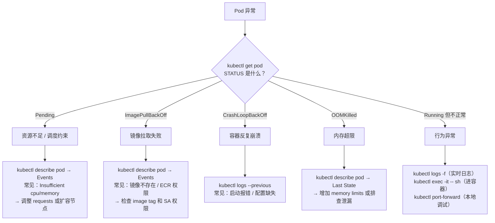

# K8s 可观测性

> 前置知识：[[05-k8s-architecture|K8s 架构原理]]中的组件交互、[[03-k8s-workload-types#四、DaemonSet — 每个节点一份|DaemonSet]] 的工作原理。应用层 SDK 见 [[opentelemetry-guide|OpenTelemetry 完整指南]]，本文聚焦 **K8s 集群层面**的可观测性基础设施。

---

## 一、为什么需要可观测性

**场景**：某天下午用户反馈"请求变慢了"，查看 Pod 状态：

```bash
kubectl get pods -n production
# NAME                        READY   STATUS    RESTARTS   AGE
# api-7d8f9b6c4-xk2pq        1/1     Running   0          3d
# api-7d8f9b6c4-m2n5p        1/1     Running   0          3d
```

看起来一切正常——Pod 在跑、没有重启。但问题确实存在。缺少的信息是：

- **Metrics**：CPU 是否飙升？P99 延迟多少？QPS 有无异常？
- **Logs**：有没有超时错误日志？哪个接口最多？
- **Traces**：一个慢请求卡在哪一步？数据库慢还是下游服务慢？

`kubectl get pods` 只告诉 Pod 是否在运行。可观测性告诉 Pod 运行得**好不好**。

### 三大支柱

| 支柱 | 回答的问题 | 典型工具 |
| --- | --- | --- |
| **Metrics** | "现在怎么样？"——聚合的数值趋势 | Prometheus + Grafana |
| **Logs** | "发生了什么？"——离散的事件记录 | Fluent Bit + OpenSearch / Loki |
| **Traces** | "为什么慢？"——单个请求的完整调用路径 | OTel Collector + Tempo / Jaeger |

三者协同：Metrics 发现异常（CPU 飙升）→ Logs 定位错误（OOM 日志）→ Traces 追踪根因（下游超时）。

---

## 二、Metrics——Prometheus + Grafana

### 2.1 Metrics Server：起点

**问题**：配了 [[07-k8s-scheduling-resources#5.1 HPA（水平自动扩缩容）|HPA]] 让 Pod 在 CPU 达到 75% 时自动扩容，HPA 怎么知道当前 CPU 是多少？

```txt
kubelet（每个节点）
  └── cAdvisor（内置，采集容器 CPU/内存实时数据）
        ↓
Metrics Server（集群级组件，聚合所有节点数据）
        ↓ 注册为 K8s API（metrics.k8s.io）
HPA Controller / kubectl top
```

```bash
kubectl top pods -n production
# NAME                        CPU(cores)   MEMORY(bytes)
# api-7d8f9b6c4-xk2pq        1200m        3.2Gi

kubectl top nodes
```

**Metrics Server 的局限**：只提供实时快照，不存储历史数据、不采集业务指标、不支持告警。生产环境需要 Prometheus 补齐。

### 2.2 Prometheus 架构

```txt
┌──────────────────────────────────────────────────────────────┐
│                  Prometheus 数据链路                           │
│                                                              │
│  数据源                    Prometheus Server          消费端   │
│  ┌─────────────────┐     ┌───────────────────┐              │
│  │ kubelet/metrics  │◄───│ Pull（主动拉取）    │──→ Grafana   │
│  ├─────────────────┤     │                   │              │
│  │ kube-state-     │◄───│ TSDB（时序数据库）  │──→ AlertMgr  │
│  │ metrics         │     │ 存储 15d~90d      │              │
│  ├─────────────────┤     │                   │──→ HPA       │
│  │ 应用 /metrics   │◄───│ PromQL 查询引擎    │   自定义指标   │
│  └─────────────────┘     └───────────────────┘   扩缩容      │
│        ↑                         ↑                          │
│  ServiceMonitor            PrometheusRule                    │
│ （告诉去哪拉数据）           （定义告警规则）                    │
└──────────────────────────────────────────────────────────────┘
```

**Pull vs Push 模型**：

| 对比 | Pull（Prometheus） | Push（StatsD / CloudWatch Agent） |
| --- | --- | --- |
| 目标挂了 | 立刻发现（拉不到） | 推送端沉默，需额外检测 |
| 采集频率 | Server 统一控制 | 每个目标自行决定 |
| 适合场景 | 长期运行的服务 | 短生命周期任务（Job / Lambda） |

**kube-state-metrics**——补充声明式状态指标：

```txt
cAdvisor：          "这个容器用了 1.2 核 CPU、3.2Gi 内存"     （运行时指标）
kube-state-metrics："这个 Deployment 期望 3 副本但只有 2 个 Ready" （声明式状态）
```

### 2.3 ServiceMonitor——告诉 Prometheus 去哪拉数据

ServiceMonitor 是 Prometheus Operator 定义的 [[11-k8s-extension-mechanisms#二、CRD（Custom Resource Definition）（进阶）|CRD]]，声明式地描述采集目标。

#### 实战：plaud-project-summary 的 ServiceMonitor

generic-deployer 的模板支持 80+ 微服务通过 values 一键接入 Prometheus 监控：

```yaml
# 来源：generic-deployer/templates/servicemonitor.yaml
{{- if .Values.serviceMonitor.enabled }}
apiVersion: monitoring.coreos.com/v1
kind: ServiceMonitor
metadata:
  name: {{ include "generic-deployer.fullname" . }}
  namespace: monitoring
  labels:
    prometheus: k8s
spec:
  selector:
    matchLabels:
      {{- include "generic-deployer.selectorLabels" . | nindent 6 }}
  namespaceSelector:
    matchNames:
      - {{ .Release.Namespace }}
  endpoints:
    - port: {{ .Values.serviceMonitor.port | default "web" }}
      path: {{ .Values.serviceMonitor.path | default "/metrics" }}
      interval: {{ .Values.serviceMonitor.interval | default "15s" }}
      relabelings:
        - sourceLabels: [__meta_kubernetes_pod_label_app_name]
          targetLabel: app_name
        - sourceLabels: [__meta_kubernetes_pod_annotation_metrics_labels_region]
          targetLabel: region
        - sourceLabels: [__meta_kubernetes_pod_annotation_metrics_labels_env]
          targetLabel: env
{{- end }}
```

服务侧只需在 values 中开启并声明 annotation：

```yaml
# 来源：plaud-share-service/values/.../main.yaml
deployer:
  serviceMonitor:
    enabled: true

  podAnnotations:
    prometheus.io/scrape: "true"
    prometheus.io/port: "9080"
    prometheus.io/path: "/metrics"
    metrics.labels/region: "ap-northeast-1"
    metrics.labels/env: "staging"
```

模板中的 `relabelings` 注入 region、env 等业务维度标签，使 Grafana 中可按区域和环境筛选。

### 2.4 常用 PromQL（进阶）

```promql
# Pod CPU 使用率（5 分钟滑动窗口）
rate(container_cpu_usage_seconds_total{namespace="production"}[5m])

# HTTP QPS（按状态码分组）
sum(rate(http_requests_total{namespace="production"}[5m])) by (status_code)

# P99 延迟
histogram_quantile(0.99, rate(http_request_duration_seconds_bucket[5m]))

# Deployment 不可用副本数
kube_deployment_status_replicas_unavailable{namespace="production"}
```

### 2.5 Grafana 可视化

Grafana 从 Prometheus 等数据源读取数据，渲染为 Dashboard：

```txt
数据源（Prometheus / Loki / Tempo）
    ↓ PromQL / LogQL / TraceQL
Grafana Dashboard（面板组合，按团队/服务组织）
    ↓ 导出 JSON
Git 版本管理（Dashboard as Code）
```

### 2.6 AlertManager——从发现问题到通知到人（进阶）

**问题**：CPU 持续超过 85% 达 10 分钟，如何自动触发告警？

```txt
Prometheus 评估 PrometheusRule
    ↓ 触发告警
AlertManager
    ├── 分组（同一 namespace 的告警合并）
    ├── 抑制（critical 已触发时压制同名 warning）
    ├── 静默（维护期间临时禁用）
    └── 路由 → Slack / PagerDuty / Webhook
```

生产环境的 PrometheusRule 示例：

```yaml
# 来源：prometheusrule/rule.yaml
apiVersion: monitoring.coreos.com/v1
kind: PrometheusRule
metadata:
  name: node-pod-alert-rules
  namespace: monitoring
spec:
  groups:
    - name: node.rules
      rules:
        - alert: NodeCPUUsage
          expr: |
            100 - (avg(irate(node_cpu_seconds_total{mode="idle"}[5m]))
            by (instance) * 100) > 85
          for: 10m                    # 持续 10 分钟才触发，避免瞬时抖动
          labels:
            severity: warning
          annotations:
            summary: "Instance {{ $labels.instance }} CPU 使用率过高"

    - name: pod.rules
      rules:
        - alert: PodMemoryUsage
          expr: |
            (container_memory_rss / container_spec_memory_limit_bytes * 100) > 85
            and container_spec_memory_limit_bytes > 0
          for: 5m
          labels:
            severity: critical
          annotations:
            description: "{{ $labels.namespace }} / {{ $labels.pod }} 内存使用超过 85%"

        - alert: PodCrashLoopBackOff
          expr: |
            sum by(namespace,pod) (kube_pod_container_status_waiting_reason{
              reason="CrashLoopBackOff"}) == 1
          for: 1m
          labels:
            severity: warning
```

AlertManager 的抑制规则与路由配置：

```yaml
# 来源：kube-prometheus/base/manifests/alertmanager-secret.yaml
"inhibit_rules":
  - "equal": ["namespace", "alertname"]
    "source_matchers": ["severity = critical"]
    "target_matchers": ["severity =~ warning|info"]
"route":
  "group_by": ["namespace"]
  "group_wait": "30s"
  "group_interval": "5m"
  "repeat_interval": "12h"
  "routes":
    - "matchers": ["severity = critical"]
      "receiver": "Critical"
```

---

## 三、Logs——Fluent Bit + OpenSearch

### 3.1 容器日志机制

容器将日志写到 stdout/stderr，容器运行时将其保存为节点上的 JSON 文件：

```txt
容器进程 → stdout/stderr
    ↓ containerd 捕获
节点文件：/var/log/containers/<pod>_<namespace>_<container>-<id>.log
    ↓ JSON 行格式
{"log":"2024-03-15T10:30:00Z INFO Processing request...\n","stream":"stdout"}
```

两个问题：

1. **分散**——每个节点只有自己的 Pod 日志，没有集中视图
2. **临时**——Pod 删除或节点缩容后日志丢失

### 3.2 日志采集架构

解决方案：用 DaemonSet 在每个节点运行日志采集器，将日志发送到集中存储。

```txt
每个节点                          集中存储               可视化
┌──────────────────┐
│ Fluent Bit Pod   │     ┌──────────────┐       ┌─────────┐
│ (DaemonSet)      │────→│ OpenSearch   │──────→│ Kibana  │
│                  │     └──────────────┘       └─────────┘
│ 挂载节点的        │
│ /var/log/         │     ┌──────────────┐       ┌─────────┐
│ containers/      │────→│ Loki         │──────→│ Grafana │
│                  │     └──────────────┘       └─────────┘
│ 自动添加 K8s     │
│ 元数据           │     ┌──────────────┐
│                  │────→│ CloudWatch   │
└──────────────────┘     └──────────────┘
```

**Fluent Bit vs Fluentd**：

| 特性 | Fluent Bit | Fluentd |
| --- | --- | --- |
| 语言 | C | Ruby |
| 内存占用 | ~5MB | ~40MB |
| 推荐用法 | **节点级采集（首选）** | 复杂的日志路由和聚合 |

### 3.3 实战：Fluent Bit 完整采集管线（进阶）

```conf
# 来源：infra/values/fluent-bit/default.yaml

# ① INPUT：tail 插件读取节点上所有容器日志文件
[INPUT]
    Name              tail
    Path              /var/log/containers/*.log
    Parser            cri
    Tag               kube.*
    DB                /var/log/flb_kube.db      # 记录读取位置，重启不重复采集
    Mem_Buf_Limit     5MB

# ② FILTER：注入 K8s 元数据 + 过滤噪音
[FILTER]
    Name                kubernetes
    Match               kube.*
    Merge_Log           On                       # JSON 格式日志展开为顶层字段
    Labels              On
    Annotations         On

[FILTER]
    Name    grep
    Match   kube.*
    Exclude kubernetes.namespace_name  ^(kube-system|opensearch)$

[FILTER]
    Name    grep
    Match   kube.*
    Exclude log   /health                        # 过滤健康检查噪音

# ③ OUTPUT：发送到 OpenSearch
[OUTPUT]
    Name                opensearch
    Match               *
    Host                opensearch-cluster-master
    Port                9200
    Logstash_Prefix     k8s-std                  # 索引前缀 → k8s-std-2024.03.15
    Logstash_Format     On                       # 按日期滚动索引
    Retry_Limit         10
    tls                 On
```

### 3.4 实战：plaud-project-summary 的 emptyDir 日志卷

除 stdout/stderr 外，部分应用还会将日志写入文件。`plaud-project-summary` 通过 `emptyDir` 卷提供日志目录：

```yaml
# 来源：plaud-project-summary/values/ap-northeast-1/prod/main.yaml
deployer:
  volumeMounts:
    - name: logs
      mountPath: /data/plaud-sync/logs

  volumes:
    - name: logs
      emptyDir: {}       # Pod 级临时卷，Pod 删除后日志消失
```

`emptyDir` 的临时性正好印证了集中式日志采集的必要性——Pod 删除后这些文件日志就丢失了，必须配合 Fluent Bit DaemonSet 采集到 OpenSearch。

### 3.5 日志后端对比

| 方案 | 索引方式 | 查询能力 | 成本 | 适用场景 |
| --- | --- | --- | --- | --- |
| **OpenSearch + Kibana** | 全文索引 | 强（全文搜索、聚合分析） | 高 | 需要复杂查询和分析 |
| **Loki + Grafana** | 只索引 label | 按 label 过滤 + grep | 低 | 与 Grafana 统一、成本敏感 |
| **CloudWatch Logs** | AWS 托管 | Insights 查询语言 | 按量 | AWS 原生集成、运维最少 |

---

## 四、Traces——OTel Collector + Tempo（进阶）

Traces 记录单个请求在多个服务间的完整调用路径，是定位"慢请求卡在哪"的关键手段。

### 4.1 部署架构（进阶）

```txt
应用 Pod（OTel SDK 埋点）
    ↓ OTLP 协议（gRPC/HTTP）
OTel Collector（DaemonSet，每个节点一个）
    ↓ 添加 K8s 元数据、批量发送
Trace 后端（Tempo / Jaeger / X-Ray）
    ↓
Grafana UI 查询和可视化
```

### 4.2 实战：OTel Collector DaemonSet 配置（进阶）

集群中 OTel Collector 同时承担 Traces、Logs、Metrics 三条管线：

```yaml
# 来源：infra/values/otel/default.yaml
mode: daemonset

config:
  receivers:
    otlp:
      protocols:
        grpc: { endpoint: "0.0.0.0:4317" }
        http: { endpoint: "0.0.0.0:4318" }

  processors:
    memory_limiter:
      limit_mib: 400
      spike_limit_mib: 100
    batch: {}
    k8sattributes:
      extract:
        metadata: [k8s.pod.name, k8s.deployment.name, k8s.namespace.name]

  exporters:
    otlp/tempo:
      endpoint: "tempo-distributed-distributor.tracing.svc.cluster.local:4317"
      tls: { insecure: true }
    opensearch/logs:
      logs_index: k8s-otel
      http:
        endpoint: "https://opensearch-cluster-master.opensearch.svc.cluster.local:9200"
    prometheus/metrics:
      endpoint: "0.0.0.0:8889"

  service:
    pipelines:
      traces:
        receivers: [otlp]
        processors: [memory_limiter, batch, k8sattributes]
        exporters: [otlp/tempo]
      logs:
        receivers: [otlp]
        processors: [memory_limiter, batch, k8sattributes]
        exporters: [opensearch/logs]
      metrics:
        receivers: [otlp, prometheus]
        processors: [memory_limiter, batch, k8sattributes]
        exporters: [prometheus/metrics]
```

Tempo 后端使用 S3 存储，通过 IRSA 获取 AWS 权限：

```yaml
# 来源：infra/values/tempo/global/prod/values.yaml
storage:
  trace:
    backend: s3
    s3:
      endpoint: s3.us-west-2.amazonaws.com
      bucket: global-prod-obs

serviceAccount:
  annotations:
    eks.amazonaws.com/role-arn: arn:aws:iam::<account-id>:role/obs-s3
```

三条管线共享同一个 Collector 进程，通过 `service.pipelines` 配置各自的数据流向。Traces 走 Tempo，Logs 走 OpenSearch，Metrics 走 Prometheus。

---

## 五、kubectl 排障速查

### 5.1 Pod 状态排障决策树



### 5.2 常用排障命令

```bash
# 查看状态
kubectl get pods -n <ns> -o wide
kubectl get events -n <ns> --sort-by=.lastTimestamp

# 详细诊断
kubectl describe pod <pod> -n <ns>
kubectl describe node <node>

# 日志
kubectl logs <pod> -n <ns>
kubectl logs <pod> --previous              # 前一个容器日志（CrashLoop 必备）
kubectl logs <pod> -c <container>          # 多容器 Pod 指定容器
kubectl logs -l app=api --tail 50          # 按 label 查看

# 进入容器
kubectl exec -it <pod> -- /bin/sh
kubectl exec <pod> -- env
kubectl exec <pod> -- cat /etc/resolv.conf

# 端口转发
kubectl port-forward <pod> 8080:8001 -n <ns>

# 资源使用
kubectl top pods -n <ns>
kubectl top nodes
```

### 5.3 常见故障速查

| 现象 | 排查方向 | 关键命令 |
| --- | --- | --- |
| Pod Pending | 资源不足 / nodeSelector 不匹配 / PVC 未绑定 | `describe pod` → Events |
| CrashLoopBackOff | 应用启动失败 / 配置错误 | `logs --previous` |
| Running 但 0/1 Ready | readinessProbe 失败 | `describe pod` → Conditions |
| Service 访问不通 | Endpoints 为空 / selector 不匹配 | `get endpoints` |
| HPA 不扩容 | Metrics Server 未装 / TARGETS 为 unknown | `get hpa` → TARGETS 列 |
| 节点 NotReady | 磁盘/内存压力 / kubelet 异常 | `describe node` → Conditions |

---

## 延伸阅读

- [[05-k8s-architecture|K8s 架构原理]] — kubelet / cAdvisor 在数据平面中的位置
- [[03-k8s-workload-types|K8s 工作负载类型]] — DaemonSet 驱动的日志采集架构
- [[07-k8s-scheduling-resources|调度与资源管理]] — Metrics Server 驱动的 HPA 扩缩容
- [[11-k8s-extension-mechanisms|K8s 扩展机制]] — ServiceMonitor / PrometheusRule 等 CRD
- [[10-helm-argocd-deployment|Helm 与 EKS 部署体系]] — generic-deployer 中的 ServiceMonitor 配置
- [[opentelemetry-guide|OpenTelemetry 完整指南]] — 应用层的 Traces / Metrics SDK
