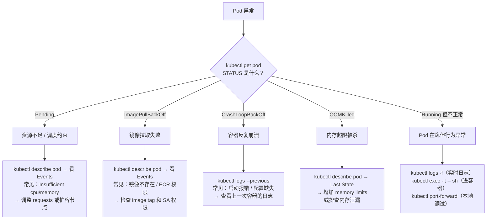

# K8s 可观测性

> 前置知识：了解 [[05-k8s-architecture|K8s 架构原理]]中的组件交互，以及 [[03-k8s-workload-types#四、DaemonSet — 每个节点一份|DaemonSet]] 的工作原理（日志采集依赖它）。
>
> 应用层的可观测性 SDK 见 [[opentelemetry-guide|OpenTelemetry 完整指南]]，本文聚焦 **K8s 集群层面**的可观测性基础设施。
>
> **学习建议**：首次阅读重点关注第一至三节和第五节（可观测性概念、Metrics Server/Prometheus 架构、日志采集、kubectl 排障）。2.4（AlertManager）、第四节（Traces）和第六节（EKS 集成）为进阶。

---

## 一、为什么需要可观测性

### 场景

你的 API 服务部署在 EKS 上，某天下午用户反馈"请求变慢了"。你打开 kubectl：

```bash
kubectl get pods -n production
# NAME                        READY   STATUS    RESTARTS   AGE
# api-7d8f9b6c4-xk2pq        1/1     Running   0          3d
# api-7d8f9b6c4-m2n5p        1/1     Running   0          3d
```

看起来一切正常——Pod 在跑、没有重启。但问题确实存在。你缺少的信息是：

- **Metrics**：CPU 使用率是不是飙了？每秒请求量有没有异常？P99 延迟多少？
- **Logs**：有没有超时错误日志？哪个接口最多？
- **Traces**：一个慢请求到底卡在哪一步？数据库查询慢还是下游服务慢？

`kubectl get pods` 只告诉你 Pod 是否在运行。可观测性告诉你 Pod 运行得**好不好**。

### 可观测性三大支柱

| 支柱 | 回答什么问题 | 典型工具 |
|------|------|------|
| **Metrics（指标）** | "现在怎么样？"——聚合的数值趋势 | Prometheus + Grafana |
| **Logs（日志）** | "发生了什么？"——离散的事件记录 | Fluent Bit + Elasticsearch / Loki |
| **Traces（链路追踪）** | "为什么慢？"——单个请求的完整调用路径 | Jaeger / Tempo + [[opentelemetry-guide|OpenTelemetry]] |

三者协同工作：Metrics 发现异常（CPU 飙升）→ Logs 定位错误（OOM 日志）→ Traces 追踪根因（下游超时）。

---

## 二、Metrics — 从数据采集到可视化告警

### 2.1 Metrics Server — HPA 的数据来源

**场景**：你配了 [[07-k8s-scheduling-resources#5.1 HPA（水平自动扩缩容）|HPA]] 让 Pod 在 CPU 达到 75% 时自动扩容。HPA 怎么知道当前 CPU 是多少？答案是 Metrics Server。

```
kubelet（每个节点上的代理）
  └── cAdvisor（内置组件，采集容器的 CPU/内存实时数据）
        ↓ kubelet 的 /metrics/resource 端点暴露
Metrics Server（集群级组件，聚合所有节点数据）
        ↓ 注册为 K8s API（metrics.k8s.io）
HPA Controller / kubectl top
```

```bash
# 查看 Pod 的实时 CPU 和内存
kubectl top pods -n production
# NAME                        CPU(cores)   MEMORY(bytes)
# api-7d8f9b6c4-xk2pq        1200m        3.2Gi

# 查看节点资源使用
kubectl top nodes
```

**Metrics Server 的局限**：

| 能做 | 不能做 |
|------|------|
| 实时 CPU/内存快照 | 存储历史数据（"昨天凌晨 CPU 多少"查不到） |
| 驱动 HPA 自动扩缩容 | 采集业务指标（QPS、延迟等） |
| `kubectl top` 命令 | 告警通知 |

> Metrics Server 只是起点。生产环境需要 Prometheus 补齐历史、查询和告警能力。

### 2.2 Prometheus — K8s 监控事实标准

#### 架构

```
┌─────────────────────────────────────────────────────────────────┐
│                    Prometheus 数据链路                            │
│                                                                 │
│  数据源（被采集端）              Prometheus Server          消费端  │
│  ┌───────────────┐       ┌──────────────────────┐              │
│  │ kubelet       │       │                      │   Grafana    │
│  │ /metrics      │◄──────│  Pull（主动拉取）       │──→ 可视化    │
│  ├───────────────┤       │                      │              │
│  │ kube-state-   │       │  TSDB（时序数据库）     │   AlertMgr   │
│  │ metrics       │◄──────│  存储 15d~90d        │──→ 告警通知   │
│  ├───────────────┤       │                      │              │
│  │ 你的应用       │       │  PromQL 查询引擎      │   HPA        │
│  │ /metrics      │◄──────│                      │──→ 自定义指标  │
│  └───────────────┘       └──────────────────────┘    扩缩容     │
│         ↑                         ↑                            │
│   ServiceMonitor            PrometheusRule                      │
│  （告诉 Prometheus            （定义告警规则）                     │
│   去哪里拉数据）                                                  │
└─────────────────────────────────────────────────────────────────┘
```

#### Pull 模型 vs Push 模型

Prometheus 采用 **Pull 模型**——由 Server 主动去各个目标的 `/metrics` 端点拉取数据，而不是目标主动推送。

| 对比 | Pull（Prometheus） | Push（StatsD、CloudWatch Agent） |
|------|------|------|
| 目标挂了 | Prometheus 立刻发现（拉不到） | 推送端沉默，需要额外检测 |
| 采集频率 | Prometheus 统一控制 | 每个目标自己决定 |
| 目标配置 | 不需要知道 Prometheus 地址 | 需要配置推送目标地址 |
| 适合场景 | 长期运行的服务 | 短生命周期任务（Job、Lambda） |

#### ServiceMonitor — 告诉 Prometheus "去哪拉数据"

ServiceMonitor 是 Prometheus Operator 定义的 [[11-k8s-extension-mechanisms#二、CRD（Custom Resource Definition）（进阶）|CRD]]，在 [[10-helm-argocd-deployment|Helm 部署笔记]]的 `generic-deployer` 中已集成支持：

```yaml
apiVersion: monitoring.coreos.com/v1
kind: ServiceMonitor
metadata:
  name: plaud-api
  namespace: plaud-project-summary
spec:
  selector:
    matchLabels:
      app: plaud-api             # 匹配哪些 Service
  endpoints:
    - port: metrics              # Service 的端口名
      path: /metrics             # 采集路径
      interval: 30s              # 每 30 秒采集一次
```

工作流程：Prometheus Operator watch ServiceMonitor 资源 → 自动更新 Prometheus 采集配置 → Prometheus 开始拉取目标的 `/metrics`。

> [!example] 🔗 实战链接：generic-deployer 中的 ServiceMonitor 模板
>
> 在我们的 deploy 项目中，`generic-deployer` Helm Chart 提供了通用的 ServiceMonitor 模板，80+ 微服务只需在 values 中开启即可接入 Prometheus 监控：
>
> **模板侧**（`generic-deployer/templates/servicemonitor.yaml`）：
>
> ```yaml
> {{- if .Values.serviceMonitor.enabled }}
> apiVersion: monitoring.coreos.com/v1
> kind: ServiceMonitor
> metadata:
>   name: {{ include "generic-deployer.fullname" . }}
>   namespace: monitoring
>   labels:
>     app.kubernetes.io/part-of: kube-prometheus
>     prometheus: k8s
> spec:
>   selector:
>     matchLabels:
>       {{- include "generic-deployer.selectorLabels" . | nindent 6 }}
>   namespaceSelector:
>     matchNames:
>       - {{ .Release.Namespace }}
>   endpoints:
>     - port: {{ .Values.serviceMonitor.port | default "web" }}
>       path: {{ .Values.serviceMonitor.path | default "/metrics" }}
>       interval: {{ .Values.serviceMonitor.interval | default "15s" }}
>       honorLabels: true
>       relabelings:
>         # 从 Pod annotation 提取 metrics 端口，动态覆盖采集地址
>         - sourceLabels: [__meta_kubernetes_pod_annotation_prometheus_io_port]
>           targetLabel: __tmp_port
>           regex: (.+)
>           action: replace
>         # 注入 app_name / region / env / 泳道 等业务标签
>         - sourceLabels: [__meta_kubernetes_pod_label_app_name]
>           targetLabel: app_name
>         - sourceLabels: [__meta_kubernetes_pod_annotation_metrics_labels_region]
>           targetLabel: region
>         - sourceLabels: [__meta_kubernetes_pod_annotation_metrics_labels_env]
>           targetLabel: env
>         - sourceLabels: [__meta_kubernetes_pod_annotation_metrics_labels_x_pld_lane]
>           targetLabel: x-pld-lane
> {{- end }}
> ```
>
> **服务侧**（`plaud-share-service/values/...`）——一个微服务通过 values 开启 ServiceMonitor 并声明 Prometheus annotation：
>
> ```yaml
> deployer:
>   serviceMonitor:
>     enabled: true          # 开启后自动创建 ServiceMonitor CRD
>
>   podAnnotations:
>     prometheus.io/scrape: "true"
>     prometheus.io/port: "9080"
>     prometheus.io/path: "/metrics"
>     metrics.labels/region: "ap-northeast-1"
>     metrics.labels/env: "staging"
>     metrics.labels/x-pld-lane: "main"
> ```
>
> 这体现了笔记中 ServiceMonitor 的核心概念——通过 CRD 声明式地告诉 Prometheus 去哪拉数据。模板中的 `relabelings` 还额外注入了 region、env、泳道等业务维度标签，使得后续在 Grafana 中可以按区域和环境进行筛选。

#### kube-state-metrics — K8s 资源状态的指标源

kubelet 的 cAdvisor 采集的是**容器级**指标（CPU、内存）。而 K8s 资源的**状态**信息（Deployment 副本数是否达标、Pod 处于什么 Phase、Job 是否完成）由 kube-state-metrics 提供：

```
cAdvisor：          "这个容器用了 1.2 核 CPU、3.2Gi 内存"  （运行时指标）
kube-state-metrics："这个 Deployment 期望 3 副本但只有 2 个 Ready"  （声明式状态指标）
```

> kube-state-metrics 作为一个 Deployment 部署在集群中，它 watch API Server 获取资源状态，转换为 Prometheus 格式暴露。

#### 常用 PromQL

```promql
# Pod 的 CPU 使用率（5分钟滑动窗口的每秒增长率）
rate(container_cpu_usage_seconds_total{namespace="production"}[5m])

# Pod 内存使用（MB）
container_memory_working_set_bytes{namespace="production"} / 1024 / 1024

# HTTP 请求 QPS（按状态码分组）
sum(rate(http_requests_total{namespace="production"}[5m])) by (status_code)

# P99 延迟（直方图的第 99 百分位）
histogram_quantile(0.99, rate(http_request_duration_seconds_bucket[5m]))

# Deployment 不可用副本数（kube-state-metrics 提供）
kube_deployment_status_replicas_unavailable{namespace="production"}
```

### 2.3 Grafana — 数据可视化

Grafana 从 Prometheus 等数据源读取数据，渲染为可视化 Dashboard：

```
数据源（Prometheus / Loki / Tempo / CloudWatch）
    ↓ 查询语言（PromQL / LogQL / TraceQL）
Grafana Dashboard（面板组合，可按团队/服务组织）
    ↓ 导出为 JSON
Git 版本管理（Dashboard as Code）
```

社区有大量预置 Dashboard（如 Node Exporter Full、K8s Cluster Monitoring），导入后开箱即用。

### 2.4 AlertManager — 从"发现问题"到"通知到人"（进阶）

**场景**：CPU 持续超过 90% 达 5 分钟，你希望自动收到 Slack 通知。

```
Prometheus 评估告警规则（PrometheusRule CRD）
    ↓ 触发告警
AlertManager 接收
    ├── 分组（同一服务的多个告警合并为一条通知）
    ├── 抑制（高优先级告警已触发时，抑制相关低优先级告警）
    ├── 静默（维护期间临时禁用特定告警）
    └── 路由 → Slack / PagerDuty / Email / Webhook
```

**PrometheusRule 示例**：

```yaml
apiVersion: monitoring.coreos.com/v1
kind: PrometheusRule
metadata:
  name: api-alerts
spec:
  groups:
    - name: api
      rules:
        - alert: HighCPUUsage
          expr: |
            rate(container_cpu_usage_seconds_total{namespace="production"}[5m]) > 0.9
          for: 5m                    # 持续 5 分钟才触发（避免瞬时抖动）
          labels:
            severity: warning
          annotations:
            summary: "Pod {{ $labels.pod }} CPU 超过 90%"
```

> [!example] 🔗 实战链接：生产环境的 PrometheusRule 告警规则
>
> 我们的 `prometheusrule/rule.yaml` 定义了两组真实告警——节点级（node.rules）和 Pod 级（pod.rules），覆盖了生产环境最常见的故障场景：
>
> ```yaml
> apiVersion: monitoring.coreos.com/v1
> kind: PrometheusRule
> metadata:
>   name: node-pod-alert-rules
>   namespace: monitoring
>   labels:
>     app.kubernetes.io/part-of: kube-prometheus
>     prometheus: k8s
>     role: alert-rules
> spec:
>   groups:
>     - name: node.rules
>       rules:
>         # 节点 CPU 持续 10 分钟超过 85%
>         - alert: NodeCPUUsage
>           expr: |
>             100 - (avg(irate(node_cpu_seconds_total{mode="idle"}[5m]))
>             by (instance) * 100) > 85
>           for: 10m
>           labels:
>             severity: warning
>           annotations:
>             summary: "Instance {{ $labels.instance }} CPU使用率过高"
>
>         # 节点 OOM Kill 检测——关联到可能的 Pod
>         - alert: HostOomKillDetected
>           expr: |
>             (increase(node_vmstat_oom_kill[1m]) > 0)
>             * on (instance) group_left (node)
>             (label_replace(topk(1, kube_pod_info{node!=""}), ...))
>           for: 0m
>           labels:
>             severity: warning
>           annotations:
>             description: "{{ $labels.instance }} 当前主机检查到有OOM现象!"
>
>     - name: pod.rules
>       rules:
>         # Pod 内存使用率超过 85%（对比 limits）
>         - alert: PodMemoryUsage
>           expr: |
>             (container_memory_rss / container_spec_memory_limit_bytes * 100) > 85
>             and container_spec_memory_limit_bytes > 0
>           for: 5m
>           labels:
>             severity: critical
>           annotations:
>             description: "命名空间: {{ $labels.namespace }} | Pod: {{ $labels.pod }} 内存使用大于85%"
>
>         # Pod 状态异常检测（CrashLoopBackOff、ImagePullBackOff 等）
>         - alert: PodCrashLoopBackOff
>           expr: |
>             sum by(namespace,pod) (kube_pod_container_status_waiting_reason{
>               reason="CrashLoopBackOff"}) == 1
>           for: 1m
>           labels:
>             severity: warning
> ```
>
> 这组规则体现了 PrometheusRule 的核心实践：`for` 字段避免瞬时抖动误报（节点 CPU 要持续 10 分钟才告警），`severity` 标签区分告警级别（OOM 是 warning，内存超限是 critical），annotation 中用模板变量输出具体的 namespace/pod 便于快速定位。

> [!example] 🔗 实战链接：AlertManager 的抑制规则与路由
>
> 我们的 AlertManager 配置（`kube-prometheus/base/manifests/alertmanager-secret.yaml`）展示了告警分组、抑制和路由的实际用法：
>
> ```yaml
> "inhibit_rules":
>   # critical 级别已触发时，自动抑制同 namespace 同名的 warning/info 告警
>   - "equal": ["namespace", "alertname"]
>     "source_matchers": ["severity = critical"]
>     "target_matchers": ["severity =~ warning|info"]
>   # warning 级别已触发时，抑制 info 级别
>   - "equal": ["namespace", "alertname"]
>     "source_matchers": ["severity = warning"]
>     "target_matchers": ["severity = info"]
> "route":
>   "group_by": ["namespace"]       # 按 namespace 分组，同一 namespace 的告警合并通知
>   "group_wait": "30s"             # 首次告警等 30s 聚合
>   "group_interval": "5m"          # 同组新告警间隔 5 分钟发送
>   "repeat_interval": "12h"        # 未恢复的告警每 12 小时重复通知
>   "routes":
>     - "matchers": ["severity = critical"]
>       "receiver": "Critical"      # critical 告警走专用通道
> ```
>
> 这段配置对应了笔记中 AlertManager 的三个关键能力：**分组**（按 namespace 合并）、**抑制**（critical 自动压制 warning）、**路由**（按严重程度分发到不同 receiver）。

---

## 三、Logging — 集群日志架构

### 3.1 容器日志机制

容器把日志写到 stdout/stderr，容器运行时（[[01-docker-basics#10. 容器运行时（深入）|containerd]]）将其保存为节点上的 JSON 文件：

```
容器进程 → stdout/stderr
    ↓ containerd 捕获并写入磁盘
节点文件: /var/log/containers/<pod>_<namespace>_<container>-<id>.log
    ↓ JSON 行格式
{"log":"2024-03-15T10:30:00Z INFO Processing request...\n","stream":"stdout","time":"..."}
```

这些日志文件有两个问题：
1. **分散**：每个节点只有自己的 Pod 日志，没有集中视图
2. **临时**：Pod 被删除或节点缩容后日志丢失

> [!example] 🔗 实战链接：plaud-project-summary 的 emptyDir 卷用于应用日志落盘
>
> 除了 stdout/stderr，有些应用还会将日志写入文件（如 Java 应用的 log4j 文件输出）。`plaud-project-summary` 通过 `emptyDir` 卷在 Pod 内提供日志目录，日志采集器（如 sidecar 或 DaemonSet）可以读取这些文件：
>
> ```yaml
> # plaud-project-summary/values/ap-northeast-1/prod/main.yaml
> deployer:
>   volumeMounts:
>     - name: logs
>       mountPath: /data/plaud-sync/logs   # 应用将日志写入此路径
>
>   volumes:
>     - name: logs
>       emptyDir: {}    # Pod 级临时卷，Pod 删除后日志消失
> ```
>
> `emptyDir` 是 Pod 生命周期内的临时存储——这正好印证了上面提到的"临时性"问题：Pod 删除后这些日志就丢失了，所以必须配合 Fluent Bit DaemonSet 集中采集。

### 3.2 日志采集架构

解决方案：用 [[03-k8s-workload-types#四、DaemonSet — 每个节点一份|DaemonSet]] 在每个节点上运行日志采集器，将日志发送到集中存储。

```
每个节点                          集中存储               可视化
┌──────────────────┐
│ Fluent Bit Pod   │     ┌──────────────┐       ┌─────────┐
│ (DaemonSet)      │────→│ Elasticsearch│──────→│ Kibana  │   EFK 方案
│                  │     └──────────────┘       └─────────┘
│ 挂载节点的        │
│ /var/log/         │     ┌──────────────┐       ┌─────────┐
│ containers/      │────→│ Loki         │──────→│ Grafana │   Grafana 方案
│                  │     └──────────────┘       └─────────┘
│ 自动添加 K8s     │
│ 元数据：          │     ┌──────────────┐
│ namespace / pod  │────→│ CloudWatch   │                    AWS 方案
│ container / node │     └──────────────┘
└──────────────────┘
```

**Fluent Bit vs Fluentd**：

| 特性 | Fluent Bit | Fluentd |
|------|------|------|
| 语言 | C | Ruby |
| 内存占用 | ~5MB | ~40MB |
| 插件生态 | 核心场景够用 | 更丰富（几百个插件） |
| 推荐用法 | **节点级采集（推荐）** | 复杂的日志路由和聚合 |

> EKS 推荐：每个节点跑 Fluent Bit（采集 + 初步处理），如果需要复杂路由再加一层 Fluentd 做聚合。

> [!example] 🔗 实战链接：Fluent Bit 的完整采集管线配置
>
> 我们的 Fluent Bit DaemonSet 配置（`infra/values/fluent-bit/default.yaml`）完整展示了 Input → Filter → Output 管线：
>
> ```yaml
> config:
>   # ① INPUT：用 tail 插件读取节点上所有容器日志文件
>   inputs: |
>     [INPUT]
>         Name              tail
>         Path              /var/log/containers/*.log
>         Parser            cri
>         Tag               kube.*
>         Refresh_Interval  5
>         DB                /var/log/flb_kube.db    # 记录读取位置，重启后不重复采集
>         Mem_Buf_Limit     5MB                     # 内存缓冲限制，防止 OOM
>         Skip_Long_Lines   On
>
>   # ② FILTER：注入 K8s 元数据 + 过滤噪音
>   filters: |
>     [FILTER]
>         Name                kubernetes
>         Match               kube.*
>         Merge_Log           On            # 将 JSON 格式日志展开为顶层字段
>         Labels              On            # 附加 Pod labels
>         Annotations         On            # 附加 Pod annotations
>
>     # 排除系统命名空间的日志
>     [FILTER]
>         Name    grep
>         Match   kube.*
>         Exclude kubernetes.namespace_name  ^(kube-system|opensearch)$
>
>     # 排除健康检查等无意义日志
>     [FILTER]
>         Name                grep
>         Match               kube.*
>         Exclude             log   /health
>
>   # ③ OUTPUT：发送到 OpenSearch（Elasticsearch 兼容）
>   outputs: |
>     [OUTPUT]
>         Name                opensearch
>         Match               *
>         Host                opensearch-cluster-master
>         Port                9200
>         Logstash_Prefix     k8s-std       # 索引前缀，最终索引名如 k8s-std-2024.03.15
>         Logstash_Format     On            # 按日期滚动索引
>         Retry_Limit         10
>         tls                 On
>         Suppress_Type_Name  On
> ```
>
> 这段配置体现了笔记中日志采集架构的完整链路：Fluent Bit 以 DaemonSet 形式挂载节点的 `/var/log/containers/`，通过 kubernetes filter 自动注入 namespace、pod 等元数据，过滤掉系统日志和健康检查噪音，最终输出到 OpenSearch 集中存储。

### 3.3 日志后端对比

| 方案 | 索引方式 | 查询能力 | 成本 | 适用场景 |
|------|------|------|------|------|
| **Elasticsearch + Kibana** | 全文索引 | 强（全文搜索、聚合分析） | 高（索引占大量空间） | 需要复杂查询和分析 |
| **Loki + Grafana** | 只索引 label | 按 label 过滤 + grep | 低（不索引日志内容） | 与 Grafana 统一、成本敏感 |
| **CloudWatch Logs** | AWS 托管 | Insights 查询语言 | 按量付费 | AWS 原生集成、运维最少 |

### 3.4 kubectl logs — 快速查看

```bash
# 查看 Pod 日志
kubectl logs <pod> -n <namespace>

# 实时跟踪（类似 tail -f）
kubectl logs -f <pod>

# 查看最近 100 行
kubectl logs --tail 100 <pod>

# 多容器 Pod 指定容器
kubectl logs <pod> -c <container-name>

# 查看前一个容器的日志（CrashLoopBackOff 排障必备！）
kubectl logs <pod> --previous

# 按 label 查看所有匹配 Pod 的日志
kubectl logs -l app=api -n production --tail 50
```

> `kubectl logs` 只读节点上的日志文件。Pod 删除后日志消失——这就是为什么生产环境必须有集中式日志采集。

---

## 四、Traces — 分布式链路追踪（进阶）

Traces 记录单个请求在多个服务间的完整调用路径，是定位"慢请求卡在哪"的关键手段。

### 4.1 在 K8s 中的部署架构

应用层的 Trace 采集由 [[opentelemetry-guide|OpenTelemetry SDK]] 完成。在 K8s 集群中，还需要部署 Trace 收集和存储后端：

```
应用 Pod（OTel SDK 埋点）
    ↓ OTLP 协议
OTel Collector（Deployment 或 DaemonSet 部署）
    ↓ 处理（采样、批量、添加 K8s 元数据）
Trace 后端
    ├── Jaeger（自托管，Elasticsearch / Cassandra 存储）
    ├── Tempo（Grafana 生态，对象存储，成本低）
    └── AWS X-Ray（AWS 托管）
         ↓
Grafana / Jaeger UI / X-Ray Console（可视化查询）
```

> [!example] 🔗 实战链接：OTel Collector DaemonSet + Tempo 的完整 Trace 管线
>
> 我们的 EKS 集群中，OTel Collector 以 DaemonSet 模式部署（`infra/values/otel/default.yaml`），同时承担 Logs、Metrics、Traces 三条管线的收集和转发：
>
> ```yaml
> mode: daemonset          # 每个节点一个 Collector Pod
> image:
>   repository: "otel/opentelemetry-collector-contrib"
>   tag: "0.132.4"
>
> config:
>   receivers:
>     # 接收应用通过 OTLP 协议 push 的数据（gRPC + HTTP）
>     otlp:
>       protocols:
>         grpc:
>           endpoint: "0.0.0.0:4317"
>         http:
>           endpoint: "0.0.0.0:4318"
>
>   processors:
>     memory_limiter:
>       limit_mib: 400           # 防止 Collector 自身 OOM
>       spike_limit_mib: 100
>     batch: {}                   # 批量发送，减少网络开销
>     k8sattributes:              # 自动注入 K8s 元数据
>       extract:
>         metadata:
>           - k8s.pod.name
>           - k8s.deployment.name
>           - k8s.namespace.name
>
>   exporters:
>     # Traces → Tempo（Grafana 生态的 Trace 后端）
>     otlp/tempo:
>       endpoint: "tempo-distributed-distributor.tracing.svc.cluster.local:4317"
>       tls:
>         insecure: true
>     # Logs → OpenSearch
>     opensearch/logs:
>       logs_index: k8s-otel
>       http:
>         endpoint: "https://opensearch-cluster-master.opensearch.svc.cluster.local:9200"
>     # Metrics → Prometheus（通过 remote write 暴露给 Prometheus 采集）
>     prometheus/metrics:
>       endpoint: "0.0.0.0:8889"
>
>   # 三条独立管线，共享 receivers 但各自路由到不同后端
>   service:
>     pipelines:
>       traces:
>         receivers: [otlp]
>         processors: [memory_limiter, batch, k8sattributes]
>         exporters: [otlp/tempo]
>       logs:
>         receivers: [otlp]
>         processors: [memory_limiter, batch, k8sattributes]
>         exporters: [opensearch/logs]
>       metrics:
>         receivers: [otlp, prometheus]
>         processors: [memory_limiter, batch, k8sattributes]
>         exporters: [prometheus/metrics]
> ```
>
> **Tempo 后端**使用 S3 作为存储（`infra/values/tempo/global/prod/values.yaml`），通过 IRSA 获取 AWS 权限：
>
> ```yaml
> storage:
>   trace:
>     backend: s3
>     s3:
>       endpoint: s3.us-west-2.amazonaws.com
>       bucket: global-prod-obs
>
> serviceAccount:
>   annotations:
>     eks.amazonaws.com/role-arn: arn:aws:iam::<account-id>:role/obs-s3
> ```
>
> 这组配置完整对应了笔记中的 Trace 架构图：应用 Pod 通过 OTLP 协议将 Span 推送到每个节点上的 OTel Collector DaemonSet，Collector 经过 `k8sattributes` processor 注入 K8s 元数据后，通过 `otlp/tempo` exporter 转发到 Tempo。Tempo 使用 S3 对象存储作为后端，成本远低于 Elasticsearch。三条管线（traces/logs/metrics）共享同一个 Collector 进程，通过 `service.pipelines` 配置各自的数据流向。

### 4.2 与 Service Mesh 的关系

[[04-k8s-networking#七、Service Mesh 概述（深入）|Service Mesh]]（如 Istio）的 Sidecar 代理可以自动为所有服务间请求生成基础 Trace Span，不需要修改应用代码。但它只能覆盖网络层面的调用关系，应用内部的函数级追踪仍然需要 OTel SDK。

---

## 五、kubectl 排障实战

### 5.1 Pod 状态排障决策树



### 5.2 常用排障命令

```bash
# ===== 查看状态 =====
kubectl get pods -n <ns> -o wide          # 含节点信息和 Pod IP
kubectl get events -n <ns> --sort-by=.lastTimestamp  # 按时间排序的事件

# ===== 详细诊断 =====
kubectl describe pod <pod> -n <ns>        # 完整信息：Events、Conditions、容器状态
kubectl describe node <node>              # 节点状态：资源压力、Taints

# ===== 日志 =====
kubectl logs <pod> -n <ns>                # 当前容器日志
kubectl logs <pod> --previous             # 前一个容器日志（CrashLoop 必备）
kubectl logs <pod> -c <container>         # 多容器 Pod 指定容器

# ===== 进入容器 =====
kubectl exec -it <pod> -- /bin/sh         # 进入容器 shell
kubectl exec <pod> -- env                 # 查看环境变量
kubectl exec <pod> -- cat /etc/resolv.conf  # 查看 DNS 配置

# ===== 端口转发（本地调试） =====
kubectl port-forward <pod> 8080:8001 -n <ns>
# 本地 localhost:8080 → Pod 的 8001 端口，无需 Ingress/Service

# ===== 资源使用 =====
kubectl top pods -n <ns>                  # Pod 的 CPU/内存实时使用
kubectl top nodes                         # 节点的 CPU/内存
```

### 5.3 常见故障速查

| 现象 | 排查方向 | 关键命令 |
|------|------|------|
| Pod 一直 Pending | 资源不足 / nodeSelector 不匹配 / PVC 未绑定 | `describe pod` 看 Events |
| CrashLoopBackOff | 应用启动失败 / 配置错误 | `logs --previous` |
| Running 但 0/1 Ready | readinessProbe 失败 | `describe pod` 看 Conditions |
| Service 访问不通 | Endpoints 为空 / selector 不匹配 | `get endpoints` + [[04-k8s-networking#八、网络排障速查|网络排障]] |
| HPA 不扩容 | Metrics Server 未装 / TARGETS 显示 unknown | `get hpa` 看 TARGETS 列 |
| 节点 NotReady | 磁盘压力 / 内存压力 / kubelet 异常 | `describe node` 看 Conditions |

---

## 六、EKS 可观测性集成（进阶）

AWS 提供托管的可观测性服务，减少自运维负担：

| 组件 | 自建方案 | AWS 托管方案 | 说明 |
|------|------|------|------|
| Metrics | Prometheus + Grafana | AMP + AMG | AMP = Amazon Managed Prometheus |
| Logging | Fluent Bit + Elasticsearch | Fluent Bit + CloudWatch | EKS 提供 Fluent Bit 托管插件 |
| Tracing | Jaeger / Tempo | AWS X-Ray | 与 OTel SDK 兼容 |
| 全栈 | 各自搭建 | CloudWatch Container Insights | 开箱即用但定制性有限 |

**CloudWatch Container Insights** 开启后自动采集：
- Pod / Node 的 CPU、内存、网络、磁盘指标
- 容器日志发送到 CloudWatch Logs
- CloudWatch 中自动创建监控 Dashboard

> **选型建议**：小团队用 Container Insights（零运维起步）；规模增长后迁移到 Prometheus + Grafana + Loki（更强的查询能力和更低的长期成本）。

---

## 延伸阅读

- [[05-k8s-architecture|K8s 架构原理]] — kubelet / cAdvisor 在数据平面中的位置
- [[03-k8s-workload-types|K8s 工作负载类型]] — DaemonSet 驱动的日志采集架构
- [[07-k8s-scheduling-resources|调度与资源管理]] — Metrics Server 驱动的 HPA 扩缩容
- [[11-k8s-extension-mechanisms|K8s 扩展机制]] — ServiceMonitor / PrometheusRule 等 CRD
- [[10-helm-argocd-deployment|Helm 与 EKS 部署体系]] — generic-deployer 中的 ServiceMonitor 配置
- [[opentelemetry-guide|OpenTelemetry 完整指南]] — 应用层的 Traces / Metrics SDK
