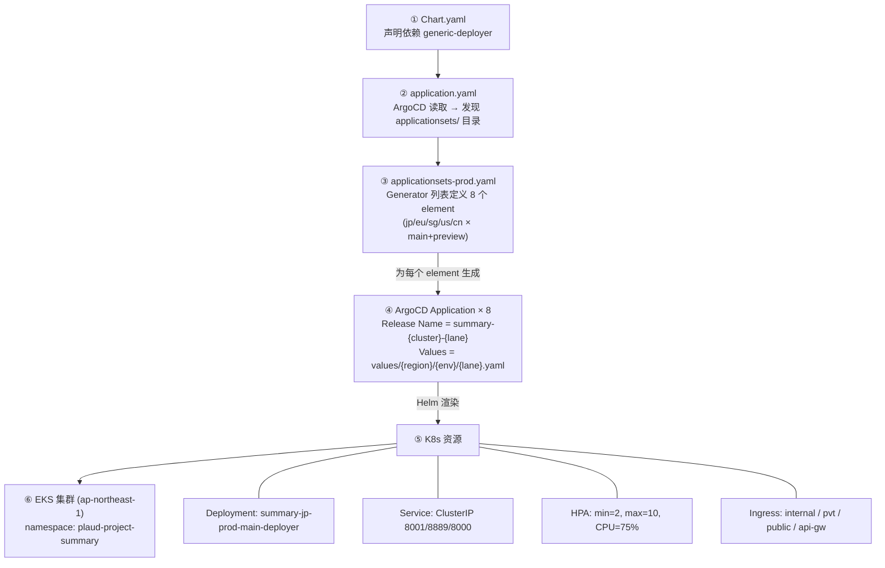
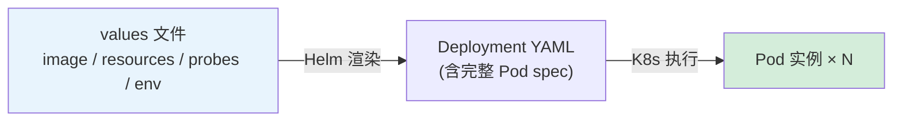

# Helm 与 EKS 集群地址学习笔记

## 一、Helm 是什么

### 1.1 核心概念

Helm 是 Kubernetes 的**包管理工具**，类似于 Linux 中的 `apt/yum`、Node.js 中的 `npm`。它解决的核心问题是：**将一组 Kubernetes YAML 资源打包、模板化、版本化管理**。

核心术语：


| 术语             | 说明                                       |
| -------------- | ---------------------------------------- |
| **Chart**      | 一个 Helm 包，包含一组模板化的 K8s 资源定义              |
| **Release**    | Chart 的一次安装实例（同一个 Chart 可在不同集群/命名空间安装多次） |
| **Values**     | 传入 Chart 模板的配置参数，用于定制化部署                 |
| **Template**   | Go 模板语法编写的 K8s YAML，通过 Values 渲染为最终清单    |
| **Repository** | 存储和分发 Chart 的仓库                          |


### 1.2 Helm 解决了什么问题

1. **消除重复 YAML**：同一个微服务部署到多个环境/区域，只需维护一套模板 + 不同 values 文件
2. **版本管理**：Chart 有版本号，可以升级、回滚
3. **依赖管理**：一个 Chart 可以依赖其他 Chart（子 Chart）
4. **参数化配置**：通过 `values.yaml` 注入不同环境的配置（镜像版本、副本数、资源限制等）

### 1.3 Chart 目录结构

```
my-chart/
├── Chart.yaml          # Chart 元数据（名称、版本、依赖）
├── values.yaml         # 默认参数值
├── templates/          # K8s 资源模板
│   ├── _helpers.tpl    # 可复用的模板片段
│   ├── deployment.yaml
│   ├── service.yaml
│   ├── ingress.yaml
│   ├── hpa.yaml
│   └── serviceaccount.yaml
└── charts/             # 子 Chart（依赖）
```

### 🔗 实战链接：generic-deployer 的真实 Chart 结构

我们的 `generic-deployer` Chart 是所有 80+ 微服务的公共基座，它的 templates 目录包含了一个微服务部署所需的全部资源模板：

```text
generic-deployer/
├── Chart.yaml              # name: deployer, version: 0.1.0
├── values.yaml             # 默认参数值
└── templates/
    ├── _helpers.tpl         # fullname 生成、标签生成、ingress 冲突校验
    ├── deployment.yaml      # Deployment（含滚动更新、拓扑分散、优雅关停）
    ├── service.yaml         # Service（ClusterIP）
    ├── service-headless.yaml # Headless Service（用于 StatefulSet 场景）
    ├── ingress.yaml         # 单 Ingress 模式
    ├── ingresses.yaml       # 多 Ingress 模式（internal/pvt/public 分离）
    ├── hpa.yaml             # HPA 水平自动扩缩容
    ├── serviceaccount.yaml  # ServiceAccount（支持 IRSA 注解）
    ├── servicemonitor.yaml  # ServiceMonitor CRD（Prometheus 指标采集）
    ├── externalsecret.yaml  # ExternalSecret CRD（AWS Secrets Manager 同步）
    └── config.yaml          # ConfigMap（应用配置注入）
```

> 注意模板中包含了两个 CRD 资源（ServiceMonitor 和 ExternalSecret），体现了 Helm 与 [[11-k8s-extension-mechanisms|K8s 扩展机制]] 的结合——Chart 不仅管理内置资源，也管理自定义资源。

### 1.4 关键模板机制

**模板渲染流程**：`Chart 模板` + `Values 参数` → 渲染 → 最终 K8s YAML → 部署到集群

```yaml
# templates/service.yaml 示例
apiVersion: v1
kind: Service
metadata:
  name: {{ include "generic-deployer.fullname" . }}  # 通过 _helpers.tpl 中的函数生成
spec:
  type: {{ .Values.service.type }}
  ports:
    {{- range .Values.service.ports }}
    - port: {{ .port }}
      targetPort: {{ .targetPort | default .port }}
    {{- end }}
```

**fullname 生成逻辑**（`_helpers.tpl`）：

```
1. 如果设置了 fullnameOverride → 直接使用
2. 否则 name = nameOverride || Chart.Name
3. 如果 Release.Name 包含 name → 使用 Release.Name
4. 否则 → Release.Name + "-" + name（截取前 63 字符）
```

### 1.5 子 Chart（依赖）机制

在 `Chart.yaml` 中声明依赖：

```yaml
# plaud-project-summary/Chart.yaml
dependencies:
- name: deployer            # 子 Chart 名称
  version: 0.1.0
  repository: "file://../generic-deployer"  # 引用本地路径
```

父 Chart 的 values 通过子 Chart 名称作为 key 传递：

```yaml
# main.yaml
deployer:                   # 对应子 Chart 名称
  replicaCount: 2
  image:
    repository: 236604669925.dkr.ecr.us-west-2.amazonaws.com/plaud/plaud-project-summary
    tag: "93347b0"
  service:
    type: ClusterIP
    ports:
      - port: 8001
        name: api
        targetPort: 8001
```

---

## 二、项目中 Helm 的实际用法

### 2.1 generic-deployer：通用部署基座

项目中使用一个共享的 `generic-deployer` Chart 作为所有微服务的基座，提供标准化的：

- Deployment（含滚动更新策略、拓扑分散约束、优雅关停）
- Service
- Ingress（单/多 ingress 支持）
- ServiceAccount（支持 EKS IRSA）
- HPA（水平自动扩缩容）
- ExternalSecret（外部密钥管理）
- ServiceMonitor（Prometheus 监控）
- ConfigMap

#### 🔗 实战链接：generic-deployer 的 Deployment 模板关键设计

`generic-deployer/templates/deployment.yaml` 中内置了多项生产级最佳实践：

```yaml
# generic-deployer/templates/deployment.yaml（关键片段）
spec:
  {{- if not .Values.autoscaling.enabled }}
  replicas: {{ .Values.replicaCount }}   # HPA 开启时不设 replicas，交给 HPA 控制
  {{- end }}
  strategy:
    type: RollingUpdate
    rollingUpdate:
      maxUnavailable: {{ .Values.updateStrategy.maxUnavailable | default 0 }}
      maxSurge: {{ .Values.updateStrategy.maxSurge | default "25%" }}
  template:
    spec:
      terminationGracePeriodSeconds: {{ .Values.terminationGracePeriodSeconds | default 45 }}
      # --- 默认拓扑分散约束（跨 AZ + 跨节点） ---
      topologySpreadConstraints:
        - maxSkew: 1
          topologyKey: topology.kubernetes.io/zone    # Pod 均匀分布到不同可用区
          whenUnsatisfiable: ScheduleAnyway
        - maxSkew: 1
          topologyKey: kubernetes.io/hostname          # Pod 均匀分布到不同节点
          whenUnsatisfiable: ScheduleAnyway
```

> 模板中 `replicas` 字段使用条件渲染：当 HPA 未开启时才设置，避免 HPA 和 Deployment 的副本数冲突。拓扑分散约束默认开启，确保 Pod 跨可用区高可用。这些逻辑只需在模板中写一次，80+ 微服务自动继承。

### 2.2 项目目录结构

每个微服务项目采用统一的目录结构：

```
plaud-project-summary/
├── Chart.yaml                      # 声明对 generic-deployer 的依赖
├── application.yaml                # ArgoCD 顶层 Application（指向 applicationsets/）
├── applicationsets/
│   ├── applicationsets.yaml        # Staging 环境的 ApplicationSet
│   └── applicationsets-prod.yaml   # Production 环境的 ApplicationSet
└── values/
    ├── ap-northeast-1/
    │   ├── staging/main.yaml
    │   └── prod/
    │       ├── main.yaml
    │       └── preview.yaml
    ├── ap-southeast-1/prod/main.yaml
    ├── eu-central-1/prod/main.yaml
    ├── us-west-2/
    │   ├── staging/main.yaml
    │   └── prod/
    │       ├── main.yaml
    │       └── preview.yaml
    └── cn-northwest-1/
        ├── staging/main.yaml
        └── prod/
            ├── main.yaml
            └── preview.yaml
```

### 2.3 ArgoCD ApplicationSet + Helm 的协作

ArgoCD ApplicationSet 充当"编排层"，将 Helm Chart 分发到多个集群：

```yaml
# plaud-project-summary/applicationsets/applicationsets-prod.yaml
spec:
  generators:
    - list:
        elements:
          - cluster: jp-prod
            server: https://686061FA24...eks.amazonaws.com   # EKS 集群地址
            env: prod
            region: ap-northeast-1
            lane: main
          - cluster: cn-prod
            server: https://D2572EA5B8...eks.amazonaws.com.cn
            env: prod
            region: cn-northwest-1
            lane: main
  template:
    metadata:
      name: "plaud-project-summary-{{ cluster }}-{{ lane }}"   # Helm Release 名
      namespace: plaud-project-summary
    spec:
      source:
        path: plaud-project-summary
        helm:
          valueFiles:
            - values/{{ region }}/{{ env }}/{{ lane }}.yaml    # 注意：不带 values- 前缀
      destination:
        server: "{{ server }}"                 # 部署目标集群
        namespace: plaud-project-summary
```

**部署流程**：

```text
ApplicationSet Generator（集群列表）
    ↓ 为每个 element 生成一个 ArgoCD Application
Application（per cluster + lane）
    ↓ 使用 Helm 渲染
Helm Chart (generic-deployer) + Values 文件
    ↓ 渲染出 K8s 资源
部署到对应 EKS 集群的目标 namespace
```

#### 🔗 实战链接：基础设施的 Multi-Source ApplicationSet 模式

微服务的 ApplicationSet 使用单一 source（Git 仓库中的 Helm Chart + values），而基础设施组件使用了更高级的 **Multi-Source** 模式——Helm Chart 来自外部仓库，values 文件来自内部 Git 仓库：

```yaml
# infra/applicationsets/strimzi-kafka-operator.yaml（简化）
apiVersion: argoproj.io/v1alpha1
kind: ApplicationSet
metadata:
  name: strimzi-kafka-operator
spec:
  generators:
    - list:
        elements:
          - name: jp-prod
            targetRevision: 0.50.0       # Operator 版本可按集群差异化
          - name: cn-prod
            targetRevision: 0.50.0
          # ... 共 11 个集群
  template:
    spec:
      sources:                           # 注意：sources（复数），不是 source
        # Source 1: 外部 Helm Chart（来自 Strimzi 官方 OCI 仓库）
        - repoURL: quay.io/strimzi-helm
          targetRevision: "{{ targetRevision }}"
          chart: strimzi-kafka-operator
          helm:
            releaseName: strimzi-kafka-operator
            valueFiles:
              - $values/infra/values/strimzi-kafka-operator/default.yaml

        # Source 2: 内部 Git 仓库（提供自定义 values 文件）
        - repoURL: git@github.com:Plaud-AI/deploy.git
          targetRevision: main
          ref: values                    # 用 ref 引用，$values 即指向此源
```

**同样的模式也用于 ClickHouse Operator 和 OpenSearch**：

```yaml
# infra/applicationsets/opensearch-master.yaml（简化）
sources:
  - repoURL: https://opensearch-project.github.io/helm-charts
    targetRevision: "{{ targetRevision }}"
    chart: opensearch
    helm:
      valueFiles:
        - $values/infra/values/opensearch-master/default.yaml        # 全局默认值
        - $values/infra/values/opensearch-master/{{ region }}/{{ env }}/values.yaml  # 环境差异值
  - repoURL: git@github.com:Plaud-AI/deploy.git
    targetRevision: main
    ref: values
```

> **Multi-Source 的优势**：Helm Chart 版本由外部仓库管理（`targetRevision: 0.50.0`），配置值由内部 Git 仓库管理。升级 Operator 只需修改 `targetRevision`，无需 fork 整个 Chart。values 文件支持多层叠加（`default.yaml` + `region/env/values.yaml`），实现渐进式配置覆盖。

### 2.4 集群内服务地址（K8s Service DNS）

最终在集群内生成的服务名格式为：

```
<release-name>-deployer.<namespace>:<port>
```

即：

```
plaud-project-summary-<cluster>-<lane>-deployer.plaud-project-summary:<port>
```

示例：

- `plaud-project-summary-jp-prod-main-deployer.plaud-project-summary:8001`
- `plaud-project-summary-jp-prod-preview-deployer.plaud-project-summary:8001`
- `plaud-project-summary-cn-prod-main-deployer.plaud-project-summary:8001`

---

## 三、实战示例：plaud-project-summary 项目全解析

以 `plaud-project-summary`（摘要服务）为例，完整拆解一个微服务从 Chart 定义到多集群部署的全过程。

### 3.1 项目目录结构

```
plaud-project-summary/
├── Chart.yaml                                    # ① Chart 元信息 + 依赖声明
├── application.yaml                              # ② ArgoCD 顶层 Application
├── applicationsets/
│   ├── applicationsets.yaml                      # ③ Staging ApplicationSet
│   └── applicationsets-prod.yaml                 # ④ Production ApplicationSet
└── values/
    ├── ap-northeast-1/
    │   ├── staging/main.yaml                     # ⑤ JP Staging 配置
    │   └── prod/
    │       ├── main.yaml                         # ⑥ JP Prod 配置
    │       └── preview.yaml                      # ⑦ JP Prod Preview 配置
    ├── us-west-2/
    │   ├── staging/main.yaml                     # US Staging
    │   └── prod/
    │       ├── main.yaml                         # US Prod
    │       └── preview.yaml                      # US Prod Preview
    ├── ap-southeast-1/prod/main.yaml             # SG Prod
    ├── eu-central-1/prod/main.yaml               # EU Prod
    └── cn-northwest-1/
        ├── staging/main.yaml                     # CN Staging
        └── prod/
            ├── main.yaml                         # CN Prod
            └── preview.yaml                      # CN Prod Preview
```

### 3.2 ① Chart.yaml — 声明依赖

```yaml
apiVersion: v2
name: plaud-project-summary      # Chart 名称，也是默认的 K8s 资源名前缀
type: application
version: 0.1.0

dependencies:
- name: deployer                          # 子 Chart 名称（values 中以此为 key）
  version: 0.1.0
  repository: "file://../generic-deployer" # 引用本地的 generic-deployer
```

> 所有项目的 Chart.yaml 几乎一模一样，区别只有 `name` 字段。

### 3.3 ② application.yaml — ArgoCD 入口

```yaml
apiVersion: argoproj.io/v1alpha1
kind: Application
metadata:
  name: plaud-project-summary           # 父应用名
  namespace: argocd
spec:
  destination:
    server: https://kubernetes.default.svc    # 部署到 ArgoCD 所在集群
    namespace: plaud-project-summary
  project: plaud
  source:
    repoURL: git@github.com:Plaud-AI/deploy.git
    targetRevision: HEAD
    path: plaud-project-summary/applicationsets       # 指向 applicationsets 目录
  syncPolicy:
    automated:
      prune: false
      selfHeal: false
```

> 这个 Application 的作用是让 ArgoCD 发现 `applicationsets/` 目录下的 ApplicationSet 资源。

**`syncPolicy.automated` 两个关键开关**：

| 配置 | 管控的场景 | `true` | `false` |
| --- | --- | --- | --- |
| **`prune`** | Git 中的改动导致某个 K8s 资源**不再被渲染**，但集群中还存在 | 自动删除集群中的对应资源 | 只标记 "out of sync"，不删除，等人工处理 |
| **`selfHeal`** | 集群中的资源被**手动修改**（如 `kubectl edit`），与 Git 不一致 | 自动恢复成 Git 中定义的状态 | 只标记 "out of sync"，不修改，等人工处理 |

> **`prune` 的具体场景**：以上面的 `application.yaml` 为例，它的 source 指向 `applicationsets/` 目录。如果你从 Git 中删除了 `applicationsets/applicationsets.yaml` 这个文件并推送，ArgoCD 发现集群中存在一个 ApplicationSet 但 Git 中已经没有了——`prune: true` 会自动删除集群中的 ApplicationSet（连带删除它生成的所有 Application），`prune: false` 则只标记 "out of sync"，等人工确认。这就是"安全优先"：误删文件（手滑、merge 冲突丢失等）不会导致线上资源被连带删除。
>
> **`selfHeal` 的具体场景**：有人用 `kubectl scale --replicas=5` 临时改了副本数，ArgoCD 会自动改回 Git 中 values 文件定义的值（如 `replicaCount: 2`），确保 Git 始终是唯一的事实来源（Single Source of Truth）。

### 3.4 ③④ ApplicationSet — 多集群编排

**Staging（applicationsets.yaml）**：

```yaml
spec:
  generators:
    - list:
        elements:
          - cluster: jp-staging                          # 用于生成 ArgoCD Application 名
            server: https://0AE3C052...eks.amazonaws.com # JP Staging 集群
            env: staging
            region: ap-northeast-1
            lane: main
          - cluster: us-staging
            server: https://C85149DE...eks.amazonaws.com # US Staging 集群
            env: staging
            region: us-west-2
            lane: main
          - cluster: cn-staging
            server: https://4F8B0222...eks.amazonaws.com.cn  # CN Staging 集群
            env: staging
            region: cn-northwest-1
            lane: main
  template:
    metadata:
      name: "plaud-project-summary-{{ cluster }}-{{ lane }}"  # → plaud-project-summary-jp-staging-main
    spec:
      source:
        targetRevision: dev                           # Staging 用 dev 分支
        helm:
          valueFiles:
            - values/{{ region }}/{{ env }}/{{ lane }}.yaml
      syncPolicy:
        automated:
          selfHeal: true         # Staging 开启自愈（自动同步）
```

**Production（applicationsets-prod.yaml）**：

```yaml
spec:
  generators:
    - list:
        elements:
          - cluster: jp-prod, lane: main       # → plaud-project-summary-jp-prod-main-deployer
          - cluster: jp-prod, lane: preview    # → Preview 环境（[[13-k8s-lane-mechanism|泳道机制]]）
          - cluster: eu-prod, lane: main       # → EU 区域
          - cluster: sg-prod, lane: main       # → 新加坡区域
          - cluster: us-prod, lane: main       # → US 区域
          - cluster: us-prod, lane: preview    # → US Preview
          - cluster: cn-prod, lane: main       # → 中国区域
          - cluster: cn-prod, lane: preview    # → 中国 Preview
  template:
    spec:
      source:
        targetRevision: main                          # Prod 用 main 分支
      syncPolicy:
        # automated 被注释掉 → Prod 需要手动同步
```

**Staging vs Production 关键差异**：


| 配置项            | Staging                              | Production                       |
| -------------- | ------------------------------------ | -------------------------------- |
| targetRevision | `dev`                                | `main`                           |
| 自动同步           | `selfHeal: true` + `prune: false`    | 手动（注释掉了 automated）               |
| 集群数量           | 3（JP/US/CN）                          | 8（JP/EU/SG/US/CN × main+preview） |

> Staging 的策略是：手动改集群会被自动纠正（防止配置漂移），但不会自动删资源（防止误删）。Prod 两个都关闭（或整个 `automated` 被注释掉），最保守——所有变更都需要人工在 ArgoCD UI 中手动触发同步。关于 `prune` 和 `selfHeal` 的详细解释见上文 3.3 节。

#### 🔗 实战链接：ApplicationSet 的规模化效果

同样的 ApplicationSet 模式被 90+ 微服务和基础设施组件统一使用。以下是 deploy 仓库中部分 applicationsets 目录：

```text
deploy/
├── plaud-sync/applicationsets/          # 同步服务
│   ├── applicationsets.yaml             # Staging: 3 集群
│   └── applicationsets-prod.yaml        # Prod: JP/EU/SG 3 集群
├── plaud-admin/applicationsets/         # 管理后台
├── plaud-transcribe/applicationsets/    # 转写服务
├── plaud-project-summary/applicationsets/  # 摘要服务
├── ... （共 90+ 服务）
└── infra/applicationsets/               # 基础设施（18 个 ApplicationSet）
    ├── strimzi-kafka-operator.yaml      # Kafka Operator → 11 集群
    ├── strimzi-kafka.yaml               # Kafka 集群 → 11 集群
    ├── opensearch-master.yaml           # OpenSearch → 11 集群
    ├── clickhouse-operator.yaml         # ClickHouse → 10 集群
    ├── external-secrets.yaml            # External Secrets → 10 集群
    ├── kube-prometheus.yaml             # Prometheus → 全集群
    └── ...
```

> 一个关键差异：微服务的 ApplicationSet 使用 `server`（EKS endpoint URL）指定目标集群，而基础设施使用 `name`（ArgoCD 注册的集群别名）。这是因为基础设施组件通过 ArgoCD 的集群管理功能注册，支持用友好名称（如 `jp-prod`）替代冗长的 URL。

### 3.5 ⑤⑥⑦ Values 文件详解 — 参数逐项说明

以 JP Prod（`values/ap-northeast-1/prod/main.yaml`）为例，逐块解读：

#### 镜像配置（image）

```yaml
deployer:                    # 所有配置都在 deployer: 下（对应子 Chart 名）
  image:
    repository: 236604669925.dkr.ecr.us-west-2.amazonaws.com/plaud/plaud-project-summary
    pullPolicy: IfNotPresent    # 仅当本地没有时才拉取
    tag: "93347b0"              # 镜像版本（通常是 git commit hash）
```

> **更新部署 = 修改 tag 值**，这是日常最频繁的操作。

#### 资源限制（resources）

```yaml
  resources:
    limits:                     # 容器资源上限
      cpu: 8                    # 8 核 CPU
      memory: 16Gi              # 16GB 内存
    requests:                   # 调度时的最低保障
      cpu: 8
      memory: 16Gi
```

> `requests = limits` 表示 **Guaranteed QoS**（服务质量等级最高：K8s 保证这个 Pod 独占所申请的资源，节点资源不足时也不会被驱逐）。

**不同环境的资源对比**：


| 环境         | CPU | Memory | 说明        |
| ---------- | --- | ------ | --------- |
| JP Staging | 1   | 4Gi    | 测试环境，资源节省 |
| JP Prod    | 8   | 16Gi   | 生产环境，高配   |
| CN Prod    | 8   | 16Gi   | 中国区生产     |


#### 副本数与自动扩缩容（replicaCount & HPA）

`replicaCount` 是告诉 Deployment "我要几个 Pod"的配置：

```yaml
deployer:
  replicaCount: 1              # Deployment 的初始 Pod 数量
```

HPA（水平自动扩缩容）可以动态调整 Pod 数量：

```yaml
  autoscaling:
    enabled: true              # 是否开启 HPA
    minReplicas: 2             # 最小副本数
    maxReplicas: 10            # 最大副本数
    targetCPUUtilizationPercentage: 75   # CPU 使用率达到 75% 时扩容
```

`**replicaCount` 与 HPA 的关系：**


| 场景                        | 谁决定 Pod 数量                        | 说明                                                       |
| ------------------------- | --------------------------------- | -------------------------------------------------------- |
| HPA 未开启（`enabled: false`） | `replicaCount`                    | 固定副本数，不会自动增减                                             |
| HPA 已开启（`enabled: true`）  | HPA 的 `minReplicas`/`maxReplicas` | `replicaCount` 仅作为初始值，HPA 接管后按负载动态调整，`replicaCount` 基本无效 |


> 所以在生产环境中，真正决定 Pod 数量的是 HPA 的 `minReplicas` 和 `maxReplicas`，而不是 `replicaCount`。Staging 环境通常不开启 HPA（`enabled: false`），直接用 `replicaCount` 固定副本数。

#### 健康检查（Probes）

```yaml
  livenessProbe:               # 存活探针：失败则重启容器
    httpGet:
      path: /health            # 健康检查路径
      port: 8000               # 独立的健康检查端口
  readinessProbe:              # 就绪探针：失败则从 Service 摘除流量
    httpGet:
      path: /health
      port: 8000
```

> plaud-project-summary 使用独立的 8000 端口提供健康检查，与业务端口（8001）分离。

#### 优雅关停（Graceful Shutdown + preStop Hook）

```yaml
  terminationGracePeriodSeconds: 600   # Pod 终止前最多等待 600 秒（10 分钟）

  lifecycle:
    preStop:
      exec:
        command: ["/bin/sh", "-c", "echo preStop && sleep 10"]
```

> `preStop` 在 SIGTERM 发送前执行，为 Endpoints（K8s 内部的"该 Service 后面有哪些 Pod"的列表）摘除传播争取 10 秒窗口，避免流量在传播窗口内发送到即将终止的 Pod。完整机制见 [[12-k8s-pod-graceful-shutdown|Pod 优雅终止完全指南]]。

#### 卷挂载（Volumes & VolumeMounts）

```yaml
  volumeMounts:                            # 容器内的挂载点
    - name: logs
      mountPath: /data/plaud-sync/logs     # 日志目录
  volumes:                                 # 卷定义
    - name: logs
      emptyDir: {}                         # 临时卷，Pod 销毁后丢失
```

> plaud-project-summary 使用 IRSA 获取 AWS 权限，无需挂载额外的 Secret 卷。

#### 环境变量（env）

```yaml
  env:
    # === 基础环境标识 ===
    - name: AWS_ENV
      value: prod
    - name: AWS_REGION
      value: ap-northeast-1
    - name: AWS_DEFAULT_REGION        # Boto3 默认区域
      value: ap-northeast-1

    # === AppConfig 动态配置（多配置文件） ===
    - name: APPCONFIG_SERVICE_NAME
      value: plaud-project-summary
    - name: APPCONFIG_RUN_ENV
      value: prod
    - name: APPCONFIG_CONFIG_FILE_NAME
      value: prod-config.yaml              # 主配置文件
    - name: APPCONFIG_MODEL_CONFIG_FILE
      value: prod-model-config.yaml        # 模型配置文件
    - name: APPCONFIG_GEMINI_KEY_FILE
      value: prod-gemini-key.json          # Gemini API Key
    - name: APPCONFIG_STRATEGY_CONFIG_FILE
      value: prod-config-strategy.json     # 策略配置文件
    - name: APPCONFIG_AWS_REGION
      value: ap-northeast-1               # AppConfig 所在区域
```

> 注意：plaud-project-summary **纯使用 IRSA**，不在 env 中传入 AK/SK，更安全。

#### ServiceAccount（IRSA）

```yaml
  serviceAccount:
    create: true                # 是否创建 ServiceAccount
    automount: true
    annotations:
      eks.amazonaws.com/role-arn: arn:aws:iam::408278014848:role/plaud-project-summary-role
    name: plaud-project-summary
```

> **IRSA**（IAM Roles for Service Accounts）：Pod 通过 ServiceAccount 自动获得 AWS IAM 权限，无需在环境变量中传 AK/SK。

#### Service 配置（多端口）

```yaml
  service:
    type: ClusterIP             # 仅集群内部可访问，不对外暴露（最常用的 Service 类型）
    ports:
      - port: 8001              # API 后端
        name: api
        targetPort: 8001
      - port: 8889              # NiceGUI 前端
        name: frontend
        targetPort: 8889
      - port: 8000              # 健康检查
        name: health
        targetPort: 8000
```

> 集群内其他 Pod 访问 API：`plaud-project-summary-jp-prod-main-deployer.plaud-project-summary:8001`

#### Ingress 配置（多 Ingress + 高级特性）

**Ingress 是什么？** Service 只解决集群**内部**的服务发现，但外部用户（浏览器、手机 App）无法直接访问 ClusterIP。**Ingress 就是 K8s 中将集群外部 HTTP/HTTPS 流量按域名和路径规则路由到集群内部 Service 的入口网关**——你可以把它理解为集群的"反向代理配置"，类似 Nginx 的 `server` + `location` 块，只不过用 K8s 原生资源声明式管理。

```text
外部请求 → Ingress Controller（实际的反向代理，如 nginx-ingress）
              ↓ 匹配 Ingress 规则（域名 + 路径）
           Service → Pod
```

核心概念：

| 概念 | 说明 |
| --- | --- |
| **Ingress 资源** | K8s YAML 声明"哪个域名的哪个路径 → 转发给哪个 Service 的哪个端口" |
| **Ingress Controller** | 真正干活的反向代理进程（如 nginx-ingress-controller），读取 Ingress 规则并执行路由 |
| **IngressClass** | 指定使用哪个 Ingress Controller（一个集群可部署多个 Controller，按用途区分） |

> 一句话总结：**Service 是集群内的 DNS，Ingress 是集群外的路由入口。** 没有 Ingress，外部流量进不来；没有 Service，Ingress 不知道把流量发给谁。

plaud-project-summary 使用多 Ingress 配置，按流量类型分离：

```yaml
  ingresses:
    # 内网 - Web 前端（NiceGUI 有状态框架，需 cookie 亲和性）
    internal:
      ingressClassName: "nginx-internal"
      annotations:
        nginx.ingress.kubernetes.io/proxy-body-size: "150m"
        nginx.ingress.kubernetes.io/affinity: "cookie"              # 会话亲和性
        nginx.ingress.kubernetes.io/session-cookie-name: "NICEGUI_AFFINITY"
        nginx.ingress.kubernetes.io/session-cookie-expires: "3600"
      hosts:
        - host: plaud-project-summary-apne1.nicebuild.click
          paths:
            - path: /                    # 前端页面
              servicePort: 8889
            - path: /api                 # API 请求
              servicePort: 8001

    # 私有 - API 后端（内网访问）
    private:
      ingressClassName: "nginx-pvt"
      hosts:
        - host: plaud-project-summary-apne1-lan.plaud.ai
          paths:
            - path: /api/temporal
              servicePort: 8001

    # 公网 - API
    public:
      ingressClassName: "nginx-public"
      hosts:
        - host: plaud-project-summary-apne1.plaud.ai
          paths:
            - path: /api/strategy
              servicePort: 8001

    # 公网 - API 网关转发（URL 重写）
    api-gateway:
      ingressClassName: "nginx-public"
      annotations:
        nginx.ingress.kubernetes.io/rewrite-target: /$2       # URL 重写规则
        nginx.ingress.kubernetes.io/use-regex: "true"
      hosts:
        - host: api-apne1.plaud.ai
          paths:
            - path: /project-summary(/|$)(.*)                 # 前缀路由
              pathType: ImplementationSpecific
              servicePort: 8001
```

> 4 种 Ingress Controller 对应不同网络层级：`nginx-internal`（内网）、`nginx-pvt`（私有）、`nginx-public`（公网）、API 网关转发。同一个 host 还可以通过 canary Ingress 实现[[13-k8s-lane-mechanism|泳道（Lane）]]流量分流。

#### 🔗 实战链接：多 Ingress 模板的实现原理

`generic-deployer/templates/ingresses.yaml` 通过遍历 values 中的 `ingresses` map，为每个 key 生成独立的 Ingress 资源：

```yaml
# generic-deployer/templates/ingresses.yaml（核心逻辑）
{{- range $name, $ingress := .Values.ingresses }}
apiVersion: networking.k8s.io/v1
kind: Ingress
metadata:
  # 名称格式：{release}-deployer-{ingress-key}
  # 例如：plaud-admin-global-staging-main-deployer-public
  name: {{ include "generic-deployer.fullname" $ }}-{{ $name | lower }}
  {{- with $ingress.annotations }}
  annotations:
    {{- toYaml . | nindent 4 }}
  {{- end }}
spec:
  ingressClassName: {{ $ingress.ingressClassName }}
  rules:
    {{- range $ingress.hosts }}
    - host: {{ .host | quote }}
      http:
        paths:
          {{- range .paths }}
          - path: {{ .path }}
            backend:
              service:
                name: {{ .serviceName | default (include "generic-deployer.fullname" $) }}
                port:
                  number: {{ .servicePort }}
          {{- end }}
    {{- end }}
---
{{- end }}
```

> 模板用 `range $name, $ingress` 遍历 map，所以 values 中定义几个 key（`internal`、`pvt`、`public`、`api-gateway`），就自动生成几个 Ingress 资源。`serviceName` 默认使用 Chart 的 fullname，也支持自定义路由到其他 Service。

### 3.6 Staging vs Prod Values 对比


| 参数                           | Staging (JP)        | Prod (JP)        | 说明          |
| ---------------------------- | ------------------- | ---------------- | ----------- |
| `image.tag`                  | `60bad01`           | `93347b0`        | 不同版本        |
| `resources.cpu`              | 1                   | 8                | Prod 资源更多   |
| `resources.memory`           | 4Gi                 | 16Gi             | Prod 内存更大   |
| `autoscaling.enabled`        | false               | true (2-10)      | Prod 开启 HPA |
| `env.AWS_ENV`                | test                | prod             | 环境标识        |
| `env.APPCONFIG_RUN_ENV`      | dev                 | prod             | 配置文件环境      |
| `APPCONFIG_CONFIG_FILE_NAME` | dev-config.yaml     | prod-config.yaml | 不同配置文件      |
| SA IAM Account               | 734110488307        | 408278014848     | 不同 AWS 账号   |
| Ingress 域名                   | `*-staging-apne1.*` | `*-apne1.*`      | 域名前缀区分      |


### 3.7 中国区 vs 海外区差异


| 参数         | 海外区 (JP/EU/SG/US)                              | 中国区 (CN)                                               |
| ---------- | ---------------------------------------------- | ------------------------------------------------------ |
| ECR 地址     | `236604669925.dkr.ecr.us-west-2.amazonaws.com` | `470515048733.dkr.ecr.cn-northwest-1.amazonaws.com.cn` |
| IAM ARN    | `arn:aws:iam::408278014848:role/...`           | `arn:aws-cn:iam::470515048733:role/...`                |
| 域名         | `*.plaud.ai` / `*.nicebuild.click`             | `*.plaud.cn` / `*.nicebuild.cn`                        |
| EKS 域名后缀   | `.eks.amazonaws.com`                           | `.eks.amazonaws.com.cn`                                |
| HPA CPU 阈值 | 75%                                            | 80%                                                    |


#### 🔗 实战链接：ExternalSecret 的完整链路（从 AWS 到 Pod）

结合 [[11-k8s-extension-mechanisms|扩展机制笔记]] 中介绍的 CRD 概念，这里展示密钥管理的完整链路：

**Step 1：每个区域部署一个 ClusterSecretStore**（通过 Kustomize overlay 管理）

```yaml
# infra/values/external-secrets/overlays/ap-northeast-1/prod/aws-secrets-manager-store.yaml
apiVersion: external-secrets.io/v1
kind: ClusterSecretStore
metadata:
  name: aws-secrets-manager-store
spec:
  provider:
    aws:
      service: SecretsManager
      region: ap-northeast-1              # 每个区域的 SecretStore 指向本区域的 Secrets Manager
      auth:
        jwt:
          serviceAccountRef:
            name: external-secrets        # ESO 自身的 ServiceAccount（通过 IRSA 获取 AWS 权限）
            namespace: external-secrets
```

**Step 2：微服务通过 values 声明需要的密钥**

```yaml
# plaud-admin/values/global/staging/main.yaml（ExternalSecret 部分）
deployer:
  externalSecrets:
    - name: plaud-admin-es
      secretStoreRef:
        name: aws-secrets-manager-store   # 引用 Step 1 的 ClusterSecretStore
        kind: ClusterSecretStore
      target:
        name: plaud-admin-es              # 生成的 K8s Secret 名称
        template:
          data:
            DB_USER: "{{ .username }}"    # 从 JSON 中提取字段
            DB_PASSWORD: "{{ .password }}"
            DB_HOST: "{{ .host }}"
      dataFrom:
        - extract:
            key: db/global-plaud-mysql    # AWS Secrets Manager 中的密钥路径

  env:
    - name: DB_HOST
      valueFrom:
        secretKeyRef:
          name: plaud-admin-es            # 引用上面生成的 Secret
          key: DB_HOST
```

> 完整链路：`AWS Secrets Manager` → `ClusterSecretStore`（每区域一个） → `ExternalSecret`（每服务一个） → `K8s Secret` → `Pod env/volumeMount`。开发者只需在 values 中声明密钥路径和字段映射，Helm 模板 + External Secrets Operator 自动完成其余工作。

### 3.8 完整部署链路图




---

## 四、Values 与 Pod 的映射关系

> Pod 和 Deployment 的基本概念见 [[02-k8s-core-concepts|K8s 核心概念入门]]，各工作负载类型的对比见 [[03-k8s-workload-types|K8s 工作负载类型]]。

在本项目中，Pod 由 Deployment 自动创建，开发者不需要手动编写 Pod YAML。Deployment 由 `generic-deployer/templates/deployment.yaml` Helm 模板生成，名称格式为 `{service}-{cluster}-{lane}-deployer`。

配置链路如下：




values 文件中的每一项，最终都会成为 Pod spec 的一部分：


| values 中的配置                        | 对应的 Pod spec 字段                                   | 作用                              |
| ---------------------------------- | ------------------------------------------------- | ------------------------------- |
| `image.repository` + `image.tag`   | `spec.containers[].image`                         | Pod 运行哪个容器镜像                    |
| `resources.limits/requests`        | `spec.containers[].resources`                     | Pod 的 CPU/内存配额                  |
| `livenessProbe` / `readinessProbe` | `spec.containers[].livenessProbe`                 | Pod 的健康检查                       |
| `env`                              | `spec.containers[].env`                           | Pod 内的环境变量                      |
| `volumeMounts` / `volumes`         | `spec.volumes` + `spec.containers[].volumeMounts` | Pod 挂载的存储卷                      |
| `serviceAccount.name`              | `spec.serviceAccountName`                         | Pod 使用的 ServiceAccount（IRSA 权限） |
| `terminationGracePeriodSeconds`    | `spec.terminationGracePeriodSeconds`              | Pod 优雅终止的等待时间                   |

---

## 五、EKS 集群地址

EKS 集群地址是 AWS 托管的 Kubernetes API Server endpoint，格式为：

```
https://<UNIQUE-HASH>.<SUFFIX>.<REGION>.eks.amazonaws.com
```

- `UNIQUE-HASH`：集群唯一标识符
- `REGION`：AWS 区域
- 中国区域后缀为 `.eks.amazonaws.com.cn`

在本项目中，EKS 地址直接写在 ArgoCD ApplicationSet 的 `server` 字段中（见上文 3.4 节）。常用查看方式：

```bash
# AWS CLI
aws eks describe-cluster --name <cluster-name> --region <region> \
  --query "cluster.endpoint" --output text

# kubectl
kubectl config view --minify -o jsonpath='{.clusters[0].cluster.server}'
```

**集群地址 vs 集群内服务地址**：


| 对比  | EKS 集群地址                                    | K8s Service DNS                       |
| --- | ------------------------------------------- | ------------------------------------- |
| 用途  | 外部访问 K8s API Server                         | 集群内 Pod 间通信                           |
| 格式  | `https://<hash>.<region>.eks.amazonaws.com` | `<svc>.<ns>.svc.cluster.local:<port>` |
| 谁使用 | kubectl / ArgoCD / CI/CD                    | 集群内的其他 Pod                            |
| 认证  | 需要 kubeconfig / IAM                         | 无需额外认证（同集群内）                          |

---

## 六、常用 Helm 命令速查（进阶）

```bash
# 查看 Chart 信息
helm show chart <chart-path>
helm show values <chart-path>

# 模板渲染（不实际部署，仅查看生成的 YAML）
helm template <release-name> <chart-path> -f values.yaml

# 安装 / 升级
helm install <release-name> <chart-path> -f values.yaml -n <namespace>
helm upgrade <release-name> <chart-path> -f values.yaml -n <namespace>

# 查看已安装的 release
helm list -n <namespace>

# 查看 release 历史
helm history <release-name> -n <namespace>

# 回滚
helm rollback <release-name> <revision> -n <namespace>

# 卸载
helm uninstall <release-name> -n <namespace>

# 依赖管理
helm dependency update <chart-path>   # 下载/更新子 Chart
helm dependency list <chart-path>     # 查看依赖列表
```

---

## 七、总结

```
Helm 核心作用：模板化 K8s 资源 + 参数化多环境配置 + 版本管理
                  ↓
generic-deployer：统一的部署基座 Chart（Deployment/Service/Ingress/HPA...）
                  ↓
各微服务 Chart：  依赖 generic-deployer，提供项目特定的 values 文件
                  ↓
ArgoCD ApplicationSet：编排层，将 Helm Chart × Values 分发到多个 EKS 集群
                  ↓
EKS 集群：        最终运行 K8s 资源的目标环境
```

---

## 延伸阅读

**部署与运维：**
- [[13-k8s-lane-mechanism|K8s 泳道机制（Lane）]] — 在同一集群、同一域名下运行多版本服务，通过 HTTP Header 路由流量
- [[12-k8s-pod-graceful-shutdown|Pod 优雅终止完全指南]] — 滚动更新时如何保证存量任务不被中断

**深入 K8s：**
- [[01-docker-basics|Docker 学习笔记]] — 容器基础：Dockerfile、镜像优化、容器运行时
- [[05-k8s-architecture|K8s 架构原理]] — 控制平面、数据平面、声明式 API 与控制器模式
- [[03-k8s-workload-types|K8s 工作负载类型]] — Deployment 之外的 StatefulSet、DaemonSet、Job
- [[04-k8s-networking|K8s 网络深入]] — CNI、CoreDNS、NetworkPolicy、Service Mesh
- [[06-k8s-storage|K8s 存储]] — PV/PVC、StorageClass、CSI
- [[08-k8s-security-rbac|K8s 安全与权限]] — RBAC、Pod Security、Secret 管理
- [[07-k8s-scheduling-resources|调度与资源管理]] — QoS、Affinity、VPA、Karpenter
- [[11-k8s-extension-mechanisms|K8s 扩展机制]] — CRD、Operator、Helm vs Kustomize

