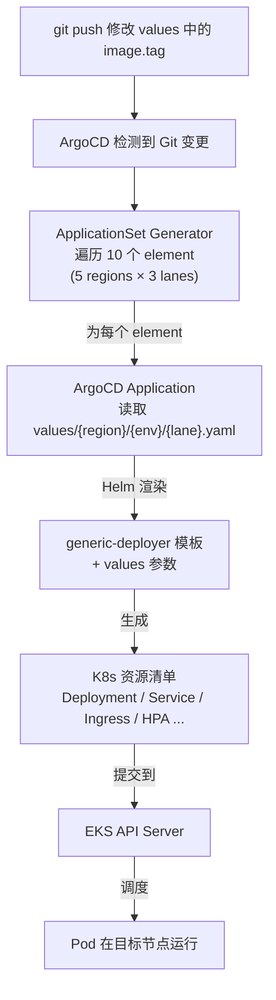

# Helm + ArgoCD：从 Values 到运行中的服务

> [!abstract] 叙事线
> [[02-k8s-core-concepts|02 核心概念]] 中提到"只需写一个 values 文件"就能部署微服务。但这背后到底发生了什么？一个 `values.yaml` 是怎么变成跨 5 个区域、跨 3 条泳道的运行中服务的？本篇深入拆解 Helm（模板引擎）和 ArgoCD（GitOps 同步器）如何协作完成这件事。

---

## 一、问题：80+ 微服务怎么统一管理部署

假设有 80+ 微服务，每个都需要 Deployment、Service、Ingress、HPA、ServiceAccount 等资源，还要部署到多个区域（JP/US/EU/SG/CN）和多条泳道（main/preview/workspace）。直接手写 YAML 会面临：

- **重复度高**：80 个服务的 Deployment YAML 结构几乎一样，只是镜像名、端口、资源配额不同
- **环境差异散落**：staging 和 prod 的 CPU/内存/副本数/域名全不一样，容易漏改
- **多集群分发**：同一份配置要部署到 5+ 个 EKS 集群，手动操作无法保证一致性

解决方案是两层抽象：

```text
Helm（模板层）：一套模板 + 不同 values → 生成不同环境的 K8s YAML
ArgoCD（同步层）：监听 Git 变更 → 自动将 Helm 渲染结果同步到目标集群
```

---

## 二、Helm——模板化的 K8s 配置

### 2.1 核心概念

Helm 是 Kubernetes 的**包管理工具**，类似 Linux 的 `apt/yum`、Node.js 的 `npm`。核心作用：**将一组 K8s YAML 资源打包、模板化、版本化管理**。

| 术语             | 说明                                       |
| -------------- | ---------------------------------------- |
| **Chart**      | 一个 Helm 包，包含一组模板化的 K8s 资源定义              |
| **Release**    | Chart 的一次安装实例（同一个 Chart 可在不同集群/命名空间安装多次） |
| **Values**     | 传入 Chart 模板的配置参数，用于定制化部署                 |
| **Template**   | Go 模板语法编写的 K8s YAML，通过 Values 渲染为最终清单    |
| **Repository** | 存储和分发 Chart 的仓库                          |

Helm 解决的四个核心问题：

1. **消除重复 YAML**：同一个微服务部署到多个环境/区域，只需维护一套模板 + 不同 values 文件
2. **版本管理**：Chart 有版本号，可以升级、回滚
3. **依赖管理**：一个 Chart 可以依赖其他 Chart（子 Chart）
4. **参数化配置**：通过 `values.yaml` 注入不同环境的配置（镜像版本、副本数、资源限制等）

### 2.2 Chart 目录结构

标准的 Chart 目录结构如下：

```text
my-chart/
├── Chart.yaml          # Chart 元数据（名称、版本、依赖）
├── values.yaml         # 默认参数值
├── templates/          # K8s 资源模板
│   ├── _helpers.tpl    # 可复用的模板片段
│   ├── deployment.yaml
│   ├── service.yaml
│   ├── ingress.yaml
│   ├── hpa.yaml
│   └── serviceaccount.yaml
└── charts/             # 子 Chart（依赖）
```

**模板渲染流程**：`Chart 模板` + `Values 参数` → 渲染 → 最终 K8s YAML → 部署到集群

### 2.3 模板语法示例（进阶）

```yaml
# 来源：deploy/generic-deployer/templates/service.yaml（简化）
apiVersion: v1
kind: Service
metadata:
  name: {{ include "generic-deployer.fullname" . }}  # 通过 _helpers.tpl 中的函数生成
spec:
  type: {{ .Values.service.type }}
  ports:
    {{- range .Values.service.ports }}
    - port: {{ .port }}
      targetPort: {{ .targetPort | default .port }}
    {{- end }}
```

**fullname 生成逻辑**（`_helpers.tpl`）：

```text
1. 如果设置了 fullnameOverride → 直接使用
2. 否则 name = nameOverride || Chart.Name
3. 如果 Release.Name 包含 name → 使用 Release.Name
4. 否则 → Release.Name + "-" + name（截取前 63 字符）
```

### 2.4 子 Chart（依赖）机制（进阶）

在 `Chart.yaml` 中声明依赖：

```yaml
# 来源：deploy/plaud-project-summary/Chart.yaml
apiVersion: v2
name: plaud-project-summary
type: application
version: 0.1.0

dependencies:
- name: deployer                          # 子 Chart 名称（values 中以此为 key）
  version: 0.1.0
  repository: "file://../generic-deployer" # 引用本地的 generic-deployer
```

父 Chart 的 values 通过子 Chart 名称作为 key 传递：

```yaml
# 来源：deploy/plaud-project-summary/values/.../main.yaml（简化）
deployer:                   # 对应子 Chart 名称
  replicaCount: 2
  image:
    repository: 236604669925.dkr.ecr.us-west-2.amazonaws.com/plaud/plaud-project-summary
    tag: "93347b0"
  service:
    type: ClusterIP
    ports:
      - port: 8001
        name: api
        targetPort: 8001
```

> 所有项目的 Chart.yaml 几乎一模一样，区别只有 `name` 字段。真正的差异全在 values 文件中。

### 2.5 实战：generic-deployer 的 Chart 结构

`generic-deployer` 是所有 80+ 微服务的公共基座，templates 目录包含一个微服务部署所需的全部资源模板：

```text
# 来源：deploy/generic-deployer/
generic-deployer/
├── Chart.yaml              # name: deployer, version: 0.1.0
├── values.yaml             # 默认参数值
└── templates/
    ├── _helpers.tpl         # fullname 生成、标签生成、ingress 冲突校验
    ├── deployment.yaml      # Deployment（含滚动更新、拓扑分散、优雅关停）
    ├── service.yaml         # Service（ClusterIP）
    ├── service-headless.yaml # Headless Service（用于 StatefulSet 场景）
    ├── ingress.yaml         # 单 Ingress 模式
    ├── ingresses.yaml       # 多 Ingress 模式（internal/pvt/public 分离）
    ├── hpa.yaml             # HPA 水平自动扩缩容
    ├── serviceaccount.yaml  # ServiceAccount（支持 IRSA 注解）
    ├── servicemonitor.yaml  # ServiceMonitor CRD（Prometheus 指标采集）
    ├── externalsecret.yaml  # ExternalSecret CRD（AWS Secrets Manager 同步）
    └── config.yaml          # ConfigMap（应用配置注入）
```

> 模板中包含两个 CRD 资源（ServiceMonitor 和 ExternalSecret），体现了 Helm 与 [[11-k8s-extension-mechanisms|K8s 扩展机制]] 的结合——Chart 不仅管理内置资源，也管理自定义资源。

#### Deployment 模板的关键设计（进阶）

```yaml
# 来源：deploy/generic-deployer/templates/deployment.yaml（关键片段）
spec:
  {{- if not .Values.autoscaling.enabled }}
  replicas: {{ .Values.replicaCount }}   # HPA 开启时不设 replicas，交给 HPA 控制
  {{- end }}
  strategy:
    type: RollingUpdate
    rollingUpdate:
      maxUnavailable: {{ .Values.updateStrategy.maxUnavailable | default 0 }}
      maxSurge: {{ .Values.updateStrategy.maxSurge | default "25%" }}
  template:
    spec:
      terminationGracePeriodSeconds: {{ .Values.terminationGracePeriodSeconds | default 45 }}
      topologySpreadConstraints:
        - maxSkew: 1
          topologyKey: topology.kubernetes.io/zone    # Pod 均匀分布到不同可用区
          whenUnsatisfiable: ScheduleAnyway
        - maxSkew: 1
          topologyKey: kubernetes.io/hostname          # Pod 均匀分布到不同节点
          whenUnsatisfiable: ScheduleAnyway
```

> `replicas` 字段使用条件渲染：HPA 未开启时才设置，避免 HPA 和 Deployment 的副本数冲突。拓扑分散约束默认开启，确保 Pod 跨可用区高可用。这些逻辑只需在模板中写一次，80+ 微服务自动继承。

#### 多 Ingress 模板的实现（进阶）

```yaml
# 来源：deploy/generic-deployer/templates/ingresses.yaml（核心逻辑）
{{- range $name, $ingress := .Values.ingresses }}
apiVersion: networking.k8s.io/v1
kind: Ingress
metadata:
  name: {{ include "generic-deployer.fullname" $ }}-{{ $name | lower }}
  {{- with $ingress.annotations }}
  annotations:
    {{- toYaml . | nindent 4 }}
  {{- end }}
spec:
  ingressClassName: {{ $ingress.ingressClassName }}
  rules:
    {{- range $ingress.hosts }}
    - host: {{ .host | quote }}
      http:
        paths:
          {{- range .paths }}
          - path: {{ .path }}
            backend:
              service:
                name: {{ .serviceName | default (include "generic-deployer.fullname" $) }}
                port:
                  number: {{ .servicePort }}
          {{- end }}
    {{- end }}
---
{{- end }}
```

> 模板用 `range $name, $ingress` 遍历 map，values 中定义几个 key（`internal`、`pvt`、`public`、`api-gateway`），就自动生成几个 Ingress 资源。

---

## 三、ArgoCD——GitOps 自动同步

Helm 解决了"怎么生成 YAML"的问题，但还有一个问题：**谁来把渲染后的 YAML 部署到集群，谁来保证集群状态和 Git 一致？** 答案是 ArgoCD。

### 3.1 核心概念：Application 与 ApplicationSet

| 概念 | 作用 |
| --- | --- |
| **Application** | ArgoCD 的基本单元：一个 Git 仓库路径 + 一组 Helm values → 部署到一个目标集群 |
| **ApplicationSet** | Application 的批量生成器：通过 Generator 列表，为每个 (集群, 泳道) 组合自动创建一个 Application |

### 3.2 项目的三层结构

每个微服务在 deploy 仓库中的目录结构：

```text
# 来源：deploy/plaud-project-summary/
plaud-project-summary/
├── Chart.yaml                      # 声明对 generic-deployer 的依赖
├── application.yaml                # ArgoCD 顶层 Application（指向 applicationsets/）
├── applicationsets/
│   ├── applicationsets.yaml        # Staging 环境的 ApplicationSet
│   └── applicationsets-prod.yaml   # Production 环境的 ApplicationSet
└── values/
    ├── ap-northeast-1/             # 日本区
    │   ├── staging/main.yaml
    │   └── prod/
    │       ├── main.yaml
    │       └── preview.yaml
    ├── us-west-2/                  # 美国区
    │   ├── staging/main.yaml
    │   └── prod/
    │       ├── main.yaml
    │       └── preview.yaml
    ├── ap-southeast-1/prod/main.yaml   # 新加坡区（仅 prod）
    ├── eu-central-1/prod/main.yaml     # 欧洲区（仅 prod）
    └── cn-northwest-1/             # 中国区
        ├── staging/main.yaml
        └── prod/
            ├── main.yaml
            └── preview.yaml
```

> values 路径规则：`values/{region}/{env}/{lane}.yaml`。这个路径会被 ApplicationSet 模板直接引用。

### 3.3 application.yaml — ArgoCD 入口

```yaml
# 来源：deploy/plaud-project-summary/application.yaml
apiVersion: argoproj.io/v1alpha1
kind: Application
metadata:
  name: plaud-project-summary
  namespace: argocd
spec:
  destination:
    server: https://kubernetes.default.svc    # 部署到 ArgoCD 所在集群
    namespace: plaud-project-summary
  project: plaud
  source:
    repoURL: git@github.com:Plaud-AI/deploy.git
    targetRevision: HEAD
    path: plaud-project-summary/applicationsets       # 指向 applicationsets 目录
  syncPolicy:
    automated:
      prune: false
      selfHeal: false
```

> 这个 Application 的唯一作用是让 ArgoCD 发现 `applicationsets/` 目录下的 ApplicationSet 资源。

**`syncPolicy.automated` 两个关键开关**：

| 配置 | 管控的场景 | `true` | `false` |
| --- | --- | --- | --- |
| **`prune`** | Git 中删除了某个资源定义，但集群中还存在 | 自动删除集群中的对应资源 | 只标记 "out of sync"，等人工处理 |
| **`selfHeal`** | 集群中的资源被手动修改（如 `kubectl edit`），与 Git 不一致 | 自动恢复成 Git 中定义的状态 | 只标记 "out of sync"，等人工处理 |

> **`prune: false` 的安全意义**：如果误删 `applicationsets.yaml` 文件（手滑、merge 冲突丢失等），`prune: true` 会连带删除集群中的 ApplicationSet 及其生成的所有 Application。`prune: false` 只标记异常，不会造成线上事故。

### 3.4 ApplicationSet — 多集群编排

**Staging（3 regions × 2 lanes = 6 Applications）**：

```yaml
# 来源：deploy/plaud-project-summary/applicationsets/applicationsets.yaml（简化）
spec:
  generators:
    - list:
        elements:
          - cluster: jp-staging
            server: https://0AE3C052...eks.amazonaws.com
            env: staging
            region: ap-northeast-1
            lane: main
          - cluster: jp-staging
            server: https://0AE3C052...eks.amazonaws.com
            env: staging
            region: ap-northeast-1
            lane: workspace
          - cluster: us-staging
            server: https://C85149DE...eks.amazonaws.com
            env: staging
            region: us-west-2
            lane: main
          # ... 共 6 个 element（3 regions × 2 lanes: main + workspace）
  template:
    metadata:
      name: "plaud-project-summary-{{ cluster }}-{{ lane }}"
    spec:
      source:
        targetRevision: dev                           # Staging 用 dev 分支
        helm:
          valueFiles:
            - values/{{ region }}/{{ env }}/{{ lane }}.yaml
      syncPolicy:
        automated:
          selfHeal: true         # Staging 开启自愈（自动同步）
```

**Production（5 regions × 3 lanes = 10 Applications）**：

```yaml
# 来源：deploy/plaud-project-summary/applicationsets/applicationsets-prod.yaml（简化）
spec:
  generators:
    - list:
        elements:
          - cluster: jp-prod, lane: main
          - cluster: jp-prod, lane: preview
          - cluster: jp-prod, lane: workspace
          - cluster: eu-prod, lane: main
          - cluster: sg-prod, lane: main
          - cluster: us-prod, lane: main
          - cluster: us-prod, lane: preview
          - cluster: us-prod, lane: workspace
          - cluster: cn-prod, lane: main
          - cluster: cn-prod, lane: preview
          # 共 10 个 element（5 regions × 3 lanes: main + preview + workspace）
  template:
    spec:
      source:
        targetRevision: main                          # Prod 用 main 分支
      syncPolicy:
        # automated 被注释掉 → Prod 需要手动同步
```

**Staging vs Production 关键差异**：

| 配置项            | Staging                              | Production                                        |
| -------------- | ------------------------------------ | ------------------------------------------------- |
| targetRevision | `dev`                                | `main`                                            |
| 自动同步           | `selfHeal: true` + `prune: false`    | 手动（注释掉了 automated）                                |
| 集群 × 泳道       | 3 regions × 2 lanes（main+workspace）  | 5 regions × 3 lanes（main+preview+workspace），共 10 个 |

> Staging 策略：手动改集群会被自动纠正（防止配置漂移），但不会自动删资源（防止误删）。Prod 策略：所有变更都需要在 ArgoCD UI 中手动触发同步，最保守。

#### Multi-Source 模式（基础设施组件）（进阶）

微服务的 ApplicationSet 使用单一 source（Git 仓库中的 Helm Chart + values），而基础设施组件使用了 **Multi-Source** 模式——Helm Chart 来自外部仓库，values 文件来自内部 Git 仓库：

```yaml
# 来源：deploy/infra/applicationsets/strimzi-kafka-operator.yaml（简化）
spec:
  generators:
    - list:
        elements:
          - name: jp-prod
            targetRevision: 0.50.0
          # ... 共 11 个集群
  template:
    spec:
      sources:                           # 注意：sources（复数）
        # Source 1: 外部 Helm Chart
        - repoURL: quay.io/strimzi-helm
          targetRevision: "{{ targetRevision }}"
          chart: strimzi-kafka-operator
          helm:
            valueFiles:
              - $values/infra/values/strimzi-kafka-operator/default.yaml

        # Source 2: 内部 Git 仓库（提供自定义 values）
        - repoURL: git@github.com:Plaud-AI/deploy.git
          targetRevision: main
          ref: values                    # $values 即指向此源
```

> **Multi-Source 的优势**：Chart 版本由外部仓库管理（`targetRevision: 0.50.0`），配置值由内部 Git 管理。升级 Operator 只需修改 `targetRevision`，无需 fork 整个 Chart。

---

## 四、Values 文件详解

以 plaud-project-summary 的 JP Prod（`values/ap-northeast-1/prod/main.yaml`）为例，逐块解读关键配置。

### 4.1 镜像配置

```yaml
# 来源：deploy/plaud-project-summary/values/ap-northeast-1/prod/main.yaml
deployer:                    # 所有配置都在 deployer: 下（对应子 Chart 名）
  image:
    repository: 236604669925.dkr.ecr.us-west-2.amazonaws.com/plaud/plaud-project-summary
    pullPolicy: IfNotPresent
    tag: "93347b0"              # 镜像版本（通常是 git commit hash）
```

> **更新部署 = 修改 tag 值**，这是日常最频繁的操作。

### 4.2 资源限制与 QoS

```yaml
  resources:
    limits:
      cpu: 8
      memory: 16Gi
    requests:
      cpu: 8
      memory: 16Gi
```

> `requests = limits` 表示 **Guaranteed QoS**（最高服务质量等级：K8s 保证独占所申请的资源，节点资源不足时也不会被驱逐）。

### 4.3 副本数与 HPA

```yaml
  replicaCount: 1              # Deployment 的初始 Pod 数量

  autoscaling:
    enabled: true
    minReplicas: 2
    maxReplicas: 10
    targetCPUUtilizationPercentage: 75
```

| 场景 | 谁决定 Pod 数量 | 说明 |
| --- | --- | --- |
| HPA 未开启（`enabled: false`） | `replicaCount` | 固定副本数 |
| HPA 已开启（`enabled: true`） | HPA 的 `minReplicas`/`maxReplicas` | `replicaCount` 仅作初始值，HPA 接管后按负载动态调整 |

> 生产环境中真正决定 Pod 数量的是 HPA 的 `minReplicas` 和 `maxReplicas`。Staging 通常不开启 HPA，直接用 `replicaCount` 固定副本数。

### 4.4 健康检查

```yaml
  livenessProbe:               # 存活探针：失败则重启容器
    httpGet:
      path: /health
      port: 8000               # 独立的健康检查端口
  readinessProbe:              # 就绪探针：失败则从 Service 摘除流量
    httpGet:
      path: /health
      port: 8000
```

> plaud-project-summary 使用独立的 8000 端口提供健康检查，与业务端口（8001）分离。

### 4.5 优雅关停

```yaml
  terminationGracePeriodSeconds: 600   # Pod 终止前最多等待 600 秒（10 分钟）

  lifecycle:
    preStop:
      exec:
        command: ["/bin/sh", "-c", "echo preStop && sleep 10"]
```

> `preStop` 在 SIGTERM 发送前执行，为 Endpoints 摘除传播争取 10 秒窗口，避免流量发送到即将终止的 Pod。完整机制见 [[12-k8s-pod-graceful-shutdown|Pod 优雅终止完全指南]]。

### 4.6 Service 配置（多端口）

```yaml
  service:
    type: ClusterIP
    ports:
      - port: 8001              # API 后端
        name: api
        targetPort: 8001
      - port: 8889              # NiceGUI 前端
        name: frontend
        targetPort: 8889
      - port: 8000              # 健康检查
        name: health
        targetPort: 8000
```

> 集群内其他 Pod 通过 Service DNS 访问：`plaud-project-summary-jp-prod-main-deployer.plaud-project-summary:8001`

### 4.7 Ingress 配置（多 Ingress + 高级特性）

**Ingress 是什么？** Service 只解决集群**内部**的服务发现。外部用户（浏览器、手机 App）无法直接访问 ClusterIP。**Ingress 是 K8s 中将外部 HTTP/HTTPS 流量按域名和路径规则路由到集群内部 Service 的入口网关**——类似 Nginx 的 `server` + `location` 块，以 K8s 原生资源声明式管理。

```text
外部请求 → Ingress Controller（实际的反向代理，如 nginx-ingress）
              ↓ 匹配 Ingress 规则（域名 + 路径）
           Service → Pod
```

| 概念 | 说明 |
| --- | --- |
| **Ingress 资源** | K8s YAML 声明"哪个域名的哪个路径 → 转发给哪个 Service 的哪个端口" |
| **Ingress Controller** | 真正执行路由的反向代理进程（如 nginx-ingress-controller） |
| **IngressClass** | 指定使用哪个 Ingress Controller（一个集群可部署多个 Controller） |

> **Service 是集群内的 DNS，Ingress 是集群外的路由入口。** 没有 Ingress，外部流量进不来；没有 Service，Ingress 不知道把流量发给谁。

plaud-project-summary 使用多 Ingress 配置，按流量类型分离：

```yaml
# 来源：deploy/plaud-project-summary/values/ap-northeast-1/prod/main.yaml（Ingress 部分）
  ingresses:
    # 内网 - Web 前端（NiceGUI 有状态框架，需 cookie 亲和性）
    internal:
      ingressClassName: "nginx-internal"
      annotations:
        nginx.ingress.kubernetes.io/affinity: "cookie"
        nginx.ingress.kubernetes.io/session-cookie-name: "NICEGUI_AFFINITY"
      hosts:
        - host: plaud-project-summary-apne1.nicebuild.click
          paths:
            - path: /
              servicePort: 8889
            - path: /api
              servicePort: 8001

    # 私有 - API 后端（内网访问）
    private:
      ingressClassName: "nginx-pvt"
      hosts:
        - host: plaud-project-summary-apne1-lan.plaud.ai
          paths:
            - path: /api/temporal
              servicePort: 8001

    # 公网 - API
    public:
      ingressClassName: "nginx-public"
      hosts:
        - host: plaud-project-summary-apne1.plaud.ai
          paths:
            - path: /api/strategy
              servicePort: 8001

    # 公网 - API 网关转发（URL 重写）
    api-gateway:
      ingressClassName: "nginx-public"
      annotations:
        nginx.ingress.kubernetes.io/rewrite-target: /$2
        nginx.ingress.kubernetes.io/use-regex: "true"
      hosts:
        - host: api-apne1.plaud.ai
          paths:
            - path: /project-summary(/|$)(.*)
              pathType: ImplementationSpecific
              servicePort: 8001
```

> 4 种 Ingress Controller 对应不同网络层级：`nginx-internal`（内网）、`nginx-pvt`（私有）、`nginx-public`（公网）、API 网关转发。同一个 host 还可通过 canary Ingress 实现 [[13-k8s-lane-mechanism|泳道（Lane）]] 流量分流。

### 4.8 ServiceAccount（IRSA）

```yaml
  serviceAccount:
    create: true
    automount: true
    annotations:
      eks.amazonaws.com/role-arn: arn:aws:iam::408278014848:role/plaud-project-summary-role
    name: plaud-project-summary
```

> **IRSA**（IAM Roles for Service Accounts）：Pod 通过 ServiceAccount 自动获得 AWS IAM 权限，无需在环境变量中传 AK/SK。

### 4.9 ExternalSecret 完整链路

结合 [[11-k8s-extension-mechanisms|扩展机制]] 中介绍的 CRD 概念，密钥管理的完整链路如下：

**Step 1：每个区域部署一个 ClusterSecretStore**

```yaml
# 来源：deploy/infra/values/external-secrets/overlays/.../aws-secrets-manager-store.yaml
apiVersion: external-secrets.io/v1
kind: ClusterSecretStore
metadata:
  name: aws-secrets-manager-store
spec:
  provider:
    aws:
      service: SecretsManager
      region: ap-northeast-1
      auth:
        jwt:
          serviceAccountRef:
            name: external-secrets
            namespace: external-secrets
```

**Step 2：微服务通过 values 声明需要的密钥**

```yaml
# 来源：deploy/plaud-admin/values/global/staging/main.yaml（ExternalSecret 部分）
deployer:
  externalSecrets:
    - name: plaud-admin-es
      secretStoreRef:
        name: aws-secrets-manager-store
        kind: ClusterSecretStore
      target:
        name: plaud-admin-es
        template:
          data:
            DB_USER: "{{ .username }}"
            DB_PASSWORD: "{{ .password }}"
            DB_HOST: "{{ .host }}"
      dataFrom:
        - extract:
            key: db/global-plaud-mysql    # AWS Secrets Manager 中的密钥路径
```

> 完整链路：`AWS Secrets Manager` → `ClusterSecretStore`（每区域一个） → `ExternalSecret`（每服务一个） → `K8s Secret` → `Pod env/volumeMount`。开发者只需在 values 中声明密钥路径和字段映射。

### 4.10 Staging vs Prod Values 对比（深入）

| 参数                           | Staging (JP)        | Prod (JP)        | 说明          |
| ---------------------------- | ------------------- | ---------------- | ----------- |
| `image.tag`                  | `60bad01`           | `93347b0`        | 不同版本        |
| `resources.cpu`              | 1                   | 8                | Prod 资源更多   |
| `resources.memory`           | 4Gi                 | 16Gi             | Prod 内存更大   |
| `autoscaling.enabled`        | false               | true (2-10)      | Prod 开启 HPA |
| `env.AWS_ENV`                | test                | prod             | 环境标识        |
| `env.APPCONFIG_RUN_ENV`      | dev                 | prod             | 配置文件环境      |
| `APPCONFIG_CONFIG_FILE_NAME` | dev-config.yaml     | prod-config.yaml | 不同配置文件      |
| SA IAM Account               | 734110488307        | 408278014848     | 不同 AWS 账号   |
| Ingress 域名                   | `*-staging-apne1.*` | `*-apne1.*`      | 域名前缀区分      |

### 4.11 中国区 vs 海外区差异（深入）

| 参数         | 海外区 (JP/EU/SG/US)                              | 中国区 (CN)                                               |
| ---------- | ---------------------------------------------- | ------------------------------------------------------ |
| ECR 地址     | `236604669925.dkr.ecr.us-west-2.amazonaws.com` | `470515048733.dkr.ecr.cn-northwest-1.amazonaws.com.cn` |
| IAM ARN    | `arn:aws:iam::408278014848:role/...`           | `arn:aws-cn:iam::470515048733:role/...`                |
| 域名         | `*.plaud.ai` / `*.nicebuild.click`             | `*.plaud.cn` / `*.nicebuild.cn`                        |
| EKS 域名后缀   | `.eks.amazonaws.com`                           | `.eks.amazonaws.com.cn`                                |
| HPA CPU 阈值 | 75%                                            | 80%                                                    |

---

## 五、部署流程串讲

把以上所有环节串起来，一次部署的完整链路如下：



**具体到 plaud-project-summary Production 的一次部署**：

```text
① 开发者修改 values/ap-northeast-1/prod/main.yaml 中的 image.tag → git push
② ArgoCD 检测到 main 分支变更
③ applicationsets-prod.yaml 的 Generator 列出 10 个 element
④ 每个 element 对应一个 ArgoCD Application：
   - plaud-project-summary-jp-prod-main
   - plaud-project-summary-jp-prod-preview
   - plaud-project-summary-jp-prod-workspace
   - plaud-project-summary-eu-prod-main
   - plaud-project-summary-sg-prod-main
   - plaud-project-summary-us-prod-main
   - plaud-project-summary-us-prod-preview
   - plaud-project-summary-us-prod-workspace
   - plaud-project-summary-cn-prod-main
   - plaud-project-summary-cn-prod-preview
⑤ 每个 Application 使用 Helm 渲染：
   Chart: generic-deployer
   Values: values/{region}/prod/{lane}.yaml
⑥ 渲染结果提交到对应 EKS 集群的 API Server
⑦ 集群创建/更新 Deployment、Service、Ingress、HPA 等资源
⑧ Pod 运行，服务上线
```

### Values 与 Pod 的映射关系

> Pod 和 Deployment 的基本概念见 [[02-k8s-core-concepts|K8s 核心概念入门]]，各工作负载类型的对比见 [[03-k8s-workload-types|K8s 工作负载类型]]。

values 文件中的每一项，最终都会成为 Pod spec 的一部分：

| values 中的配置                        | 对应的 Pod spec 字段                                   | 作用                              |
| ---------------------------------- | ------------------------------------------------- | ------------------------------- |
| `image.repository` + `image.tag`   | `spec.containers[].image`                         | Pod 运行哪个容器镜像                    |
| `resources.limits/requests`        | `spec.containers[].resources`                     | Pod 的 CPU/内存配额                  |
| `livenessProbe` / `readinessProbe` | `spec.containers[].livenessProbe`                 | Pod 的健康检查                       |
| `env`                              | `spec.containers[].env`                           | Pod 内的环境变量                      |
| `volumeMounts` / `volumes`         | `spec.volumes` + `spec.containers[].volumeMounts` | Pod 挂载的存储卷                      |
| `serviceAccount.name`              | `spec.serviceAccountName`                         | Pod 使用的 ServiceAccount（IRSA 权限） |
| `terminationGracePeriodSeconds`    | `spec.terminationGracePeriodSeconds`              | Pod 优雅终止的等待时间                   |

### 集群内服务地址

最终在集群内生成的 Service DNS 格式为：

```text
<release-name>-deployer.<namespace>:<port>
```

示例：
- `plaud-project-summary-jp-prod-main-deployer.plaud-project-summary:8001`
- `plaud-project-summary-jp-prod-preview-deployer.plaud-project-summary:8001`
- `plaud-project-summary-cn-prod-main-deployer.plaud-project-summary:8001`

### EKS 集群地址

EKS 集群地址是 AWS 托管的 Kubernetes API Server endpoint，直接写在 ApplicationSet 的 `server` 字段中：

```text
https://<UNIQUE-HASH>.<REGION>.eks.amazonaws.com      # 海外区
https://<UNIQUE-HASH>.<REGION>.eks.amazonaws.com.cn   # 中国区
```

| 对比  | EKS 集群地址                                    | K8s Service DNS                       |
| --- | ------------------------------------------- | ------------------------------------- |
| 用途  | 外部访问 K8s API Server                         | 集群内 Pod 间通信                           |
| 格式  | `https://<hash>.<region>.eks.amazonaws.com` | `<svc>.<ns>.svc.cluster.local:<port>` |
| 谁使用 | kubectl / ArgoCD / CI/CD                    | 集群内的其他 Pod                            |
| 认证  | 需要 kubeconfig / IAM                         | 无需额外认证（同集群内）                          |

---

## 六、规模化效果（深入）

同样的 ApplicationSet 模式被 90+ 微服务和基础设施组件统一使用：

```text
# 来源：deploy/ 仓库结构（部分）
deploy/
├── plaud-sync/applicationsets/          # 同步服务
├── plaud-admin/applicationsets/         # 管理后台
├── plaud-transcribe/applicationsets/    # 转写服务
├── plaud-project-summary/applicationsets/  # 摘要服务
├── ... （共 90+ 服务）
└── infra/applicationsets/               # 基础设施（18 个 ApplicationSet）
    ├── strimzi-kafka-operator.yaml      # Kafka Operator → 11 集群
    ├── strimzi-kafka.yaml               # Kafka 集群 → 11 集群
    ├── opensearch-master.yaml           # OpenSearch → 11 集群
    ├── clickhouse-operator.yaml         # ClickHouse → 10 集群
    ├── external-secrets.yaml            # External Secrets → 10 集群
    ├── kube-prometheus.yaml             # Prometheus → 全集群
    └── ...
```

> 微服务的 ApplicationSet 使用 `server`（EKS endpoint URL）指定目标集群，基础设施使用 `name`（ArgoCD 注册的集群别名）。这是因为基础设施组件通过 ArgoCD 的集群管理功能注册，支持用友好名称（如 `jp-prod`）替代冗长的 URL。

---

## 七、常用 Helm 命令速查

```bash
# 模板渲染（不实际部署，仅查看生成的 YAML）
helm template <release-name> <chart-path> -f values.yaml

# 安装 / 升级
helm install <release-name> <chart-path> -f values.yaml -n <namespace>
helm upgrade <release-name> <chart-path> -f values.yaml -n <namespace>

# 查看已安装的 release
helm list -n <namespace>

# 查看 release 历史 & 回滚
helm history <release-name> -n <namespace>
helm rollback <release-name> <revision> -n <namespace>

# 依赖管理
helm dependency update <chart-path>   # 下载/更新子 Chart
```

---

## 八、总结

```text
开发者修改 values 文件（image.tag / resources / env ...）
    ↓ git push
generic-deployer（模板层）：一套模板 + values → 渲染为 K8s YAML
    ↓
ArgoCD ApplicationSet（同步层）：检测 Git 变更 → 将 Helm 渲染结果分发到多个 EKS 集群
    ↓
EKS 集群 API Server：接收资源清单 → 调度 Pod → 服务上线
```

核心设计思想：
- **模板复用**：80+ 微服务共享一个 generic-deployer，差异全在 values
- **GitOps**：Git 是唯一事实来源，集群状态必须与 Git 一致
- **渐进式安全**：Staging 自动同步、Prod 手动同步；prune 默认关闭

---

## 延伸阅读

**部署与运维：**
- [[13-k8s-lane-mechanism|K8s 泳道机制（Lane）]] — 在同一集群、同一域名下运行多版本服务，通过 HTTP Header 路由流量
- [[12-k8s-pod-graceful-shutdown|Pod 优雅终止完全指南]] — 滚动更新时如何保证存量任务不被中断

**深入 K8s：**
- [[01-docker-basics|Docker 学习笔记]] — 容器基础：Dockerfile、镜像优化、容器运行时
- [[05-k8s-architecture|K8s 架构原理]] — 控制平面、数据平面、声明式 API 与控制器模式
- [[03-k8s-workload-types|K8s 工作负载类型]] — Deployment 之外的 StatefulSet、DaemonSet、Job
- [[04-k8s-networking|K8s 网络深入]] — CNI、CoreDNS、NetworkPolicy、Service Mesh
- [[06-k8s-storage|K8s 存储]] — PV/PVC、StorageClass、CSI
- [[08-k8s-security-rbac|K8s 安全与权限]] — RBAC、Pod Security、Secret 管理
- [[07-k8s-scheduling-resources|调度与资源管理]] — QoS、Affinity、VPA、Karpenter
- [[11-k8s-extension-mechanisms|K8s 扩展机制]] — CRD、Operator、Helm vs Kustomize
