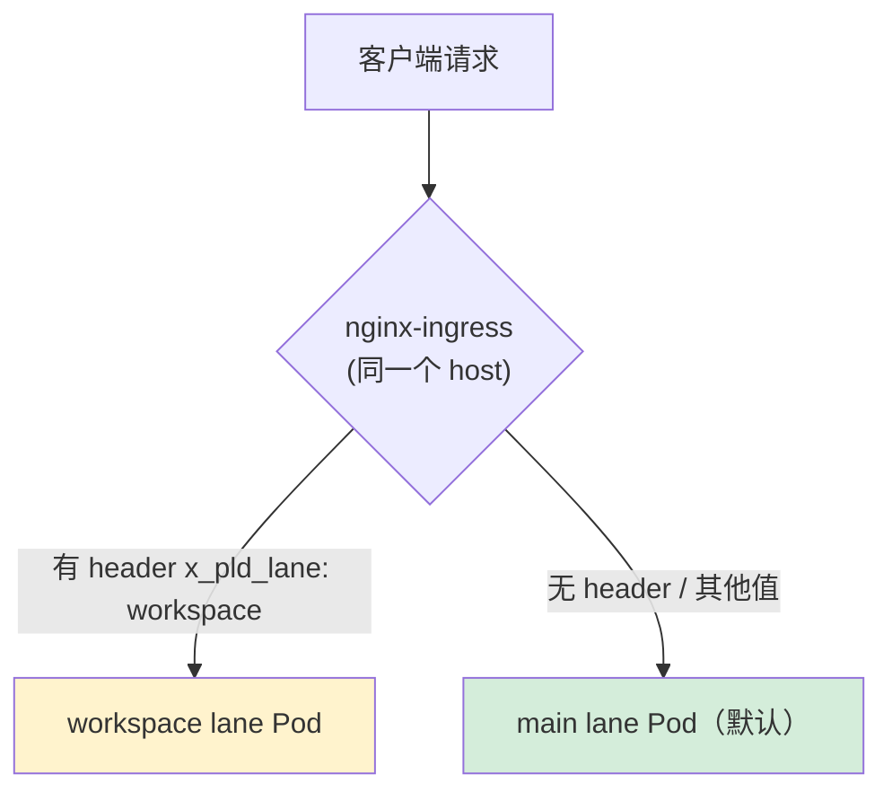

# K8s 泳道机制（Lane）

> 来源：[飞书文档 - 如何为服务新增泳道](https://nicebuild.feishu.cn/wiki/WtPGwkvEhifpg9kICdbccjpKnFe)
>
> 前置知识：本文建立在 [[10-helm-argocd-deployment|Helm 与 EKS 部署体系]] 之上，需要理解 Ingress、Deployment、ApplicationSet、values 文件等概念。
>
> **学习建议**：首次阅读重点关注"什么是泳道"、"操作步骤"和"注意事项"。ArgoCD ApplicationSet 配置细节、"多服务联调"和"泳道的局限"为进阶。

## 什么是泳道

泳道（Lane）是一种**流量隔离机制**，允许在同一个 K8s 集群、同一个域名（host）下运行同一服务的**多个版本实例**，通过 HTTP Header 路由流量到不同版本。

典型场景：开发/测试时，某个团队需要使用自己修改的服务版本，但不影响其他人使用默认版本。

### "同一个 K8s 集群"是什么意思

K8s 集群 = 一组由 Kubernetes 统一管理的服务器（节点）。公司有多个集群，分布在不同区域和环境：


| 集群名            | 区域                   | 用途   |
| -------------- | -------------------- | ---- |
| `jp-staging`   | ap-northeast-1 (日本)  | 测试环境 |
| `jp-prod-main` | ap-northeast-1 (日本)  | 生产环境 |
| `sg-prod-main` | ap-southeast-1 (新加坡) | 生产环境 |
| `cn-prod-main` | cn-northwest-1 (中国)  | 生产环境 |


每个集群有一个唯一的 API Server 地址（即 `applicationsets.yml` 中的 `server` 字段）。

"同一个集群"意味着 **main 泳道和 workspace 泳道的 `server` 地址完全一样**，两个版本的 Pod 跑在同一批机器上，共享集群资源：

```yaml
# main lane 和 workspace lane 都指向同一个 server
server: https://0AE3C052C45D172B2FB662AE03742C52.gr7.ap-northeast-1.eks.amazonaws.com
```

### "同一个域名（host）"是什么意思

域名就是 Ingress 资源中配置的 `host` 字段——用户/客户端访问服务时使用的 URL 地址。

泳道机制下，main 和 workspace 两个泳道共用 **完全相同的域名**：

```yaml
# main lane 的 ingress
hosts:
  - host: plaud-passport-service-staging-apne1-lan.plaud.ai  # ← 这个域名

# workspace lane 的 canary ingress
hosts:
  - host: plaud-passport-service-staging-apne1-lan.plaud.ai  # ← 同一个域名
```

同一个域名 + 两个 Ingress（一个主 Ingress，一个 canary Ingress），nginx 根据请求是否携带特定 header 来决定流量去向。这就是为什么文档强调 **"host 必须与 main 相同"**——canary 机制要求两者共享同一个入口域名。

### 路由规则


| 请求 Header               | 路由目标              |
| ----------------------- | ----------------- |
| `x_pld_lane: workspace` | workspace 泳道的 Pod |
| 无 header / 其他值          | main 泳道的 Pod（默认）  |


### 流量示意图




---

## 核心概念

### 1. Canary Ingress（金丝雀 Ingress）

nginx-ingress 提供的流量分流能力，是泳道机制的底层实现：

- **Main Ingress**：主入口，处理所有普通请求（不带特殊 header）
- **Canary Ingress**：通过 annotation 声明自己是"金丝雀"，拦截带有指定 header 的请求

关键 annotation（annotation 是 K8s 资源上的键值对标签，用来给控制器传递额外指令——这里就是告诉 nginx "这是一个 canary Ingress，按这个 header 分流"）：

```yaml
nginx.ingress.kubernetes.io/canary: "true"
nginx.ingress.kubernetes.io/canary-by-header: "x_pld_lane"
nginx.ingress.kubernetes.io/canary-by-header-value: "workspace"
```

本质：**同一个 host 有两个 Ingress 资源**，nginx 根据 header 决定将流量转发给哪个 Service / [[03-k8s-workload-types#二、Deployment（回顾）|Deployment]]。

> [!example] 实战链接：plaud-project-summary workspace 泳道的 Canary Ingress 注解
> 来源：`deploy/plaud-project-summary/values/ap-northeast-1/staging/workspace.yaml`
>
> workspace 泳道在同一个服务上配了 4 组 Ingress（internal / private / public / api-gateway），**每一组都加了完整的 canary 三件套**：
> ```yaml
> ingresses:
>   # 内网 - Web 前端 (canary)
>   internal:
>     ingressClassName: "nginx-internal"
>     annotations:
>       nginx.ingress.kubernetes.io/canary: "true"
>       nginx.ingress.kubernetes.io/canary-by-header: "x-pld-lane"
>       nginx.ingress.kubernetes.io/canary-by-header-value: "workspace"
>     hosts:
>       - host: plaud-project-summary-staging-apne1.nicebuild.click  # 与 main 相同的域名
>         paths: [...]
>
>   # 私有 - API 后端 (canary)
>   private:
>     ingressClassName: "nginx-pvt"
>     annotations:
>       nginx.ingress.kubernetes.io/canary: "true"
>       nginx.ingress.kubernetes.io/canary-by-header: "x-pld-lane"
>       nginx.ingress.kubernetes.io/canary-by-header-value: "workspace"
>     hosts:
>       - host: plaud-project-summary-staging-apne1-lan.plaud.ai     # 与 main 相同的域名
>         paths: [...]
> ```
> 对照上面的概念：每一组 Ingress 的 `host` 都与 main 完全一样，canary 注解让 nginx 按 header 分流到 workspace Pod。一个服务如果有多个入口（内网、公网、gRPC...），**每个入口都要单独加 canary 注解**。

#### "两个 Ingress 资源"是怎么产生的

新增泳道时，你**只需要配置新泳道的 values 文件**。main lane 的 Ingress 是已有的，不需要动。

**你实际要做的事：** 在新泳道的 values 文件（如 `workspace.yml`）里写 Ingress 配置，加上 canary annotation，host 填和 main 一样的域名：

```yaml
# workspace.yml — 你写的内容
ingress:
  enabled: true
  ingressClassName: "nginx-pvt"
  annotations:
    nginx.ingress.kubernetes.io/canary: "true"                  # ← 声明是 canary
    nginx.ingress.kubernetes.io/canary-by-header: "x_pld_lane"  # ← 按哪个 header 分流
    nginx.ingress.kubernetes.io/canary-by-header-value: "workspace"  # ← header 值匹配什么
  hosts:
    - host: plaud-passport-service-staging-apne1-lan.plaud.ai   # ← 和 main 相同的域名
      paths:
        - path: /
          pathType: Prefix
          servicePort: 80
```

**Helm 自动做的事：** 读取这个 values 文件 + `generic-deployer` 模板，渲染出完整的 K8s Ingress 资源（包括 `metadata.name`、`apiVersion`、完整的 `spec` 等），然后部署到集群。

> [!example] 实战链接：generic-deployer 的 Ingress 模板如何渲染 canary 注解
> 来源：`deploy/generic-deployer/templates/ingresses.yaml`（多 Ingress 模板）
>
> 这是实际的 Helm 模板——它遍历 values 中的 `ingresses` 字典，为每一组配置生成一个独立的 Ingress 资源。**annotations 部分原封不动地从 values 文件注入**，canary 三件套就是通过这个机制生效的：
>
> ```yaml
> {{- range $name, $ingress := .Values.ingresses }}
> apiVersion: networking.k8s.io/v1
> kind: Ingress
> metadata:
>   name: {{ include "generic-deployer.fullname" $ }}-{{ $name | lower | replace "_" "-" }}
>   {{- with $ingress.annotations }}
>   annotations:
>     {{- toYaml . | nindent 4 }}   # ← values 中的 canary 注解在这里注入
>   {{- end }}
> spec:
>   ingressClassName: {{ $ingressClassName }}
>   rules:
>     {{- range $ingress.hosts }}
>     - host: {{ .host | quote }}
>       http:
>         paths: [...]
>     {{- end }}
> ---
> {{- end }}
> ```
>
> 对照概念：你在 values 文件里写 `nginx.ingress.kubernetes.io/canary: "true"` 等注解，Helm 模板通过 `toYaml` 原样输出到最终的 Ingress 资源中。**你只管配 values，不用碰模板。**

最终集群里就有了两个 Ingress——main 的（早就存在）和 workspace 的（刚生成的），nginx 把它们合并成一条路由规则：

```text
同一个域名 plaud-passport-service-staging-apne1-lan.plaud.ai
    │
    ├── 请求带 x_pld_lane: workspace  →  workspace Ingress  →  workspace Pod
    │
    └── 请求不带 / 其他值             →  main Ingress       →  main Pod
```

#### 你需要配什么 vs Helm 自动生成什么


|                | 你在 values 文件中配                                                   | Helm 自动生成                                |
| -------------- | ---------------------------------------------------------------- | ---------------------------------------- |
| main lane      | 已有，不需要动                                                          | 已有的 Ingress 资源                           |
| workspace lane | `ingress.annotations`（canary 三件套）+ `ingress.hosts`（和 main 相同的域名） | 完整的 Ingress YAML（name、apiVersion、spec 等） |


> `demo_poc/test_ing/ing.yaml` 中展示的两个完整 Ingress YAML 只是一个独立测试用例，用于验证 canary 机制本身。正式流程中你永远不需要手写完整的 Ingress YAML。

### 2. ArgoCD ApplicationSet — 自动生成泳道部署（进阶）

ApplicationSet 是 ArgoCD 的"批量生成器"（详见 [[10-helm-argocd-deployment#2.3 ArgoCD ApplicationSet + Helm 的协作|Helm 笔记 2.3 节]]），分两部分：**elements 列表**（要部署什么）和 **template 模板**（怎么部署）。

以 `demo_poc` 项目的 `prod-applications.yaml` 为例：

```yaml
spec:
  generators:
    - list:
        elements:
          # ── 第 1 组变量：main 泳道 ──
          - name: jp-prod
            server: https://686061FA...eks.amazonaws.com
            env: prod
            region: ap-northeast-1
            lane: main

          # ── 第 2 组变量：feature-a 泳道 ──
          - name: jp-prod-feature-a
            server: https://686061FA...eks.amazonaws.com  # 同一个集群
            env: prod
            region: ap-northeast-1
            lane: feature-a

  template:
    metadata:
      name: "demo-poc-{{ name }}"         # 用变量生成 Application 名
    spec:
      source:
        path: demo_poc
        helm:
          valueFiles:
            - values/{{ region }}/{{ env }}/values-{{ lane }}.yaml  # 用变量选 values 文件
      destination:
        server: "{{ server }}"            # 用变量决定部署到哪个集群
```

ArgoCD 读到这个文件后，把每一组变量代入 template，**自动生成对应的 ArgoCD Application**：


| element | 生成的 Application 名            | 使用的 values 文件           | 部署目标       |
| ------- | ---------------------------- | ----------------------- | ---------- |
| 第 1 组   | `demo-poc-jp-prod`           | `values-main.yaml`      | JP 集群      |
| 第 2 组   | `demo-poc-jp-prod-feature-a` | `values-feature-a.yaml` | JP 集群（同一个） |


**"新增一组泳道"就是在 elements 列表里多加一组变量。** 比如要加 `lane-a` 泳道，只需多加：

```yaml
          - name: jp-prod-lane-a
            server: https://686061FA...   # 同一个集群
            env: prod
            region: ap-northeast-1
            lane: lane-a                  # ← 对应 values-lane-a.yaml
```

ArgoCD 就会自动多生成一个 Application，用 `values-lane-a.yaml` 渲染出新的 Deployment + Service + Canary Ingress，整个过程无需手动干预。

> [!example] 实战链接：plaud-project-summary 的 ApplicationSet（生产环境，含 3 种泳道）
> 来源：`deploy/plaud-project-summary/applicationsets/applicationsets-prod.yaml`
>
> 这是一个真正在线上运行的 ApplicationSet，同一个集群下同时存在 `main`、`preview`、`workspace` 三种泳道：
>
> ```yaml
> apiVersion: argoproj.io/v1alpha1
> kind: ApplicationSet
> metadata:
>   name: plaud-project-summary-prod
>   namespace: argocd
> spec:
>   generators:
>     - list:
>         elements:
>           # JP 集群：main + preview
>           - cluster: jp-prod
>             server: https://<cluster-id>.yl4.ap-northeast-1.eks.amazonaws.com
>             env: prod
>             region: ap-northeast-1
>             lane: main
>           - cluster: jp-prod
>             server: https://<cluster-id>.yl4.ap-northeast-1.eks.amazonaws.com
>             env: prod
>             region: ap-northeast-1
>             lane: preview
>
>           # US 集群：main + preview + workspace（三种泳道共存）
>           - cluster: us-prod
>             server: https://<cluster-id>.sk1.us-west-2.eks.amazonaws.com
>             env: prod
>             region: us-west-2
>             lane: main
>           - cluster: us-prod
>             server: https://<cluster-id>.sk1.us-west-2.eks.amazonaws.com
>             env: prod
>             region: us-west-2
>             lane: preview
>           - cluster: us-prod
>             server: https://<cluster-id>.sk1.us-west-2.eks.amazonaws.com
>             env: prod
>             region: us-west-2
>             lane: workspace
>           # ... 其他区域省略
>
>   template:
>     metadata:
>       name: "plaud-project-summary-{{ cluster }}-{{ lane }}"
>     spec:
>       source:
>         helm:
>           valueFiles:
>             - values/{{ region }}/{{ env }}/{{ lane }}.yaml
>       destination:
>         server: "{{ server }}"
> ```
>
> 注意几个要点：
> - **同一个 `server`（同一个集群）** 出现了多次，每次 `lane` 不同——这正是"同一集群内多版本"的体现
> - 生产环境下 US 集群已经同时运行了 main、preview、workspace 三种泳道
> - template 中的 `{{ lane }}.yaml` 会分别匹配到 `main.yaml`、`preview.yaml`、`workspace.yaml` 三个不同的 values 文件

### 3. Helm Values 文件

每个泳道有独立的 [[10-helm-argocd-deployment#3.5 ⑤⑥⑦ Values 文件详解 — 参数逐项说明|values 文件]]（如 `workspace.yml`），用于覆盖 Helm Chart 默认配置：


| 配置项                 | 说明                                                |
| ------------------- | ------------------------------------------------- |
| Ingress annotations | 加 canary 相关 annotation，与 main 区分                  |
| serviceAccount      | `create: false`，复用 main 泳道已有的 SA，避免 IAM Role 重复绑定 |
| resources           | 适当缩小 CPU/内存，泳道通常只做测试用                             |
| podAnnotations      | 给 Prometheus 指标打上泳道标签，方便监控区分（见下文详解）               |

> [!example] 🔗 实战链接：main vs workspace Values 文件核心差异对比
> **来源**：`deploy/plaud-project-summary/values/ap-northeast-1/staging/` 下的 `main.yaml` 与 `workspace.yaml`
>
> 同一个服务、同一个区域，两个泳道的 values 文件**结构完全相同**，但关键配置不同：
>
> | 配置项 | main.yaml | workspace.yaml |
> |---|---|---|
> | `serviceAccount.create` | `true`（创建 SA） | `false`（复用 main 的 SA） |
> | `podAnnotations` | 无泳道标签 | `metrics.labels/x-pld-lane: "workspace"` |
> | `ingresses.*.annotations` | 无 canary 注解 | 每组都加 canary 三件套 |
> | `ingresses.*.hosts` | `plaud-project-summary-staging-apne1-lan.plaud.ai` | **完全相同的域名** |
>
> 可以看到 workspace 泳道并不需要从头写一份完整配置——**大部分内容直接复制 main，再改动上述 4 处差异即可**。其中 `serviceAccount.create: false` 是最容易遗漏的。

> [!example] 🔗 实战链接：plaud-summary 通过 ConfigMap 注入 lane 标识
> **来源**：`deploy/plaud-summary/values/us-west-2/staging/values-main.yaml` 与 `values-workspace.yaml`
>
> 部分服务需要在运行时知道自己属于哪个泳道。plaud-summary 通过 `config` 字段注入 lane 信息：
>
> ```yaml
> # values-main.yaml
> config:
>   content: |
>     {
>       "key": "main",
>       "lane": "main"
>     }
>   mountPath: "/config/config.json"
>
> # values-workspace.yaml
> config:
>   content: |
>     {
>       "key": "workspace",
>       "lane": "workspace"
>     }
>   mountPath: "/config/config.json"
> ```
>
> Helm 模板（`generic-deployer/templates/config.yaml`）会将 `config.content` 渲染成 ConfigMap，挂载到 Pod 的指定路径。应用启动时读取 `/config/config.json` 就能知道自己是哪个泳道，从而在业务逻辑中做出区分（例如日志标记、消费者分组等）。

---

## 操作步骤（以 plaud-passport-service JP devtest 新增 workspace 泳道为例）

### Step 1：applicationsets.yml 添加新泳道

文件路径：`plaud-passport-service/applicationsets/applicationsets.yml`

```yaml
cluster: jp-staging
server: https://0AE3C052C45D172B2FB662AE03742C52.gr7.ap-northeast-1.eks.amazonaws.com
env: staging
region: ap-northeast-1
lane: workspace
```

- `server` 与 main lane 相同（同一集群）
- ArgoCD Application 名格式：`{service}-{cluster}-{env}-{lane}-{lane}`

### Step 2：新建 values 文件

文件路径：`plaud-passport-service/values/ap-northeast-1/staging/workspace.yml`

**HTTP Ingress 加 canary annotations：**

```yaml
ingress:
  enabled: true
  ingressClassName: "nginx-pvt"
  annotations:
    nginx.ingress.kubernetes.io/proxy-body-size: "150m"
    nginx.ingress.kubernetes.io/canary: "true"
    nginx.ingress.kubernetes.io/canary-by-header: "x_pld_lane"
    nginx.ingress.kubernetes.io/canary-by-header-value: "workspace"
  hosts:
    - host: plaud-passport-service-staging-apne1-lan.plaud.ai
      paths:
        - path: /
          pathType: Prefix
          servicePort: 80
```

**gRPC Ingress 同样加 canary annotations（如有）：**

```yaml
ingresses:
  grpc:
    ingressClassName: "nginx-pvt"
    annotations:
      nginx.ingress.kubernetes.io/backend-protocol: "GRPC"
      nginx.ingress.kubernetes.io/canary: "true"
      nginx.ingress.kubernetes.io/canary-by-header: "x_pld_lane"
      nginx.ingress.kubernetes.io/canary-by-header-value: "workspace"
    hosts:
      - host: plaud-passport-service-grpc-staging-usw2-lan.plaud.ai
        paths:
          - path: /
            pathType: Prefix
            servicePort: 8081
```

**serviceAccount 复用 main：**

```yaml
serviceAccount:
  create: false
  name: plaud-passport-service
```

**Prometheus 标记泳道（podAnnotations）：**

```yaml
podAnnotations:
  metrics.labels/x-pld-lane: "workspace"
```

`podAnnotations` 在 values 文件中设置，Helm 渲染时由 `generic-deployer/templates/deployment.yaml` 模板自动注入到每个 Pod 的 `metadata.annotations` 字段。配置链路：

```text
values 文件                          Helm 模板                              最终 Pod
podAnnotations:                →   {{- with .Values.podAnnotations }}   →   metadata:
  metrics.labels/x-pld-lane:         annotations:                            annotations:
    "workspace"                        {{- toYaml . | nindent 8 }}              metrics.labels/x-pld-lane: "workspace"
```

Prometheus 采集指标时会读取 Pod 上的 annotation，从而区分该指标来自哪个泳道。跟 `image`、`resources`、`env` 一样，**所有 Pod 级别的配置都在 values 文件中设置，由 Helm 模板注入，不需要直接改模板。**

> [!example] 🔗 实战链接：plaud-summary main vs workspace 的 podAnnotations 对比
> **来源**：`deploy/plaud-summary/values/us-west-2/staging/` 下的 `values-main.yaml` 与 `values-workspace.yaml`
>
> plaud-summary 的 podAnnotations 同时包含了 Prometheus 抓取配置和泳道标签，可以清楚看到 main 和 workspace 的区别：
>
> ```yaml
> # values-main.yaml
> podAnnotations:
>   prometheus.io/scrape: "true"
>   prometheus.io/port: "7072"
>   prometheus.io/path: "/metrics"
>   metrics.labels/region: "us-west-2"
>   metrics.labels/env: "staging"
>   metrics.labels/x-pld-lane: "main"        # ← main 泳道
>
> # values-workspace.yaml
> podAnnotations:
>   prometheus.io/scrape: "true"
>   prometheus.io/port: "7072"
>   prometheus.io/path: "/metrics"
>   metrics.labels/region: "us-west-2"
>   metrics.labels/env: "staging"
>   metrics.labels/x-pld-lane: "workspace"   # ← workspace 泳道
> ```
>
> 两者唯一的区别就是 `metrics.labels/x-pld-lane` 的值。Prometheus 查询时可以用 `{x_pld_lane="workspace"}` 过滤出 workspace 泳道的指标，避免与 main 泳道的数据混在一起。

**资源适当缩小：**

```yaml
resources:
  limits:
    cpu: 1
    memory: 2Gi
  requests:
    cpu: 1
    memory: 2Gi
```

### Step 3：提 PR 到 dev 分支

改动文件：

- `plaud-passport-service/applicationsets/applicationsets.yml`
- `plaud-passport-service/values/ap-northeast-1/staging/workspace.yml`

PR 合并后 ArgoCD 自动同步，在 namespace（命名空间——K8s 中用来隔离资源的逻辑分组，每个服务通常有自己的 namespace）下创建：

- **[[03-k8s-workload-types#二、Deployment（回顾）|Deployment]]**：`{service}-{cluster}-{env}-{lane}-deployer`
- **Service**：含 web(80)、grpc(8081)、private(9080) 三个端口
- **Ingress**：HTTP canary ingress + gRPC canary ingress

### Step 4：验证

```bash
# HTTP → workspace lane
curl -H "x_pld_lane: workspace" https://plaud-passport-service-staging-apne1-lan.plaud.ai/health

# gRPC → workspace lane
grpcurl -H "x_pld_lane: workspace" plaud-passport-service-grpc-staging-usw2-lan.plaud.ai:443 list
```

---

## 注意事项

1. **main lane 必须先存在** — canary ingress 依赖 main ingress，main 不存在时 canary 不生效
2. **host 必须与 main 相同** — canary 和 main 用同一个 host，nginx 按 header 路由
3. **HTTP 和 gRPC 都要加 canary** — 如果服务有两个 ingress，两个都需要加 canary annotations
4. **serviceAccount 复用 main** — `create: false`，复用已有 SA，避免 IAM Role 重复绑定
5. **文件命名** — 该服务用 `.yml` 后缀，命名为 `{lane}.yml`（区别于其他服务的 `values-{lane}.yaml`）

> [!example] 🔗 实战链接：preview 泳道 — 不用 canary，用独立域名
> **来源**：`deploy/plaud-project-summary/values/ap-northeast-1/prod/preview.yaml`
>
> 并非所有泳道都使用 canary 机制。preview 泳道是一个例外——它的 Ingress **没有 canary 注解**，而是使用**独立的域名**：
>
> ```yaml
> # preview.yaml — 注意：没有 canary 注解
> ingresses:
>   internal:
>     ingressClassName: "nginx-internal"
>     annotations:
>       nginx.ingress.kubernetes.io/proxy-body-size: "150m"
>       # ... 只有 cookie 亲和性等注解，没有 canary 三件套
>     hosts:
>       - host: plaud-project-summary-pre-apne1.nicebuild.click   # ← "pre" 前缀，独立域名
>   private:
>     hosts:
>       - host: plaud-project-summary-pre-apne1-lan.plaud.ai      # ← "pre" 前缀，独立域名
>   api-gateway:
>     hosts:
>       - host: api-pre-apne1.plaud.ai                            # ← "pre" 前缀，独立域名
> ```
>
> 对比两种泳道方式：
>
> | | workspace 泳道（canary 机制） | preview 泳道（独立域名） |
> |---|---|---|
> | 域名 | 与 main **相同** | 独立域名（含 `pre` 前缀） |
> | canary 注解 | 需要加三件套 | **不需要** |
> | 路由方式 | 请求加 `x-pld-lane` header | 直接访问独立域名 |
> | 适用场景 | 开发联调，临时测试 | 预发布验证，长期存在的独立环境 |
>
> preview 泳道更像是一个"半独立的环境"——它有自己的域名和入口，但仍然部署在同一个 K8s 集群中，共享 ServiceAccount 等基础设施。它的 `AWS_ENV` 值为 `pre`（而非 `test` 或 `prod`），指向独立的 AppConfig 配置（`pre-config.yaml`）。

---

## 泳道的局限：服务间调用（进阶）

泳道是**单服务级别**的流量隔离，不会自动传播到下游服务调用。理解这一点对多服务场景至关重要。

### 上游服务如何调用泳道版本

取决于上游是通过 Ingress 域名还是 K8s Service DNS 调用你的服务：

#### 方式 1：通过 Ingress 域名调用（推荐，加 header 即可）

上游在请求里加 `x_pld_lane` header，nginx 自动路由到对应泳道，不需要改地址：

```bash
# 上游调用时加 header，自动走 workspace 泳道
curl -H "x_pld_lane: workspace" https://plaud-project-summary-apne1-lan.plaud.ai/api/xxx
```

#### 方式 2：通过 K8s Service DNS 直接调用（需要改地址）

Service DNS 绕过了 Ingress，header 分流不生效。workspace 泳道会生成一个不同名字的 Service：

```text
main 泳道:
  plaud-project-summary-jp-prod-main-deployer.plaud-project-summary:8001
                                  ^^^^
workspace 泳道:
  plaud-project-summary-jp-prod-workspace-deployer.plaud-project-summary:8001
                                  ^^^^^^^^^  ← 名字包含泳道名
```

上游要调 workspace 版本，必须改目标地址。

| 调用方式 | 怎么切到 workspace 泳道 | 上游需要改什么 |
|---|---|---|
| Ingress 域名（`xxx-lan.plaud.ai`） | 加 `x_pld_lane: workspace` header | 只加一个 header |
| K8s Service DNS（`xxx-deployer.ns:port`） | 换成 `xxx-workspace-deployer.ns:port` | 改目标地址 |

### 多服务联调场景（进阶）

当你测试的需求涉及多个服务时，泳道不会自动传播到下游调用。例如 project-summary（workspace 泳道）调用 filesystem 服务：

```text
用户请求（带 x_pld_lane: workspace）
    │
    ▼
Ingress ──→ project-summary (workspace 泳道) ✅ 走了 workspace
                │
                │ 内部 HTTP 调用（没有 x_pld_lane header）
                ▼
           filesystem (main 泳道) ← 还是走了 main！
```

当前项目的内部调用没有透传 lane header，所以下游服务始终走 main 泳道。

**解决办法：**

| 方案 | 做法 | 是否需要改代码 |
|---|---|---|
| 只测试单个服务的代码改动 | 不需要额外处理，泳道开箱即用 | 否 |
| 下游也要走 workspace | 在代码中透传 `x_pld_lane` header（前提是内部调用走 Ingress 域名） | 是 |
| 下游需要不同配置（如不同的 [[temporal_notes\|Temporal]] namespace） | 在 workspace 的 values 文件中设置不同的 `APPCONFIG_CONFIG_FILE_NAME`，指向独立的 AppConfig 文件 | 否 |

---

## 参考

- [样例 PR: deploy#1791](https://github.com/Plaud-AI/deploy/pull/1791)

