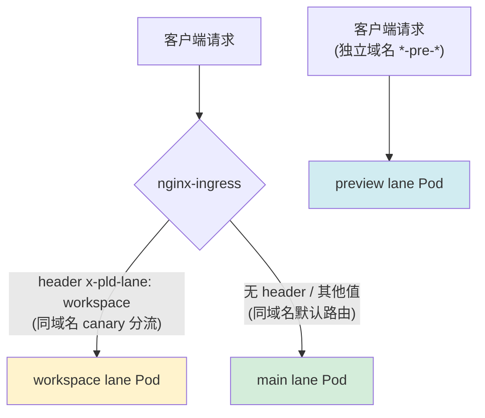

# K8s 泳道机制（Lane）

> 前置知识：本文建立在 [[10-helm-argocd-deployment|Helm 与 EKS 部署体系]] 之上，需要理解 Ingress、Deployment、ApplicationSet、values 文件等概念。
>
> **核心问题**：在同一个 K8s 集群、同一个域名下，如何让同一服务的多个版本实例并行运行，并按需将流量路由到不同版本？

---

## 一、什么是泳道

泳道（Lane）是一种**流量隔离机制**，允许在同一个 K8s 集群、同一个域名（host）下运行同一服务的**多个版本实例**，通过 HTTP Header 或独立域名路由流量到不同版本。

典型场景：开发/测试时，某个团队需要使用自己修改的服务版本，但不影响其他人使用默认版本。

### 1.1 plaud-project-summary 的三条泳道

plaud-project-summary 在生产环境同时运行三条泳道，采用两种不同的路由方式：

| 泳道 | 路由方式 | 域名 | 适用场景 |
|---|---|---|---|
| **main** | 正常 Ingress，无 canary 注解 | `plaud-project-summary-apne1-lan.plaud.ai` | 默认生产流量 |
| **workspace** | Canary Ingress，header `x-pld-lane=workspace` | 与 main **相同** | 开发联调，临时测试 |
| **preview** | 独立域名，不用 canary | `plaud-project-summary-pre-apne1-lan.plaud.ai` | 预发布验证，长期存在 |

### 1.2 路由规则



### 1.3 "同一个集群"与"同一个域名"

**同一个集群**——main 泳道和 workspace 泳道的 `server` 地址完全一样，两个版本的 Pod 跑在同一批机器上，共享集群资源：

```yaml
# 来源：deploy/plaud-project-summary/applicationsets/applicationsets-prod.yaml
# main lane 和 workspace lane 都指向同一个 server
server: https://0AE3C052C45D172B2FB662AE03742C52.gr7.ap-northeast-1.eks.amazonaws.com
```

**同一个域名**（仅 workspace 泳道）——canary 机制要求两个 Ingress 共享同一个 host：

```yaml
# 来源：deploy/plaud-project-summary/values/ap-northeast-1/staging/

# main lane 的 ingress
hosts:
  - host: plaud-project-summary-staging-apne1-lan.plaud.ai

# workspace lane 的 canary ingress（同一个域名）
hosts:
  - host: plaud-project-summary-staging-apne1-lan.plaud.ai
```

---

## 二、Canary Ingress — workspace 泳道的底层实现

**问题**：同一个域名如何同时指向两组不同的 Pod？

nginx-ingress 提供的 Canary 注解可以让同一个 host 拥有两个 Ingress 资源，nginx 根据 header 决定将流量转发给哪个 Service/Deployment。

### 2.1 三件套注解

```yaml
nginx.ingress.kubernetes.io/canary: "true"
nginx.ingress.kubernetes.io/canary-by-header: "x-pld-lane"
nginx.ingress.kubernetes.io/canary-by-header-value: "workspace"
```

### 2.2 workspace 泳道的实际配置

一个服务如果有多个入口（内网、公网、gRPC...），**每个入口都需要单独加 canary 注解**：

```yaml
# 来源：deploy/plaud-project-summary/values/ap-northeast-1/staging/workspace.yaml
ingresses:
  # 内网 - Web 前端 (canary)
  internal:
    ingressClassName: "nginx-internal"
    annotations:
      nginx.ingress.kubernetes.io/canary: "true"
      nginx.ingress.kubernetes.io/canary-by-header: "x-pld-lane"
      nginx.ingress.kubernetes.io/canary-by-header-value: "workspace"
    hosts:
      - host: plaud-project-summary-staging-apne1.nicebuild.click  # 与 main 相同

  # 私有 - API 后端 (canary)
  private:
    ingressClassName: "nginx-pvt"
    annotations:
      nginx.ingress.kubernetes.io/canary: "true"
      nginx.ingress.kubernetes.io/canary-by-header: "x-pld-lane"
      nginx.ingress.kubernetes.io/canary-by-header-value: "workspace"
    hosts:
      - host: plaud-project-summary-staging-apne1-lan.plaud.ai     # 与 main 相同
```

### 2.3 Helm 模板如何渲染 canary 注解（进阶）

`generic-deployer` 的 Ingress 模板遍历 values 中的 `ingresses` 字典，为每一组配置生成一个独立的 Ingress 资源，annotations 原封不动地从 values 文件注入：

```yaml
# 来源：deploy/generic-deployer/templates/ingresses.yaml
{{- range $name, $ingress := .Values.ingresses }}
apiVersion: networking.k8s.io/v1
kind: Ingress
metadata:
  name: {{ include "generic-deployer.fullname" $ }}-{{ $name | lower | replace "_" "-" }}
  {{- with $ingress.annotations }}
  annotations:
    {{- toYaml . | nindent 4 }}   # ← values 中的 canary 注解在此注入
  {{- end }}
spec:
  ingressClassName: {{ $ingressClassName }}
  rules:
    {{- range $ingress.hosts }}
    - host: {{ .host | quote }}
      http:
        paths: [...]
    {{- end }}
---
{{- end }}
```

最终集群里有两个 Ingress（main 的和 workspace 的），nginx 将它们合并成一条路由规则：

```text
同一个域名 plaud-project-summary-staging-apne1-lan.plaud.ai
    │
    ├── 请求带 x-pld-lane: workspace  →  workspace Ingress  →  workspace Pod
    │
    └── 请求不带 / 其他值               →  main Ingress       →  main Pod
```

---

## 三、preview 泳道 — 独立域名方式

**问题**：并非所有泳道都适合 canary 方式，预发布环境需要完全独立的访问入口。

preview 泳道不使用 canary 注解，而是配置独立域名（含 `pre` 前缀）：

```yaml
# 来源：deploy/plaud-project-summary/values/ap-northeast-1/prod/preview.yaml
# 注意：没有 canary 注解
ingresses:
  internal:
    ingressClassName: "nginx-internal"
    annotations:
      nginx.ingress.kubernetes.io/proxy-body-size: "150m"
      # 只有 cookie 亲和性等注解，没有 canary 三件套
    hosts:
      - host: plaud-project-summary-pre-apne1.nicebuild.click   # "pre" 前缀，独立域名
  private:
    hosts:
      - host: plaud-project-summary-pre-apne1-lan.plaud.ai      # "pre" 前缀，独立域名
  api-gateway:
    hosts:
      - host: api-pre-apne1.plaud.ai                            # "pre" 前缀，独立域名
```

两种泳道方式对比：

| | workspace 泳道（canary 机制） | preview 泳道（独立域名） |
|---|---|---|
| 域名 | 与 main **相同** | 独立域名（含 `pre` 前缀） |
| canary 注解 | 需要三件套 | **不需要** |
| 路由方式 | 请求加 `x-pld-lane` header | 直接访问独立域名 |
| 适用场景 | 开发联调，临时测试 | 预发布验证，长期存在的独立环境 |

> preview 泳道更像是一个"半独立的环境"——拥有自己的域名和入口，但仍然部署在同一个 K8s 集群中，共享 ServiceAccount 等基础设施。其 `AWS_ENV` 值为 `pre`，指向独立的 AppConfig 配置。

---

## 四、ArgoCD ApplicationSet — 自动生成泳道部署

**问题**：新增一条泳道需要手动创建 Deployment、Service、Ingress 吗？

不需要。ApplicationSet 是 ArgoCD 的"批量生成器"（详见 [[10-helm-argocd-deployment#2.3 ArgoCD ApplicationSet + Helm 的协作|Helm 笔记 2.3 节]]），在 elements 列表中多加一组变量即可自动生成完整的部署资源。

### 4.1 plaud-project-summary 的 ApplicationSet（含三种泳道）

```yaml
# 来源：deploy/plaud-project-summary/applicationsets/applicationsets-prod.yaml
apiVersion: argoproj.io/v1alpha1
kind: ApplicationSet
metadata:
  name: plaud-project-summary-prod
  namespace: argocd
spec:
  generators:
    - list:
        elements:
          # JP 集群：main + preview
          - cluster: jp-prod
            server: https://<cluster-id>.yl4.ap-northeast-1.eks.amazonaws.com
            env: prod
            region: ap-northeast-1
            lane: main
          - cluster: jp-prod
            server: https://<cluster-id>.yl4.ap-northeast-1.eks.amazonaws.com
            env: prod
            region: ap-northeast-1
            lane: preview

          # US 集群：main + preview + workspace（三种泳道共存）
          - cluster: us-prod
            server: https://<cluster-id>.sk1.us-west-2.eks.amazonaws.com
            env: prod
            region: us-west-2
            lane: main
          - cluster: us-prod
            server: https://<cluster-id>.sk1.us-west-2.eks.amazonaws.com
            env: prod
            region: us-west-2
            lane: preview
          - cluster: us-prod
            server: https://<cluster-id>.sk1.us-west-2.eks.amazonaws.com
            env: prod
            region: us-west-2
            lane: workspace

  template:
    metadata:
      name: "plaud-project-summary-{{ cluster }}-{{ lane }}"
    spec:
      source:
        helm:
          valueFiles:
            - values/{{ region }}/{{ env }}/{{ lane }}.yaml
      destination:
        server: "{{ server }}"
```

关键要点：
- **同一个 `server`** 出现多次、每次 `lane` 不同——这就是"同一集群内多版本"
- template 中的 `{{ lane }}.yaml` 分别匹配 `main.yaml`、`preview.yaml`、`workspace.yaml`
- **新增泳道 = 在 elements 中多加一组变量**，ArgoCD 自动生成对应的 Application

---

## 五、Helm Values 文件 — 泳道间的配置差异

**问题**：workspace 泳道的 values 文件和 main 有哪些关键差异？

每个泳道有独立的 [[10-helm-argocd-deployment#3.5 ⑤⑥⑦ Values 文件详解 — 参数逐项说明|values 文件]]。workspace 的 values 大部分内容直接复制 main，再改动以下几处关键差异：

| 配置项 | main.yaml | workspace.yaml |
|---|---|---|
| `serviceAccount.create` | `true`（创建 SA） | `false`（复用 main 的 SA） |
| `podAnnotations` | 无泳道标签 | `metrics.labels/x-pld-lane: "workspace"` |
| `ingresses.*.annotations` | 无 canary 注解 | 每组都加 canary 三件套 |
| `ingresses.*.hosts` | 服务域名 | **与 main 完全相同的域名** |
| `resources` | 正常配置 | 适当缩小（泳道通常只做测试用） |

### 5.1 podAnnotations 与 Prometheus 指标区分

```yaml
# 来源：deploy/plaud-summary/values/us-west-2/staging/values-main.yaml
podAnnotations:
  prometheus.io/scrape: "true"
  prometheus.io/port: "7072"
  prometheus.io/path: "/metrics"
  metrics.labels/x-pld-lane: "main"

# 来源：deploy/plaud-summary/values/us-west-2/staging/values-workspace.yaml
podAnnotations:
  prometheus.io/scrape: "true"
  prometheus.io/port: "7072"
  prometheus.io/path: "/metrics"
  metrics.labels/x-pld-lane: "workspace"   # ← 唯一差异
```

Prometheus 查询时可以用 `{x_pld_lane="workspace"}` 过滤出 workspace 泳道的指标，避免与 main 泳道的数据混在一起。

### 5.2 ConfigMap 注入 lane 标识（进阶）

部分服务需要在运行时知道自己属于哪个泳道。通过 `config` 字段注入 lane 信息：

```yaml
# 来源：deploy/plaud-summary/values/us-west-2/staging/values-workspace.yaml
config:
  content: |
    {
      "key": "workspace",
      "lane": "workspace"
    }
  mountPath: "/config/config.json"
```

Helm 模板将 `config.content` 渲染成 ConfigMap，挂载到 Pod 的指定路径。应用启动时读取 `/config/config.json` 即可获知所属泳道。

---

## 六、操作步骤（以新增 workspace 泳道为例）

### Step 1：applicationsets.yml 添加新泳道

```yaml
# 来源：deploy/plaud-passport-service/applicationsets/applicationsets.yml（新增部分）
cluster: jp-staging
server: https://0AE3C052C45D172B2FB662AE03742C52.gr7.ap-northeast-1.eks.amazonaws.com
env: staging
region: ap-northeast-1
lane: workspace
```

`server` 与 main lane 相同（同一集群）。

### Step 2：新建 values 文件

文件路径：`deploy/plaud-passport-service/values/ap-northeast-1/staging/workspace.yml`

**HTTP Ingress 加 canary annotations：**

```yaml
# 来源：deploy/plaud-passport-service/values/ap-northeast-1/staging/workspace.yml
ingress:
  enabled: true
  ingressClassName: "nginx-pvt"
  annotations:
    nginx.ingress.kubernetes.io/canary: "true"
    nginx.ingress.kubernetes.io/canary-by-header: "x_pld_lane"
    nginx.ingress.kubernetes.io/canary-by-header-value: "workspace"
  hosts:
    - host: plaud-passport-service-staging-apne1-lan.plaud.ai   # 与 main 相同
      paths:
        - path: /
          pathType: Prefix
          servicePort: 80
```

**gRPC Ingress 同样加 canary annotations（如有）：**

```yaml
# 来源：deploy/plaud-passport-service/values/ap-northeast-1/staging/workspace.yml
ingresses:
  grpc:
    ingressClassName: "nginx-pvt"
    annotations:
      nginx.ingress.kubernetes.io/backend-protocol: "GRPC"
      nginx.ingress.kubernetes.io/canary: "true"
      nginx.ingress.kubernetes.io/canary-by-header: "x_pld_lane"
      nginx.ingress.kubernetes.io/canary-by-header-value: "workspace"
    hosts:
      - host: plaud-passport-service-grpc-staging-usw2-lan.plaud.ai
        paths:
          - path: /
            pathType: Prefix
            servicePort: 8081
```

**serviceAccount 复用 main + Prometheus 标记泳道：**

```yaml
# 来源：deploy/plaud-passport-service/values/ap-northeast-1/staging/workspace.yml
serviceAccount:
  create: false
  name: plaud-passport-service

podAnnotations:
  metrics.labels/x-pld-lane: "workspace"
```

### Step 3：提 PR 合并

改动文件：
- `plaud-passport-service/applicationsets/applicationsets.yml`
- `plaud-passport-service/values/ap-northeast-1/staging/workspace.yml`

PR 合并后 ArgoCD 自动同步，在 namespace 下创建：
- **Deployment**：`{service}-{cluster}-{env}-{lane}-deployer`
- **Service**：含 web(80)、grpc(8081)、private(9080) 三个端口
- **Ingress**：HTTP canary ingress + gRPC canary ingress

### Step 4：验证

```bash
# HTTP → workspace lane
curl -H "x_pld_lane: workspace" \
  https://plaud-passport-service-staging-apne1-lan.plaud.ai/health

# gRPC → workspace lane
grpcurl -H "x_pld_lane: workspace" \
  plaud-passport-service-grpc-staging-usw2-lan.plaud.ai:443 list
```

---

## 七、注意事项

1. **main lane 必须先存在** — canary ingress 依赖 main ingress，main 不存在时 canary 不生效
2. **host 必须与 main 相同**（workspace 泳道） — canary 和 main 用同一个 host，nginx 按 header 路由
3. **HTTP 和 gRPC 都要加 canary** — 如果服务有两个 ingress，两个都需要加 canary annotations
4. **serviceAccount 复用 main** — `create: false`，复用已有 SA，避免 IAM Role 重复绑定
5. **preview 泳道不走 canary** — 使用独立域名（`pre` 前缀），不需要 canary 注解

---

## 八、泳道的局限：服务间调用（进阶）

**问题**：泳道是单服务级别的流量隔离，下游服务调用会自动走对应泳道吗？

不会。泳道不会自动传播到下游服务调用。

### 8.1 示例：跨服务调用

```text
用户请求（带 x-pld-lane: workspace）
    │
    ▼
Ingress ──→ project-summary (workspace 泳道) ✅ 走了 workspace
                │
                │ 内部 HTTP 调用（没有 x-pld-lane header）
                ▼
           filesystem (main 泳道) ← 还是走了 main
```

### 8.2 两种调用方式的影响

| 调用方式 | 如何切到 workspace 泳道 | 需要改什么 |
|---|---|---|
| Ingress 域名（`xxx-lan.plaud.ai`） | 加 `x-pld-lane: workspace` header | 只加一个 header |
| K8s Service DNS（`xxx-deployer.ns:port`） | 换成 `xxx-workspace-deployer.ns:port` | 改目标地址 |

Service DNS 绕过了 Ingress，header 分流不生效。workspace 泳道会生成一个不同名字的 Service：

```text
main 泳道:
  plaud-project-summary-jp-prod-main-deployer.plaud-project-summary:8001

workspace 泳道:
  plaud-project-summary-jp-prod-workspace-deployer.plaud-project-summary:8001
                                  ^^^^^^^^^  ← 名字包含泳道名
```

### 8.3 解决办法

| 方案 | 做法 | 是否需要改代码 |
|---|---|---|
| 只测试单个服务的代码改动 | 不需要额外处理，泳道开箱即用 | 否 |
| 下游也要走 workspace | 在代码中透传 `x-pld-lane` header（前提：内部调用走 Ingress 域名） | 是 |
| 下游需要不同配置 | 在 workspace 的 values 文件中设置不同的 `APPCONFIG_CONFIG_FILE_NAME`，指向独立的 AppConfig 文件 | 否 |

---

## 参考

- [样例 PR: deploy#1791](https://github.com/Plaud-AI/deploy/pull/1791)
- [飞书文档 - 如何为服务新增泳道](https://nicebuild.feishu.cn/wiki/WtPGwkvEhifpg9kICdbccjpKnFe)
