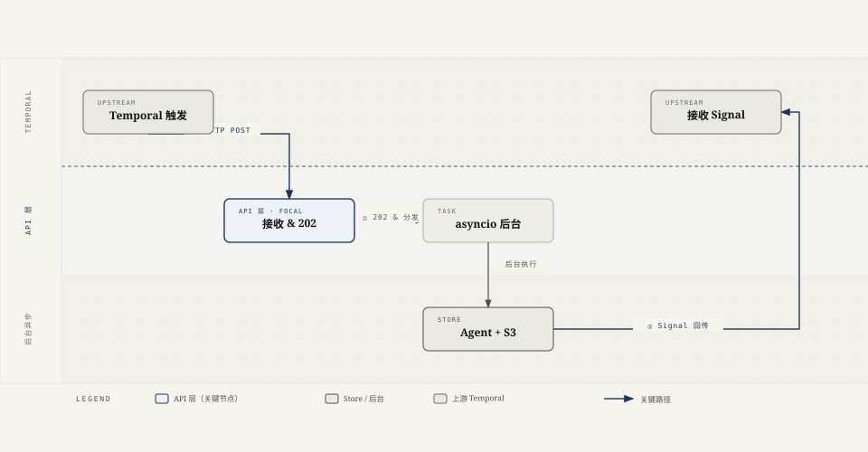
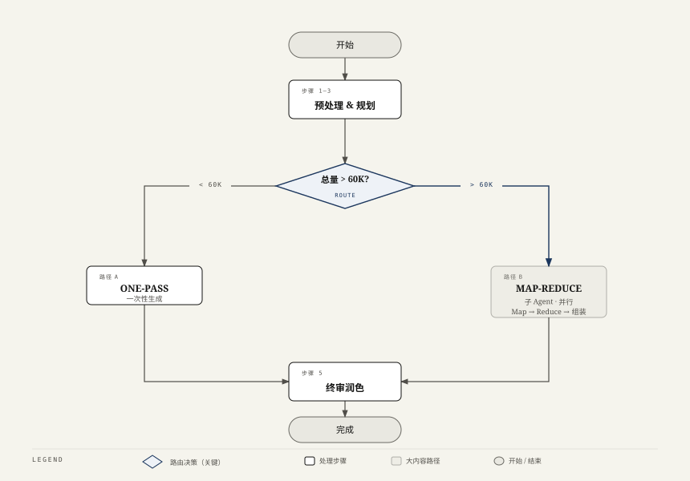
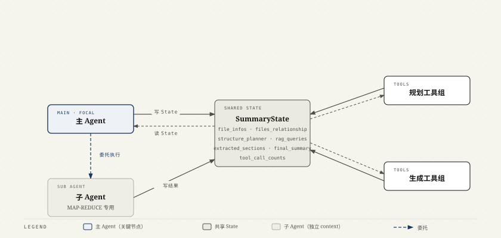
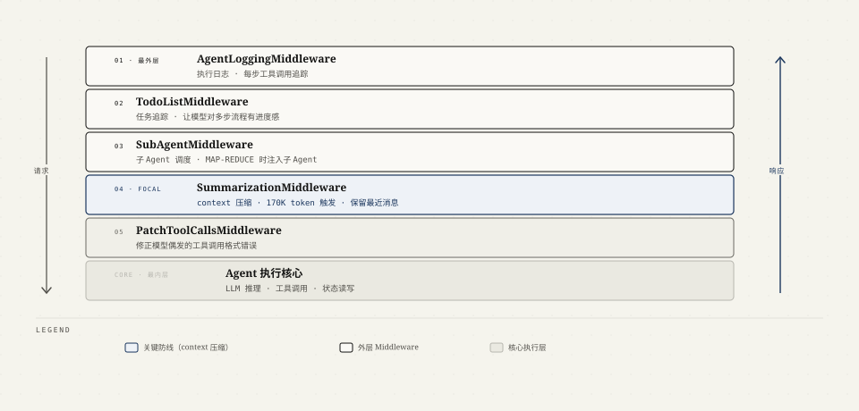
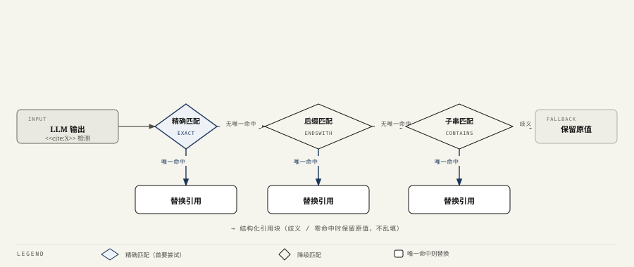
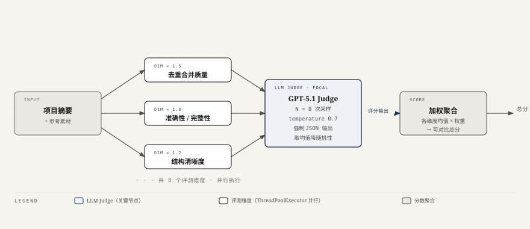

# Plaud Project Summary — 面试介绍文档

> [!tip] 一句话电梯陈述
> 我从 0 到 1 独立负责并上线了一个 **Multi-Agent 项目级摘要服务**：把一个项目下的多份录音转写和文档聚合起来，产出一份结构化的项目报告，支持「总结 / 对比 / 进度跟踪」三种策略。核心是一套基于 DeepAgents 的 Agent 工作流，配合 Temporal 异步编排、引用溯源工程和自研评测体系，端到端覆盖从 API、Agent 编排到上线运维。

---

## 1. 项目背景：要解决什么问题

Plaud 的核心产品是把单次录音转成总结。但用户的真实场景往往是**一个项目持续好几周、积累十几份录音和文档**——单条总结回答不了那些需要跨文件才能回答的问题。

Project Summary 就是为此而生：**输入一个项目下的多份素材，输出一份融会贯通的项目报告**。它支持三种策略，对应三类诉求。**SUMMARY（总结）**把多份素材的主题提取出来、去重、再合并成一份完整总结；**COMPARISON（对比）**横向比较多份素材里的观点和方案差异——比如把同一岗位几位面试候选人的面试录音放在一起，对比谁的表现更契合；**PROGRESS（进度）**则跟踪同一个项目随时间推移的进展和趋势。

技术上的核心挑战有三个，也是面试时我会重点讲的：

1. **Context 体量不可控**——少则两三份、多则十几份长录音，token 量跨度极大，可能远超单次 context window，必须配套 context 管理策略，单一处理方式扛不住。
2. **长耗时任务**——跑一次 multi-agent 流程要几十秒甚至更久，同步 HTTP 必然超时。
3. **可信与可量化**——报告必须能溯源到原始文件（引用），改一版 prompt 得能客观判断是变好还是变坏（评测）。

---

## 2. 我的角色

**独立负责，端到端 0→1**：需求拆解、架构设计、Agent 编排、API、Temporal 接入、引用工程、评测体系、上线运维全部我一个人做，目前已作为生产管道上线。

---

## 3. 整体架构：一个请求的生命周期

服务部署在 K8s Pod 里，用 Supervisor 管多个进程（API :8001 / 健康检查 :8000 / Agent 健康端点 :8002）。生产流量来自上游的 Temporal 工作流：

```text
上游 Temporal Workflow
   │  ① HTTP POST /api/temporal/project-summary/process
   ▼
本服务 API 层
   ├── 校验请求；若正在关停 → 503 拒绝
   ├── 把任务丢进后台 asyncio.Task（带上 OTel 上下文做链路追踪）
   └── ② 立即返回 202 accepted
        │
        ▼  （后台异步执行）
   预处理文件摘要 → 语言检测 → 跑 Summary Agent → 提取标题 → 存 S3
        │
        ▼  ③ Temporal Signal 把结果异步回传给上游 Workflow
```

这就是后面要讲的 **Temporal「外部服务」模式**：上游负责编排和重试，本服务专注算，三次交互（HTTP 触发 / 202 / Signal 回传）解耦。


*三次交互解耦：① HTTP 触发，② 202 立即返回（上游不阻塞），③ Temporal Signal 异步回传结果。API 层是关键节点——把同步触发和异步执行拆开，使长耗时任务不超时。*

---

## 4. Agent 工作流详解（重点）

> [!important] 这是面 Agent 岗的核心，我会讲得最细
> 框架是 **DeepAgents（基于 LangChain `create_agent` + middleware 体系）**。整体是一个**单主 Agent + 一个 map-reduce 子 Agent**的结构，编排范式是**引导式工具编排 + 硬约束兜底**：把摘要流程拆成 7 个工具（tool），用 system prompt 把调用顺序写死来牵引主 Agent 按序执行，再用工具限流锁住流程骨架，防止它乱序、漏步或循环。

### 4.1 编排范式：为什么是「引导式工具编排」而不是别的

主 Agent 的 system prompt 里有一段 `Workflow (execute strictly in order)`，把整条流程显式列成 5 步，要求模型严格按序调工具、最后一步做完就停手：

```text
1. analyze_file_relationships     分析文件关系
2. generate_plan_structure        生成大纲
3. retrieve_rag_content_for_files RAG 检索（如适用）
4. 生成摘要（按体量二选一）
   - 小内容：generate_few_file_summary（one-pass）
   - 大内容：extract_file_sections_batch → merge_sections_batch → assemble_final_document
5. review_final_summary           终审润色；做完即结束，不再调任何工具
```

这套设计介于两个极端之间，是我反复权衡的结果：

- **不用纯自由 ReAct**（让模型自己想下一步调什么）：摘要流程的骨架是确定的，自由发挥只会带来乱序、漏步、重复调用，不可控也难复现。
- **折中：prompt 定序（软引导）+ 工具限流（硬兜底）**。骨架用规则锁死，每步内部的智能交给 LLM。**能用规则保证的就别指望 prompt，能用 prompt 表达的就别写死成代码**——这是我编排 Agent 的核心判断。

### 4.2 前置预处理：先给每个文件生成文件级摘要（在 Agent 之外）

跑 Agent 之前，先给每个文件生成一份**文件级摘要 `file_summary`**（即每个文件的概览），同时做语言检测。

> [!note] 为什么这步放在 Agent 之外
> 一是它是确定性的数据准备 + 批量 IO，没有推理决策，没必要交给 Agent；二是后续的路由判断和文件关系分析都依赖 `file_summary`，必须先就绪。**关键收益：后续 Agent 看到的是各文件的摘要而非全文，从源头压低 context。**（注意别和请求里的项目级 `overview` 搞混——那个只用于语言检测。）

### 4.3 状态设计：SummaryState 是工具之间唯一的数据总线 ⭐

这是整个 Agent 的骨架，也是面试我最想讲的点。**工具之间从不互相调用，全部通过一个共享的 `SummaryState` 读写来传递数据**——上一个工具把结果写进某个 state 字段，下一个工具从里面读。数据流是这样的：

```text
file_infos
  └─(analyze_file_relationships)→ files_relationship
       └─(generate_plan_structure)→ structure_planner + rag_queries
            └─(retrieve_rag_content_for_files)→ 回填 file_infos[].rag_content
                 ├─ ONE-PASS ─(generate_few_file_summary)─────────────→ final_summary
                 └─ MAP-REDUCE ─(extract_file_sections_batch)→ extracted_sections
                                  └─(merge_sections_batch)→ merged_sections
                                       └─(assemble_final_document)→ final_summary
                                                                        └─(review)→ final_summary
```

> [!important] 并发写 state 用 reducer 合并——容易被追问的细节
> Map / Reduce 阶段是**并行**跑的（多个文件、多个 section 同时写回），如果直接覆盖同一个 dict 就会丢数据。所以 `extracted_sections`、`merged_sections`、`tool_call_counts` 这几个并发写的字段，都用 `Annotated[dict, merge_dicts]` 声明了 **reducer**：LangGraph 在多个并行分支写同一字段时，不覆盖、而是按 reducer 合并。**这是 LangGraph 处理并行节点状态冲突的标准手法，没有它并行就是数据竞争。**

`SummaryState` 继承自 LangChain 的 `AgentState`，关键字段：


| 字段                   | 含义                                      |
| -------------------- | --------------------------------------- |
| `file_infos`         | 输入文件列表，含 `file_summary` / `rag_content` |
| `files_relationship` | 文件关系分析结果                                |
| `structure_planner`  | 文档大纲                                    |
| `rag_queries`        | 需检索文件的 RAG 查询（仅 location_file）          |
| `extracted_sections` | Map 产物：source_id → {sections}           |
| `merged_sections`    | Reduce 产物：section_id → {name, content}  |
| `final_summary`      | 最终摘要                                    |
| `tool_call_counts`   | 各工具调用计数（限流用）                            |


### 4.4 路由决策：ONE-PASS vs MAP-REDUCE

Agent 创建时根据总内容大小**静态选路**（默认阈值约 60K tokens，配在 AppConfig 可调）：

```python
total_size = get_total_content_size(file_infos)
use_map_reduce = total_size > small_content_threshold
```

- **内容小** → ONE-PASS：所有内容一次性喂给 LLM 生成完整摘要。简单、快、上下文连贯。
- **内容大** → MAP-REDUCE：拆解后分而治之，绕开单次 context window 的限制，也避开 context 过长导致的「中间信息丢失」(lost in the middle)。

> 为什么静态选路而不让模型自己决定？因为这是个确定性可判断的指标（token 量），交给模型判断只会增加不确定性和一次额外 LLM 调用。**能用规则判断的就不交给 LLM**——这是我贯穿整个项目的设计原则。技术上：MAP-REDUCE 模式才会通过 `SubAgentMiddleware` 把子 Agent 注入主 Agent，ONE-PASS 模式则把 `generate_few_file_summary` 直接挂到主 Agent 的工具列表里。


*路由决策是纯规则判断（token 量阈值约 60K），不过 LLM，保证确定性。两条路径在终审前汇合，使路由对下游透明。*

### 4.5 共有规划阶段（两条路都先走）

不管走哪条路，都先经过三个规划工具，把"怎么写"想清楚再动手。每个工具的 prompt 都走 **Langfuse 集中管理 + 本地 fallback**：


| 步骤  | 工具                               | 输入 → 输出                                                    | 关键点                                                                                            |
| --- | -------------------------------- | ---------------------------------------------------------- | ---------------------------------------------------------------------------------------------- |
| 1   | `analyze_file_relationships`     | `file_summary` → `files_relationship`                      | LLM 分析文件间关系、识别各方观点与分歧；结果按内容哈希键缓存到 Filesystem，**跨任务复用**，限流 1 次（内置缓存检查）                          |
| 2   | `generate_plan_structure`        | `files_relationship` → `structure_planner` + `rag_queries` | LLM 生成文档大纲；对 location_file 用 **structured output**（`RAGQueriesExtraction`）从大纲里抽出每个文件要检索的 query |
| 3   | `retrieve_rag_content_for_files` | `rag_queries` → 回填 `file_infos[].rag_content`              | 对 location_file 走 Retriever API 做 RAG 检索补内容，没有 query 就跳过（确定性，不过 LLM）                           |


### 4.6 路径 A — ONE-PASS

`generate_few_file_summary`：把大纲 + 所有文件内容一次性交给 LLM，直接生成 `final_summary`。内容能塞进一个 context window 时，这条路上下文最连贯、调用最少。

### 4.7 路径 B — MAP-REDUCE（子 Agent + 并行）

大内容委托给一个独立的 `**map-reduce-synthesizer` 子 Agent**（`CompiledSubAgent`），它有**独立的 context**，跟主 Agent 隔离。子 Agent 自己的 system prompt 也写死了三步顺序：

```text
Map：extract_file_sections_batch  —— 每个文件并行抽取 section（asyncio.gather，并发上限 5）
  │                                   structured output → FileSectionExtraction
  ▼                                   （列表而非 dict，为兼容 Gemini 的结构化输出）
Reduce：merge_sections_batch      —— 换个维度：把所有文件的"同一个 section"并行合并
  │                                   （Map 按文件切，Reduce 按 section 切）
  ▼
Assembly：assemble_final_document —— 按大纲组装、补过渡语 → final_summary
```

> [!note] 这里有两个面试高频追问点
> **① 维度转换是 map-reduce 的精髓**：Map 阶段**按文件切**（每个文件抽出它的各个 section），Reduce 阶段**换成按 section 切**（把所有文件的同一个 section 放一起合并）。先纵向拆、再横向并，去重合并就发生在这个维度翻转里。
> **② 子 Agent 隔离为什么重要**：Map-Reduce 会产生大量中间产物（每个文件 × 每个 section）。如果都堆在主 Agent 的 context 里，会迅速撑爆 context window、还会干扰主 Agent 的判断。把它整体下沉到子 Agent，主 Agent 只看到「做完了」的结论，**主 Agent 的 context 始终干净**。这是 multi-agent 里 context 隔离的典型收益。

> [!important] 追问：SubAgent 和主 Agent 如何交互？（三层回答）
>
> **表象层**：从主 Agent 视角，SubAgent 就是一个特殊的工具——注册到 `SubAgentMiddleware` 后，会以工具的形式出现在主 Agent 的可用工具列表里，主 Agent 根据 SubAgent 的 `description`（如"处理大内容的 map-reduce agent"）决定什么时候调用它。
>
> **机制层**：调用时，`SubAgentMiddleware` 拦截这个工具调用，把当前 `SummaryState` 传给子 Agent 的 `runnable`。子 Agent 在**独立 context** 里执行（有自己的 messages / system prompt / 工具列表），执行完把结果写回共享的 `SummaryState`（如 `final_summary`），主 Agent 拿到更新后的 state 继续。**关键是：共享 State，隔离 Context**——两边读写同一个 Pydantic State 对象，但各自的对话历史和中间产物互不污染。
>
> **收益层**：这个设计最大的价值是 **context 隔离**。Map-Reduce 会产生大量中间产物（10 个文件 × 5 个 section = 50 次工具调用），如果都堆在主 Agent 的 context 里会撑爆 window、干扰主 Agent 的后续决策。下沉到子 Agent 后，主 Agent 只看到一次委托和一个结论，context 始终干净。


*主 Agent 和子 Agent 共享同一个 SummaryState，但各自持有独立的 context（消息历史、中间产物互不污染）。子 Agent 处理 MAP-REDUCE 时产生的大量中间产物不会进入主 Agent 的 context window。*

### 4.8 收尾 — review

`review_final_summary`：回到主 Agent，对 `final_summary` 做一遍终审润色（检测文档类型、调整风格、保留引用标记）。system prompt 明确要求这一步做完工作流即结束、不再调任何工具。

### 4.9 健壮性：把 Agent「跑稳」的两道防线

> [!important] 这部分是 Agent 工程和「写个 demo」的真正分水岭

**防线一：Middleware 栈**（主 Agent 组装时挂上）


| 中间件                        | 职责                                               |
| -------------------------- | ------------------------------------------------ |
| `AgentLoggingMiddleware`   | 执行日志，便于追踪每步工具调用                                  |
| `TodoListMiddleware`       | 任务追踪，让模型对多步流程有进度感                                |
| `SubAgentMiddleware`       | 子 Agent 调度（仅 MAP-REDUCE 注入子 Agent）               |
| `SummarizationMiddleware`  | **170K token 触发 context 压缩**，保留最近若干条消息，让超长任务也能跑完 |
| `PatchToolCallsMiddleware` | 修正模型偶发的工具调用格式错误                                  |


**防线二：工具调用限流 + 锁写**（`tool_call_counts` state 字段 + `check_tool_limit`）

system prompt 是软引导，模型仍可能反复调同一个工具陷入死循环——这是 Agent 上线最常见的事故。所以每个工具都有调用上限做硬约束：


| 工具                                                                                                                        | 上限         |
| ------------------------------------------------------------------------------------------------------------------------- | ---------- |
| 生成 / 合并 / 组装 / 审阅类（`generate_few_file_summary`、`merge_sections_batch`、`assemble_final_document`、`review_final_summary` 等） | 2          |
| `analyze_file_relationships`、`generate_plan_structure`                                                                    | 1（带内置缓存检查） |


额外加一条**锁写规则**：`review_final_summary` 执行后，`generate_few_file_summary` 会被拒绝执行，**防止 Agent 又跑回去重新生成、覆盖掉已经润色好的结果**。


*SummarizationMiddleware 是最关键的防线——在 context 达到 170K token 前自动压缩历史，使长任务不被 context window 限制截断。五层 Middleware 共同保证"Agent 不跑飞"。*

### 4.10 端到端串一遍（面试可以这样一口气讲）

> 请求进来后，先在 Agent 之外把每个文件压成 `file_summary`、顺带检测语言；按总 token 量静态选 ONE-PASS 或 MAP-REDUCE；主 Agent 被 system prompt 牵引按序走「分析文件关系 → 生成大纲并抽 RAG 查询 → location_file 检索补全」三步规划，所有中间结果都写进共享的 `SummaryState`；小内容一次性生成，大内容交给上下文隔离的子 Agent 做「并行抽取 section → 按 section 并行合并 → 组装」，并发写 state 用 reducer 合并；最后回主 Agent 终审润色得到 `final_summary`。全程用 middleware 压缩 context、用工具限流防跑飞。Agent 产出后，再交回 API 层做**确定性后处理**（引用还原 + source_id 换文件名，见 5.3），不再过 LLM。

---

## 5. 我做的关键技术决策与难点（STAR 式）

### 5.1 Agent 健壮性工程 ⭐（Agent 岗最该讲的）

> [!important] 一句话设计哲学
> Agent 不是写出来能跑就行，难在**别让它跑飞**。我的思路是「软引导定方向、硬约束兜底线」：用 system prompt 引导流程顺序，但绝不依赖它——再叠三层硬防护。

- **流程锁死**：system prompt 写死工具调用顺序，工具限流（`tool_call_counts`）给每个工具设调用上限，防止模型乱序、漏步、反复调同一个工具陷入死循环。
- **Context 不失控**：`SummarizationMiddleware` 在 170K token 自动压缩历史；大内容下沉到上下文隔离的子 Agent，保证主 Agent 的 context 始终干净。
- **结果不被覆盖**：`review_final_summary` 之后锁写，拒绝再执行生成类工具，防止润色好的结果被重新生成覆盖。

> 机制细节（middleware 栈、限流表、reducer）见 [4.9](#49-健壮性把-agent跑稳的两道防线) 与 [4.3](#43-状态设计summarystate-是工具之间唯一的数据总线-) ——这部分是我在这个项目里花最多心思、也最能体现 Agent 工程能力的地方。

### 5.2 Temporal「外部服务」模式 + K8s 优雅关停 ⭐

> [!note] 先讲清 Temporal 是什么
> **Temporal 是一个分布式工作流编排引擎**（durable workflow orchestration engine），负责管理长流程的**状态持久化、重试、超时**等。上游 Plaud 后端用它来编排整条业务流水线，Project Summary 只是其中一个环节。

- **S（问题）**：摘要是长耗时任务（几十秒级），用同步 HTTP 接口必然超时；但又要可靠地把结果交回上游。
- **T/A（方案）**：以「外部服务」模式接入——上游 Workflow 发 HTTP 触发，本服务**立即返回 202**，把活儿丢到后台 asyncio 跑，**算完用 Temporal Signal 把结果异步回传**给那个 Workflow。HTTP 只负责"收下任务"，结果走 Signal，彻底解耦。
- **配套：K8s 优雅关停**。长任务最怕滚动发布时被 SIGTERM 打断。我的关停流程：收到 SIGTERM → 置 `_shutting_down` 标志 → 新请求和健康检查都返 503（**K8s 据此停止往这个 Pod 转发流量**）→ 等所有在途后台任务跑完（`asyncio.gather` 追踪 `_running_tasks`）→ 才安全退出。**保证在途的长任务不被腰斩**。

### 5.3 Citation 引用溯源工程

- **S（问题）**：报告必须能溯源到原始文件，但完整文件 ID 是长 UUID，直接让 LLM 在正文里写既费 token 又容易写错/截断。
- **A（方案）**：**LLM 内部用短 ID**（省 token），出口做确定性后处理两步：
  1. `<<cite:source_id>>` 转成结构化引用块，并对被 LLM 截断的 ID 做**三级匹配还原**——精确匹配 → 后缀匹配（endswith）→ 子串匹配（contains），逐级降级；且**每级只在唯一命中时才还原**，命中多个（歧义）或零命中都保留原值，绝不乱填；
  2. 把正文里裸露的 source_id 替换回**可读文件名**，同时保护已结构化的引用块不被误伤。
- **关键判断**：这一步**纯 Python 确定性处理，不再过 LLM**——引用还原是个有确定答案的匹配问题，交给 LLM 只会引入新的幻觉。


*三级匹配逐级降级，每级只在唯一命中时才替换——零命中或歧义（多命中）均保留原值，不乱填，彻底排除幻觉引用。整个后处理是纯 Python 确定性逻辑，不再过 LLM。*

### 5.4 自研评测体系（G-Eval）⭐

- **S（问题）**：改一版 prompt、调一个策略，到底变好还是变坏？靠人工读太主观、不可复现。
- **A（方案）**：自研 LLM-as-Judge 评测：
  - 每种策略配一套**加权维度**。比如 SUMMARY 有 7 个维度（完整性、准确性、**去重合并质量**、结构清晰度、深度、可用性、策略一致性），核心能力"去重合并质量"权重 1.5、结构 1.2，其余 1.0。
  - **G-Eval 模式**：每个维度**多次采样**（N=8，temperature 0.7 制造多样性）取均值，降低单次打分的随机性；保留每次原始分数便于分析。
  - 8 个维度**并行**评测（ThreadPoolExecutor），Judge 用强模型（gpt-5.1）、强制 JSON 输出。
- **R（效果）**：每次改动都能跑出**可量化、可对比**的维度分和总分，迭代有了客观标尺。
  - 〔面试时补：可以举一个"靠评测发现某次改动其实是负优化 / 验证某次重构带来 X 分提升"的具体例子〕


*8 个维度并行评测（ThreadPoolExecutor），每个维度 N=8 次采样取均值，降低单次打分随机性。去重合并质量权重 1.5（核心能力），结构清晰度 1.2，其余 1.0——改动后跑评测即可量化是变好还是变坏。*

### 5.5 区域感知路由 + AppConfig 热更新（次要，可略）

- 服务跑在海外和国内两个 Region。按 `AWS_REGION` 自动选模型与框架：海外用 Gemini（Vertex AI）、国内用豆包（走自研 Model Hub SDK）。
- 凭证、路由、prompt、各工具的模型配置都托管在 AWS AppConfig，watchdog 线程轮询（120s）检测变更，**多数配置零停机热更新**（每次调用读最新 / watchdog 重置单例两种机制）。

---

## 6. 技术栈


| 类别          | 用到的东西                                                       |
| ----------- | ----------------------------------------------------------- |
| Agent / LLM | DeepAgents、LangChain、Langfuse（prompt 管理 + LLM 追踪）           |
| 模型          | Gemini (Vertex AI)、豆包（Model Hub）、Judge 用 GPT                |
| 后端          | FastAPI、asyncio 后台任务                                        |
| 编排          | Temporal（外部服务模式 + Signal 回传）                                |
| 存储          | AWS S3（源文件桶 + 结果桶双桶）、Filesystem KV（关系缓存）、Retriever API（RAG） |
| 运维          | K8s、Supervisor、AWS AppConfig（热更新）、OpenTelemetry（分布式追踪）      |


---

## 7. 面试可能追问 & 我的回答预案

> [!question] ONE-PASS / MAP-REDUCE 的阈值怎么定的？
> 按经验值结合模型 context window 和 context 过长导致的「中间信息丢失」拐点来定，配在 AppConfig 里可热调。核心不是阈值多精确，而是**有这条静态分流**，避免大内容硬塞进单次 context window。

> [!question] 为什么用 DeepAgents 而不是自己用 LangGraph 手写图？
> 摘要流程是**确定性的多步工具链**，DeepAgents 的 middleware 体系（子 Agent 调度、context 压缩、Todo 追踪）开箱即用，省掉我自己造这些轮子；同时它底层就是 LangChain `create_agent`，需要时仍能下沉到图层面控制。**用框架省掉的正是 Agent 工程里最容易出 bug 的那部分（状态、压缩、调度）**。

> [!question] Map 和 Reduce 的"维度"区别再说清楚？
> Map 阶段**按文件切**：每个文件并行抽出它的各个 section。Reduce 阶段**换成按 section 切**：把所有文件的"同一个 section"放一起并行合并。这个**维度转换**正是 map-reduce 去重合并的本质——先纵向拆、再横向并。

> [!question] 怎么保证 Agent 输出稳定 / 不跑飞？
> 三层：静态路由减少模型决策点、工具配额防死循环、review 后锁写防覆盖；再加确定性后处理（引用还原）把能不交给 LLM 的都收回来。

> [!question] G-Eval 里 Judge 自己也会有偏差，怎么办？
> 多次采样取均值降方差、维度拆细让每次只判断一个明确问题、强制结构化输出 + 保留 evidence 便于人工抽查。它的定位是**相对比较**（A 版 vs B 版），不追求绝对分准确。

> [!warning] 待我补充的量化数据（面试前填好）
>
> - 单任务平均处理时长、处理过的最大文件数 / token 量
> - 上线后的业务指标（采用率 / 用户反馈 / 替代了什么）
> - 用评测体系发现问题或验证提升的**一个具体故事**
