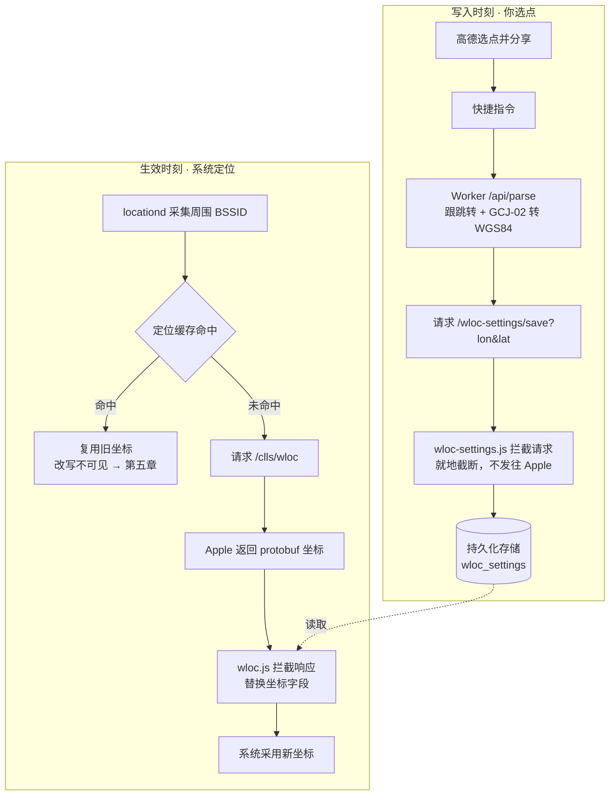

# iOS 虚拟定位操作手册 — wloc + Shadowrocket

> 适用环境：iOS 26 / Shadowrocket / 用高德地图选点。按第一到第六章顺序做完即可，第七章是出问题时的排查表。
>
> 改的是 **Apple 网络定位（WiFi + 基站）**，不动 GPS 硬件定位。
>
> 来源：
>
> - [Yu9191/wloc](https://github.com/Yu9191/wloc) — README、`modules/*`、`dist/wloc-settings.js`
> - [Shadowrocket 使用手册 补完计划](https://lowertop.github.io/Shadowrocket/)

---

## 一、开工前确认

打开 Shadowrocket，看底部导航栏有没有 **「模块」** 这一项。

- **有** → 继续第二章。
- **没有** → 先去 App Store 更新。旧版本不支持模块，只能手工往配置文件里写 `[Script]` 和 `[MITM]`，麻烦得多。

整套方案要动的三个开关，缺一个都不会生效：模块已启用、HTTPS 解密覆盖目标域名、根证书被系统信任。第二、三章就是逐个打开它们，**而且失败时系统不会给你任何提示**，所以每步都给了"做完应该看到什么"。

---

## 二、安装模块

1. 打开 Shadowrocket → 底部点 **「模块」**（部分版本在「配置」选项卡里面 → 模块）
2. 点右上角 **「+」**
3. 粘贴这个地址：

   ```text
   https://raw.githubusercontent.com/Yu9191/wloc/refs/heads/main/modules/wloc.module
   ```

4. 点 **「下载」**
5. **点一下这个模块条目，让它后面出现「✓」**

> [!warning] 第 5 步不能省
> 下载完成不等于启用。没有「✓」，脚本一次都不会跑。

**做完应该看到**：模块列表里有「Apple WLOC 定位修改」，带 ✓；点进去能看到两条脚本规则 `Apple WLOC`（改定位响应）和 `WLOC Settings`（存坐标）。

**别去动模块参数。** 里面的默认值是经度 `113.94114`、纬度 `22.544577`，保持原样。坐标由第五章的快捷指令写入，优先级更高。手改过参数会导致以后再也无法恢复真实定位，详见第六章。

---

## 三、开 HTTPS 解密并信任证书

Shadowrocket 的解密开关**绑定在配置文件上**，必须对你**当前正在使用**的那份配置开启。开在别的配置上等于没开。

1. 底部 **「配置」** → 找到正在使用的配置文件 → 点它右边的 **「i」** 图标
2. 进 **「HTTPS 解密」**
3. 打开 **「启用 HTTPS 解密」**
4. 点 **「生成新的 CA 证书」** → 弹窗点「允许」
5. 返回上一层，点 **「安装证书」** → Safari 提示「已下载配置描述文件」
6. **设置 → 通用 → VPN、DNS 与设备管理 → 已下载的描述文件 → 安装**（输入锁屏密码，连点两三次「安装」）
7. **设置 → 通用 → 关于本机 → 证书信任设置 → 找到 Shadowrocket 的证书，把开关打开**

> [!warning] 第 7 步是最大的坑
> 装了描述文件 **不等于** 信任。不打开「证书信任设置」里那个开关，HTTPS 解密完全不生效，脚本永远不触发，而 iOS 一个字都不会提示你。绝大多数失败案例都停在这一步。

解密域名**不用手加**。模块里写的是 `hostname = %APPEND% gs-loc.apple.com, gs-loc-cn.apple.com`，`%APPEND%` 表示追加到你现有的解密列表，不会覆盖原有配置。

**做完应该看到**：「证书信任设置」里 Shadowrocket 那一项的开关是绿的。

---

## 四、导入两个快捷指令

用 Safari 打开这两个链接，各点「添加快捷指令」：

- **wloc 设置地理位置** → `https://www.icloud.com/shortcuts/a82717d8fdad4e6280866fcf911173f7`
- **wloc 清理恢复位置** → `https://www.icloud.com/shortcuts/f42632d406504f24a2cd163af4fe012f`

**做完应该看到**：快捷指令 App 里有这两条。

---

## 五、写入坐标并让定位生效（iOS 26）

iOS 26 上这两件事**不能分开做**。`locationd` 会把之前拿到的真实定位缓存在内存里长时间复用，结果就是**脚本明明改成功了、日志都显示「已修改」，地图上的位置却一点没变**。开关飞行模式、关闭定位服务都清不掉这个缓存。

所以「写入坐标」不是一个能单独完成的步骤，它必须嵌在清缓存的流程里。而且**它在两条路径里的位置不一样**：路径 A 要先关掉定位服务再写，路径 B 要先写再重启。下面两条路径各自完整，选一条从头做到尾。

> [!note] 不是 iOS 26 的设备
> iOS 15~18 没有这个缓存问题，做完下面的「写入动作」就直接生效，两条路径都不用走。

### 写入动作

两条路径都会用到，先看清这四步。**前提是 Shadowrocket 连接已打开**，状态栏要有 VPN 图标 —— 快捷指令需要发一个请求到 `gs-loc.apple.com/wloc-settings/save` 让脚本拦下来，代理没开就写不进去。

1. 打开高德地图，**长按地图**选中目标位置（或搜索地点后点进详情页）
2. 点底部卡片的 **「分享」**
3. 高德会先弹出**它自己的**分享面板（微信 / QQ / 复制链接…）→ **必须再点「更多」**，才会调起 iOS 系统分享菜单
4. 在系统菜单里选 **「wloc 设置地理位置」**。首次运行会问一次权限，允许

**做完应该看到**：快捷指令跑完提示成功。

坐标系你不用管。高德分享出来是短链、真坐标藏在 302 跳转的 `Location` 响应头里、而且是 GCJ-02 偏移坐标；快捷指令会把链接交给 Cloudflare Worker 跟跳转、抠坐标、换算成 WGS84。苹果地图链接虽然直接带 `coordinate=`，在大陆同样是 GCJ-02，走一样的流程。

### 路径 A：不重启（先试这条）

1. **关闭定位服务**
2. 执行上面的**写入动作**
3. 打开定位服务 → 当 App 弹出「允许访问位置信息」时，选 **「下次询问或在我共享时」**
4. 打开地图验证

重新授权会触发一次全新的定位请求，多数情况下足以绕开缓存。**第 1 步必须在写入之前**，顺序反了这条路径就不成立。

### 路径 B：重启（A 不成功时走，成功率最高）

1. 执行上面的**写入动作**
2. 开飞行模式 → 关闭定位服务 → **重启设备**
3. 关掉飞行模式（**WiFi 也要关**）→ 打开 Shadowrocket 连接，确认 VPN 图标出现 → 打开定位服务
4. 打开地图验证

这条路径写入排在最前，重启之后**不需要再写一次**。

---

## 六、恢复真实定位

两种可选方式：
1. 运行「wloc 清理恢复位置」快捷指令 → 重启
2. 在「模块」里把 wloc 模块的「✓」取消，或直接删除模块 → 重启 （实测不需要重启）

> [!warning] 只有一个前提：模块参数没被你手改过
> 脚本的「透传模式」（不改响应、原样放行）**只在持久化数据为空 且 模块参数仍是默认值 `113.94114` / `22.544577` 时才触发**。一旦手填过经纬度，清理快捷指令就失效了 —— 脚本会继续用参数里的坐标，此时只能把参数改回默认值或直接关模块。

<!-- -->

> [!note] Shadowrocket 没有脚本编辑器
> wloc 的 README 给了手动清除持久化数据的命令（`$persistentStore.write(null, "wloc_settings")`、`$prefs.removeValueForKey("wloc_settings")`），但**只适用于 Surge / Quantumult X / Loon**，Shadowrocket 跑不了任意 JS。
> 不需要担心：`wloc-settings.js` 支持 `action=clear` 参数，清理快捷指令走的就是这条路，脚本会自己删掉 `wloc_settings` 键。上面两种方式够用。

---

## 七、排查表

| 现象 | 最可能的原因 | 怎么处理 |
| --- | --- | --- |
| 定位完全没变，日志里也找不到 wloc 记录 | 证书没「完全信任」；或 HTTPS 解密开在了别的配置上；或模块没打 ✓ | 回第三章第 7 步核对「证书信任设置」的开关；确认解密开在**正在使用**的那份配置上；确认模块有 ✓ |
| 日志显示「已修改」，但定位不变 | iOS 26 定位缓存 | 走第五章，路径 A 不行就走路径 B 重启 |
| 快捷指令报错，或坐标写不进去 | Shadowrocket 没连接，请求没被拦截 | 打开连接确认 VPN 图标；仍失败就把全局路由切到「代理」再试 |
| 高德分享菜单里找不到快捷指令 | 停在高德自己的分享面板上了 | 再点一次 **「更多」**，调起 iOS 系统分享菜单 |
| 清理之后仍然是假位置 | 模块参数被手填过，透传模式失效 | 把参数改回 `113.94114` / `22.544577`，或直接关闭模块，然后重启 |
| 室外定位飘回真实位置 | GPS 硬件定位盖过了网络定位 | 属于能力边界，见第八章，无解 |

想看日志排查时，模块参数里的 `logLevel` 默认是 `info`。**Shadowrocket 版模块调不了这个参数** —— `.module` 文件没有 `#!arguments` 声明，参数硬编码在脚本行的 `argument=` 字符串里，参数界面是空的。要改成 `debug` 得把模块内容复制出来新建一个本地模块，直接改那行字符串。

---

## 八、能力边界与风险

### 能做到什么程度

- **只改网络定位（WiFi / 基站），不影响 GPS 硬件定位。**
- **室外 GPS 信号强时，iOS 可能直接忽略网络定位结果**，伪造无效。
- **室内、以 WiFi 定位为主的场景效果最好。**
- 代理连接必须常开，断开即失效。
- 国内部分 App（包括高德自己）除系统定位外还有自研的网络定位通道，不一定完全跟随系统网络定位，表现可能和苹果地图不一致。

### 三点风险

1. **根证书信任是全局能力。** 系统一旦信任 Shadowrocket 的 CA，它就能解密任何被加进 MITM 列表的域名，作用域远大于 `gs-loc.apple.com`。
2. **脚本是运行时从 GitHub 远程拉的。** `dist/wloc.js` 和 `dist/wloc-settings.js` 跑在代理进程里、能读写持久化存储，上游改动你无感。介意就把两个 js 下载到本地、改模块指向本地文件。
3. **地图链接会离开设备。** 解析要经过第三方 Worker（作者声明不写存储、不记日志、不缓存）。介意就自部署，见附录。

合规边界另算：改自己设备的定位没问题，拿它绕考勤打卡、实名核验、平台风控是另一件事，可能违反服务条款乃至相关法规。

---

## 附一、原理速览

只在排查时需要 —— 知道链路长什么样，才能判断断在哪一环。

坐标的**选定**和**生效**发生在两个互不相关的时刻，所以模块里是两条独立的拦截规则：

- `wloc-settings.js` 拦截发往 `/wloc-settings/save` 的**请求**，把坐标写进持久化存储（键名 `wloc_settings`）。这个接口在 Apple 侧并不存在，请求被脚本就地截断，从不真正发出。
- `wloc.js` 拦截 `/clls/wloc` 的**响应**，读出坐标，解析 protobuf 并替换坐标字段，再放行给系统。



坐标取值优先级：持久化存储 > 模块参数 > 内置默认值。这就是「不要动模块参数」的由来。

---

## 附二、资源清单

其他代理工具的订阅地址（同一套脚本，只是模块格式不同）：

| 宿主 | 订阅地址 |
| --- | --- |
| Shadowrocket | `https://raw.githubusercontent.com/Yu9191/wloc/refs/heads/main/modules/wloc.module` |
| Surge / Egern | `https://raw.githubusercontent.com/Yu9191/wloc/refs/heads/main/modules/wloc.sgmodule` |
| Loon | `https://raw.githubusercontent.com/Yu9191/wloc/refs/heads/main/modules/wloc.lpx` |
| Stash | `https://raw.githubusercontent.com/Yu9191/wloc/refs/heads/main/modules/wloc.stoverride` |
| Quantumult X | `https://raw.githubusercontent.com/Yu9191/wloc/refs/heads/main/modules/wloc.conf` |

Stash 直接订阅 `.stoverride`，不要用 Script Hub 转换。

自部署 Worker（公共选点服务有请求上限，且能避免链接外发给第三方）：

```bash
git clone https://github.com/Yu9191/wloc.git
cd wloc/worker
npm install
npx wrangler login
npm run deploy
```

部署完成后把快捷指令里的 Worker 域名换成自己的地址。Cloudflare 免费账户每天 10 万次请求，个人用完全够。
