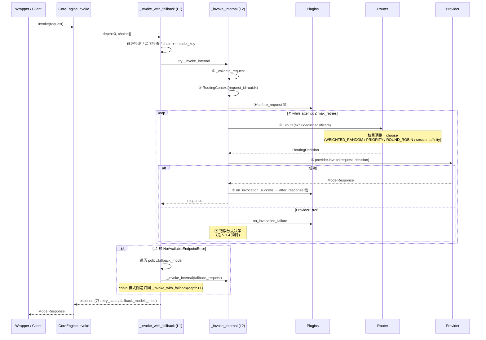

# Plaud Model Hub 完全指南

> 📂 **对应源码**：`/Users/liangzhu/Documents/work/plaud-model-hub`
> 本文档无法直接回答的细节，可直接到该源码目录查阅（关键路径见第十七章）。

---

## 目录

1. [项目定位](#一项目定位)（含核心问题与解决方案详解）
2. [整体架构](#二整体架构)（含 Passthrough 透传架构详解）
3. [使用方式](#三使用方式)
4. [配置系统](#四配置系统)
5. [CoreEngine 核心引擎](#五coreengine-核心引擎)
6. [路由策略](#六路由策略)
7. [插件系统](#七插件系统)
8. [Fallback 降级机制](#八fallback-降级机制)
9. [Provider 适配层](#九provider-适配层)（含 Adapter 跨风格路由）
10. [Wrapper 实现原理](#十wrapper-实现原理)
11. [数据模型速查](#十一数据模型速查)（含错误体系、追踪、EngineConfig）
12. [CLI 工具集](#十二cli-工具集)
13. [配置最佳实践](#十三配置最佳实践)
14. [常见问题](#十四常见问题)
15. [快速查询表](#十五快速查询表)
16. [设计模式与架构决策](#十六设计模式与架构决策)
17. [关键文件速查](#十七关键文件速查)

---

## 一、项目定位

Model Hub 是 Plaud AI Platform 的 **统一大模型调用基础设施层**。

**核心理念：**

> 业务方只需关心 `app_id` + `logical_model`，供应商 Key、路由策略、熔断降级全部由 Model Hub 内部管理。

### 1.1 Model Hub 解决了什么问题

Model Hub 解决的不是"怎么调 API"的问题，而是——**当你有多个模型供应商、多个 API 入口时，如何让业务代码不关心这些复杂性**。

下面通过 6 个具体场景来说明。

---

#### 场景一：多 Provider 碎片化 —— 各业务各管各的

**没有 Model Hub 时的痛点：**

Summary 服务用 OpenAI，Transcription 用 Anthropic，翻译用 Google Gemini。每个团队各自管理 API Key、用不同的 SDK、写不同的错误处理逻辑：

```python
# summary 服务 —— 用 OpenAI
import openai
client = openai.OpenAI(api_key="sk-xxx")
response = client.chat.completions.create(model="gpt-4o", ...)

# transcription 服务 —— 用 Anthropic
import anthropic
client = anthropic.Anthropic(api_key="sk-ant-xxx")
response = client.messages.create(model="claude-3-haiku", ...)
```

想换模型？改代码 → 改 SDK → 改错误处理 → 发版。一次切换影响全链路。

**Model Hub 怎么解决：统一抽象层**

所有业务方只需要一个 client，传 `logical_model` 名字：

```python
from model_hub_sdk import ModelHubClient

client = ModelHubClient(app_id="summary")
response = client.chat(model="gpt-4.1", messages=[...])
```

底层是 OpenAI、Anthropic 还是 Google，业务方完全不关心。切换模型 **只需改 YAML 配置，不用改代码、不用发版**。

---

#### 场景二：同一模型多个 Endpoint —— 负载均衡与高可用

**痛点**：为了可用性和成本优化，公司同时购买了 OpenAI 直连和 Azure OpenAI 的 GPT-4o 服务。但业务代码只调一个 URL，无法利用两个入口做负载均衡。

**Model Hub 怎么解决：一个 Logical Model → 多个 Endpoint**

这是 Model Hub **最核心的抽象**——Logical Model（逻辑模型）与 Endpoint（物理入口）的分离：

```yaml
models:
  summary:gpt-4.1:
    endpoints:
    - provider: openai          # OpenAI 直连，权重 60%
      model: gpt-4o-mini
      weight: 60
      priority: 10
    - provider: azure           # Azure OpenAI，权重 40%
      model: gpt-4o-mini
      weight: 40
      priority: 5
```

业务方调用 `model="gpt-4.1"` 时，Router 根据策略自动选择走哪个 endpoint：


| 策略           | 行为                               | 适用场景   |
| ------------ | -------------------------------- | ------ |
| **加权随机**（默认） | 按权重概率分配，60% 走 OpenAI，40% 走 Azure | 日常负载均衡 |
| **轮询**       | 依次轮流，均匀分配                        | 严格均分流量 |
| **优先级**      | 优先用高优先级的 endpoint，同级内加权随机        | 主备模式   |


还支持 **会话粘性**（Session Affinity）：同一个 `session_id` 的请求始终路由到同一个 endpoint（基于一致性哈希），适合多轮对话场景。

**三层关系总结**：

```
Logical Model "gpt-4.1"            ← 业务方只认这个名字
├── Endpoint: OpenAI GPT-4o-mini   ← 具体的 API 入口
│   └── Provider: openai           ← 底层 SDK 类型
└── Endpoint: Azure GPT-4o-mini
    └── Provider: azure_openai
```

- **Logical Model**（逻辑模型）：业务方的调用入口，如 `"gpt-4.1"`、`"claude-3"`
- **Endpoint**（端点）：一个具体的 API 入口 = Provider + Model + 凭证 + 配置
- **Provider**（供应商）：底层 SDK 类型（openai、anthropic、genai 等）

一个 Logical Model 可以有多个 Endpoint，一个 Provider 可以被多个 Endpoint 引用。

> 详见 [六、路由策略](#六路由策略)

---

#### 场景三：调用失败的容错机制 —— 单次救援 + Endpoint 健康管理

**痛点**：Provider 调用会以各种方式失败——429 限流、5xx 宕机、发送过快、某个 endpoint 持续不健康。这些问题看似零散，其实可以按**作用时机**统一归纳为两个互补层次：

- **层 1：单次请求救援**（事后）——这一次调用失败了，怎么把它救回来
- **层 2：Endpoint 健康管理**（事前 + 状态维护）——基于历史统计，决定后续请求要不要走这个 endpoint

层 1 关心"这一次"，层 2 关心"长期趋势"。两层互相喂数据，共同保证系统韧性。

---

##### 层 1：单次请求救援 —— 三级救援链

目标：让一次失败的调用最终成功。三级按递进关系串联：

```
请求 → Endpoint A
  ├─ 成功 → 返回
  └─ 失败 →
      ├─ ① Retry 退避重试（同 endpoint）
      │    └─ 仍然失败 ↓
      ├─ ② Failover 故障转移（换 endpoint）
      │    └─ 所有 endpoint 都失败 ↓
      └─ ③ Fallback 跨模型降级（换 logical model）
```

**① Retry 退避重试**

CoreEngine 按错误类型采用不同策略：


| 错误类型          | 策略                                       | 原因               |
| ------------- | ---------------------------------------- | ---------------- |
| **429 限流**    | 先在同 endpoint 退避重试 → 再失败后 failover        | 限流可能只是暂时的，退避一下就好 |
| **5xx 服务端错误** | 直接 failover 到其他 endpoint，不在原 endpoint 重试 | 服务端出问题，换个入口更有效   |


退避算法：**指数退避 + 随机抖动**。优先读取服务端返回的 `Retry-After` 头，没有则 `backoff_factor × 2^attempt`，再叠加随机抖动避免"惊群效应"。

**② Failover 故障转移**

退避仍失败后，Router 把当前 endpoint 加入 `tried_endpoints` 排除集合，从剩余可用 endpoint 中重新选择——在同一个 logical model 的多个 endpoint 间切换。

**③ Fallback 跨模型降级**

当一个 logical model 的**所有 endpoint 都耗尽**（抛出 `NoAvailableEndpointError`）时才触发，切换到另一个 logical model：

```yaml
policies:
  summary:gpt-4.1:
    fallback_model: "summary:claude-3"   # GPT-4o 全挂 → 降级到 Claude
  summary:claude-3:
    fallback_model: "summary:gpt-4.1"    # Claude 全挂 → 降级到 GPT-4o
```

降级流程：

```
请求 model="gpt-4.1"
├── Endpoint A (OpenAI GPT-4o) → 失败
├── Endpoint B (Azure GPT-4o)  → 失败
├── 所有 endpoint 耗尽 → NoAvailableEndpointError
│
└── 触发 Fallback → 切到 model="claude-3"
    ├── Endpoint C (Anthropic Haiku) → 成功
    └── 返回结果（Response 附带 fallback 统计）
```

防护机制：

- **循环检测**：A fallback 到 B，B 又 fallback 到 A → 自动终止，防无限递归（**仅 Chain 模式**）
- **深度限制**：默认最多降级 3 层（`max_fallback_depth` 可配置，**仅 Chain 模式生效**）
- **列表模式**：`fallback_model` 支持配置为列表，按顺序逐个尝试（List 模式不受深度限制）

> 详见 [五、CoreEngine 核心引擎](#五coreengine-核心引擎) 和 [八、Fallback 降级机制](#八fallback-降级机制)

---

##### 层 2：Endpoint 健康管理 —— 三种信号各司其职

目标：基于历史统计识别不健康的 endpoint，避免流量浪费在已知有问题的节点上。三种机制**按错误类型分工**：


| 机制                  | 应对错误         | 响应方式     | 粒度      |
| ------------------- | ------------ | -------- | ------- |
| **Rate Limiter**    | 429 限流       | 标记不可用/控速 | 二值 / 控频 |
| **Adaptive Weight** | 429 频发       | 渐进降权     | 连续      |
| **Circuit Breaker** | 非 429（5xx 等） | 完全熔断     | 二值      |


**Rate Limiter 限流器（两层防护）**

解决的问题是**怎么防止自己把 Provider 打爆**：

- **主动层（令牌桶）**：桶容量 + 补充速率控制发送速率。例如容量 50 + 每秒补 10 个——允许 50 个突发，长期钳制在 10 次/秒。无令牌时 Router 直接跳过该 endpoint，请求根本不发出去
- **被动层（429 解析）**：解析服务端 `Retry-After` 头（缺省时默认 60s），标记 `is_limited=True`。限流期内 Router 排除 endpoint，过期自动恢复

一句话：**令牌桶是预防（控制自己别发太快），429 解析是治疗（对方说太快了就听话等着）**。

> ⚠️ **以上描述是限流器的默认行为**。启用自适应权重插件后，`soft_limit_on_429=true` 联动会**关闭被动层的"硬排除"那一步**——限流器收到 429 时**不再**标记 `is_limited=True`，Router 不排除 endpoint，由 AW 按错误率渐进降权接管。但限流器仍负责把 `Retry-After`（或兜底窗口 60s）写入 `quota.retry_after_seconds`，供 Engine 单次重试退避使用。详见 §7.5「Retry-After 的两个独立用途」与 §7.6「soft_limit_on_429 联动」。
>
> ⚠️ 此外，**主动层（令牌桶）当前未接入引擎**，配置无实际效果——详见 §7.5「实现状态速查」。

**Adaptive Weight 自适应权重（专治 429 频发）**

限流器对 429 的处理是**二值的**——要么可用，要么完全不可用。在多 endpoint 配置下容易"连锁失败"：

```
gemini(w=60) : gpt(w=30) : claude(w=10)
       ↓ gemini 429 被限流器标记为不可用
0% : 75% : 25%          # 流量突然全部涌向 gpt 和 claude
       ↓ gpt/claude 也扛不住 → 也 429
       ↓ 三个都不可用 → NoAvailableEndpointError → 业务中断
```

自适应权重改为**按滑动窗口 429 频率渐进降权**：

```
gemini(w=60) : gpt(w=30) : claude(w=10)          # 正常 6:3:1
       ↓ gemini 429 增多（error_rate=20%）
gemini(w=42) : gpt(w=30) : claude(w=10)          # 自动降权
       ↓ gemini 429 持续（error_rate=60%+）
gemini(w=6)  : gpt(w=30) : claude(w=10)          # 大幅降权但保留探测流量
       ↓ gemini 恢复正常（旧记录滑出窗口）
gemini(w=60) : gpt(w=30) : claude(w=10)          # 自动回升
```

核心保证：**即使所有 endpoint 都在 429，权重降到下限仍保留最低探测流量，不会 NoAvailableEndpointError**。

**典型场景 GSU + PayGo**：Vertex AI 两种计费模式（GSU 便宜但容量有限 / PayGo 贵但充足）共用同一 logical model。没有自适应权重时 GSU 一限流 PayGo 瞬间承担 100% 流量，成本飙升还可能连锁 429；有自适应权重后流量按实时错误率渐进转移，给 PayGo 缓冲时间。

**Circuit Breaker 熔断器（专治持续高错误率）**

某个 endpoint 非 429 错误率持续过高时（如 50% 的请求返回 5xx），每次调用都要等它超时再 failover 就是浪费。熔断器自动识别并完全排除：

```
CLOSED（正常放行）
  ↓ 滑动窗口（60s）内失败率 > 50% 且调用次数 ≥ 5 次
OPEN（熔断中 —— Router 直接跳过此 endpoint）
  ↓ 30 秒后自动进入
HALF_OPEN（探测中 —— 放少量请求试探）
  ├── 连续成功 3 次 → 回到 CLOSED
  └── 出现失败 → 回到 OPEN
```

endpoint 恢复后，半开探测自动将其重新纳入。

**三者协同口诀**：

```
429            → 自适应权重降权（渐进）
5xx            → 熔断器熔断（二值）
发送速率过快    → 限流器令牌桶（主动预防）

推荐：exclude_429_from_circuit_breaker=true + soft_limit_on_429=true
避免三者对 429 重复动手造成双重惩罚
```

> 详见 [七、插件系统](#七插件系统)

---

##### 两层如何配合：一次完整失败的处理路径

```
请求进来
  │
  ├─ ① 选 Endpoint（层 2 干活）
  │    ├─ 熔断器 / 限流器：排除不可用 endpoint
  │    └─ 自适应权重：调整剩余 endpoint 权重
  │
  ├─ ② 发请求前（层 2 继续）
  │    └─ 令牌桶判断是否放行
  │
  ├─ ③ 请求结果
  │    ├─ 成功 → 统计回写层 2（刷新滑动窗口）→ 返回
  │    └─ 失败 → 层 1 接手
  │         ├─ 429 → 退避重试 or failover
  │         ├─ 5xx → failover
  │         └─ 不论成败都回写层 2 统计
  │
  └─ ④ 当前模型所有 endpoint 耗尽
       └─ 层 1 触发 Fallback → 换 logical model → 递归回到 ①
```

**关键理念**：层 1 是"事后救火"，层 2 是"事前预防 + 状态记忆"。层 1 的每次成功/失败会更新层 2 的滑动窗口，层 2 的健康判断又影响层 1 后续的 endpoint 选择——两层构成闭环。

---

#### 场景四：不想改代码 —— 原生 SDK 透传

**痛点**：团队已经用 OpenAI SDK 写了大量业务代码，不可能全部改成 Model Hub 的统一 API。

**Model Hub 怎么解决：Wrapper 透传模式（Passthrough）**

只需加一行 `wrap_openai()`，其余代码完全不变：

```python
# 改动前 —— 原生 OpenAI SDK
from openai import OpenAI
client = OpenAI()

# 改动后 —— 加一行包装，其余不变
from model_hub_sdk.wrappers import wrap_openai
client = wrap_openai(app_id="summary", config_store=...)

# 用法和原生完全一样，返回的也是原生 ChatCompletion 对象
response = client.chat.completions.create(
    model="gpt-4.1",
    messages=[{"role": "user", "content": "Hello"}],
    temperature=0.7,
)
```

底层：你的参数**原封不动**透传给 Provider（零转换），返回的也是原生响应对象，但中间自动获得了路由、重试、熔断、降级、可观测性等全部能力。

如果路由到了不同风格的 Provider（比如你写 OpenAI 风格但路由到了 Anthropic），Adapter 层会自动做双向格式转换，对业务方完全透明。

> 详见 [2.1 Passthrough 架构](#21-passthrough-架构为什么需要它) 和 [十、Wrapper 实现原理](#十wrapper-实现原理)

---

### 1.2 整体关系图

```
┌──────────── 你的业务代码 ─────────────┐
│  client.chat(model="gpt-4.1", ...)  │
└──────────────────┬──────────────────┘
                   │
         ┌─────────▼─────────┐
         │   Logical Model   │  ← 逻辑模型：业务方只认这个名字
         │   "gpt-4.1"       │
         └─────────┬─────────┘
                   │
         ┌─────────▼──────────────────────────┐
         │              Router                │
         │  加权随机 / 轮询 / 优先级 / 会话粘性   │
         └───┬──────────┬──────────┬──────────┘
             │          │          │
      ┌──────▼───┐ ┌────▼─────┐ ┌──▼─────────┐
      │ Endpoint │ │ Endpoint │ │ Endpoint   │
      │ OpenAI   │ │ Azure    │ │ Anthropic  │  ← 跨模型 Fallback
      │ GPT-4o   │ │ GPT-4o   │ │ Claude 3   │
      └──────────┘ └──────────┘ └────────────┘
             │          │          │
         ┌───▼──────────▼──────────▼───┐
         │       容错机制（自动）         │
         │  重试 → Failover → Fallback  │
         │  熔断器 → 限流器              │
         └─────────────────────────────┘
```

### 1.3 问题-方案速查


| 问题                        | Model Hub 的解决方案                         | 对应机制                  |
| ------------------------- | --------------------------------------- | --------------------- |
| 多个 Provider，各自 SDK/Key 分散 | 统一 client，只传 logical_model              | Provider 抽象层          |
| 同一模型多个 API 入口             | 一个 logical model 配多个 endpoint           | Router 路由策略           |
| 某个 endpoint 限流/宕机         | 自动退避重试 + failover 到其他 endpoint          | CoreEngine 重试机制       |
| 所有 endpoint 都挂了           | 自动降级到其他模型                               | Fallback 降级链          |
| 某个 endpoint 持续高错误率        | 熔断器自动跳过，恢复后自动纳入                         | Circuit Breaker 插件    |
| 发送速率过快 / Provider 返回 429  | 令牌桶预防 + 429 解析被动响应，双层防护                 | Rate Limiter 插件       |
| 429 频发导致多 endpoint 连锁失败   | 按错误率渐进降权，流量平滑转移，保证不 NoAvailableEndpoint | Adaptive Weight 插件    |
| 不想改已有代码                   | wrap_openai() 一行改动，透传模式                 | Wrapper + Passthrough |
| 缺少统一可观测性                  | Langfuse（成本追踪）+ OpenTelemetry（指标/追踪）    | 插件系统                  |
| 换模型要改代码发版                 | 只改 YAML 配置，代码零改动                        | 配置与代码分离               |


---

## 二、整体架构

```
┌─────────────────────────────────────────────────────────────┐
│                         业务层                               │
│  SDK Wrapper (OpenAI/Anthropic/GenAI)                       │
│  ModelHubClient (统一 API)                                   │
│  LangChain Integration (ChatModelHub/EmbeddingsModelHub)    │
└──────────────────────────┬──────────────────────────────────┘
                           │
┌──────────────────────────▼──────────────────────────────────┐
│                      CoreEngine                             │
│  ┌──────────┐  ┌──────────┐  ┌────────────────────────┐     │
│  │  Router  │  │ Plugin   │  │ Fallback / Retry       │     │
│  │ 路由策略  │  │ Chain    │  │ 降级 / 重试 / 退避       │     │
│  └──────────┘  └──────────┘  └────────────────────────┘     │
└──────────────────────────┬──────────────────────────────────┘
                           │
┌──────────────────────────▼──────────────────────────────────┐
│                    Provider 适配层                           │
│  OpenAI │ Anthropic │ GenAI │ Azure │ Bedrock │ Volcengine  │
│  DashScope │ Vertex AI                                      │
└──────────────────────────┬──────────────────────────────────┘
                           │
┌──────────────────────────▼──────────────────────────────────┐
│                      配置层                                  │
│  FileConfigStore (YAML/JSON)  │  AppConfigConfigStore (AWS) │
└─────────────────────────────────────────────────────────────┘
```

**Monorepo 结构：**


| 包                | 路径                     | 职责                 |
| ---------------- | ---------------------- | ------------------ |
| `model-hub-core` | `packages/core/`       | 核心引擎，零硬依赖          |
| `model-hub-sdk`  | `packages/sdk-python/` | Python SDK，依赖 core |


**包依赖规则（严格执行）**：

```
Core → 不依赖 SDK 和 Transport
SDK  → 依赖 Core
Services → 依赖 Core，不依赖 SDK
```

### 2.1 Passthrough 架构：为什么需要它？

📍 `core/models.py:30` PassthroughMode | `core/providers/base.py:176` ModelProvider

先理解一个核心矛盾：

> Model Hub 的核心价值是**统一**调用——所有厂商用一套 API。但业务方习惯用原生 SDK（如 `openai.ChatCompletion.create()`），不想改代码。

如果把"统一"做到底，就需要把用户传入的 OpenAI 原生参数，**先转成** Model Hub 内部格式（ModelRequest），再**转回**厂商格式发请求，拿到响应后**再转成** Model Hub 格式，**再转回** OpenAI 格式还给用户。这就是 4 次数据转换，Wrapper 代码量巨大（~7,800 行），而且一些厂商独有参数在中间格式里没对应字段，就丢了。

**Passthrough 的核心思想**：既然用户传的就是 OpenAI 格式，最终也要调 OpenAI 的 API——那 Model Hub 拿到参数后，**不转换**，直接透传给底层 SDK，只在中间做路由、重试、熔断这些"附加能力"就行了。

这就是 **Passthrough Mode**（透传模式）。

### 2.2 三种调用模式

Model Hub 通过一个枚举值区分三种模式：

```python
class PassthroughMode(str, Enum):
    DISABLED = "disabled"       # 统一模式
    SAME_STYLE = "same_style"   # 同风格透传
    CROSS_STYLE = "cross_style" # 跨风格透传
```

#### 模式 1：统一模式（DISABLED）—— 后端代码直接调用

**场景**：后端代码不用任何厂商 SDK，直接调用 `ModelHubClient.chat()`。

```python
client = ModelHubClient(app_id="summary")
response = client.chat(model="gpt-4", messages=[...])
```

**数据流**：

```
你的代码
  → ModelRequest(messages=[...], temperature=0.7)
  → CoreEngine（路由、重试、熔断）
  → Provider：
      转换1：ModelRequest → OpenAI SDK 参数
      调用：openai.chat.completions.create(...)
      转换2：OpenAI 响应 → ModelResponse
  → 你拿到 ModelResponse
```

**特点**：需要 2 次转换，但你用的是 Model Hub 的统一 API，代码不绑定任何厂商。

#### 模式 2：同风格透传（SAME_STYLE）—— 原生 SDK + 零转换

**场景**：你用 `wrap_openai()` 包装，写法和原生 OpenAI SDK 完全一样，但底层路由到的也是 OpenAI 兼容的 endpoint。

```python
client = wrap_openai(app_id="summary", config_store=...)
response = client.chat.completions.create(model="gpt-4", messages=[...])
```

**数据流**：

```
你的代码（OpenAI 风格参数）
  → Wrapper 打包：ModelRequest(raw_request=你的原始参数, source_style="openai")
  → CoreEngine（路由、重试、熔断 —— 不动你的参数）
  → Provider 发现：source_style == 自己的风格
      不转换！直接：openai.chat.completions.create(**你的原始参数)
      响应也不转换：raw_response = 原生响应
  → Wrapper 拆包：return response.raw_response
  → 你拿到的就是原生 OpenAI ChatCompletion 对象
```

**特点**：**零转换**。你的参数原封不动地送到 API，响应也原封不动地还给你。所有厂商独有参数都不会丢失。Wrapper 代码极少（~600 行 vs 之前 ~7,800 行）。

**哪些 Provider 属于"同风格"**：Azure OpenAI、火山引擎、DashScope 都兼容 OpenAI API，所以用 `wrap_openai()` 路由到这些 endpoint 时也是零转换。

#### 模式 3：跨风格透传（CROSS_STYLE）—— 你写 OpenAI 风格，路由到 Anthropic

**场景**：你用 `wrap_openai()` 写代码，但配置里同时有 OpenAI 和 Anthropic 的 endpoint。当 OpenAI 的 endpoint 全部不可用时，流量自动转移到 Anthropic。

```yaml
models:
  summary:smart:
    endpoints:
      - provider: openai       # priority: 10
        model: gpt-4o
      - provider: anthropic    # priority: 5（备选）
        model: claude-sonnet-4
```

**数据流**：

```
你的代码（OpenAI 风格参数）
  → Wrapper 打包：ModelRequest(raw_request=你的原始参数, source_style="openai")
  → CoreEngine（路由到 Anthropic endpoint）
  → Provider 发现：source_style="openai" ≠ 自己的风格 "anthropic"
      需要适配！调用 Adapter：
      转换1：OpenAI 参数 → Anthropic 参数（如提取 system 消息为独立参数）
      调用：anthropic.messages.create(**适配后的参数)
      转换2：Anthropic 响应 → OpenAI 格式响应
  → Wrapper 拆包：return response.raw_response
  → 你拿到的仍然是 OpenAI ChatCompletion 格式！
```

**特点**：你的代码完全不需要改——写的是 OpenAI 风格，但可以透明地路由到任何厂商。Adapter 层负责双向格式转换。

### 2.3 三种模式对比


| 对比项        | 统一模式                 | 同风格透传              | 跨风格透传              |
| ---------- | -------------------- | ------------------ | ------------------ |
| **谁用**     | 后端代码（ModelHubClient） | SDK Wrapper（同厂商路由） | SDK Wrapper（跨厂商路由） |
| **代码风格**   | Model Hub 统一 API     | 原生 SDK 风格          | 原生 SDK 风格          |
| **数据转换**   | 2 次                  | **0 次**            | 2 次（Adapter 层）     |
| **厂商参数透传** | 有限（provider_params）  | **完整**             | 经 Adapter 适配       |
| **自动选择**   | 手动指定                 | Wrapper 自动判断       | Wrapper 自动判断       |


> 用户不需要手动选模式。`wrap_openai()` 会自动设置 `passthrough_mode`；路由到同风格 endpoint 时自动走 SAME_STYLE，路由到异风格 endpoint 时自动走 CROSS_STYLE。

### 2.4 这套设计的精妙之处

**所有基础设施在三种模式下完全复用**：

无论走哪种模式，CoreEngine 的路由、重试、熔断、限流、插件链都照常工作——它们只关心 endpoint 选择和错误处理，不关心请求参数的具体格式。这意味着：

- Router 不需要改——它只看 logical_model 和 endpoint 列表
- CircuitBreaker 不需要改——它只看 endpoint_id 和成功/失败
- Plugins 自动适配——通过 `request.is_passthrough` 判断该读 `messages` 还是 `raw_request`

**Provider 内部通过三个私有方法分派**（📍 `core/providers/base.py:176` ModelProvider）：

```python
class ModelProvider:
    def invoke(self, request, decision):
        if not request.is_passthrough:
            return self._invoke_unified(request, decision)      # 统一模式
        elif request.source_style == self.api_style:
            return self._invoke_passthrough(request, decision)  # 同风格：零转换
        else:
            return self._invoke_adapted(request, decision)      # 跨风格：Adapter 转换
```

### 2.5 ModelRequest/ModelResponse 中的 Passthrough 字段

**ModelRequest 增加了 4 个字段**来支持透传（📍 `core/models.py:189` ModelRequest）：

```python
passthrough_mode: PassthroughMode   # 哪种模式
source_style: str | None            # 用户侧风格："openai" / "anthropic" / "genai"
raw_request: dict | None            # 用户传的原始参数（原封不动）
raw_method: str | None              # 原始方法路径，如 "chat.completions.create"
```

**ModelResponse 增加了 2 个字段**（📍 `core/models.py:368` ModelResponse）：

```python
raw_response: Any | None            # 厂商返回的原生响应对象
raw_error: Exception | None         # 厂商抛出的原生异常
```

**插件如何适配**：

```python
class ObservabilityPlugin(Plugin):
    def before_request(self, request, context):
        if request.is_passthrough:
            self.log_input(request.raw_request)   # 透传模式：记录原始参数
        else:
            self.log_input(request.messages)       # 统一模式：记录 messages
```

---

## 三、使用方式

### 3.1 SDK Wrapper（推荐，迁移成本最低）

📍 `sdk/wrappers/openai/factory.py:49` wrap_openai | `sdk/wrappers/openai/wrapper.py:114` WrappedOpenAI

```python
from model_hub_sdk import wrap_openai
from model_hub_sdk.config import FileConfigStore

client = wrap_openai(
    app_id="summary",
    config_store=FileConfigStore("./config.yaml"),
)

# 与原生 OpenAI SDK 完全相同的 API
response = client.chat.completions.create(
    model="gpt-4",
    messages=[{"role": "user", "content": "Hello!"}]
)
```

**原理：** 拦截原生 SDK 方法调用 → 转 ModelRequest → CoreEngine 路由 → 转回原生响应格式

支持：`wrap_openai` / `wrap_async_openai` / `wrap_anthropic` / `wrap_async_anthropic` / `wrap_genai` / `wrap_async_genai`

**Async 支持**（📍 `sdk/wrappers/openai/factory.py:88` wrap_async_openai | `sdk/wrappers/_async_utils.py:16`）：

```python
from model_hub_sdk import wrap_async_openai

client = wrap_async_openai(app_id="summary", config_store=FileConfigStore("./config.yaml"))

# 异步调用
response = await client.chat.completions.create(
    model="gpt-4", messages=[...],
)

# 异步流式
stream = await client.chat.completions.create(
    model="gpt-4", messages=[...], stream=True,
)
async for chunk in stream:
    print(chunk.choices[0].delta.content, end="")
```

> 实现原理：`_async_utils.py` 中 `run_sync_in_thread` 将同步 CoreEngine 调用放入线程池，`sync_iterator_to_async` 通过 asyncio.Queue 将同步迭代器转为异步迭代器。

### 3.2 ModelHubClient（统一 API）

📍 `sdk/client/hub_client.py:90` ModelHubClient | `:168` chat | `:262` embed | `:559` get_openai_client

支持 9 种请求类型，每种有专用响应类型：

```python
from model_hub_sdk import ModelHubClient

client = ModelHubClient(app_id="summary", env="prod")

# Chat（对话补全）
response = client.chat(model="gpt-4.1", messages=[...])

# Embedding（向量嵌入）
embeddings = client.embed(model="text-embedding-3-small", input=["Hello"])

# Image Generation（图像生成）
images = client.generate_image(model="dall-e-3", prompt="A sunset")

# Transcription（语音转文字）
text = client.transcribe(model="whisper-1", audio_file=open("audio.mp3", "rb"))

# Speech / TTS（文字转语音）
audio = client.speak(model="tts-1", input="Hello world")

# Moderation（内容审核）
result = client.moderate(model="text-moderation-latest", input="some text")
```

**完整请求类型**：


| 请求类型             | 方法                        | 说明    |
| ---------------- | ------------------------- | ----- |
| CHAT             | `client.chat()`           | 对话补全  |
| EMBEDDING        | `client.embed()`          | 向量嵌入  |
| IMAGE_GENERATION | `client.generate_image()` | 图像生成  |
| IMAGE_EDIT       | —                         | 图像编辑  |
| IMAGE_VARIATION  | —                         | 图像变体  |
| TRANSCRIPTION    | `client.transcribe()`     | 语音转文字 |
| TRANSLATION      | —                         | 语音翻译  |
| SPEECH           | `client.speak()`          | 文字转语音 |
| MODERATION       | `client.moderate()`       | 内容审核  |


### 3.3 LangChain 集成

📍 `sdk/integrations/langchain/chat_model.py:58` ChatModelHub | `sdk/integrations/langchain/embeddings.py:28` EmbeddingsModelHub

```python
from model_hub_sdk.integrations.langchain import ChatModelHub, EmbeddingsModelHub

llm = ChatModelHub(app_id="ai-agent", model="gpt-4.1")
result = llm.invoke("Hello, world!")

# 支持 Tool Binding
llm_with_tools = llm.bind_tools([my_tool])

# 支持 Embedding
embeddings = EmbeddingsModelHub(app_id="ai-agent", model="text-embedding-3-small")
```

### 3.4 获取原生 Client

```python
client = ModelHubClient(app_id="summary", config_store=FileConfigStore("./config.yaml"))
openai_client = client.get_openai_client(model="gpt-4.1")
# 注意：不经过 CoreEngine，不享受路由/重试/熔断能力
```

---

## 四、配置系统

### 4.1 v2 配置格式（推荐）

📍 `core/config/parser.py:30` ConfigParser | `core/config/models.py:123` ProviderConfig | `:64` RoutePolicy

```yaml
config_schema: v2
version: 1
env: dev

# ① Provider 预设（定义一次，多处引用）
providers:
  litellm:
    provider: openai
    base_url: https://litellm.example.com/v1
    api_key: ${LITELLM_API_KEY}
    defaults:
      timeout_ms: 30000

  anthropic:
    provider: anthropic
    api_key: ${ANTHROPIC_API_KEY}

# ② 模型配置（3 种格式，见 4.4）
models:
  ai-demo:gpt-4: litellm/gpt-4-turbo

  ai-demo:gpt-4-ha:
    endpoints:
      - provider: litellm
        model: gpt-4-turbo
        weight: 70
      - provider: openai
        model: gpt-4-turbo
        weight: 30

# ③ 路由策略
policies:
  default:
    strategy: weighted_random
  summary:claude-sonnet:
    strategy: priority
    fallback_model: summary:gpt-4

# ④ 插件
plugins:
  langfuse:
    enabled: true
  circuit_breaker:
    enabled: true
```

**环境变量支持**：

- `${LITELLM_API_KEY}` — 从环境变量读取
- `${LANGFUSE_HOST:-https://cloud.langfuse.com}` — 未设置时用默认值

### 4.2 Key 格式

```
{app_id}:{logical_model}
```

例如：`project-summary:gemini-2.5-pro`

### 4.3 支持的 Provider


| Provider      | 类型标识           | 必填                             |
| ------------- | -------------- | ------------------------------ |
| OpenAI        | `openai`       | api_key                        |
| Azure OpenAI  | `azure_openai` | api_key, base_url, api_version |
| Anthropic     | `anthropic`    | api_key                        |
| Google GenAI  | `genai`        | api_key                        |
| Vertex AI     | `vertex_ai`    | project_id, location           |
| 火山引擎          | `volcengine`   | api_key                        |
| 阿里云 DashScope | `dashscope`    | api_key                        |
| AWS Bedrock   | `bedrock`      | region                         |


### 4.4 三种模型配置格式

#### 字符串格式（最简洁）

```yaml
models:
  # 格式: "provider_preset/physical_model[@version]"
  project-summary:gemini-2.5-pro: vertex/gemini-2.5-pro
  project-summary:qwen3-max: qwen/qwen3-max
```

#### 简化对象格式（单 endpoint，自定义参数）

```yaml
models:
  project-summary:gpt-4o-custom:
    provider: litellm
    model: gpt-4o-2024-11-20
    weight: 80
    enabled: true
    timeout_ms: 60000
    max_retries: 3
    priority: 10
```

#### 完整格式（多 endpoint）

```yaml
models:
  project-summary:gemini:
    endpoints:
      - provider: vertex
        model: gemini-2.5-pro
        weight: 30
        enabled: true
        timeout_ms: 30000
        priority: 10

      - provider: vertex
        model: gemini-3.1-pro-preview
        weight: 50
        enabled: true
        timeout_ms: 30000
        priority: 20

      - provider: vertex
        model: gemini-3-flash-preview
        weight: 20
        enabled: true
        timeout_ms: 20000
        priority: 5
```

### 4.5 Endpoint 完整字段

```yaml
endpoints:
  - id: ep-primary                # [可选] Endpoint ID，不指定则自动生成
    provider: azure-east          # [必填] Provider 预设名或类型
    model: gpt-4o                 # [必填] 物理模型名
    base_url: https://...         # [可选] 基础 URL（覆盖预设）
    credential_ref: cred-azure    # [可选] 凭证引用
    weight: 60                    # [可选] 路由权重，默认 100
    enabled: true                 # [可选] 是否启用，默认 true
    priority: 10                  # [可选] 优先级（PRIORITY 策略用）
    region: us-east               # [可选] 区域标识
    timeout_ms: 30000             # [可选] 超时（毫秒）
    max_retries: 2                # [可选] 最大重试次数
    request_types:                # [可选] 支持的请求类型
      - chat
      - embedding
    extra: {}                     # [可选] 厂商特定配置
```

### 4.6 多 Endpoint 应用场景

#### 场景 1：负载均衡（不同版本）

```yaml
models:
  ai-demo:gpt-4o-balanced:
    endpoints:
      - provider: openai
        model: gpt-4o-2024-11-20  # 新版本
        weight: 60                # 60% 流量
      - provider: openai
        model: gpt-4o-mini        # 旧版本
        weight: 40                # 40% 流量
```

**效果**：灰度发布，既验证新版本，又降低成本

#### 场景 2：多区域容灾

```yaml
models:
  project-summary:gemini-global:
    endpoints:
      - provider: vertex-us       # 美国区（低延迟）
        model: gemini-2.5-pro
        weight: 50
        region: us
        priority: 10
      - provider: vertex-eu       # 欧盟区（备选）
        model: gemini-2.5-pro
        weight: 30
        region: eu
        priority: 5
      - provider: openrouter      # 公网 fallback
        model: "google/gemini-2.0-flash"
        weight: 20
        region: global
        priority: 1
```

**效果**：优先用美国区（低延迟）→ 美国区故障自动转移到欧盟区 → 都故障使用 OpenRouter

#### 场景 3：成本优化（混合厂商）

```yaml
models:
  project-summary:summary-cheap:
    endpoints:
      - provider: openrouter
        model: "tngtech/deepseek-r1t2-chimera:free"
        weight: 50
      - provider: openrouter
        model: "kwaipilot/kat-coder-pro:free"
        weight: 30
      - provider: litellm
        model: gpt-4o-mini
        weight: 20
```

**效果**：优先用免费模型，配额用完再用付费的

#### 场景 4：多版本灰度

```yaml
models:
  ai-demo:gpt-4o-canary:
    endpoints:
      - provider: openai
        model: gpt-4o-2024-12-20  # 金丝雀
        weight: 10                # 10% 流量
      - provider: openai
        model: gpt-4o-2024-11-20  # 稳定版
        weight: 90                # 90% 流量
```

### 4.7 配置属性优先级

```
endpoint.extra > credential.extra > provider.defaults > 代码默认值
```

### 4.8 Provider 级别硬禁用

Provider 支持 `enabled: false` 一键禁用，会硬关闭该 provider 下**所有** endpoint，无论 endpoint 自身是否 `enabled: true`：

```yaml
providers:
  deprecated-provider:
    provider: openai
    enabled: false          # 硬禁用：所有使用该 provider 的 endpoint 立即不可用
    base_url: https://old-api.example.com/v1
    api_key: ${OLD_API_KEY}
```

适用于生产环境紧急下线某个供应商，无需逐个修改 endpoint 配置。

### 4.9 v2 Inline 凭证

v2 格式支持将 `api_key` 等凭证直接写在 provider 块内，解析器自动生成 `CredentialConfig`（ref 为 `provider-{name}`），无需单独的 `credentials` 区块：

```yaml
# v2 Inline（推荐，减少 ~80% 配置样板）
providers:
  my-openai:
    provider: openai
    api_key: ${OPENAI_API_KEY}      # 直接内联
    base_url: https://api.openai.com/v1

# 等价于 v1 的分离写法：
# credentials:
#   cred-openai:
#     api_key: ${OPENAI_API_KEY}
# providers:
#   my-openai:
#     provider: openai
#     credential_ref: cred-openai
```

非保留字段（如 `api_version`、`service_account_json`、`project_id`）会自动收集到 `extra` 字典中。

### 4.10 配置校验

📍 `core/config/parser.py:30` ConfigParser

配置解析包含 **两层校验**：


| 层级            | 检查内容                                                  | 时机  |
| ------------- | ----------------------------------------------------- | --- |
| **Schema 校验** | YAML 结构、字段类型、必填项                                      | 解析时 |
| **业务规则校验**    | 凭证引用存在性、fallback 模型存在性、endpoint ID 唯一性、循环 fallback 检测 | 解析后 |


可用 CLI 工具 `config-validator` 在部署前预检（见第十二章）。

### 4.11 ConfigStore 配置存储后端

📍 `core/config/store.py:12` ConfigStore | `sdk/config/file.py:20` FileConfigStore | `sdk/config/appconfig.py:21` AppConfigConfigStore


| 后端            | 类                          | 说明                         |
| ------------- | -------------------------- | -------------------------- |
| 本地文件          | `FileConfigStore`          | 读取本地 YAML/JSON，适合开发和单机部署   |
| AWS AppConfig | `AppConfigConfigStore`     | 从 AWS AppConfig 拉取，支持轮询热加载 |
| 数据库           | `DBConfigStore`（Service 层） | 集中式配置管理（服务端实现）             |


**AWS AppConfig 热加载**：

```python
from model_hub_sdk.config import AppConfigConfigStore

config_store = AppConfigConfigStore(
    application="plaud-model-hub",
    environment="prod",
    configuration_profile="default",
)

# 轮询刷新（零停机更新）
config_store.refresh()  # 调用 get_latest_configuration，有变更时自动更新
```

工作流程：`start_configuration_session()` → 周期性 `get_latest_configuration()` → 有更新时自动替换内存中的配置对象。

### 4.12 完整配置骨架（全字段速查）

📍 实例参考：`plaud-model-hub/examples/config-complete.yaml` | `plaud-model-hub/schemas/modelhub-config.schema.json`

**原理**：v2 配置由 3 个必备元字段 + 4 个核心顶层块（`providers` / `models` / `policies` / `plugins`）+ 1 个 v1 兼容块（`credentials`）组成。`providers` 定义"用什么连"，`models` 定义"暴露成什么"，`policies` 定义"怎么挑/降级"，`plugins` 定义"怎么观测和保护"。

#### 顶层骨架

```yaml
# ────── 必备元信息 ──────
config_schema: v2          # [可选] 格式版本：v1 / v2，默认 v1
version: 1                 # [必填] 配置版本号，热加载时按此判断更新
env: dev                   # [必填] 环境：dev / staging / prod

# ────── Provider 预设：定义"用什么连" ──────
providers:                 # [可选] v2 才有；v1 改用 endpoint.base_url + credentials
  <name>:                  # 预设名（被 endpoint.provider 引用）
    provider: openai       # 厂商类型（openai / anthropic / vertex_ai / ...）
    base_url: ...
    api_key: ${...}
    enabled: true          # 硬开关，false 时屏蔽该预设下所有 endpoint
    defaults: { ... }      # endpoint 默认值（被 endpoint 同名字段覆盖）

# ────── 逻辑模型：暴露给业务方的入口 ──────
models:                    # [必填] key 格式 {app_id}:{logical_model}
  <app>:<model>: <preset>/<physical_model>[@<version>]   # ① 字符串格式
  <app>:<model>: { provider, model, weight, ... }        # ② 简化对象
  <app>:<model>: { endpoints: [ {...}, {...} ] }         # ③ 完整格式

# ────── 路由策略：多 endpoint 时怎么挑 ──────
policies:                  # [可选] key 与 models 同名；缺省时继承 default
  default: { strategy, enable_session_affinity }
  <app>:<model>: { strategy, fallback_model, ... }

# ────── 凭证（v1 兼容） ──────
credentials:               # [可选] v2 已被 provider.api_key 内联取代
  <ref>: { ref, api_key, extra }

# ────── 可观测性 & 容错插件 ──────
plugins:                   # [可选] 缺省时用各插件代码默认值
  langfuse: { enabled, public_key, secret_key, host }
  otel: { enabled, service_name }
  circuit_breaker: { enabled, failure_threshold, min_calls, window_size_seconds, ... }
  rate_limit: { enabled, bucket_capacity, refill_rate, respect_retry_after, ... }
```

#### 顶层字段表

| 字段              | 必填 | 类型   | 说明                                                          |
| --------------- | -- | ---- | ----------------------------------------------------------- |
| `config_schema` | 否  | str  | `v1` 或 `v2`；省略默认 `v1`                                       |
| `version`       | 是  | int  | ≥ 1；配置变更后递增，ConfigStore 据此触发热加载                             |
| `env`           | 是  | str  | `dev` / `staging` / `prod`；同一文件可承载多套环境，SDK 端按 env 过滤         |
| `providers`     | 否  | dict | v2 预设映射；v1 用 endpoint.base_url + credentials 替代              |
| `models`        | 是  | dict | 逻辑模型映射，key = `{app_id}:{logical_model}`                     |
| `policies`      | 否  | dict | 路由策略映射，key 与 models 对应；可定义 `default` 兜底                     |
| `credentials`   | 否  | dict | v1 凭证映射；v2 推荐内联到 provider                                   |
| `plugins`       | 否  | dict | 插件配置（langfuse / otel / circuit_breaker / rate_limit）        |

#### Provider 预设完整字段

```yaml
providers:
  azure-eastus:                    # 预设名（任意标识，供 endpoint.provider 引用）
    provider: azure_openai         # [必填] 厂商类型，见 4.3 表
    base_url: https://...          # [可选] API 基础 URL（部分厂商必填）
    api_key: ${AZURE_KEY}          # [可选] 内联凭证（v2 推荐）
    credential_ref: cred-azure     # [可选] v1 兼容；指向 credentials.<ref>
    enabled: true                  # [可选] 硬开关；false 时该预设下所有 endpoint 失效，默认 true
    defaults:                      # [可选] endpoint 默认值（endpoint 显式字段优先）
      weight: 100
      enabled: true
      priority: 0
      timeout_ms: 30000
      max_retries: 2
    # 非保留字段会被自动收集进 extra：
    api_version: "2024-02-15-preview"     # → extra.api_version
    project_id: my-gcp-project            # → extra.project_id（vertex_ai）
    service_account_json: ${SA_JSON}      # → extra.service_account_json
    access_key: ${AWS_AK}                 # → extra.access_key（bedrock）
    secret_key: ${AWS_SK}                 # → extra.secret_key
    region: us-east-1                     # → extra.region
```

| 字段               | 必填   | 类型   | 说明                                                                                                       |
| ---------------- | ---- | ---- | -------------------------------------------------------------------------------------------------------- |
| `provider`       | 是    | str  | `openai` / `azure_openai` / `anthropic` / `genai` / `vertex_ai` / `volcengine` / `dashscope` / `bedrock` |
| `base_url`       | 视厂商  | str  | OpenAI 兼容代理、Azure 必填；Anthropic / GenAI 用官方默认可省                                                           |
| `api_key`        | 视厂商  | str  | 支持 `${VAR}` 与 `${VAR:-default}` 环境变量语法                                                                   |
| `credential_ref` | 否    | str  | v1 兼容；v2 内联 `api_key` 后无需此字段                                                                             |
| `enabled`        | 否    | bool | 硬开关，优先级最高（详见 4.7）                                                                                        |
| `defaults`       | 否    | dict | endpoint 默认值；支持 `weight` / `enabled` / `priority` / `timeout_ms` / `max_retries`                         |
| 其他键              | 否    | any  | 非保留字段自动收集进 `extra`，透传给 Provider 适配器                                                                      |

> **保留字段**（不会进 `extra`）：`provider`、`base_url`、`api_key`、`credential_ref`、`defaults`、`extra`、`enabled`。

#### Policy 完整字段

```yaml
policies:
  default:                                      # 全局兜底；未匹配 key 的模型继承此项
    strategy: WEIGHTED_RANDOM                   # [可选] 路由策略
    enable_session_affinity: true               # [可选] 会话粘性，默认 true

  ai-demo:claude-opus-4-5:                      # key 必须与 models 同名
    fallback_model: ai-demo:claude-sonnet-4-5   # [可选] 全 endpoint 耗尽时的降级目标
    # 也可写成 list 模式（不受 max_fallback_depth 限制）：
    # fallback_model:
    #   - ai-demo:claude-sonnet-4-5
    #   - ai-demo:gemini-2.5-flash
```

| 字段                        | 必填 | 类型           | 默认值               | 说明                                                                  |
| ------------------------- | -- | ------------ | ----------------- | ------------------------------------------------------------------- |
| `strategy`                | 否  | str          | `WEIGHTED_RANDOM` | `WEIGHTED_RANDOM` / `ROUND_ROBIN` / `PRIORITY`（大小写均接受）              |
| `enable_session_affinity` | 否  | bool         | `true`            | 同 `session_id` 一致性哈希到同 endpoint，多轮对话场景必开                            |
| `fallback_model`          | 否  | str \| list  | —                 | 单值走 Chain 模式（含循环检测、`max_fallback_depth=3`）；列表走 List 模式逐个尝试         |

#### Plugins 完整字段

```yaml
plugins:
  langfuse:                                     # LLM 追踪（开发推荐）
    enabled: true
    public_key: ${LANGFUSE_PUBLIC_KEY}
    secret_key: ${LANGFUSE_SECRET_KEY}
    host: ${LANGFUSE_HOST:-https://cloud.langfuse.com}

  otel:                                         # OpenTelemetry（生产推荐）
    enabled: false                              # 与 langfuse 互斥，避免重复埋点
    service_name: model-hub-sdk

  circuit_breaker:                              # 熔断器（建议常开）
    enabled: true
    failure_threshold: 0.5                      # 窗口内失败率阈值
    min_calls: 5                                # 触发统计的最小调用数
    window_size_seconds: 60                     # 滑动窗口大小
    open_duration_seconds: 30                   # OPEN → HALF_OPEN 等待时长
    half_open_max_calls: 3                      # 半开探测放行数

  rate_limit:                                   # 限流器（建议常开）
    enabled: true
    enable_token_bucket: true                   # ⚠️ 当前版本未接入 Engine（见 §7.5）
    bucket_capacity: 10
    refill_rate: 1.0
    respect_retry_after: true                   # 429 解析服务端 Retry-After 头
    max_retry_after_seconds: 300.0              # Retry-After 上限截断
    default_retry_after_seconds: 60.0           # 无 Retry-After 时兜底窗口
    exclude_429_from_circuit_breaker: true      # 防止限流误熔断
```

| 插件                | 关键字段                                                                                                                    | 默认行为                       |
| ----------------- | ----------------------------------------------------------------------------------------------------------------------- | -------------------------- |
| `langfuse`        | `enabled` / `public_key` / `secret_key` / `host`                                                                        | 启用，凭证从环境变量读取               |
| `otel`            | `enabled` / `service_name`                                                                                              | 启用，service 名 `model-hub-sdk` |
| `circuit_breaker` | `failure_threshold=0.5` / `min_calls=5` / `window_size_seconds=60` / `open_duration_seconds=30` / `half_open_max_calls=3` | 启用，5 次以上调用且失败率 > 50% 触发熔断 |
| `rate_limit`      | `bucket_capacity=10` / `refill_rate=1.0` / `respect_retry_after=true` / `default_retry_after_seconds=60`                | 启用，遵守服务端 Retry-After，兜底 60s |

#### 凭证（v1 兼容）

```yaml
credentials:
  cred-openai:
    ref: cred-openai                # [必填] 与 endpoint.credential_ref 对应
    api_key: ${OPENAI_API_KEY}      # [必填]
    extra:                          # [可选] AK/SK、SA JSON 等非 api_key 凭证写这里
      access_key: ${AWS_AK}
      secret_key: ${AWS_SK}
```

> v2 推荐直接把 `api_key` / `access_key` 等写到 `providers.<name>` 内联，解析器会自动生成 `ref=provider-<name>` 的 `CredentialConfig`，无需单独 `credentials` 区块。

#### 速用速查（按"想改什么 → 改哪一行"）

| 想做的事                    | 改哪里                                                       |
| ----------------------- | --------------------------------------------------------- |
| 新增一个供应商账号               | `providers.<name>` 增加预设                                   |
| 新增一个业务可见的模型名            | `models.<app>:<model>` 用字符串 / 简化 / 完整格式之一                 |
| 让一个模型多 endpoint 容灾      | `models.<app>:<model>.endpoints` 用列表                      |
| 改单 endpoint 的超时/重试      | endpoint 块内 `timeout_ms` / `max_retries`                  |
| 改一组 endpoint 的默认超时/重试   | `providers.<name>.defaults`                               |
| 紧急下线一个供应商账号             | `providers.<name>.enabled: false`                         |
| 给一个模型配跨模型降级             | `policies.<app>:<model>.fallback_model`                   |
| 全局开关熔断 / 限流 / 追踪        | `plugins.<plugin>.enabled`                                |
| 调路由权重                   | endpoint 内 `weight`（仅 `WEIGHTED_RANDOM` 生效）               |
| 主备切换                    | `policies.*.strategy: PRIORITY` + endpoint 内 `priority`   |

---

## 五、CoreEngine 核心引擎

📍 `core/engine.py:108` CoreEngine | `:58` EngineConfig

### 5.1 请求完整生命周期

#### 5.1.1 原理：三层嵌套循环 + 七个阶段

整个请求生命周期 = **三层嵌套循环**驱动**七个串行阶段**。一句话本质：

> 同一请求按 `(fallback_model 链 → endpoint 池 → 同 endpoint 退避)` 三层依次降级；每一次实际打到 Provider 的 HTTP 调用都包在统一的"前置插件 → 路由 → 调用 → 后置插件"七段管道里。

| 层 | 函数 | 循环对象 | 退出条件 | 失败抛出 |
| --- | --- | --- | --- | --- |
| L1 跨模型 fallback | `_invoke_with_fallback` 📍 `engine.py:208` | `policy.fallback_model` 列表 | 任一 model 成功 | `NoAvailableEndpointError`（含原因链） |
| L2 单模型 failover | `_invoke_internal` 📍 `engine.py:333` while attempt | `tried_endpoints` 之外的剩余 endpoint | 任一 endpoint 成功 / `attempt > max_retries` | `NoAvailableEndpointError`（all endpoints exhausted） |
| L3 同 endpoint 退避 | `_invoke_internal` 内 429 分支 📍 `engine.py:451` | `rate_limit_retried[endpoint_id]`（每 endpoint 至多 1 次退避） | 第二次 429 / 5xx / 成功 | 上抛到 L2 推进 attempt |

> L1 是**递归**（链式 fallback `policy.fallback_is_chain=True` 时复用同函数 +1 depth）；L2 是 **`while`**；L3 是 **L2 的同 attempt 内 `continue`**——退避不消耗 attempt 预算。

#### 5.1.2 七阶段管道（每次 L2 循环执行一遍）

每个 attempt 对应**一次完整的 7 阶段执行**。状态变量在 attempt 间持续累积；管道内部按下表严格串行：

| 阶段 | 名称 | 关键动作 | 失败行为 | 代码位置 |
| --- | --- | --- | --- | --- |
| ① | 入参验证 | 按 `passthrough_mode` / `request_type` 校验必填字段（CHAT→messages、EMBEDDING→input、PASSTHROUGH→raw_request+raw_method+source_style 等） | 抛 `ConfigError`，**不进入循环**，无重试 | `_validate_request` 📍 `:1668` |
| ② | 上下文构建 | 若 `context is None`：从 request 派生 `RoutingContext(app_id, env, region, session_id, request_id=uuid4)`；否则补 `request_id` | — | `:354-364` |
| ③ | `before_request` 插件链 | 顺序遍历 `self.plugins`，每个插件可改写 request；返回最后一个插件的输出 | 插件抛错 → 直接 `raise`（不走 fallback） | `:367-368` |
| ④ | 路由决策 | (1) 拉 `model_config`（按 request_type 过滤 endpoints）→ 若无 raise `NoAvailableEndpointError`<br>(2) 拉 `policy`<br>(3) 收集排除集 = 手动熔断 ∪ 各 `EndpointFilterProvider.get_unavailable_endpoints()` ∪ `tried_endpoints`<br>(4) 各 `WeightAdjustmentProvider.get_weight_multipliers()` 合并（降权取 min、加成取 max、降权优先）→ 复制 endpoints 改 weight<br>(5) `Router.choose(endpoints, policy, session_id, excluded)` 返回 `EndpointConfig`<br>(6) 取 credential、合并 timeout，构造 `RoutingDecision` | 排除后无可用 endpoint → `NoAvailableEndpointError` → 跳到 L1 fallback | `_route` 📍 `:1389` |
| ⑤ | Provider 调用 | `provider = registry.get(decision.provider)` → `provider.invoke(request, decision)` 走真正 HTTP | 抛 `ProviderError(status_code, response_headers)` 或其他异常 | `:390-393` |
| ⑥ | 成功收尾 | 计算 `latency_ms` → `_notify_invocation_success`（驱动熔断器/自适应权重的成功事件）→ 回填响应元数据（`logical_model / app_id / env / request_id / session_id / trace_id / latency_ms`）→ `retry_count > 0` 时挂 `retry_stats` → 顺序遍历 `after_response` 插件 → `return` | — | `:395-416` |
| ⑦ | 失败分支 | 见 5.1.4 决策矩阵；分类后或 `continue`（不耗 attempt）或 `attempt += 1`（消耗预算） | attempt 超限 → `_notify_retry_exhausted` + `on_error` 插件 → `NoAvailableEndpointError` 上抛 L1 | `:418-498`、`:500-512` |

> ⚠️ 阶段 ① 的 `ConfigError`、阶段 ③ 的非 `ProviderError` 异常都**绕过 fallback**——只有 `NoAvailableEndpointError`（L2 显式抛）才触发 L1 的 fallback 循环。`ProviderError` 不可重试时也会被 L2 转化为 `NoAvailableEndpointError`（先尝试本模型剩余 endpoint，全部不行再上抛）。

#### 5.1.3 完整时序图



#### 5.1.4 错误分支决策矩阵（阶段 ⑦ 唯一真相表）

📍 `engine.py:418-492`，按出现顺序判定，**先到先匹配**：

| 触发条件 | `is_retryable` | `attempt` 预算 | 是否 failover | 是否退避 sleep | 后续动作 |
| --- | --- | --- | --- | --- | --- |
| 4xx 不可重试 + 还有未 tried endpoint | False | ❌ 不增加 | ✅ 加入 `tried_endpoints` | ❌ | `continue`（同 attempt 换 endpoint） |
| 4xx 不可重试 + 无可用 endpoint | False | ❌ | — | ❌ | `on_error` 插件 → `NoAvailableEndpointError` 抛 L1 |
| 429 首次 + `_get_backoff_seconds` 返回秒数 | True | ❌ 不增加 | ❌ 同 endpoint | ✅ `time.sleep(backoff)` | `rate_limit_retried[ep]=1`，下轮重试同 ep |
| 429 首次 + 退避返回 None（`failover_immediately` 且无 Retry-After） | True | ✅ +1（隐式，循环末尾统一加） | ✅ | ❌ | 直接 failover |
| 429 再次（同 endpoint 已退避过） | True | ✅ +1 | ✅ | ❌ | failover |
| 5xx | True | ✅ +1 | ✅ | ❌（退避在下轮 ④→⑤ 之间不发生 sleep；下次 429 才会 sleep） | failover |
| 非 `ProviderError` 异常 | — | — | — | — | 立即 `on_error` 插件 → `raise`，**绕过 fallback** |
| `attempt > current_max_retries` | — | — | — | — | 退出 while → `NoAvailableEndpointError` 上抛 L1 |

**关键不变量**：
- `is_retryable = status_code == 429 or status_code >= 500`（📍 `errors.py:80`），4xx 全部不可重试。
- `should_circuit_break` 与 `is_retryable` 同义（📍 `errors.py:88`），4xx 业务错误不会污染熔断器。
- 4xx 路径**不消耗 attempt** 是有意设计——保证"所有 endpoint 都试过"才放弃，最大化覆盖；副作用是单 attempt 可能扫遍全部 endpoint。
- 429 首次退避在同 attempt 内 `continue`，所以同一 endpoint 最多被退避**一次**（`rate_limit_retried` per-endpoint 计数）。

#### 5.1.5 状态变量作用域矩阵

每层循环维护各自状态，跨层不共享。理解这张表 = 理解为什么 fallback / failover / 退避三种降级互不干扰：

| 变量 | 作用域 | 初始值 | 何时更新 | 跨 attempt 持续？ |
| --- | --- | --- | --- | --- |
| `fallback_chain: set[str]` | L1 递归参数 | `set()` | 每层 `chain | {model_key}`（**不可变**，新建 set） | ✅ 跨递归层 |
| `fallback_depth: int` | L1 递归参数 | `0` | 链式 fallback 时 `depth+1` | ✅ 跨递归层 |
| `fallback_models_tried: list[str]` | L1 累积 | `[]` | 每尝试一个 fb_model 就 append | ✅ 写入最终 `retry_stats` |
| `attempt: int` | L2 局部 | `0` | 仅 5xx/429 再次/`failover_immediately` 时 +1 | ✅ 同 model 内 |
| `current_max_retries: int` | L2 局部 | `engine_config.default_max_retries` | 每轮路由后被 `_get_max_retries(request, ep_id)` 覆盖（request > endpoint > default） | ✅ 但被下一轮覆盖 → 见 5.2.4 混写陷阱 |
| `tried_endpoints: set[str]` | L2 局部 | `set()` | 每次失败 `add(endpoint_id)` | ✅ 排除已坏 ep |
| `rate_limit_retried: dict[str, int]` | L2 局部 | `{}` | 429 首次退避时 `[ep]=1` | ✅ per-ep 计数 |
| `last_error: Exception` | L2 局部 | `None` | 每次 except 覆盖 | ✅ 用于异常上抛 |
| `retry_stats: RetryStats` | L2 局部 | 空 | 每次 `record_retry` | ✅ 写入响应 |
| `decision: RoutingDecision` | L2 局部 | `None` | 每次 `_route` 后覆盖 | ❌ 每轮重算 |
| `context.endpoint_id / context.attempt` | 跨层共享对象 | — | 每次 ④ 后写入 | ✅ 插件可读 |

> `fallback_chain` 故意做成**不可变**——每层递归 `chain | {model_key}` 新建 set，防止并发递归时父子互相污染（📍 `:244` `_invoke_with_fallback`）。

#### 5.1.6 进入与退出的精确边界

| 入参/前置条件 | 行为 |
| --- | --- |
| `request.app_id + request.logical_model` 在配置中找不到 | 阶段 ④ `model_config = None` → 直接 `NoAvailableEndpointError` → L1 尝试 fallback_model |
| `request.request_type` 与 endpoint 的 `request_types` 不匹配 | 配置层在 `get_model_config` 阶段过滤掉，等同上一行 |
| `request.max_retries` 显式传入 | 覆盖 endpoint 和 default，三级查找最高优先级 |
| `request.timeout_ms` 显式传入 | 覆盖 endpoint 和 default（📍 `_get_timeout_ms`） |
| `context` 由调用方传入 | 直接复用，仅在 `request_id is None` 时补 uuid（保留 trace_id / user_id 等观测字段） |
| `policy.fallback_model = []` 且全 endpoint 失败 | L1 没有可遍历对象 → 把 L2 抛出的 `NoAvailableEndpointError` 原样 `raise` |
| `policy.fallback_is_chain = False`（list 模式） | L1 直接 `_invoke_internal(fb_request)`，不递归，不增加 depth；无循环检测意义（每个 fb 都是叶子调用） |
| `policy.fallback_is_chain = True`（chain 模式） | L1 递归 `_invoke_with_fallback(..., depth+1)`，受 `max_fallback_depth=3` 与 `fallback_chain` 双重保护 |

| 出参/最终响应 | 携带信息 |
| --- | --- |
| 成功 `ModelResponse` | `logical_model / app_id / env / request_id / session_id / trace_id / latency_ms / endpoint_id（in usage）`；若有重试还携带 `retry_stats(retry_count, retried_endpoints, total_backoff_ms, status_codes)`；若走过 fallback 还含 `original_model / final_model / fallback_models_tried` |
| L2 抛 `NoAvailableEndpointError` | `reason="all endpoints exhausted after N attempts, last error: ..."`，`__cause__` 指向最后一次 `ProviderError` |
| L1 抛 `NoAvailableEndpointError` | `reason="circular fallback detected: ..."` 或 `"max fallback depth (3) exceeded"` 或最后一个 fb_model 的失败原因 |

#### 5.1.7 流式调用的生命周期差异

📍 `_invoke_stream_internal:600`、`_invoke_stream_with_fallback:547`

整体管道一致，差异集中在阶段 ⑤–⑥–⑦：

| 阶段 | 非流式 | 流式 |
| --- | --- | --- |
| ⑤ | `provider.invoke()` 一次性返回完整 `ModelResponse` | `provider.invoke_stream()` 仅返回 `Iterator[StreamChunk]`，**真实数据在迭代时才到达** |
| 重试边界 | 整个 ⑤ 调用包在 while 内 | **只有"获取迭代器"包在 while 内**（`stream = provider.invoke_stream(...)` 抛错可重试）；拿到迭代器即 `break` 跳出循环 |
| ⑥ | 立即填元数据→`after_response` 插件 | 边迭代边 yield；流尽后聚合（`id` 取首 chunk、`content` 拼接 delta、`usage` 取末 chunk）再调 `after_response` |
| ⑦ | 错误矩阵适用 | 已 yield 任何 chunk 后再失败 → **直接抛错，不可 fallback**（数据已发出，无法回收） |

异步路径 `ainvoke / ainvoke_stream / _ainvoke_internal` 完全镜像同步语义，仅把 `time.sleep` 替换为 `asyncio.sleep`、迭代器换为 `AsyncIterator`，状态机和阶段划分一致。

#### 5.1.8 一图速记

```
┌─────────────────────────────── L1: _invoke_with_fallback ───────────────────────────────┐
│  循环检测(chain) → 深度检查(≤3) → for fb in [primary, ...fallback_model]:                │
│                                                                                          │
│    ┌─────────────────────────── L2: _invoke_internal ──────────────────────────────┐    │
│    │  ① validate  ② build context  ③ before_request[*]                            │    │
│    │                                                                                │    │
│    │  while attempt ≤ current_max_retries:                                          │    │
│    │    ④ route = excluded ∪ tried → weight_adjust → router.choose                  │    │
│    │    ⑤ provider.invoke(request, route)                                           │    │
│    │       ├─ ✅ → ⑥ enrich → on_success → after_response[*] → return              │    │
│    │       └─ ❌ ProviderError →                                                    │    │
│    │              ┌──────────────── L3: 同 endpoint 退避 ─────────────────┐         │    │
│    │              │  429 首次 + Retry-After/指数 → sleep → continue        │         │    │
│    │              └────────────────────────────────────────────────────────┘         │    │
│    │           4xx → tried.add → continue (不耗 attempt)                            │    │
│    │           5xx / 429 再次 → tried.add → attempt += 1                            │    │
│    │  → 退出: NoAvailableEndpointError                                              │    │
│    └────────────────────────────────────────────────────────────────────────────────┘    │
│                                                                                          │
│  ↑ 捕获后尝试下一个 fb_model（chain 模式则 depth+1 递归回 L1）                          │
└──────────────────────────────────────────────────────────────────────────────────────────┘
```

### 5.2 重试与 Failover

#### 5.2.1 主循环：单 logical model 的尝试上限

📍 `core/engine.py:379` 主循环 | `:1601` `_get_max_retries`

`_invoke_internal` 单次调用就是一个 while 循环：

```python
current_max_retries = self.engine_config.default_max_retries   # 初始用 default

while attempt <= current_max_retries:
    decision = self._route(request, context, tried_endpoints)
    current_max_retries = self._get_max_retries(request, decision.endpoint_id)  # ★ 每轮覆盖
    # 调用 → 失败 → attempt += 1
```

**`current_max_retries` 是动态变量**，每轮被当前选中 endpoint 的查找结果重写。`max_retries=2` ⇒ attempt 取 0/1/2 ⇒ **最多 3 次"消耗预算"的尝试**。

#### 5.2.2 三级查找规则

`_get_max_retries` 三级 fallback，**没有 min/max 比较**：

| 优先级 | 来源                                | 备注              |
| --- | --------------------------------- | --------------- |
| 1   | `request.max_retries`             | 业务调用时显式传入       |
| 2   | `endpoint.max_retries`            | YAML 单 endpoint 覆盖 |
| 3   | `engine_config.default_max_retries` | 源码 dataclass 默认 = 2 |

> `default_max_retries` 不是上限，只是兜底。endpoint 写 5 就生效 5，写 0 就生效 0。

#### 5.2.3 attempt 消耗规则

| 错误类型              | 消耗 attempt | 行为                |
| ----------------- | ---------- | ----------------- |
| 4xx 不可重试          | ❌ 不增加      | failover 到其他 endpoint，**不耗预算** |
| 429 首次（同 endpoint 退避） | ❌ 不增加      | 退避后重试同 endpoint   |
| 429 再次            | ✅ +1       | failover          |
| 5xx               | ✅ +1       | failover          |

**例外**：`failover_immediately` 策略下，首次 429 直接 failover、消耗 attempt（详见 5.3）。

#### 5.2.4 endpoint `max_retries` 混写的坑

由于 `current_max_retries` 每轮被覆盖，**任何一个 endpoint 的低 `max_retries` 都会截断整个链**。

例：4 endpoint 配 `[gemini=3, gpt-5=0, gpt-4-1=2, o3=2]`，全部失败：

| attempt | while 检查（用上轮 bound） | 路由     | 更新后 bound |
| ------- | ----------------- | ------ | --------- |
| 0       | `0 <= 2`（default）✓ | gemini | 3         |
| 1       | `1 <= 3` ✓        | gpt-5  | **0**     |
| 2       | `2 <= 0` ✗        | —      | 直接退出      |

**gpt-4-1 / o3 永远试不到**——gpt-5 的 `max_retries=0` 把后续循环卡死。

> 第 0 轮 while 检查必然用 `default_max_retries`（还没路由），所以 default 至少决定"能不能进入第一次循环"。设负数会让 model 根本不调用。

#### 5.2.5 配置最佳实践

- **多 endpoint logical model**：要么所有 endpoint **都不写** `max_retries`（统一走 default），要么**全部写同一个值**。混写让总尝试次数随路由顺序浮动，不可预测。
- **单 endpoint logical model**：可以独立配，没有循环 bound 浮动问题。

#### 5.2.6 failover 的下一个 endpoint 怎么选

failover 后下一轮 `_route()` **排除已 tried 的 endpoint**，在剩余池里**按 `policies.strategy` 重新选**：

| `strategy`              | failover 行为                  |
| ----------------------- | ---------------------------- |
| `WEIGHTED_RANDOM`（默认）   | 剩余池按 weight 加权随机，**顺序不确定**   |
| `PRIORITY`              | 按 priority 降序逐个尝试，**确定的链式 failover** |
| `ROUND_ROBIN`           | 轮询，跳过 tried 取下一个             |

要让 failover 顺序固定，必须用 `PRIORITY`，并给每个 endpoint 配 `priority` 字段。

#### 5.2.7 退避公式

| 参数                      | 默认值                     | 说明      |
| ----------------------- | ----------------------- | ------- |
| `default_max_retries`   | 2                       | 兜底重试次数  |
| `retry_on_status_codes` | 408,409,429,500-504,529 | 可重试状态码  |
| `backoff_factor`        | 1.0                     | 退避基数    |
| `max_backoff_seconds`   | 10.0                    | 最大退避时间  |
| `jitter_factor`         | 0.25                    | 抖动 ±25% |

`backoff = factor × 2^attempt + jitter`，attempt=0 → ~1s，1 → ~2s，2 → ~4s（封顶 10s）。

#### 5.2.8 实战配方："summary:auto 链式 failover 2 次"

需求：gemini → gpt-5 → gpt-4-1，3 个 endpoint 各试一次。

**只配 YAML 不够，必须 YAML + 业务代码组合**：

```yaml
# 1. YAML：删掉所有 endpoint 的 max_retries，统一落 default
summary:auto:
  endpoints:
    - id: auto-gemini-2-5-pro    # 不写 max_retries
      weight: 66
    - id: auto-gpt-5             # 不写 max_retries
      weight: 34
    ...

# 2. （可选）固定 failover 顺序：把策略改成 PRIORITY，否则按权重随机选下一个
policies:
  summary:auto:
    strategy: PRIORITY
```

```python
# 3. 业务代码：注入 failover_immediately
engine_config = EngineConfig(
    rate_limit_backoff_strategy="failover_immediately",
    # default_max_retries=2,  # 默认就是 2
)
```

**为什么必须 `failover_immediately`**：默认策略下首次 429 会先在同 endpoint 退避（不消耗 attempt），第二次 429 才 failover。3 个 attempt 预算可能只跑 2 个不同 endpoint。`failover_immediately` 让首次 429 直接 failover，3 个 attempt 一一对应 3 个新 endpoint。

### 5.3 429 处理策略


| 策略                      | 行为                           |
| ----------------------- | ---------------------------- |
| `retry_after_first`（默认） | 优先用 Retry-After 头，无则指数退避     |
| `exponential_only`      | 忽略 Retry-After，始终指数退避        |
| `failover_immediately`  | 无 Retry-After 时立即切换 endpoint |


**处理流程：** 首次 429 → 同 endpoint 退避重试 → 再次 429 → failover → 全部 429 → fallback 模型

> ⚠️ **配置位置**：`rate_limit_backoff_strategy` 是 `EngineConfig` 字段，**只能在业务代码构造 SDK 时注入**，YAML 顶层无 `engine` 块解析它。**全局生效**，无 per-model 覆盖能力。要让单一 logical model 单独走某种策略，需改源码。

> ⚠️ **Provider 差异警告**：上表行为依赖"能否从响应**头**里读出 `Retry-After`"。Google Gemini / Vertex 的 429 响应**不返** `Retry-After` header（它把建议等待时长放在 body 的 `error.details[].retryDelay`，google.rpc.RetryInfo 风格），当前代码**只解析 header、不解析 body**，所以 Gemini 在三种策略下的实际表现：
>
> - `retry_after_first`（默认）→ 永远拿不到 → **退化为指数退避公式**
> - `exponential_only` → 本就走公式，行为一致
> - `failover_immediately` → 永远拿不到 → **永远立即 failover**（同一 endpoint 不会退避重试）
>
> 详见 §7.5「Provider 端如何把响应头送进来」末尾的 provider 差异表。

### 5.4 三层调用结构（深入）

CoreEngine 内部分为三个嵌套层次，各自职责清晰：

```
invoke()                          ← 公共入口        📍 engine.py:163
  └── _invoke_with_fallback()     ← 跨模型 fallback  📍 engine.py:203
        └── _invoke_internal()    ← 单模型重试        📍 engine.py:328
              └── provider.invoke()  ← 实际 API 调用
```

#### 第 1 层：invoke() → _invoke_with_fallback()

初始化 fallback 上下文（`fallback_chain=set()`, `fallback_depth=0`），调用第 2 层。

#### 第 2 层：_invoke_with_fallback()（📍 `engine.py:203`）

```python
def _invoke_with_fallback(request, context, fallback_chain, fallback_depth, ...):
    # 1. 循环检测：model_key = "app_id:logical_model"  📍 :229
    if model_key in fallback_chain:
        raise CircularFallbackError  # A→B→A 被阻止

    # 2. 深度限制
    if fallback_depth > max_fallback_depth:
        raise MaxFallbackDepthError

    # 3. 尝试当前模型
    try:
        return _invoke_internal(request, context)
    except NoAvailableEndpointError:
        # 4. 遍历 fallback 模型列表
        for fallback_model in policy.fallback_model:
            try:
                if policy.fallback_is_chain:
                    # Chain 模式：递归调用，depth+1
                    return _invoke_with_fallback(..., depth+1)
                else:
                    # List 模式：直接调用 _invoke_internal
                    return _invoke_internal(fallback_request, context)
            except NoAvailableEndpointError:
                continue  # 尝试下一个 fallback
        raise  # 全部失败
```

**注意**：`fallback_chain` 是不可变的（每层创建新 set），防止并发污染。

#### 第 3 层：_invoke_internal()（📍 `engine.py:328`，重试状态机）

```python
def _invoke_internal(request, context):
    tried_endpoints: set[str] = set()
    rate_limit_retried: dict[str, int] = {}  # 📍 :368 每 endpoint 的 429 重试计数

    # 构建 RoutingContext（如未提供）
    context.request_id = uuid4()

    # 插件 before_request
    for plugin in plugins:
        request = plugin.before_request(request, context)

    while attempt <= max_retries:                        # 📍 :374
        # 路由选择（排除 tried + 熔断 + 限流的 endpoint）
        decision = _route(request, excluded=tried_endpoints)

        try:
            response = provider.invoke(request, decision)
            # 成功 → 通知插件 → after_response → 返回
            return response

        except ProviderError as e:
            if not e.is_retryable:                       # 📍 :425
                # 4xx：不重试，但尝试其他 endpoint（不增加 attempt）
                tried_endpoints.add(endpoint_id)
                if 还有其他 endpoint:
                    continue  # ← 注意：attempt 不变！
                else:
                    raise NoAvailableEndpointError

            if e.status_code == 429:                     # 📍 :448
                count = rate_limit_retried.get(endpoint_id, 0)
                if count == 0:
                    # 首次 429：在同一 endpoint 退避重试
                    backoff = _get_backoff_seconds(...)
                    if backoff is None:
                        tried_endpoints.add(endpoint_id)  # failover
                    else:
                        sleep(backoff)
                        rate_limit_retried[endpoint_id] = 1
                        continue  # ← attempt 不变，重试同一 endpoint
                else:
                    # 再次 429：failover 到其他 endpoint
                    tried_endpoints.add(endpoint_id)
                    attempt += 1

            else:  # 5xx
                tried_endpoints.add(endpoint_id)
                attempt += 1

    raise NoAvailableEndpointError  # 重试耗尽
```

**关键细节**：

- **4xx 不增加 attempt**：最大化 endpoint 覆盖，所有 endpoint 都试过才放弃
- **429 首次退避不增加 attempt**：给同一 endpoint 第二次机会
- **429 计数是 per-endpoint 的**：`rate_limit_retried` dict 跟踪每个 endpoint 的 429 次数
- **超时优先级**：Request > Endpoint > EngineConfig（级联覆盖）

### 5.5 流式支持（Streaming）

📍 `core/engine.py:515` invoke_stream | `core/models.py:542` StreamChunk

CoreEngine 通过 `invoke_stream()` 提供全链路流式支持：

```python
# Wrapper 方式（最常用）
stream = client.chat.completions.create(
    model="gpt-4", messages=[...], stream=True,
)
for chunk in stream:
    print(chunk.choices[0].delta.content, end="")

# ModelHubClient 方式
for chunk in client.chat(model="gpt-4", messages=[...], stream=True):
    print(chunk)
```

**流式链路**：

```
invoke_stream(request)
  ├── 路由选择 + 插件链（与 invoke 相同）
  ├── Provider.invoke_stream() → Iterator[StreamChunk]
  └── 流式返回（逐 chunk 传递给调用方）
```

- 同步流式：`Provider.invoke_stream()` 返回 `Iterator[StreamChunk]`
- 异步流式：`_async_utils.sync_iterator_to_async` 通过 asyncio.Queue 将同步迭代器转为 `AsyncIterator`
- 所有插件钩子（before_request / after_response）在流式模式下仍然生效

**流式与非流式的关键差异**：

```
非流式：重试循环保护整个调用
  retry loop { provider.invoke() → 完整响应 }

流式：重试循环只保护流的初始化，不保护迭代
  retry loop { provider.invoke_stream() → 获得迭代器 } → break
  for chunk in iterator:  ← 这里出错无法重试！
      yield chunk
  aggregate → after_response
```

**流式中断处理**：


| 场景                          | 行为                                         |
| --------------------------- | ------------------------------------------ |
| 获取迭代器时失败                    | 正常重试/failover/fallback                     |
| 迭代中失败，**尚未** yield 任何 chunk | 抛出 NoAvailableEndpointError → 可触发 fallback |
| 迭代中失败，**已经** yield 了 chunk  | 直接抛错，**不可** fallback（无法回收已发出的数据）           |


**StreamChunk 聚合规则**（流式完成后构建 ModelResponse 用于 after_response 插件）：

- `id` = 第一个有效 chunk.id 或 request_id
- `choices[0].message.content` = 所有 chunk.delta 拼接
- `usage` = 最后一个 chunk 的 usage
- `latency_ms` = 整个流的持续时间

---

## 六、路由策略

📍 `core/router.py:24` Router | `:42` choose | `:112` _weighted_random | `:140` _round_robin | `:173` _priority | `:95` _get_affinity_endpoint

### 6.0 policies 配置详解

`policies` 和 `models` 是**分开的两个配置块**，通过相同的 key（格式 `app_id:logical_model`）关联：

- `models` 定义：这个逻辑模型**有哪些 endpoint**
- `policies` 定义：这些 endpoint 之间**怎么选**（路由策略、降级目标等）

```yaml
models:
  summary:gpt-4.1:                # ← 定义"有哪些 endpoint"
    endpoints:
      - provider: openai
        model: gpt-4o-mini
        weight: 60
      - provider: azure
        model: gpt-4o-mini
        weight: 40

policies:
  summary:gpt-4.1:                # ← 同名 key，定义"怎么在这些 endpoint 之间选"
    strategy: WEIGHTED_RANDOM
    fallback_model: "summary:claude-3"
```

当调用 `client.chat(model="gpt-4.1")` 时，Engine 拼出 key `"summary:gpt-4.1"` 去查 policies，找到对应的路由策略。

**default 策略与继承**：`default` 是特殊的基线策略，其他 policy 只需声明和 default **不同的字段**，其余自动继承：

```yaml
policies:
  default:                         # 所有模型的默认策略
    strategy: WEIGHTED_RANDOM
    enable_session_affinity: true

  summary:gpt-4.1:                 # 只写差异：加了 fallback
    fallback_model: "summary:claude-3"
    # strategy → 继承 WEIGHTED_RANDOM
    # enable_session_affinity → 继承 true

  summary:round-robin:             # 需要覆盖 strategy
    strategy: ROUND_ROBIN
    enable_session_affinity: false  # 也覆盖了 session_affinity
```

如果某个 model **没有对应的 policy 条目**，就直接用 default 的配置（默认 WEIGHTED_RANDOM + 开启会话粘性）。

### 6.1 WEIGHTED_RANDOM（默认）

```yaml
policies:
  default:
    strategy: WEIGHTED_RANDOM
    enable_session_affinity: true
```

**行为**：

```
第一个请求（session_id=abc）
  → 按权重随机选择 → 选中 endpoint-1

第二个请求（session_id=abc）
  → 粘性路由 → 仍用 endpoint-1（避免模型差异）

第三个请求（session_id=xyz）
  → 新 session → 重新按权重选择
```

**会话粘性（Session Affinity）：** 提供 session_id 时，MD5 一致性哈希确保同一 session 路由到同一 endpoint。适合多轮对话场景。

### 6.2 ROUND_ROBIN（轮询）

```yaml
policies:
  ai-demo:load-balanced:
    strategy: ROUND_ROBIN
    enable_session_affinity: false
```

```
第 1 个请求 → endpoint-1
第 2 个请求 → endpoint-2
第 3 个请求 → endpoint-3
第 4 个请求 → endpoint-1（循环）
```

线程安全计数器轮流分配，均匀分布请求，不考虑权重，适合无状态场景。

### 6.3 PRIORITY（优先级）

```yaml
models:
  ai-demo:priority-example:
    endpoints:
      - provider: azure-east
        model: gpt-4o
        priority: 10  # 最高优先级
      - provider: openai
        model: gpt-4o
        priority: 5   # 中等优先级
      - provider: litellm
        model: gpt-4o-mini
        priority: 1   # 最低优先级

policies:
  ai-demo:priority-example:
    strategy: PRIORITY
```

**行为**：Router 每次**只从最高优先级那一档**里选。低优先级的 endpoint 只有在高优先级的被排除后（调用失败、被熔断）才有机会被选中。

"降到下一优先级"不是 Router 主动做的，而是 Engine 的重试循环间接实现：

```
第 1 次尝试：
  Router 收到 [A(priority=10), B(priority=5), C(priority=1)]
  → 最高优先级 = 10 → 选中 A
  → A 调用失败 → A 加入 tried_endpoints（排除集合）

第 2 次尝试：
  Router 收到 [B(priority=5), C(priority=1)]         ← A 已被排除
  → 最高优先级变成 5 → 选中 B
  → B 调用失败 → B 加入 tried_endpoints

第 3 次尝试：
  Router 收到 [C(priority=1)]                         ← A、B 已被排除
  → 选中 C
```

### 6.4 weight vs priority 详解

**核心区别**：priority 决定**选哪一档**，weight 决定**同一档内的流量比例**。

不同策略下两个字段的作用：


|              | WEIGHTED_RANDOM | ROUND_ROBIN | PRIORITY      |
| ------------ | --------------- | ----------- | ------------- |
| **weight**   | 决定流量比例          | 忽略          | **仅在同优先级内生效** |
| **priority** | 忽略              | 忽略          | 决定选哪一档        |


**PRIORITY 策略下两者配合的例子**：

```yaml
summary:smart:
  endpoints:
  - provider: openai          # ┐
    model: gpt-4o             # │ 同优先级 100（第一档）
    weight: 70                # │ → 这档内 70% 流量走 OpenAI
    priority: 100             # │
  - provider: azure           # │
    model: gpt-4o             # │ → 这档内 30% 流量走 Azure
    weight: 30                # │
    priority: 100             # ┘
  - provider: openai          #
    model: gpt-3.5-turbo      # 优先级 10（第二档）
    priority: 10              # 正常情况永远不会被选中
```

- **正常情况**：所有请求在 priority=100 的两个 endpoint 间按 70:30 分配
- **当 priority=100 的两个都挂了**：才会降到 priority=10 的 gpt-3.5-turbo

对于 WEIGHTED_RANDOM 策略，priority 字段即使写了也会被忽略，所有 endpoint 按 weight 比例分流。

### 6.4 Endpoint 过滤机制

📍 `core/config/resolver.py:26` ConfigResolver

路由选择前，ConfigResolver 对 endpoint 进行两级过滤：


| 过滤类型                   | 行为                                | 说明                           |
| ---------------------- | --------------------------------- | ---------------------------- |
| **Region 过滤（软）**       | 优先匹配指定 region 的 endpoint；无匹配时返回全部 | 不会因 region 不匹配而报错            |
| **Request Type 过滤（硬）** | 仅返回声明支持该请求类型的 endpoint；无匹配返回 None | 会导致 NoAvailableEndpointError |


```yaml
endpoints:
  - provider: openai
    model: gpt-4o
    region: us-east
    request_types: [chat, embedding]    # 仅支持 chat 和 embedding

  - provider: openai
    model: dall-e-3
    region: us-east
    request_types: [image_generation]   # 仅支持图像生成
```

**完整路由决策流程**：

```
ModelRequest
  → Region 软过滤（按 request.region 筛选）
  → Request Type 硬过滤（按 request.request_type 筛选）
  → 排除不可用 endpoint（disabled / 熔断 / 限流中）
  → Session Affinity 检查（有 session_id 时一致性哈希）
  → 应用路由策略（WEIGHTED_RANDOM / ROUND_ROBIN / PRIORITY）
  → RoutingDecision
```

---

## 七、插件系统

📍 `core/plugins/base.py:13` Plugin | `:95` EndpointFilterProvider | `:114` InvocationLifecycleHook | `:155` RetryInfoProvider | `:183` RetryLifecycleHook

### 7.1 执行顺序与生命周期

**插件顺序**（order 越小越先执行）：


| 插件             | Order | 作用               |
| -------------- | ----- | ---------------- |
| AdaptiveWeight | 4     | 自适应权重调整（最先——调权重） |
| RateLimit      | 5     | 限流               |
| CircuitBreaker | 10    | 熔断               |
| OTel           | 10    | OpenTelemetry 追踪 |
| Langfuse       | 200   | LLM 专用追踪（最后）     |


**生命周期钩子**——定义了插件能在 Engine 执行流程的哪些节点上"插一脚"，分两层：

**第一层：基础钩子**（Plugin 基类自带，所有插件都有，**请求级**——一个请求只触发一次）：

```
before_request(request, context) → 请求发出前，可修改请求
    ↓
Provider 调用（可能含多次重试）
    ↓
after_response(request, response, context) → 成功后，可修改响应
    ↓
on_error(request, error, context) → 全部重试耗尽后的最终错误
```

**第二层：高级 Protocol 接口**（按需实现，**尝试级**——重试中的每次尝试都会触发）：


| 接口                         | 触发时机                     | 方法                                | 实现者           |
| -------------------------- | ------------------------ | --------------------------------- | ------------- |
| `EndpointFilterProvider`   | Router 选 endpoint **之前** | `get_unavailable_endpoints()`     | 熔断器、限流器       |
| `WeightAdjustmentProvider` | Router 选 endpoint **之前** | `get_weight_multipliers()`        | 自适应权重         |
| `InvocationLifecycleHook`  | 每次单独的 Provider 调用成功/失败后  | `on_invocation_success/failure()` | 熔断器、限流器、自适应权重 |
| `RetryInfoProvider`        | Engine 计算退避时间时           | `get_suggested_backoff()`         | 限流器           |
| `RetryLifecycleHook`       | 每次重试前 + 重试耗尽时            | `on_retry_attempt/exhausted()`    | 可观测性插件        |


Engine 在 `add_plugin()` 时通过 `isinstance` 检查插件实现了哪些 Protocol，缓存到对应列表，运行时只调用匹配的插件。

**完整请求流程中的钩子触发时序**：

```
请求进来
├─ Plugin.before_request()            ← 基础钩子（所有插件）
├─ EndpointFilterProvider             ← 熔断器/限流器排除不可用 endpoint
│   .get_unavailable_endpoints()
├─ WeightAdjustmentProvider           ← 自适应权重调整 endpoint 权重
│   .get_weight_multipliers()
├─ Router.choose() → 选中 Endpoint A
├─ 第 1 次尝试：调用 Provider
│   ├─ 成功 → InvocationLifecycleHook.on_invocation_success()
│   └─ 失败 → InvocationLifecycleHook.on_invocation_failure()
│            RetryInfoProvider.get_suggested_backoff()
│            RetryLifecycleHook.on_retry_attempt()
├─ 第 2 次尝试（failover 到 Endpoint B）→ 同上...
├─ 成功 → Plugin.after_response()     ← 基础钩子（所有插件）
└─ 全失败 → Plugin.on_error()         ← 基础钩子（所有插件）
           RetryLifecycleHook.on_retry_exhausted()
```

**各插件实现的接口一览**：


| 插件           | Plugin 基础钩子        | EndpointFilter              | WeightAdjustment         | InvocationLifecycle  | RetryInfo               | RetryLifecycle |
| ------------ | ------------------ | --------------------------- | ------------------------ | -------------------- | ----------------------- | -------------- |
| **自适应权重**    | -                  | -                           | `get_weight_multipliers` | `on_success/failure` | -                       | -              |
| **熔断器**      | before/after/error | `get_unavailable_endpoints` | -                        | `on_success/failure` | -                       | -              |
| **限流器**      | before/after/error | `get_unavailable_endpoints` | -                        | `on_success/failure` | `get_suggested_backoff` | -              |
| **Langfuse** | before/after/error | -                           | -                        | -                    | -                       | -              |
| **OTel**     | before/after/error | -                           | -                        | -                    | -                       | -              |


### 7.2 插件默认开启行为

**没有任何插件是"零配置默认开启"的**。YAML 里没有 `plugins` 区块时，不会加载任何插件。

但每个插件的 `enabled` 字段默认值为 `True`，所以**一旦在 YAML 中声明了某个插件块（哪怕是空的），它就会被开启**并使用默认参数：

```yaml
plugins:
  circuit_breaker:    # 只声明，不写任何参数 → enabled 默认 True，全部使用默认值
```

**激活条件汇总**：


| 插件              | 零配置默认开启？ | 声明后默认开启？ | 额外依赖？                                                        |
| --------------- | -------- | -------- | ------------------------------------------------------------ |
| Adaptive Weight | 否        | 是        | 无（core 内置）                                                   |
| Circuit Breaker | 否        | 是        | 无（core 内置）                                                   |
| Rate Limiter    | 否        | 是        | 无（core 内置）                                                   |
| Langfuse        | 否        | 是        | 需要 `pip install model-hub-sdk[langfuse]`，未安装则跳过并打 warning 日志 |
| OpenTelemetry   | 否        | 是        | 需要 `pip install model-hub-sdk[otel]`，未安装则跳过并打 warning 日志     |


📍 激活逻辑见 `sdk/plugins/factory.py`：对每个插件做**双重检查**——配置字段不为 None **且** `enabled == True` 才创建实例。

### 7.3 Langfuse（可观测性）

📍 `sdk/plugins/langfuse.py`

**用途**：LLM 调用的追踪、分析和调试

```yaml
plugins:
  langfuse:
    enabled: true
    public_key: ${LANGFUSE_PUBLIC_KEY:-}
    secret_key: ${LANGFUSE_SECRET_KEY:-}
    host: ${LANGFUSE_HOST:-https://cloud.langfuse.com}
```

**执行链路**：

- before_request → `start_generation(name, input, metadata)`
- after_response → `generation.update(output, usage, model, latency)` + `end()`
- on_error → `generation.update(level="ERROR")` + `end()`

**记录内容**：app_id, env, logical_model, endpoint_id, provider, latency_ms, token_usage, trace_id

### 7.3 OpenTelemetry（OTEL）

📍 `sdk/plugins/otel.py`

**用途**：分布式追踪和遥测（云原生标准）

```yaml
plugins:
  otel:
    enabled: false
    service_name: model-hub-sdk
```

标准 OpenTelemetry Span，属性命名空间：

- `modelhub.*`：Model Hub 自定义属性
- `gen_ai.*`：OpenAI 兼容标准属性

**Langfuse vs OTEL 对比**：


| 对比项         | Langfuse     | OTEL                 |
| ----------- | ------------ | -------------------- |
| **用途**      | LLM 专用追踪平台   | 云原生分布式追踪             |
| **学习曲线**    | 低（针对 LLM）    | 中等（通用）               |
| **与其他服务集成** | 有限           | 优秀（Jaeger、Datadog 等） |
| **开发体验**    | 优秀（LLM 友好UI） | 需额外工具可视化             |
| **推荐环境**    | 开发           | 生产                   |


> **注意**：Langfuse v3+ 基于 OpenTelemetry 实现。同时启用两者会导致追踪记录重复，建议二选一。

### 7.4 熔断器（Circuit Breaker）

📍 `core/plugins/circuit_breaker.py:50` CircuitBreakerPlugin

熔断器是故障隔离机制，防止故障传播和雪崩效应。

#### 状态机

```
CLOSED（正常）
  │ 失败率 > threshold 且 calls >= min_calls
  ▼
OPEN（熔断）
  │ 等待 open_duration_seconds
  ▼
HALF_OPEN（半开探测）
  │ 探测全部成功 → CLOSED
  │ 任一失败 → OPEN
```

#### 配置

```yaml
plugins:
  circuit_breaker:
    enabled: true
    failure_threshold: 0.5         # 失败率阈值（50%）
    min_calls: 5                   # 最小调用次数
    window_size_seconds: 60        # 滑动时间窗口（秒）
    open_duration_seconds: 30      # 熔断持续时间（秒）
    half_open_max_calls: 3         # 半开状态最多试探请求数
```

**实现细节**：

**滑动窗口**：每个 endpoint 维护一个 `deque[tuple[float, bool]]`（双端队列），存储 `(调用时间戳, 是否成功)`。每次记录前先从队头清理超过 `window_size_seconds` 的过期记录（`popleft`，O(1)），清理后队列里剩下的就是"最近 N 秒内的所有调用"，直接算失败率。用 deque 而非 list 是因为滑动窗口的操作模式是"队尾追加 + 队头删除"，deque 两端操作都是 O(1)。

**线程安全（RLock）**：多线程并发时可能同时读写 deque 和状态，需要加锁。用 RLock（可重入锁）而非普通 Lock，是因为存在同一线程内的嵌套调用链（如 `_record_failure` → `_check_threshold` → `_transition_to`），RLock 允许同一线程多次获取锁而不会死锁。

#### 工作场景

```
假设：min_calls=5, failure_threshold=0.5, window_size_seconds=60

0-10s   请求 1-5 全部失败（5/5 = 100% > 50%）
        ✓ 达到 min_calls  ✓ 超过阈值
        → 触发熔断 OPEN

10-40s  OPEN 状态（30 秒），所有请求立即拒绝

40s     进入 HALF_OPEN，允许最多 3 个探测请求

42s     探测全部成功 → 返回 CLOSED
```

#### 错误分类


| 类型     | 状态码                 | 参与熔断统计 |
| ------ | ------------------- | ------ |
| 可重试错误  | 408, 409, 429*, 5xx | 是      |
| 不可重试错误 | 400, 401, 403, 404  | 否      |


*429 通常被 `exclude_429_from_circuit_breaker` 排除

### 7.5 限流器（Rate Limiter）

📍 `core/plugins/rate_limit.py` RateLimitPlugin | `core/providers/rate_limit_parser.py` 响应头解析 | `core/engine.py:1502` `_get_excluded_endpoints` | `core/engine.py:1693` `_calculate_backoff`

每个 Provider 都有调用频率限制（如"每分钟最多 60 请求"），超了返回 429。

#### ⚠️ 实现状态速查（重要）

限流器源码里包含三个子功能，**接入引擎的程度不同**——下游使用方需要按这张表理解实际可用能力：


| 子功能                            | 状态         | 证据                                                                                |
| ------------------------------ | ---------- | --------------------------------------------------------------------------------- |
| **被动 429 标记排除**                | ✅ 完整可用     | `on_error → is_limited → get_unavailable_endpoints → engine._get_excluded_endpoints` 链路全通 |
| **Retry-After 解析 + 引擎退避**      | ✅ 完整可用     | 5 段链路：Provider → ProviderError → Parser → quota → `RetryInfoProvider` → Engine `_calculate_backoff` |
| **令牌桶（主动控速）**                  | ⚠️ 未接入引擎   | `TokenBucket` 类完整、配置可读、过滤路径已接入；但 `consume_token` 在生产代码 **0 次调用**——桶永远不被消费，"桶空 → 排除"判定无法触发 |
| **`X-RateLimit-*` 配额头解析**      | 🔍 仅观测     | 解析后存入 `quota.limit_*` / `remaining_*`，当前未参与路由决策                                    |


**配置项真实影响范围**（下游决策依据）：

- ✅ **真实有效**：`respect_retry_after`、`max_retry_after_seconds`、`default_retry_after_seconds`、`exclude_429_from_circuit_breaker`、`soft_limit_on_429`
- ⚠️ **当前无效**（设计意图，未接入引擎）：`enable_token_bucket`、`bucket_capacity`、`refill_rate`

下文按"是否真实生效"两级展开。

---

#### 第 1 层：被动限流（429 + Retry-After） —— ✅ 完整实现

撞了墙再停（Provider 返回 429 之后处理）。

```
请求发出 → Provider 返回 429（带 response_headers）
  → on_error() 捕获 429
  → _handle_rate_limit_error():
      1. quota.is_limited = True（除非 soft_limit_on_429=true）
      2. 解析 Retry-After 头 → 写入 quota.retry_after_seconds、limited_until
         （无 Retry-After → 用 default_retry_after_seconds，默认 60s）
  → 后续被两个独立路径消费（见 §"Retry-After 的两个用途"）
```

作用：避免对已限流的 endpoint **反复发请求**，在本地拦截而不是每次都挨一个 429；同时把服务端建议的退避时长喂给 Engine。

> ⚠️ **"无 Retry-After"在哪些 provider 上是常态**：解析器只看 HTTP header（`retry-after` / `Retry-After`），不读 body。**Google Gemini / Vertex 的 429 不返这个 header**，所以这条路径在 Gemini 上**永远走兜底分支**（`default_retry_after_seconds` 60s 固定窗口），服务端 body 里的 `retryDelay` 拿不到。OpenAI / Anthropic / Azure OpenAI 等返 header 的 provider 才能享受到精确退避。详见本节末的 provider 差异表。

#### 第 2 层：主动限流（令牌桶） —— ⚠️ 设计意图，未接入引擎

```
设计意图：
  发请求前 → 令牌桶 try_acquire()
    ├─ 有令牌 → 取走 1 个，请求放行
    └─ 无令牌 → endpoint 标记不可用 → Router 跳过

实际现状：
  • Engine 的 before_request hook 是 no-op（源注释："此时 endpoint 可能还未确定"）
  • endpoint 选定之后 Engine 没有调用 consume_token / try_acquire
  • _buckets 字典在生产路径上始终为空
  • bucket.available_tokens() < 1 判定永远不为真
```

> **下游使用方应对**：
> - 配置里显式写 `enable_token_bucket: false`，避免误以为它在工作
> - 主动控速的需求由"被动 429 + Retry-After 退避 + 自适应权重渐进降权"组合覆盖
>
> **如果团队需要让令牌桶生效**：需在 [`engine.py`](file:///Users/liangzhu/Documents/work/plaud-model-hub/packages/core/src/model_hub_core/engine.py) 的 endpoint 选定后、Provider 调用前补一个钩子调 `consume_token(endpoint_id)`，并设计请求失败时的令牌回补策略。属于代码改动，不是配置能解决的。

#### 配置（标注真实生效情况）

```yaml
plugins:
  rate_limit:
    enabled: true

    # === ⚠️ 主动限流（令牌桶）—— 当前未接入引擎，配置无副作用也无效果 ===
    enable_token_bucket: false        # 推荐显式 false，避免误以为它在工作
    # bucket_capacity: 10             # 当前不影响行为
    # refill_rate: 1.0                # 当前不影响行为

    # === ✅ 被动限流（429 + Retry-After）—— 完整生效 ===
    respect_retry_after: true         # 遵守服务端 Retry-After 头
    max_retry_after_seconds: 300.0    # 限制最大等待时长，防止单次卡死
    default_retry_after_seconds: 60.0 # 无 Retry-After 时的兜底窗口

    # === ✅ 与熔断器的交互 —— 完整生效 ===
    exclude_429_from_circuit_breaker: true   # 429 不计入熔断失败率

    # === ✅ 与自适应权重的联动 —— 完整生效 ===
    soft_limit_on_429: false          # 默认 false；启用 AW 时工厂层自动设为 true
                                      # true → 429 不再标记 endpoint 不可用，
                                      #        但 quota.retry_after_seconds 仍写入，
                                      #        Engine 仍按 Retry-After 退避

# 配套引擎策略（决定 Retry-After 怎么用）：
engine:
  rate_limit_backoff_strategy: retry_after_first   # 默认值，三选一见下文
  max_backoff_seconds: 60                           # 退避上限（含 Retry-After）
```

#### Retry-After 的两个独立用途

📍 [`rate_limit.py:407-442`](file:///Users/liangzhu/Documents/work/plaud-model-hub/packages/core/src/model_hub_core/plugins/rate_limit.py#L407-L442) `get_suggested_backoff` | [`engine.py:1729-1736`](file:///Users/liangzhu/Documents/work/plaud-model-hub/packages/core/src/model_hub_core/engine.py#L1729-L1736) `_calculate_backoff`

`_handle_rate_limit_error` 把解析后的 Retry-After 写入 `quota.retry_after_seconds` 和 `quota.limited_until` 之后，会被两条独立路径各自消费：

**用途 ⓐ：标记 endpoint 不可用直到过期**（受 `soft_limit_on_429` 影响）

```
quota.is_limited=True + now < quota.limited_until
  ↓ get_unavailable_endpoints() 返回此 endpoint
  ↓ Engine._get_excluded_endpoints() 收集所有 EndpointFilterProvider
  ↓ Router 路由时跳过它，直到 limited_until 过期
```

> 启用 AW + `soft_limit_on_429=true` 时，**`is_limited` 不再被标记，这条路径关闭**——endpoint 不会被排除，由 AW 降权处理。

**用途 ⓑ：告诉 Engine 单次重试要退避多久**（与 `soft_limit_on_429` **无关**）

```
RateLimitPlugin 实现 RetryInfoProvider 接口
  ↓ Engine._calculate_backoff(attempt, endpoint_id, error)
  ↓ for provider in self._retry_info_providers:
        suggested = provider.get_suggested_backoff(endpoint_id, error)
        if suggested is not None:
            return min(suggested, max_backoff_seconds)
  ↓ 用服务端建议的精确值，不再叠加抖动（避免破坏服务端节流意图）
  ↓ Engine sleep(backoff) 后重试
```

`quota.retry_after_seconds` 的写入与 `is_limited` 完全无关，所以即使 AW 接管了 ⓐ，**Engine 仍能拿到 Retry-After 用于 ⓑ**。

#### Engine 退避策略（`rate_limit_backoff_strategy`）

📍 [`engine.py:89-94, 1693-1744`](file:///Users/liangzhu/Documents/work/plaud-model-hub/packages/core/src/model_hub_core/engine.py#L1693-L1744)

引擎在收到 429 后如何选退避时间，由 `engine.rate_limit_backoff_strategy` 决定：


| 策略值                     | 行为                                     | 适用场景                                        |
| ----------------------- | -------------------------------------- | ------------------------------------------- |
| `retry_after_first`（默认） | 优先用 Retry-After，没有则指数退避 + 抖动           | 大多数场景。服务端给提示就听，没给提示自己算                      |
| `exponential_only`      | 永远用指数退避，**忽略 Retry-After**             | Provider 给的 Retry-After 不靠谱（如固定写大值），想自己控制节奏 |
| `failover_immediately`  | 没有 Retry-After 时**立即换 endpoint**，不重试本机 | 多 endpoint 充足、宁愿换路也不想等                      |


配套参数：

- `max_backoff_seconds`（默认 60）：所有退避值的上限——即使 Retry-After 写了 600 秒也只等 60 秒
- `backoff_factor`（默认 1.0）+ `jitter`（默认 true）：指数退避的基础与抖动开关

> ⚠️ **配置位置 caveat**：`rate_limit_backoff_strategy` 字段属于 **`EngineConfig`**（[`engine.py:60-95`](file:///Users/liangzhu/Documents/work/plaud-model-hub/packages/core/src/model_hub_core/engine.py#L60-L95)），**不在限流器插件配置里**。当前**没有 yaml → EngineConfig 的反序列化路径**——仓库内所有 yaml 示例都没有 `engine:` 节，全靠在 wrapper 工厂函数里直接传 Python 对象：
>
> ```python
> from model_hub_core.engine import EngineConfig
> client = wrap_genai(
>     ...,
>     engine_config=EngineConfig(rate_limit_backoff_strategy="exponential_only"),
> )
> ```
>
> 想完全用 yaml 配出这一项，目前做不到，需要先在 SDK 层加映射。

**Gemini / Vertex 在三种策略下的实际表现**（因不返 Retry-After header）：

| 策略                       | OpenAI / Anthropic 等返 header 的 provider | Google Gemini / Vertex                  |
| ------------------------ | ---------------------------------------- | --------------------------------------- |
| `retry_after_first`（默认）  | 用服务端建议值精确退避                              | 永远拿不到 → **退化为指数退避公式**                   |
| `exponential_only`       | 同公式                                      | 同左（行为一致）                                |
| `failover_immediately`   | 拿到值则退避；拿不到则换 endpoint                    | 永远拿不到 → **永远立即 failover**（同 endpoint 不重试） |

**怎么选**（按场景）：

- **不知道选啥** → 留默认 `retry_after_first`：返 header 的 provider 听服务端，Gemini 自动落公式
- **多 endpoint 充足，希望 429 立即换路** → `failover_immediately`（注意此模式下 Gemini 永不会本地重试）
- **想让所有 provider 用统一节奏 / 不信任服务端建议值** → `exponential_only`
- **只用 Gemini** → 三个值实际效果只有两种（`failover_immediately` 立即换 / 另两种走公式），按需求二选一即可

#### Provider 端如何把响应头送进来

📍 各 provider 文件中的 `_extract_response_headers`

所有 Provider（[openai_compatible.py](file:///Users/liangzhu/Documents/work/plaud-model-hub/packages/core/src/model_hub_core/providers/openai_compatible.py)、[google.py](file:///Users/liangzhu/Documents/work/plaud-model-hub/packages/core/src/model_hub_core/providers/google.py)、[vertex_ai.py](file:///Users/liangzhu/Documents/work/plaud-model-hub/packages/core/src/model_hub_core/providers/vertex_ai.py)、[genai.py](file:///Users/liangzhu/Documents/work/plaud-model-hub/packages/core/src/model_hub_core/providers/genai.py)）在抛 `ProviderError` 时统一带上 `response_headers`：

```python
raise ProviderError(..., response_headers=self._extract_response_headers(e))
```

`RateLimitHeaderParser` 从中提取，支持：

- 标准 `Retry-After` 头（**秒数**或 **HTTP 日期** 两种格式）
- `X-RateLimit-Limit-Requests` / `X-RateLimit-Remaining-Requests` / `X-RateLimit-Reset-*`（OpenAI 风格）
- `X-RateLimit-Limit-Tokens` / `X-RateLimit-Remaining-Tokens`（Anthropic 风格）

> `X-RateLimit-*` 配额头当前**仅供观测**——解析后存入 `quota.limit_*` / `remaining_*` 字段，不参与路由决策。如果未来要做"配额预测式降权"，可基于此扩展。

##### Provider 差异表（关键）

不同 provider 在 429 响应中传达"建议等待时长"的方式差别巨大，决定了 Retry-After 解析路径在哪些 provider 上**真正生效**：

| Provider                         | 等待时长在哪                                    | 当前代码能否解析 | 实际效果                                            |
| -------------------------------- | ----------------------------------------- | -------- | ----------------------------------------------- |
| OpenAI                           | HTTP header `Retry-After`（秒数）             | ✅ 能      | 服务端建议值精确退避                                      |
| Anthropic                        | HTTP header `retry-after`（秒数）             | ✅ 能      | 同上                                              |
| Azure OpenAI                     | HTTP header `Retry-After`                 | ✅ 能      | 同上                                              |
| **Google Gemini**（google-genai） | **JSON body** `error.details[].retryDelay`（google.rpc.RetryInfo 风格，如 `"23s"`） | ❌ **不能** | 拿不到值 → 走 `default_retry_after_seconds`（60s 固定窗口） + Engine 落到指数退避公式 |
| **Vertex AI**                    | 同上（google.rpc.RetryInfo）                  | ❌ **不能** | 同上                                              |
| AWS Bedrock                      | botocore `ClientError` 的 metadata（无标准 header） | ❌ **不能** | 同上                                              |

**为什么 Gemini 会这样**：

1. Gemini 的 429 响应**不在 header 里放 `Retry-After`**，建议时长是 google.rpc 标准的 RetryInfo proto 形式塞在 body：

   ```json
   {"error": {"code": 429, "status": "RESOURCE_EXHAUSTED",
              "details": [{"@type": "type.googleapis.com/google.rpc.RetryInfo",
                           "retryDelay": "23s"}]}}
   ```

2. `_extract_response_headers` 沿用的是 OpenAI/Anthropic httpx 风格，只读 `error.response.headers` / `error.headers`
3. `RateLimitHeaderParser.extract_retry_after` 也只翻 headers dict，不读 body
4. 因此 Gemini 撞 429 时，"`23s`"这个数永远进不到 `quota.retry_after_seconds`，链路在 Gemini 这条路径上等于空转

**对 Gemini 用户的实际影响**：

- ✅ 仍有重试（engine 的指数退避公式照跑）
- ✅ endpoint 仍会被临时排除（用兜底窗口 `default_retry_after_seconds`）
- ❌ 重试时机不是服务端建议的精确值，仅是 `factor × 2^attempt` 公式估算
- ❌ 高并发时容易反复撞 429（公式给的等待短于服务端期望）

**如果要补齐 Gemini 这条路径**：需要在 [`providers/genai.py`](file:///Users/liangzhu/Documents/work/plaud-model-hub/packages/core/src/model_hub_core/providers/genai.py) 抛 `ProviderError` 之前解析异常 body 的 `error.details[].retryDelay`，塞进 `ProviderError.response_headers["retry-after"]`（或新增 body parser 路径），现有解析链路就能自动接上。属于代码改动，不是配置能解决的。

#### 令牌桶工作流程（设计参考，当前未生效）

⚠️ 以下流程描述的是**设计意图**，由于 `consume_token` 未接入引擎，当前生产路径下不会发生：

```
设计意图（bucket_capacity=10, refill_rate=1.0）:
  第 0 秒：[●●●●●●●●●●] 10 个令牌
  突发 10 个请求 → 令牌用尽 → 桶空时 endpoint 应被排除
  第 1 秒：补充 1 个 → 又可用
  第 10 秒：恢复满负荷
```

调优建议表（`bucket_capacity` / `refill_rate`）保留供未来接入后参考，**当前调整这些值不影响生产行为**。

#### 多 Endpoint 时的限流行为

```
假设：OpenAI (weight=60) + Azure (weight=40)

0-60s   正常：OpenAI 60% + Azure 40%
60s     OpenAI 返回 429 → 标记不可用
60-120s Azure 承载 100% 流量（用户无感知）
120s    限流过期 → 恢复 60:40 分配
```

### 7.6 自适应权重（Adaptive Weight）

📍 `core/plugins/adaptive_weight.py` | `core/plugins/base.py:183` WeightAdjustmentProvider | `core/engine.py:1513` _apply_weight_adjustments

自适应权重插件是对 429 的**第三种处理思路**，填补了限流器（二值）和熔断器（二值）之间的空白层：

- 限流器：撞到 429 → 完全排除 endpoint
- 自适应权重：撞到 429 → 按频率**渐进降低**权重
- 熔断器：非 429 错误超阈值 → 完全熔断

> 429 的本质是"我没坏，只是你请求太多了"——正确的应对是**少给它流量（降权）而不是暂时别用了（熔断）**。

#### 为什么限流器不够 —— 震荡问题

限流器对 429 的处理是"二值切换"：Retry-After 期间 0 流量，期满瞬间恢复到原始权重。这种"满档↔关档"的暴力切换会让 endpoint 反复被打爆：

```
T=0      A 返回 429 + Retry-After: 5min → 限流器标记 A 不可用
T=0-5    A 流量 0%，全压 B/C
T=5      Retry-After 到期 → A 恢复
         Router 按原始权重 60:30:10 → A 瞬间拿回 60% 流量
T=5+1s   A 没真正恢复（刚喘口气）→ 又 429 + Retry-After: 5min
T=5-10   A 流量 0%，全压 B/C
……      陷入"恢复 1 秒→再 429→限流 5 分钟"的死循环
```

自适应权重改为**平滑旋钮**：A 刚恢复时先分配 5% 试探流量，稳定后再逐渐加到 20%、40%、60%。流量曲线从 `0→满→0→满` 的震荡，变成 `0→13%→20%→40%→60%` 的平滑爬升。这是 AW 存在的根本动机——不是再提供一个隔离手段，而是把"隔离/恢复"的暴力开关换成渐进旋钮。

#### 三层防护体系

```
┌──────────────────────────────────────────────────────┐
│  第 1 层：自适应权重（渐进式）                            │
│  429 频率升高 → 降低 endpoint 权重 → 流量平滑转移        │
│  作用：预防性调度，避免问题扩大                            │
│                                                        │
│  第 2 层：限流器（二值式）                                 │
│  429 + Retry-After → 标记 endpoint 暂时不可用           │
│  作用：遵守服务端的明确限流指令                            │
│  注意：启用 soft_limit_on_429 时，此层让位给第 1 层        │
│                                                        │
│  第 3 层：熔断器（二值式）                                 │
│  非 429 错误率超阈值 → 熔断 endpoint                    │
│  作用：故障隔离，防止雪崩                                │
│                                                        │
│  第 4 层：Fallback（跨模型）                             │
│  当前模型所有 endpoint 都失败 → 切换到另一个 logical model │
│  作用：最后的安全网                                       │
└──────────────────────────────────────────────────────┘
```

#### 核心公式

```
error_rate  = 滑动窗口内 429 次数 / 窗口内总调用次数
multiplier  = max(min_weight_ratio, 1.0 - error_rate × penalty_factor)
effective_weight = max(1, int(base_weight × multiplier))
```

> Engine 层（📍 `engine.py:1554`）额外保证 `effective_weight >= 1`，保留最低探测流量，使滑动窗口能接收到新的成功记录，实现自动恢复。完全摘除 endpoint 应由熔断器完成，而不是靠权重降为 0。

**公式效果**（penalty_factor=1.5, min_weight_ratio=0.1）：


| 429 错误率 | 乘数       | base=60 → effective | base=30 → effective |
| ------- | -------- | ------------------- | ------------------- |
| 0%      | 1.0      | 60                  | 30                  |
| 10%     | 0.85     | 51                  | 25                  |
| 20%     | 0.70     | 42                  | 21                  |
| 33%     | 0.50     | 30                  | 15                  |
| 50%     | 0.25     | 15                  | 7                   |
| 60%+    | 0.10（下限） | 6                   | 3                   |


**自动恢复**：滑动窗口中的旧记录自然过期（超过 `window_size_seconds` 被清除），error_rate 随之下降，权重自动回升。无需额外恢复逻辑。

#### base / multiplier / effective_weight 三者的关系

公式涉及三个权重数值，对应三个不同的概念层次：


| 数值                 | 来源                    | 性质                          | 类比         |
| ------------------ | --------------------- | --------------------------- | ---------- |
| `base_weight`      | yaml 里写死的 `weight: N` | **配置意图**（产品决策，插件不改写）         | 商品**原价**   |
| `multiplier`       | 插件按 error_rate 实时计算   | **运行时健康度**（每次路由都重算，0.1~1.0） | 临时**折扣**   |
| `effective_weight` | `base × multiplier`   | Router 实际使用的值                | 当前**实付价**  |


**为什么不直接改 `weight`，而要分两步**：

- **配置意图不被污染**：`weight: 60` 表达的是"正常时按 6:3:1 分流"的产品决策，插件不应改写它
- **可热插拔**：禁用插件后，所有 endpoint 立刻退回到 base_weight，行为可预测
- **可观测**：排查问题时一眼看出"原配 60、当前折扣 0.70、所以 effective=42"，事实和政策两个维度独立追溯

Router 拿到 effective_weight 列表后做加权随机：

```
原本（无插件）:    [gemini(60), gpt(30), claude(10)]  总和 100
  → gemini 命中概率 60%

降权后:           [gemini(42), gpt(30), claude(10)]  总和 82
  → gemini 命中概率 42/82 = 51%
  → gpt    命中概率 30/82 = 37%
  → claude 命中概率 10/82 = 12%
```

注意 gpt 和 claude 的 base_weight 没变，只是总和缩水后相对占比自然上升。这与下文"权重再分配策略：自然相对变化"是同一件事的两个视角——一个看公式，一个看效果。

#### 数据采集：每次调用的事件流

`error_rate` 不从外部监控系统拉取，而是插件自身实现 `InvocationLifecycleHook`，每次请求结束时**就地打点**到滑动窗口：

```
路由前: get_weight_multipliers()        ← 遍历所有 endpoint，各自读窗口算 error_rate
   ↓                                      返回 dict[endpoint_id → multiplier]
Router.choose() → 按 effective_weight 选中 endpoint
   ↓
Provider 调用（耗时不定）
   ↓
调用结束 → on_invocation_success/failure ← 写一条 (now, False/True)
```

> **时序：当前请求用的是历史数据，不影响自己的路由决策**
>
> 写入 `(now, F/T)` 发生在 Provider 调用**结束之后**。t=N 进来的请求总是基于 `[N - window, N]` 内**已经入队**的历史记录算乘数，本次调用的成败要等下一次请求来时才参与决策——自身反馈只进入未来。
>
> 另外 `get_weight_multipliers()` 是**一次扫所有 endpoint**：每个 endpoint 各自一个独立 deque，路由前都各自做一次清理 + 算乘数，互不干扰。

**为什么用"事件流 + 滑动窗口"而不是其他方式**：


| 方式                       | 优点                  | 缺点                  |
| ------------------------ | ------------------- | ------------------- |
| **事件流 + 滑动窗口**（当前方案）     | ground truth、零延迟、自动恢复 | 内存占用 ~ QPS × window |
| 定时拉 Provider/网关 metrics | 解耦                  | 秒级延迟、依赖外部系统          |
| 全局计数器 + 周期性重置             | 实现简单                | 重置瞬间会有"窗口边界震荡"      |
| EWMA（指数加权移动平均）          | 平滑                  | 调参更难、不直观             |


关键优势是**自动恢复无需额外逻辑**：旧 429 记录走出窗口（被 popleft）后，分母分子同时下降，error_rate 自然回落，乘数自然回升到 1.0。

#### 滑动窗口数据结构

每个 endpoint 维护一个 `deque[tuple[float, bool]]`，记录 `(timestamp, is_target_error)`。查询时从头部清理过期记录（`popleft` O(1)），新记录追加到尾部（`append` O(1)）：

```
deque: [(90,F), (100,T), (120,F), (140,T), (160,F), (180,T), (190,F), (200,F)]
        ↑ 队头：最旧                                          队尾：最新 ↑
        过期时从这端 popleft                              新记录 append 到这端
```

> **关键：`is_target_error` 是写入时贴的标签，不是事后回查**。每次调用结束时由 `InvocationLifecycleHook` 算出 bool，连同时间戳一起入队，所以算 `error_rate` 时只需数第二位 `True` 的占比，不必回去翻原始异常。
>
> [`adaptive_weight.py:89-108`](file:///Users/liangzhu/Documents/work/plaud-model-hub/packages/core/src/model_hub_core/plugins/adaptive_weight.py#L89-L108)：
>
> ```python
> def on_invocation_success(self, endpoint_id, latency_ms):
>     self._record(endpoint_id, is_error=False)         # 成功 → False
>
> def on_invocation_failure(self, endpoint_id, error, should_circuit_break):
>     is_target = (
>         isinstance(error, ProviderError)
>         and error.status_code in self.config.error_codes  # 默认 [429]
>     )
>     self._record(endpoint_id, is_error=is_target)     # 命中 [429] 才算 True
> ```
>
> 注意：**只有命中 `error_codes`（默认只有 429）才记成 True**。其他失败（500、超时…）也写入 deque，但 `is_error=False` —— 它们**进总数（分母），不进分子**。

**错误率计算示例**：假设 `window_size_seconds=120`，当前时刻 t=200s：

```
cutoff = 200 - 120 = 80
窗口范围: [80s, 200s]（左闭：清理判定是 timestamp < cutoff，timestamp=80 的记录保留）
窗口内: 8 次总调用，3 次 429
error_rate = 3/8 = 37.5%
multiplier = max(0.1, 1.0 - 0.375 × 1.5) = 0.4375
base_weight=80 → effective_weight = max(1, int(80 × 0.4375)) = 35
```

所有状态操作通过 `RLock` 保护（与熔断器同一机制）。

#### 恢复机制

AW 没有显式的"恢复"动作，也没有状态机。每次路由都从滑动窗口现场重算 `error_rate` 和 `multiplier`——窗口里 429 多就降权，少就回升，没有就 multiplier = 1.0。**没有持久化的"惩罚状态"**。

时间往前走，乘数自动从下限爬回 1.0，靠两股力联合作用：

##### 力 1：旧 429 记录走出窗口

每次写入或查询前都会做 `_cleanup_old_calls`：队头时间戳早于 `now - window_size_seconds` 的记录全部 `popleft`。如果丢出去的是 `(t_old, True)`，分子分母同时 -1；如果是 `(t_old, False)`，只有分母 -1，分子不变（这种情况下 `error_rate` 反而会**短暂升高**）。

`error_rate` 真正下降，靠的是**早期窗口里 429 占比高**——丢出去的批次里 True 比 False 多，分子下降速度快于分母。

##### 力 2：新成功调用进入窗口稀释

Engine 强制 `effective_weight ≥ 1`（📍 [`engine.py:1554`](file:///Users/liangzhu/Documents/work/plaud-model-hub/packages/core/src/model_hub_core/engine.py#L1554)），即使 multiplier 压到 `min_weight_ratio=0.1`，endpoint 仍能拿到至少 1 份探测流量。endpoint 真的恢复正常，新调用全部 `(t, False)` 入队，分母涨而分子不涨，`error_rate` 被稀释。

##### 关键自洽：力 2 是力 1 的前提

如果 `min_weight_ratio` 允许为 0，endpoint 就完全收不到流量。旧记录全部过期后队列空了，新数据也进不来——endpoint 永远卡在"无证据"状态，既不能证伪也不能证实。所以配置层强制 `min_weight_ratio > 0`，引擎层再用 `effective_weight >= 1` 兜底。**完全摘除一个 endpoint 是熔断器的职责，不是 AW 的**。

**完整时间轴示例**（`window_size_seconds=120, penalty_factor=1.5, min_weight_ratio=0.1, base_weight=60`）：

```
T=0~30s    A 撞 429 频繁
           窗口快照: 30 条调用，15 条 429
           error_rate = 15/30 = 50%
           multiplier = max(0.1, 1 - 0.5×1.5) = 0.25
           effective_weight = max(1, int(60×0.25)) = 15
           → A 拿到 ~15/总权重 的流量

T=30~120s  A 那边的限流配额已经恢复，但 Router 仍按 15 给量
           90 秒里 A 收到 ~22 次请求，全部成功
           窗口快照: 52 条调用，仍只有 15 条 429（新进的全是 False）
           error_rate = 15/52 ≈ 29%
           multiplier = max(0.1, 1 - 0.29×1.5) ≈ 0.57
           effective_weight ≈ 34
           → 部分恢复

T=120s↑    最早的 (0, True)、(2, False) 那批记录开始 popleft
           分子分母同步下降，但因为早期 429 密集
           error_rate 持续走低，multiplier 持续回升

T≈180s     T=0~30s 的所有记录全部过期
           窗口里只剩 T=60~180s 这段，全是成功
           error_rate = 0
           multiplier = 1.0
           → 完全恢复
```

multiplier 从 `0.25 → 0.57 → 1.0` 是一条**平滑爬升曲线**，不是熔断器那种"封禁 30s → 探测 3 次 → 一刀切回到正常"的台阶。这也是 AW 相对熔断器的核心价值：把"隔离/恢复"的暴力开关换成渐进旋钮。

#### 配置

```yaml
plugins:
  adaptive_weight:
    enabled: true
    window_size_seconds: 120        # 滑动窗口（秒），统计最近 N 秒的错误率
    penalty_factor: 1.5             # 惩罚系数，越大降权越快
    min_weight_ratio: 0.1           # 权重下限比例，不低于原始的 10%
    error_codes: [429]              # 触发降权的状态码，可扩展为 [429, 503]
    soft_limit_on_429: true         # 联动限流器：429 不排除 endpoint
    alert_threshold: 0.5            # 权重乘数降到 50% 以下时告警
```


| 参数                    | 类型        | 默认值     | 说明                                      |
| --------------------- | --------- | ------- | --------------------------------------- |
| `enabled`             | bool      | `false` | 是否启用                                    |
| `window_size_seconds` | int       | `120`   | 滑动窗口大小（秒）                               |
| `penalty_factor`      | float     | `1.5`   | 429 错误率 × penalty_factor = 权重降低的比例      |
| `min_weight_ratio`    | float     | `0.1`   | 权重下限比例 (0.0, 1.0]。要求 > 0（摘除应由熔断器）       |
| `error_codes`         | list[int] | `[429]` | 触发降权的 HTTP 状态码，可扩展为 `[429, 503]`        |
| `soft_limit_on_429`   | bool      | `true`  | 联动限流器。开启后 429 不再标记 endpoint 不可用，由降权机制处理 |
| `alert_threshold`     | float     | `0.5`   | 告警阈值。权重乘数低于此值时输出 WARNING 日志             |


#### soft_limit_on_429 联动

**问题**：自适应权重降权是渐进的，但限流器收到 429 后会直接标记 `is_limited=True` 将 endpoint 完全排除。两者行为冲突。

**方案**：两个插件共享 `soft_limit_on_429` 开关：


| `soft_limit_on_429` | 429 发生时限流器的行为                | 适用场景               |
| ------------------- | ---------------------------- | ------------------ |
| `false`（限流器默认）      | 标记 endpoint 不可用，Router 直接排除  | 未启用自适应权重，保持原有限流器行为 |
| `true`              | **不**标记 endpoint 不可用，仅记录配额信息 | 启用自适应权重，由降权机制平滑处理  |


当 `adaptive_weight.enabled=true` 且配置里写了 `soft_limit_on_429=true` 时，SDK 工厂层（📍 `sdk/plugins/factory.py`）会自动将限流器的 `soft_limit_on_429` 设为 `true`，无需手动配两处。

**两处 flag 的语义关系**：`rate_limit.soft_limit_on_429` 和 `adaptive_weight.soft_limit_on_429` 表达的是**同一个语义维度**——"429 时走软路线（AW 降权）还是硬路线（RL 二值排除）"，只是分处在两个 plugin 里，默认值不同：


| 位置                                  | 角色                 | 默认值     |
| ----------------------------------- | ------------------ | ------- |
| `adaptive_weight.soft_limit_on_429` | **意图端**：用户表达期望     | `true`  |
| `rate_limit.soft_limit_on_429`      | **生效端**：限流器实际检查的标志 | `false` |


工厂层只做**单向传递**：AW 的值为 `true` 时把 RL 那份也设成 `true`。用户配置时只需在 adaptive_weight 一处表态（默认已是 `true`），rate_limit 那份无需手写。两处值的组合效果：

- 任一处为 `true`（AW 开着且联动未被关掉）→ **软路线**（AW 降权，RL 不排除）
- 两处都是 `false`（未开 AW，或显式关闭 AW 联动）→ **硬路线**（RL 二值排除）

#### 降权告警日志

内置防重复机制：同一 endpoint 降权触发后只告警一次（记入 `_alerted` 集合），恢复到阈值以上时输出 INFO。

```
# 首次降权到阈值以下
WARNING  Endpoint vertex/gemini-2.5-pro weight reduced to 25%
         (error_rate=50.0%, multiplier=0.25)

# 部分恢复（超过阈值）
INFO     Endpoint vertex/gemini-2.5-pro weight recovered to 70%
         (error_rate=20.0%, multiplier=0.70)

# 完全恢复（窗口内 429 全部过期）
INFO     Endpoint vertex/gemini-2.5-pro weight fully recovered (error_rate=0%)
```

#### 权重再分配策略：自然相对变化

降权后其他 endpoint 的绝对权重**不变**，相对占比自然上升：

```
gemini 降权后：gemini=33, gpt=30, claude=10 → 总和 73
  gemini 占 45%，gpt 占 41%，claude 占 14%
```

选择"自然相对变化"而非"显式重分配"的原因：

1. **简单**：每个 endpoint 的调整后权重只取决于自身的健康度，不存在跨 endpoint 耦合
2. **可预测**：排查问题时 `effective_weight = base_weight × multiplier`，一目了然
3. **可调**：想让 gemini 占比更低，提高 `penalty_factor` 即可

#### 工作推演

配置：gemini(w=60) : gpt(w=30) : claude(w=10)，penalty_factor=1.5

**场景 A：只有 gemini 429**

```
t=30s  gemini error_rate=20% → multiplier=0.70 → w=42
       实际比例 42:30:10 = 51%:37%:12%

t=60s  gemini error_rate=50% → multiplier=0.25 → w=15
       实际比例 15:30:10 = 27%:55%:18%
       日志：WARNING Endpoint gemini weight reduced to 25%

t=210s 窗口内 429 全部过期 → multiplier=1.0 → w=60
       完全恢复到 60:30:10
```

**场景 B：全部 429（极端）**

```
三个 endpoint 都 error_rate=60%+
  gemini: w=6,  gpt: w=3,  claude: w=1   （各自都降到下限）
  实际比例 6:3:1 = 60%:30%:10%（退回原始比例）

关键：没有任何 endpoint 被排除，仍然工作
  → 每个请求只是较高概率 429 后重试
  → 不会 NoAvailableEndpointError
```

#### 典型场景：GSU + PayGo

Vertex AI 两种计费模式（GSU 便宜但容量有限 / PayGo 贵但充足）共用一个 logical model：

```yaml
project-summary:gemini-2.5-pro:
  endpoints:
    - provider: vertex
      model: gemini-2.5-pro
      weight: 80
      extra: { billing: gsu }       # 主力
    - provider: vertex
      model: gemini-2.5-pro
      weight: 20
      extra: { billing: paygo }     # 补充
```


| 对比项      | 没有自适应权重              | 有自适应权重             |
| -------- | -------------------- | ------------------ |
| 流量切换     | 0% ↔ 100% 突变         | 80% → 50% → 29% 渐进 |
| PayGo 压力 | 突然承担 5 倍流量           | 逐步增加，有缓冲           |
| GSU 恢复   | 限流过期后瞬间涌回 → 再次 429   | 滑动窗口渐进恢复，不震荡       |
| 极端情况     | 两个都不可用 → 业务中断        | 两个都降权但保留 → **不中断** |
| 成本控制     | PayGo 被迫 100% → 成本飙升 | PayGo 按需承接 → 成本可预期 |


#### 为什么需要 penalty_factor —— 测量与反应的解耦

公式中的 `penalty_factor` 是把"错误率"翻译成"降权力度"的调节阀。如果没有它（相当于 `penalty_factor = 1.0`），公式简化为：

```
multiplier = 1.0 - error_rate
```

读出来是**"错多少降多少"**——50% 请求失败 → 还给它 50% 流量。这个反应过于保守：

- 429 的本质是"**当前 QPS 已超过容量**"。要让 endpoint 恢复，必须把流量压到容量线**以下**；给它"等量"的流量，它继续 429，error_rate 永远收敛不了
- 失败请求**不是免费的**：每个 429 都消耗 retry/backoff 配额、占用 Engine 重试时间、给上游多带几百毫秒延迟

`penalty_factor=1.5` 让削减幅度**大于**失败幅度，给恢复留空间：


| error_rate | `penalty=1.0` 乘数 | `penalty=1.5` 乘数 | 含义对比                          |
| ---------- | ---------------- | ---------------- | ----------------------------- |
| 30%        | 0.70             | 0.55             | 同样 30% 失败，1.5 多削 15% 流量       |
| 50%        | 0.50             | 0.25             | 同样 50% 失败，1.5 多削 25% 流量       |
| 70%        | 0.30             | 0.10（兜底）         | 1.5 直接到下限，迅速放手让 endpoint 恢复 |


**设计意义：把"测量"和"反应"解耦**

```
   测量层               反应层
┌─────────────┐     ┌──────────────────┐
│ error_rate  │ ──► │ × penalty_factor │ ──► multiplier
│（事实）       │     │（政策）            │
└─────────────┘     └──────────────────┘
```

- **error_rate 是事实**——窗口里的 429 比例，所有 endpoint 同一口径
- **penalty_factor 是政策**——为 1% 错误率付出多少权重代价

两者拆开后，测量逻辑全局通用，反应力度按场景独立调整，互不影响。

**调参信号**（与下文"参数调优"配合使用）：


| 现象                                    | 判断                | 调整方向                          |
| ------------------------------------- | ----------------- | ----------------------------- |
| 流量经常被打到下限 6 还在 429                 | 削得不够狠             | `penalty_factor` 调高（→ 2.0）   |
| GSU/PT 一抖动就被 PayGo 抢走 70%+ 流量      | 削得太狠，成本不优        | `penalty_factor` 调低（→ 1.0~1.2） |
| 大部分场景                                  | 默认值即可             | 保持 `1.5`                      |


#### 参数调优

**penalty_factor**：


| 取值      | 风格  | 效果                | 适用场景            |
| ------- | --- | ----------------- | --------------- |
| 1.0     | 温和  | 50% 错误率时权重降到原来的一半 | 429 偶发，不想过度反应   |
| 1.5（推荐） | 均衡  | 33% 错误率时权重就降到一半   | 大多数场景           |
| 2.0     | 激进  | 25% 错误率就降到一半      | 有充足的备用 endpoint |


**window_size_seconds**：


| 取值       | 效果        | 适用场景         |
| -------- | --------- | ------------ |
| 60s      | 快速响应，快速恢复 | 429 通常是短暂的   |
| 120s（推荐） | 均衡        | 大多数场景        |
| 300s     | 慢响应，慢恢复   | 429 通常持续较长时间 |


> **注意**：`error_codes` 默认只有 429。如果把 503 加进去，503 同时还会被熔断器统计，两者会同时生效——降权 + 可能熔断。通常建议只配 `[429]`，让 5xx 错误由熔断器独立处理。

#### 作用域：每个 logical model 各自生效

自适应权重作用于 `Engine._route()` 中，只对**当前请求对应的 logical model 的 endpoints** 生效。这意味着：

- **配置一次，按需切片**：插件配置在全局 `plugins.adaptive_weight` 段，但运行时是按 logical model 切片处理——不需要在每个 model 下重复声明
- **统计按 endpoint ID 隔离**：不同 logical model 即使使用同一物理模型，endpoint ID 不同（配置解析时自动生成），429 计数互不污染
- **不跨 logical model 转流量**：一个 model 的所有 endpoint 都降到下限，**不会**自动切换到另一个 logical model——那是 **Fallback**（§8）的职责
- **单 endpoint 的 model 无可调对象**：只有 1 个 endpoint 的 logical model，插件对它就是空操作

```yaml
plugins:
  adaptive_weight:
    enabled: true              # ← 全局开关

models:
  project-summary:gemini-2.5-pro:    # ← logical model A：插件在这 2 个 endpoint 间调权
    endpoints:
    - {provider: vertex, weight: 80, extra: {billing: pt}}
    - {provider: vertex, weight: 20, extra: {billing: paygo}}

  project-summary:gpt-4o:            # ← logical model B：独立调权，与 A 互不影响
    endpoints:
    - {provider: openai, weight: 60}
    - {provider: azure,  weight: 40}

  summary:claude:                    # ← logical model C：单 endpoint，插件无操作空间
    endpoints:
    - {provider: anthropic, weight: 100}
```

### 7.7 限流器、熔断器、自适应权重的协同

**各机制分工总览**：


| 职责                  | 归属           | 说明                             |
| ------------------- | ------------ | ------------------------------ |
| "要不要重试"             | Engine       | 根据状态码和重试次数判断                   |
| "等多久再试"             | Engine + 限流器 | Engine 算指数退避，限流器提供 Retry-After |
| "要不要换 endpoint"     | Engine       | 同 endpoint 连续失败后 failover      |
| "这个 endpoint 暂时别用"  | 限流器          | 标记 `is_limited=True`           |
| "这个 endpoint 少给点流量" | 自适应权重        | 降低权重乘数                         |
| "这个 endpoint 坏了"    | 熔断器          | OPEN 状态完全排除                    |


**场景协同矩阵**：


| 场景     | 自适应权重        | 限流器            | 熔断器         | Fallback | 结果              |
| ------ | ------------ | -------------- | ----------- | -------- | --------------- |
| 偶发 429 | 轻微降权         | soft_limit 不排除 | 不参与（429 排除） | 不触发      | 流量微调            |
| 频繁 429 | 大幅降权 + 告警    | soft_limit 不排除 | 不参与         | 不触发      | 流量大幅转移          |
| 5xx 错误 | 不介入（仅监控 429） | 不介入            | 统计失败率，可能熔断  | 不触发      | 熔断器处理           |
| 全部 429 | 全部降到下限       | 不排除任何 endpoint | 不参与         | 不触发      | **按降权比例分配，不中断** |
| 全部 5xx | 不介入          | 不介入            | 全部熔断        | 触发       | 切换到 fallback 模型 |


**推荐配置**：

```yaml
exclude_429_from_circuit_breaker: true  # 熔断器不统计 429
soft_limit_on_429: true                 # 限流器不排除 429（由自适应权重降权）
```

**为什么要这么配？**

```
❌ 三者都对 429 动手：
   60s 429 → 限流器排除 60s → 熔断器 OPEN 30s（双重惩罚）
   自适应权重想降权但 endpoint 已不可用 → 降权无效

✅ 分工明确（推荐）：
   429 → 自适应权重降权（渐进式）
   非 429 错误 → 熔断器处理
   限流器配合 Retry-After 告诉 Engine 等多久（但不排除）
```

#### 常见认知辨析

**Q1：启用自适应权重后，限流器还有用吗？**

仍然有用。限流器的三个子功能中，只有"二值排除 endpoint"让位给 AW，其余不可替代：


| 子功能                | AW 启用后 | 原因                         |
| ------------------ | ------ | -------------------------- |
| 令牌桶主动控速            | 保留     | AW 是被动的（要等 429 发生），令牌桶主动预防 |
| 令牌耗尽时跳过 endpoint   | 保留     | 属主动控速，与 soft_limit 无关      |
| 解析 `Retry-After` 头 | 保留     | AW 不告诉 Engine 单次重试要退避多久    |
| `is_limited` 二值排除  | 让位给 AW | 由 AW 渐进降权替代（避免震荡）          |


**Q2：既然限流器能隔离 endpoint，AW 是否多余？**

不多余。限流器的隔离是"二值切换"，会导致震荡（见 §7.6 震荡问题）。AW 的核心价值不是"再加一个隔离手段"，而是把**暴力开关换成平滑旋钮**。AW 接管"隔离/恢复"的职责是为了消除震荡，不是为了重复工作。

**Q3：启用 AW 之后，endpoint 是否永远不会被排除？**

**不对**。AW 只处理 429（默认 `error_codes: [429]`），熔断器独立处理 5xx：

- A 持续 429（忙）→ AW 渐进降权 → **不会熔断**（前提 `exclude_429_from_circuit_breaker=true`）
- A 持续 5xx（坏）→ 熔断器统计失败率 → 超阈值 OPEN → **完全排除 A**

AW 保证的是"因 429 不熔断"，不是"永不熔断"。5xx 该熔断还是要熔断——否则对方真的挂了，AW 只能靠低权重试探，比直接隔离更慢。

**Q4：单独开启 AW（不开限流器）可以吗？**

可以但不推荐。少了限流器后：

- `Retry-After` 头没人解析 → Engine 按指数退避（可能几秒就重试）→ 过早重试又挨 429
- 客户端无主动控速 → 瞬间发起大量请求 → 在 AW 反应过来之前先把 endpoint 打爆

AW 是"事后降权"，需要滑动窗口累积样本才能起效。令牌桶和 Retry-After 填补的是"事前"和"即时"两个响应时机。

**Q5：`rate_limit.soft_limit_on_429` 和 `adaptive_weight.soft_limit_on_429` 是同一件事吗？**

是。两处 flag 表达的是同一语义（"429 时走软路线还是硬路线"），只是默认值不同、由工厂层单向桥接。详见 §7.6 soft_limit_on_429 联动。用户配置时只需在 adaptive_weight 表态，另一处不用手写。

---

## 八、Fallback 降级机制

📍 `core/engine.py:203` _invoke_with_fallback | `:229` 循环检测 | `core/errors.py:39` NoAvailableEndpointError

### 触发条件

Fallback **不是**因为单个 429 触发，而是因为 **所有 endpoint 都不可用**时触发。

```
请求 Model A
  ↓
检查 endpoint 可用性（限流器、熔断器）
  ├─ 还有可用 endpoint → failover（不触发 fallback）
  └─ 所有 endpoint 不可用 → NoAvailableEndpointError → 触发 fallback
```

> 启用自适应权重后 fallback 触发概率显著降低：自适应权重只会把 endpoint 权重降到下限，**不会排除任何 endpoint**，所以即使所有 endpoint 都在 429，仍然有权重可选，不会直接走到 fallback 路径。fallback 此时更多用于应对 5xx 全挂这类熔断场景。

### 配置

```yaml
policies:
  # 降级链：Pro → Flash
  project-summary:gemini-3.1-pro-preview:
    fallback_model: "project-summary:gemini-2.5-pro"

  project-summary:gemini-2.5-pro:
    fallback_model: "project-summary:gemini-3-flash-preview"

  # 跨厂商 fallback
  ai-demo:gpt-4o:
    fallback_model: "ai-demo:claude-sonnet-4"
```

**格式**：

- 完整格式：`"other-app:gpt-3.5"` → 用指定 app_id
- 简化格式：`"gpt-3.5"` → 用原始请求的 app_id

### 两种 Fallback 模式


| 模式                                   | 说明         | 适用     |
| ------------------------------------ | ---------- | ------ |
| **Chain**（`fallback_is_chain: true`） | 递归链式 A→B→C | 简单链式降级 |
| **List**（`fallback_is_chain: false`） | 线性遍历列表     | 多候选模型  |


### 工作流程

```
0s   请求 Model A → 3 个 endpoint 全部 429 → NoAvailableEndpointError
1s   检查 fallback_model → 切换到 Model B
2s   请求 Model B → endpoint 可用 → 成功
3s   返回响应（虽然用 Model B，但请求成功）
```

### 安全机制

```yaml
max_fallback_depth: 3  # 最多 fallback 3 次（仅 Chain 模式生效）
```

- **循环检测**：A→B→A 会被检测并中止（仅 Chain 模式）
- **深度限制**：默认最多 3 层（仅 Chain 模式）
- **RetryStats** 记录原始模型、最终模型、所有中间模型

> ⚠️ **List 模式不受限**：`max_fallback_depth` 和循环检测都只作用于 Chain 模式（`fallback_is_chain: true`）。
> List 模式下每个候选模型在同一层通过 `_invoke_internal` 直接调用，不递归、不累加 `fallback_depth`，
> 因此 `fallback_model` 列表长度不受 `max_fallback_depth` 限制；循环检测的 `fallback_chain` 集合也仅在递归层级间传递。
> 参考：[engine.py:260-270](../../../../../../../Documents/work/plaud-model-hub/packages/core/src/model_hub_core/engine.py#L260-L270)。

### 多 Endpoint + Fallback 交互

```
Model A 有 3 个 endpoint（Azure + OpenAI + OpenRouter 全部被限流）
  → 尝试 endpoint-1 → 不可用
  → 尝试 endpoint-2 → 不可用
  → 尝试 endpoint-3 → 不可用
  → 所有 endpoint 失败 → 触发 fallback → Model B
```

**关键：只有当 Model A 的所有 endpoint 都失败，才会 fallback。**

---

## 九、Provider 适配层

📍 `core/providers/base.py:176` ModelProvider | `:69` ClientPool | `core/providers/openai_compatible.py:31` OpenAICompatibleProvider

### 统一接口

```python
class ModelProvider(ABC):
    def name() → str
    def supported_request_types() → list[RequestType]
    def invoke(request, decision) → ModelResponse
    def invoke_stream(request, decision) → Iterator[StreamChunk]
```

### 三种调用模式（v2 Passthrough）


| 模式                                | 说明                 | 转换次数 |
| --------------------------------- | ------------------ | ---- |
| **Unified**（passthrough=DISABLED） | 标准 ModelRequest 字段 | 2 次  |
| **Same-Style Passthrough**        | raw_request 直接透传   | 0 次  |
| **Cross-Style Passthrough**       | Adapter 层跨厂商转换     | 1 次  |


### OpenAI-Compatible Provider 基类

Azure OpenAI、火山引擎（Volcengine）、DashScope 均继承 `OpenAICompatibleProvider` 基类，复用 OpenAI SDK 的调用逻辑，仅通过参数差异化（`base_url`、认证方式、`api_version` 等）适配不同厂商：

```
ModelProvider (ABC)
  └── OpenAICompatibleProvider (基类)
        ├── AzureOpenAIProvider    (api_version, base_url)
        ├── VolcengineProvider     (endpoint_id)
        └── DashScopeProvider      (region)
```

这种设计使新增 OpenAI 兼容供应商只需继承基类并配置差异参数。

### 支持的请求类型矩阵


| 类型               | OpenAI | Anthropic | GenAI | Azure | Bedrock | Volcengine | DashScope |
| ---------------- | ------ | --------- | ----- | ----- | ------- | ---------- | --------- |
| Chat             | ✅      | ✅         | ✅     | ✅     | ✅       | ✅          | ✅         |
| Embedding        | ✅      | ❌         | ✅     | ✅     | ✅       | ✅          | ✅         |
| Image Generation | ✅      | ❌         | ✅     | ✅     | ❌       | ❌          | ❌         |
| Image Edit       | ✅      | ❌         | ❌     | ✅     | ❌       | ❌          | ❌         |
| Transcription    | ✅      | ❌         | ❌     | ✅     | ❌       | ❌          | ❌         |
| Translation      | ✅      | ❌         | ❌     | ✅     | ❌       | ❌          | ❌         |
| Speech           | ✅      | ❌         | ❌     | ✅     | ❌       | ❌          | ❌         |
| Moderation       | ✅      | ❌         | ❌     | ✅     | ❌       | ❌          | ❌         |


### Adapter 适配层（跨风格路由）

📍 `core/adapters/` 目录 | `openai_to_anthropic.py:83` | `openai_to_genai.py:82`

当 Wrapper 使用 OpenAI 风格，但路由到 Anthropic/GenAI/Bedrock endpoint 时，需要 Adapter 做参数和响应的双向转换。

#### Adapter 接口

```python
class APIStyleAdapter(ABC):
    source_style: str   # 用户侧风格，如 "openai"
    target_style: str   # Provider 侧风格，如 "anthropic"

    def adapt_request(kwargs: dict) -> dict        # 源参数 → 目标参数
    def adapt_response(response: Any) -> Any       # 目标响应 → 源格式
    def adapt_stream(stream: Iterator) -> Iterator  # 流式响应转换
    def get_target_method(source_method: str) -> str # 方法路径映射
```

#### Adapter 注册表

```python
ADAPTERS = {
    ("openai", "anthropic"): OpenAIToAnthropicAdapter,
    ("openai", "genai"):     OpenAIToGenAIAdapter,
    ("openai", "bedrock"):   OpenAIToBedrockAdapter,
    ("anthropic", "openai"): AnthropicToOpenAIAdapter,  # 反向
    ("genai", "openai"):     GenAIToOpenAIAdapter,      # 反向
}

# OpenAI 兼容供应商：无需 Adapter，直接透传
OPENAI_COMPATIBLE = {"openai", "azure_openai", "volcengine", "dashscope", "litellm"}

def get_adapter(source_style, target_provider):
    if source_style == "openai" and target_provider in OPENAI_COMPATIBLE:
        return None  # 零转换优化
    return ADAPTERS[(source_style, target_provider)]()
```

#### OpenAI → Anthropic 转换示例


| 转换项        | OpenAI 格式                    | Anthropic 格式           |
| ---------- | ---------------------------- | ---------------------- |
| system 消息  | `messages` 中 `role="system"` | 提取为独立 `system` 参数      |
| max_tokens | 可选                           | **必填**（Adapter 自动补默认值） |
| 方法路径       | `chat.completions.create`    | `messages.create`      |
| 响应格式       | `ChatCompletion`             | 转回 `ChatCompletion`    |


### 错误码映射

所有 Provider 错误映射为统一 `ProviderError`：


| 状态码 | 可重试 | 触发熔断   | 典型场景                  |
| --- | --- | ------ | --------------------- |
| 429 | ✅   | ⚙️ 可配置 | Rate Limit            |
| 500 | ✅   | ✅      | Internal Server Error |
| 503 | ✅   | ✅      | Service Unavailable   |
| 529 | ✅   | ✅      | Anthropic Overloaded  |
| 400 | ❌   | ❌      | Bad Request           |
| 401 | ❌   | ❌      | Auth Error            |


### Client 连接池

`ClientPool`（线程安全 LRU，默认 100）：

```
缓存 Key = {provider}:{base_url}:{sha256(api_key)[:16]}
```

相同配置的 endpoint 共享 client 实例。

---

## 十、Wrapper 实现原理

📍 `sdk/wrappers/openai/wrapper.py:114` WrappedOpenAI | `sdk/wrappers/openai/factory.py:49` wrap_openai

### 执行链路

```
用户: client.chat.completions.create(model="gpt-4", messages=[...])
  │
  ├── WrappedOpenAI.__getattr__("chat") → 拦截
  ├── WrappedCompletions.create()
  │     ├── convert_openai_messages_to_hub()   # 消息格式转换
  │     ├── extract_openai_provider_params()   # 提取 tools, temperature 等
  │     ├── build ModelRequest                 # 构建统一请求
  │     ├── CoreEngine.invoke()               # 引擎执行
  │     └── to_openai_completion()            # 转回 OpenAI 格式
  │
  └── 返回 openai.ChatCompletion（与原生完全兼容）
```

v2 Passthrough 架构大幅简化了 Wrapper 实现（从 v1 的 ~7,800 行降至 ~600 行），使用 `passthrough_mode=SAME_STYLE` 直接透传原生 SDK 参数。

### 响应格式转换


| 源                    | → OpenAI            | → Anthropic           | → GenAI                 |
| -------------------- | ------------------- | --------------------- | ----------------------- |
| ModelResponse (Chat) | ChatCompletion      | Message               | GenerateContentResponse |
| StreamChunk          | ChatCompletionChunk | RawMessageStreamEvent | GenerateContentResponse |


---

## 十一、数据模型速查

📍 `core/models.py:189` ModelRequest | `:368` ModelResponse | `:12` RequestType | `:495` RoutingContext | `:525` RoutingDecision | `:592` RetryStats

### ModelRequest 关键字段


| 字段                 | 说明                                    |
| ------------------ | ------------------------------------- |
| `logical_model`    | 逻辑模型名                                 |
| `app_id`           | 应用标识                                  |
| `request_type`     | CHAT / EMBEDDING / IMAGE_GENERATION 等 |
| `messages`         | Chat 消息列表                             |
| `session_id`       | 会话 ID（粘性路由）                           |
| `timeout_ms`       | 请求级超时覆盖                               |
| `max_retries`      | 请求级重试覆盖                               |
| `provider_params`  | 透传给 Provider                          |
| `passthrough_mode` | DISABLED / SAME_STYLE / CROSS_STYLE   |
| `raw_request`      | 原生 SDK 参数（Passthrough 模式）             |


### ModelResponse 关键字段


| 字段             | 说明                        |
| -------------- | ------------------------- |
| `choices`      | Chat 响应                   |
| `usage`        | token 用量                  |
| `model`        | 物理模型名                     |
| `provider`     | Provider 名                |
| `endpoint_id`  | 命中的 endpoint              |
| `latency_ms`   | 总延迟                       |
| `retry_stats`  | 重试统计                      |
| `raw_response` | 原生 SDK 响应（Passthrough 模式） |


### RetryStats


| 字段                               | 说明                            |
| -------------------------------- | ----------------------------- |
| `retry_count`                    | 总重试次数                         |
| `failover_count`                 | 切换 endpoint 次数                |
| `backoff_retry_count`            | 退避重试次数（同 endpoint）            |
| `retries_by_status`              | `dict[int, int]` — 按状态码统计重试次数 |
| `total_backoff_ms`               | 总等待时间                         |
| `endpoints_tried`                | 尝试过的 endpoint（有序）             |
| `fallback_models_tried`          | 尝试过的 fallback 模型              |
| `original_model` / `final_model` | 原始/最终模型                       |


> RetryStats 仅在 `retry_count > 0` 时附加到响应，避免无重试时的冗余数据。

### 错误体系

📍 `core/errors.py:10` ModelHubError | `:39` NoAvailableEndpointError | `:55` ProviderError | `:96` CircuitBreakerOpenError

```
ModelHubError                         ← 基类
  ├── ConfigError                     ← 配置错误
  ├── RoutingError                    ← 路由决策错误
  │     └── NoAvailableEndpointError  ← 所有 endpoint 不可用（触发 fallback）
  ├── CircuitBreakerOpenError         ← 特定 endpoint 熔断中
  ├── ProviderError                   ← Provider API 错误
  │     ├── status_code: int          ← HTTP 状态码
  │     ├── is_retryable: bool        ← 是否可重试
  │     └── should_circuit_break: bool ← 是否计入熔断
  ├── TimeoutError                    ← 请求超时
  └── DeprecatedAPIError              ← 已废弃 API 调用
```

`ProviderError` 是最关键的错误类型，驱动了 CoreEngine 的重试/failover/熔断决策。

### 多级追踪 ID


| ID           | 用途        | 生成方式                | 范围        |
| ------------ | --------- | ------------------- | --------- |
| `request_id` | 单次调用唯一 ID | Engine 自动生成 UUID v4 | 单次 invoke |
| `trace_id`   | 分布式追踪（可选） | 外部传入                | 跨服务       |
| `session_id` | 多轮对话分组    | 调用方传入               | 多次 invoke |


- `request_id` 确保每次调用可追踪，即使跨 fallback 链
- `trace_id` 对接 OTEL/Jaeger 等分布式追踪系统
- `session_id` 同时用于会话粘性路由（一致性哈希）

### EngineConfig 完整字段（📍 `core/engine.py:58`）


| 字段                            | 类型        | 默认值                       | 说明                                 |
| ----------------------------- | --------- | ------------------------- | ---------------------------------- |
| `default_max_retries`         | int       | 2                         | 全局最大重试次数（可被 endpoint/request 覆盖）   |
| `retry_on_status_codes`       | list[int] | [408,409,429,500-504,529] | 触发重试的状态码                           |
| `backoff_factor`              | float     | 1.0                       | 退避基数：`factor × 2^attempt`          |
| `max_backoff_seconds`         | float     | 10.0                      | 单次退避上限                             |
| `jitter`                      | bool      | True                      | 是否添加随机抖动（防惊群）                      |
| `jitter_factor`               | float     | 0.25                      | 抖动范围：backoff × (1 ± 0.25 × random) |
| `rate_limit_backoff_strategy` | str       | "retry_after_first"       | 429 处理策略 ⚠️ 当前**只能 Python 代码传入**，无 yaml 入口（详见 §7.5「Engine 退避策略」） |
| `default_timeout_ms`          | int       | 30000                     | 默认请求超时                             |
| `max_fallback_depth`          | int       | 3                         | 最大 fallback 深度                     |


---

## 十二、CLI 工具集

项目提供 4 个 CLI 工具（位于 `tools/` 目录），用于配置管理和运维：


| 工具                   | 路径                        | 用途                                  |
| -------------------- | ------------------------- | ----------------------------------- |
| **config-validator** | `tools/config-validator/` | 配置校验（Schema + 业务规则）                 |
| **config-migrate**   | `tools/config-migrate/`   | v1 → v2 配置自动迁移                      |
| **llm-importer**     | `tools/llm-importer/`     | 从 LiteLLM Proxy / OpenRouter 批量导入模型 |
| **sync-appconfig**   | `tools/sync-appconfig/`   | 本地配置同步到 AWS AppConfig               |


### config-validator

部署前预检，捕获配置错误：

```bash
# 校验配置文件
python -m config_validator ./config.yaml

# 检查内容：
# - YAML 结构是否合法
# - Provider 引用是否存在
# - Credential 引用是否存在
# - Fallback 模型是否存在
# - Endpoint ID 是否唯一
# - 是否存在循环 fallback
```

### config-migrate

将 v1 配置自动转换为 v2 格式：

```bash
# 自动迁移
python -m config_migrate ./config-v1.yaml -o ./config-v2.yaml
```

### llm-importer

从现有 LLM 代理服务批量导入模型配置：

```bash
# 从 LiteLLM Proxy 导入
python -m llm_importer --source litellm --url https://litellm.example.com

# 从 OpenRouter 导入（支持交互式模型选择）
python -m llm_importer --source openrouter --interactive
```

### sync-appconfig

将本地配置文件同步到 AWS AppConfig，支持部署策略：

```bash
# 同步到 AWS AppConfig
python -m sync_appconfig ./config.yaml \
  --application plaud-model-hub \
  --environment prod \
  --strategy AllAtOnce  # 或 Linear, Canary
```

---

## 十三、配置最佳实践

### 环境隔离


| 环境   | Langfuse | OTEL | 熔断器 | 限流器 | 自适应权重 |
| ---- | -------- | ---- | --- | --- | ----- |
| 本地开发 | ✅        | ❌    | ✅   | ✅   | 可选    |
| 测试环境 | ✅        | ❌    | ✅   | ✅   | ✅     |
| 生产环境 | ❌*       | ✅    | ✅   | ✅   | ✅     |


*如果需要 Langfuse，禁用 OTEL

### 限流和熔断配置

> ⚠️ 限流器的令牌桶部分（`bucket_capacity` / `refill_rate`）当前未接入引擎（详见 §7.5），**调这两个值不影响生产行为**。下面的场景配置只关注真实生效的字段。

#### 低并发场景

```yaml
rate_limit:
  enable_token_bucket: false       # 显式关闭（避免误以为它在工作）
  respect_retry_after: true
  default_retry_after_seconds: 30  # 无 Retry-After 时的兜底窗口短一些
  max_retry_after_seconds: 120
circuit_breaker:
  failure_threshold: 0.5
  min_calls: 3
  window_size_seconds: 30
  open_duration_seconds: 15
engine:
  rate_limit_backoff_strategy: retry_after_first
  max_backoff_seconds: 30
```

#### 高并发场景

```yaml
rate_limit:
  enable_token_bucket: false
  respect_retry_after: true
  default_retry_after_seconds: 60
  max_retry_after_seconds: 300
circuit_breaker:
  failure_threshold: 0.3            # 更敏感（30% 就触发）
  min_calls: 20
  window_size_seconds: 60
  open_duration_seconds: 60
engine:
  rate_limit_backoff_strategy: retry_after_first
  max_backoff_seconds: 60
adaptive_weight:
  enabled: true                     # 多 endpoint 场景强烈建议开启
  soft_limit_on_429: true
  penalty_factor: 1.5
  min_weight_ratio: 0.1
```

### 多 Endpoint 权重分配


| 策略       | 分配方式                      |
| -------- | ------------------------- |
| **成本优先** | 便宜 70% + 付费 30%           |
| **质量优先** | 最好 50% + 次好 40% + 可接受 10% |
| **均衡策略** | 40% + 35% + 25%           |


### 推荐做法

- 始终启用熔断器和限流器
- **限流器只配真实生效的字段**：`respect_retry_after`、`max_retry_after_seconds`、`default_retry_after_seconds`、`exclude_429_from_circuit_breaker`、`soft_limit_on_429`
- **显式关闭未接入的令牌桶**：`enable_token_bucket: false`（详见 §7.5 实现状态速查）
- 多 endpoint 场景启用自适应权重，并开启 `soft_limit_on_429: true`（让 429 由降权处理）
- `exclude_429_from_circuit_breaker: true`（防止双重惩罚）
- 配置 fallback 链防止级联故障
- 多 endpoint 使用 weighted_random + session affinity
- 开发用 Langfuse，生产用 OTEL（不要同时开）

### 避免

- 配置 `enable_token_bucket: true` 后误以为有主动控速保护（当前未接入引擎，等同 false）
- 同时启用 Langfuse 和 OTEL（重复记录）
- 429 计入熔断统计
- 循环 fallback（A→B→A）
- 不配置 fallback + 单 endpoint（单点故障）

### 完整配置模板

```yaml
config_schema: v2
version: 1
env: prod

providers:
  primary:
    provider: openai
    base_url: https://api.openai.com/v1
    api_key: ${OPENAI_API_KEY:-}
  backup:
    provider: anthropic
    api_key: ${ANTHROPIC_API_KEY:-}

models:
  app-name:gpt-4o:
    endpoints:
      - provider: primary
        model: gpt-4o
        weight: 70
        timeout_ms: 30000
      - provider: backup
        model: claude-opus-4-5
        weight: 30
        timeout_ms: 40000

policies:
  default:
    strategy: WEIGHTED_RANDOM
    enable_session_affinity: true
  app-name:gpt-4o:
    fallback_model: "app-name:gpt-4o-mini"
  app-name:gpt-4o-mini:
    fallback_model: "app-name:backup-model"

plugins:
  langfuse:
    enabled: true
    public_key: ${LANGFUSE_PUBLIC_KEY:-}
    secret_key: ${LANGFUSE_SECRET_KEY:-}
  circuit_breaker:
    enabled: true
    failure_threshold: 0.5
    min_calls: 5
    window_size_seconds: 60
    open_duration_seconds: 30
  rate_limit:
    enabled: true
    enable_token_bucket: false        # ⚠️ 当前未接入引擎，显式关闭
    # bucket_capacity / refill_rate 当前不影响行为，省略
    respect_retry_after: true         # ✅ 真实生效
    max_retry_after_seconds: 300.0    # ✅ 真实生效
    default_retry_after_seconds: 60.0 # ✅ 真实生效
    exclude_429_from_circuit_breaker: true
    # soft_limit_on_429 由 adaptive_weight 联动设置，无需手动配
  adaptive_weight:
    enabled: true
    window_size_seconds: 120
    penalty_factor: 1.5
    min_weight_ratio: 0.1
    error_codes: [429]
    soft_limit_on_429: true         # 联动限流器
    alert_threshold: 0.5

# Engine 退避策略（决定 Retry-After 怎么用）
engine:
  rate_limit_backoff_strategy: retry_after_first   # 默认值
  max_backoff_seconds: 60                           # 退避上限
  backoff_factor: 1.0
  jitter: true
```

---

## 十四、常见问题

### Q1: 429 会导致 Fallback 吗？

429 会标记 endpoint 为不可用，但如果模型还有其他可用 endpoint，会自动 failover，不会 fallback。只有当所有 endpoint 都不可用时，才会触发 fallback。

### Q2: 限流器和熔断器应该都启用吗？

是的。限流器保护客户端和下游服务，熔断器防止故障传播。一起启用效果最好。

### Q3: 同时启用 Langfuse 和 OTEL 会怎样？

会导致追踪记录重复。开发用 Langfuse，生产用 OTEL。

### Q4: 如何快速恢复故障 Endpoint？

减小 `open_duration_seconds` 和 `default_retry_after_seconds`。但太快恢复可能导致重复故障。

### Q5: weight 和 priority 的区别？

weight 控制流量分配比例（WEIGHTED_RANDOM/ROUND_ROBIN），priority 控制故障转移优先级（PRIORITY 策略）。可以同时配置。

### Q6: 自适应权重和熔断器有什么区别？应该同时启用吗？

两者应对不同类型的错误，**应该同时启用**：

- **自适应权重**：处理 429（"你请求太多了"），按错误率**渐进降权**，不排除 endpoint
- **熔断器**：处理 5xx（"我出问题了"），错误率超阈值时**完全排除**（OPEN 状态）

典型分工：`exclude_429_from_circuit_breaker: true` + `soft_limit_on_429: true` + `adaptive_weight.error_codes: [429]`。429 由自适应权重渐进降权，5xx 由熔断器熔断，互不打架。

### Q7: 启用自适应权重后还需要限流器吗？

**需要**——但**实际起作用的只是限流器的被动部分**，因为令牌桶当前未接入引擎（详见 §7.5 实现状态速查）。当前真实组合：

- ~~令牌桶：主动限速~~ ⚠️ 设计意图，未接入引擎；配置 `enable_token_bucket: false` 显式关闭
- ✅ **限流器的被动部分（解析 Retry-After）**：告诉 Engine 单次重试要等多久——这是限流器目前不可替代的核心价值
- ✅ **自适应权重**：429 频繁发生时按错误率平滑转移流量
- ✅ **`soft_limit_on_429=true` 联动**：限流器收到 429 不再二值排除 endpoint，让 AW 渐进降权接管

### Q8: min_weight_ratio 能设为 0 吗？

**不能**。配置层会校验 `0.0 < min_weight_ratio <= 1.0`，Engine 层还会额外保证 `effective_weight >= 1`。这样保留最低探测流量，让滑动窗口能接收到新的成功记录实现自动恢复。如果需要完全摘除 endpoint，用熔断器。

### Q9: 为什么 Gemini 撞 429 时退避时间不准？

因为 **Gemini 的 429 响应不返 `Retry-After` HTTP header**——它把建议等待时长放在响应 body 的 `error.details[].retryDelay`（google.rpc.RetryInfo proto 风格，如 `"23s"`），而当前的 `RateLimitHeaderParser` 只解析 header、不读 body。

**实际表现**：

- ✅ Gemini 429 仍会触发重试和 endpoint 临时排除
- ❌ 但拿不到服务端建议的 `23s`，限流器写入的是 `default_retry_after_seconds`（默认 60s）作为 `limited_until` 的窗口
- ❌ Engine 退避也走不到 `RetryInfoProvider` 那条精确路径，落到 `factor × 2^attempt` 的指数退避公式

**对 `rate_limit_backoff_strategy` 三个选项的影响**（仅对 Gemini）：

| 策略 | Gemini 实际行为 |
|---|---|
| `retry_after_first`（默认） | 拿不到值 → 退化为指数退避公式 |
| `exponential_only` | 同上 |
| `failover_immediately` | 拿不到值 → **永远立即换 endpoint，本地不重试** |

**怎么缓解**：

- 单 endpoint 场景：保持默认 `retry_after_first`（公式退避兜底），适当调大 `default_retry_after_seconds` 与 `max_backoff_seconds` 防止反复撞 429
- 多 endpoint 场景：建议启用**自适应权重插件**——它统计 429 频率渐进降权，能在不依赖 Retry-After 的情况下把流量平滑切到健康 endpoint
- 想彻底解决：需要在 [`providers/genai.py`](file:///Users/liangzhu/Documents/work/plaud-model-hub/packages/core/src/model_hub_core/providers/genai.py) 抛 `ProviderError` 之前解析 body 的 `retryDelay`，塞进 `response_headers["retry-after"]`，现有链路就能自动接上（属于代码改动，配置无法搞定）

详见 §7.5「Provider 端如何把响应头送进来」末尾的 provider 差异表。

---

## 十五、快速查询表

### 429 处理流程

```
收到 429
  → 解析 Retry-After
  → 标记 endpoint 不可用
  → 检查是否还有其他可用 endpoint
    ├─ 有 → failover（不 fallback）
    └─ 无 → fallback 到 fallback_model
```

### 多 Endpoint 自动转移流程

```
endpoint 返回 429 → 标记不可用 → 路由器排除 → 选择其他 endpoint → 请求成功转移
```

### 错误恢复时间参考


| 场景         | 熔断持续 | 限流等待 |
| ---------- | ---- | ---- |
| 快速恢复（暂时故障） | 15s  | 30s  |
| 保守恢复（持久故障） | 60s  | 120s |


---

## 十六、设计模式与架构决策

### 项目中使用的设计模式


| 模式                          | 实现位置                                              | 作用               |
| --------------------------- | ------------------------------------------------- | ---------------- |
| **Facade**                  | CoreEngine 单入口 `invoke()`                         | 简单公共 API，隐藏内部复杂性 |
| **Strategy**                | Router（WEIGHTED_RANDOM / ROUND_ROBIN / PRIORITY）  | 可切换的路由算法         |
| **Chain of Responsibility** | Plugin 链按 order 执行 before/after 钩子                | 可扩展的请求/响应处理      |
| **Template Method**         | ModelProvider 基类定义 invoke 分派，子类实现 _invoke_unified | 统一 Provider 接口   |
| **Adapter**                 | APIStyleAdapter（OpenAI↔Anthropic/GenAI/Bedrock）   | 跨厂商参数和响应转换       |
| **Flyweight**               | ClientPool（LRU，max=100）                           | 连接复用，内存效率        |
| **Decorator**               | wrap_openai/wrap_anthropic 增强原生 SDK               | 透明注入路由/重试/熔断     |
| **Protocol**                | `@runtime_checkable` 的插件接口                        | 无基类耦合的可选能力扩展     |


### 关键架构决策与取舍


| 决策            | 选项 A                          | 选项 B（选中）                | 选中理由             |
| ------------- | ----------------------------- | ----------------------- | ---------------- |
| CoreEngine 入口 | 双入口（passthrough 和 unified 分开） | 单入口 invoke() 内部分支       | 更简单的心智模型，基础设施零重复 |
| 模式标识          | bool 字段                       | PassthroughMode 枚举（3 值） | 语义清晰，未来可扩展       |
| Adapter 放置    | 在 Wrapper 层                   | 在 Provider 层            | 集中管理，可被所有路由路径复用  |
| 插件扩展          | 继承基类                          | Protocol 接口组合           | 无侵入，可选实现，松耦合     |
| Client 管理     | 每次请求创建新 Client                | ClientPool（LRU）         | 连接复用，修复超时处理      |
| v1 兼容         | 弃用 v1 格式                      | v1→v2 自动转换器             | 零迁移成本，渐进式升级      |


### 基础设施复用矩阵

所有基础设施在三种调用模式下完全复用，零重复：


| 能力              | Unified       | Same-Style       | Cross-Style      |
| --------------- | ------------- | ---------------- | ---------------- |
| 路由决策            | ✅             | ✅                | ✅                |
| 会话粘性            | ✅             | ✅                | ✅                |
| 重试/退避           | ✅             | ✅                | ✅                |
| 429 处理          | ✅             | ✅                | ✅                |
| 熔断器             | ✅             | ✅                | ✅                |
| 限流器             | ✅             | ✅                | ✅                |
| Fallback        | ✅             | ✅                | ✅                |
| before/after 插件 | ✅（读 messages） | ✅（读 raw_request） | ✅（读 raw_request） |
| **数据转换次数**      | 2             | **0**            | 2                |


---

## 十七、关键文件速查


| 功能                   | 文件                                                                           |
| -------------------- | ---------------------------------------------------------------------------- |
| 核心引擎                 | `packages/core/src/model_hub_core/engine.py`                                 |
| 路由策略                 | `packages/core/src/model_hub_core/router.py`                                 |
| 数据模型                 | `packages/core/src/model_hub_core/models.py`                                 |
| 错误模型                 | `packages/core/src/model_hub_core/errors.py`                                 |
| 配置解析                 | `packages/core/src/model_hub_core/config/parser.py`                          |
| 配置解析器                | `packages/core/src/model_hub_core/config/resolver.py`                        |
| 配置数据模型               | `packages/core/src/model_hub_core/config/models.py`                          |
| 环境变量展开               | `packages/core/src/model_hub_core/config/env_utils.py`                       |
| 熔断器                  | `packages/core/src/model_hub_core/plugins/circuit_breaker.py`                |
| 限流器                  | `packages/core/src/model_hub_core/plugins/rate_limit.py`                     |
| 自适应权重                | `packages/core/src/model_hub_core/plugins/adaptive_weight.py`                |
| 插件基类                 | `packages/core/src/model_hub_core/plugins/base.py`                           |
| Provider 基类          | `packages/core/src/model_hub_core/providers/base.py`                         |
| OpenAI 兼容基类          | `packages/core/src/model_hub_core/providers/openai_compatible.py`            |
| Provider 注册表         | `packages/core/src/model_hub_core/providers/registry.py`                     |
| Rate Limit 响应头解析     | `packages/core/src/model_hub_core/providers/rate_limit_parser.py`            |
| 跨厂商适配器               | `packages/core/src/model_hub_core/adapters/`                                 |
| SDK Client           | `packages/sdk-python/src/model_hub_sdk/client/hub_client.py`                 |
| Client Factory       | `packages/sdk-python/src/model_hub_sdk/client/factory.py`                    |
| OpenAI Wrapper       | `packages/sdk-python/src/model_hub_sdk/wrappers/openai_wrapper.py`           |
| Async 工具             | `packages/sdk-python/src/model_hub_sdk/wrappers/_async_utils.py`             |
| LangChain Chat       | `packages/sdk-python/src/model_hub_sdk/integrations/langchain/chat_model.py` |
| LangChain Embeddings | `packages/sdk-python/src/model_hub_sdk/integrations/langchain/embeddings.py` |
| FileConfigStore      | `packages/sdk-python/src/model_hub_sdk/config/file.py`                       |
| AppConfigStore       | `packages/sdk-python/src/model_hub_sdk/config/appconfig.py`                  |
| 配置校验工具               | `tools/config-validator/`                                                    |
| 配置迁移工具               | `tools/config-migrate/`                                                      |
| 模型导入工具               | `tools/llm-importer/`                                                        |
| AppConfig 同步工具       | `tools/sync-appconfig/`                                                      |
| 完整配置示例               | `examples/config-complete.yaml`                                              |
| 架构设计文档               | `docs/arch-v2.md`                                                            |


---

**文档版本**：3.1（新增 Adaptive Weight 插件）
**最后更新**：2026-04-20