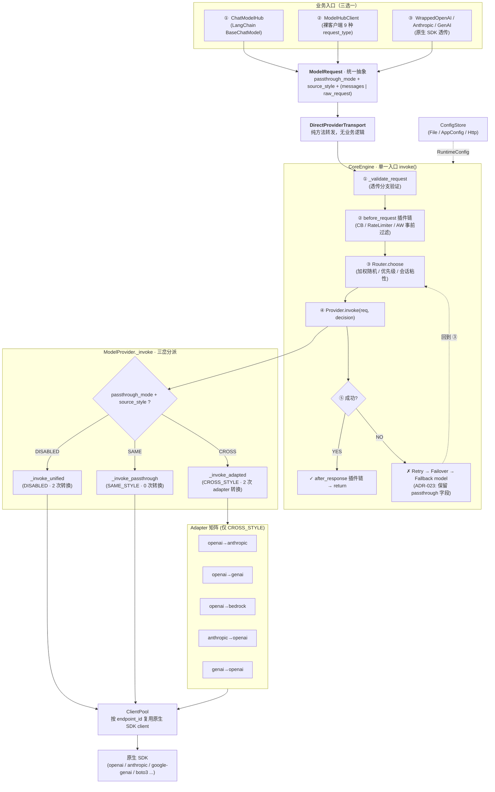

# Plaud Model Hub · 架构介绍

> **架构图**（draw.io 文件，含 2 页）：[model-hub-arch.drawio](file:///Users/liangzhu/Documents/docs/diagram/model-hub-arch.drawio)
>     · 页 1：对象持有关系（has-a 静态结构）
>     · 页 2：一次调用的数据流（UML 时序）
>
> **官方设计文档**：`docs/arch-v2.md`
> **本文定位**：上层介绍 / 讲解骨架，配合 drawio 图使用；细节实现去看 `arch-v2.md` 和源码

---

## 一、为什么有这个项目

业务场景里同时有多家 LLM 供应商（OpenAI / Anthropic / Gemini / 火山 / DashScope / Bedrock …），每家：

- API key 不同、SDK 不同、错误处理不同
- 配额、限流、稳定性差异大
- 同一逻辑模型常常买了两三个 endpoint（不同区域 / 不同计费档）

如果让业务代码自己处理这些 → 每个团队重复造轮子（client、错误处理、fallback）、换模型 = 改代码 + 发版、一个 endpoint 限流业务直接挂、多 endpoint 想做负载均衡得自己写。

**Model Hub 把这些通用问题一次性下沉成基础设施**：业务方只需 `app_id + logical_model` 两个名字。

具体做法是把所有调用形态统一为 `ModelRequest` 信封，由 CoreEngine 通过单一入口 `invoke(request) → response` 处理。不同业务场景通过三种模式接入——既可以用 Hub 定义的统一字段（适合不关心厂商差异的业务），也可以把原生 SDK 参数原样透传（适合已有 SDK 代码、不想改写的业务）：


| 模式                     | 触发条件                                 | 调用形态                  | 转换次数                 |
| ---------------------- | ------------------------------------ | --------------------- | -------------------- |
| **DISABLED**（统一模式）     | `passthrough_mode = DISABLED`        | 业务方填 `messages` 等统一字段 | 2 次（hub 抽象 ↔ 各家 SDK） |
| **SAME_STYLE**（同风格透传）  | `source_style == provider.api_style` | 业务方用原生 SDK 写法         | **0 次**              |
| **CROSS_STYLE**（跨风格透传） | `source_style != provider.api_style` | 业务方用原生 SDK 写法         | 2 次（adapter 内部翻译）    |


---

## 二、整体架构（一张图理解）

> 详细图请打开 [model-hub-arch.drawio](file:///Users/liangzhu/Documents/docs/diagram/model-hub-arch.drawio)。
>
> 下面是文档级简化版（讲架构时口述配合这张图就够）：




---

## 三、九个核心组件（按数据流顺序）

### 1. 业务入口层 · 三种形态


| 入口                                    | 调用形态                                                                                   | 适合谁                     | 内部走  | 转换次数                |
| ------------------------------------- | -------------------------------------------------------------------------------------- | ----------------------- | ---- | ------------------- |
| **ChatModelHub**                      | LangChain `BaseChatModel`（`.invoke / .stream / .bind_tools / .with_structured_output`） | LangChain / LCEL 业务     | 统一模式 | 2 次                 |
| **ModelHubClient**                    | 裸 `.chat() .embed() .generate_image() .transcribe() .speak() .moderate()`              | 非 LangChain 纯 Python 业务 | 统一模式 | 2 次                 |
| **WrappedOpenAI / Anthropic / GenAI** | 写法 == 原生 SDK                                                                           | 已用原生 SDK、不想改代码          | 透传模式 | 0 / 2 次（视 endpoint） |


三种入口最终都汇聚成同一种东西 —— `ModelRequest`。

### 2. ModelRequest · 统一抽象层

```python
@dataclass
class ModelRequest:
    # 统一模式字段
    logical_model: str
    messages: list[Message]
    temperature, max_tokens, ...
    provider_params: dict | None       # 厂商原生参数透传袋

    # 透传模式字段
    passthrough_mode: PassthroughMode  # DISABLED / SAME_STYLE / CROSS_STYLE
    source_style: str | None           # "openai" / "anthropic" / "genai" / "bedrock"
    raw_request: dict | None           # 原生 SDK kwargs
    raw_method: str | None             # "chat.completions.create" / "messages.create" / ...

    @property
    def is_passthrough(self) -> bool:
        return self.passthrough_mode != PassthroughMode.DISABLED
```

`**ModelResponse` 对称地有 2 个透传字段**：`raw_response`（原生响应对象）+ `raw_error`（原生异常）。

**4 个字段的作用** —— `passthrough_mode` 决定走不走透传；`source_style` 决定走哪条 adapter；`raw_request` 是要透传/翻译的内容；`raw_method` 是要调用的目标方法。

**统一模式下的参数分流**

- 统一客户端（ChatModelHub / ModelHubClient）的参数来源有两条通道，入口层（`_build_request`）负责分拣：
  - `temperature` / `max_tokens` → 被 pop 成 ModelRequest **顶层统一字段**（Hub 认识并接管翻译的参数）
  - 其余所有 kwargs → 原样装进 `provider_params`（Hub 不认识、不校验、不改名的**透传袋**）
- 构造器 `ChatModelHub(...)` 只接受固定的 pydantic 白名单字段（约 13 个），**未声明的参数被 `extra='ignore'` 静默丢弃**。厂商原生参数必须通过调用时 kwargs（`.invoke()` / `.bind()`）传入，不能写在构造器里。
- 透传模式（WrappedOpenAI / Anthropic / GenAI）不走这套分拣——所有参数原封不动打包进 `raw_request`，没有白名单，没有校验，Hub 全程不拆包。

### 3. Transport · 调用解耦层

`DirectProviderTransport` 内部就一句 `self._engine.invoke(...)`，**纯方法转发**。

为什么要拆？—— 预留扩展点。未来如果 SDK 要远程调 `model-hub-api`（不是进程内），只需写 `HttpApiTransport` 实现，业务入口代码不用改一行。

### 4. CoreEngine · 单一入口 invoke()

> ★ 关键设计：整个 Model Hub 对外只有一个方法签名 `invoke(request) → response`，所有能力栈完全复用。

引擎的处理分为**循环外**和**循环内**两段。循环外只跑一次，循环内每次重试都重新执行：

```
── 循环外（整个请求跑一次）──────────────────────────
① _validate_request             ← 透传分支验证（is_passthrough ? 检查 raw_* : 检查 messages）
② Plugin.before_request 链      ← 基础钩子，每个插件可修改 request（当前大多数插件在这步是 no-op）

── 循环内（while attempt ≤ max_retries）───────────
③ 收集排除集 + 调整权重            ← 两个 Protocol 接口（见下文），每次重试都重新计算
④ Router.choose                 ← 在排除 + 降权后的候选池中选 endpoint
⑤ _effective_request            ← 合并参数：YAML endpoint 默认值 < 单次调用传入值
⑥ Provider.invoke               ← 真正发 HTTP 请求
⑦ 成功 → after_response 回写滑窗 → return
   失败 → Retry → Failover → Fallback（换 logical_model）→ 回到 ③
```

**③ 的两个 Protocol 接口**——容错插件影响路由决策的真正入口，不是通过 `before_request` 方法，而是 Engine 在路由前主动调用：


| 接口                         | 谁实现     | 做什么                                             | 效果                                  |
| -------------------------- | ------- | ----------------------------------------------- | ----------------------------------- |
| `EndpointFilterProvider`   | 熔断器、限流器 | `get_unavailable_endpoints()` 返回不可用 endpoint 集合 | Router 直接跳过，不参与选择                   |
| `WeightAdjustmentProvider` | 自适应权重   | `get_weight_multipliers()` 返回每个 endpoint 的权重乘数  | Router 用调整后的 effective_weight 做加权随机 |


这两个接口在**每次重试**都会重新触发——因为上一次失败后滑窗数据已更新，endpoint 的可用状态和权重可能已经变化。

④ 必须在路由之后执行——不同 endpoint 在 YAML 中可能配了不同的 `extra.provider_params`，选中哪个 endpoint 决定了和哪份默认参数合并。合并后的 `provider_params` 交给 Provider 层使用。`timeout_ms` / `max_retries` 也遵循同样的优先级：`request 显式传入 > endpoint 配置 > engine_config 默认值`。

**关键约束 · ADR-023** —— fallback 阶段必须保留 `passthrough_mode / source_style / raw_request / raw_method` 4 字段，否则透传请求在 fallback model 阶段会退化成空的统一请求。

### 5. ModelProvider._invoke · ★ 三岔分派（核心抽象）

`arch-v2.md` §7.1 写得最直白：

```python
def invoke(self, request, decision) -> ModelResponse:
    if not request.is_passthrough:
        return self._invoke_unified(request, decision)        # 统一模式
    if request.source_style == self.api_style:
        return self._invoke_passthrough(request, decision)    # 同风格透传
    else:
        return self._invoke_adapted(request, decision)        # 跨风格透传
```


| 方法                    | 走它的场景                             | 转换次数            | 厂商独有参数       | 谁实现        |
| --------------------- | --------------------------------- | --------------- | ------------ | ---------- |
| `_invoke_unified`     | 入口是 ChatModelHub / ModelHubClient | 2 次             | 受统一字段限制      | 子类**必须**实现 |
| `_invoke_passthrough` | Wrapped 路由到本家 endpoint            | **0 次**         | 无损           | 基类默认实现     |
| `_invoke_adapted`     | Wrapped 路由到异家 endpoint            | 2 次（adapter 内部） | 经 adapter 翻译 | 基类默认实现     |


**为什么 `_invoke_unified` 必须子类实现**：统一模式下业务方填的是 Hub 自定义的抽象字段（`messages: list[Message]`、`temperature`、`max_tokens`），而各家 SDK 的参数格式不同——Anthropic 的 `max_tokens` 是必填项、Gemini 的 `temperature` 要塞进 `GenerateContentConfig` 对象而非顶层参数、`max_tokens` 在 Gemini 叫 `max_output_tokens`。每个 Provider 子类各自实现翻译逻辑，这是"2 次转换"中 request 方向的那一次；响应回来后再反向翻译成 `ModelResponse` 标准字段，是第 2 次。另外两个方法不需要子类操心：`_invoke_passthrough` 原样喂 SDK，`_invoke_adapted` 委托给 Adapter 做翻译，流程通用。新接一个 Provider 只需写 `_invoke_unified`，透传和跨风格适配继承基类即可。

**统一模式下 `provider_params` 的处理差异**

Engine 合并完参数后，`provider_params` 交给 Provider——但各 Provider 拆包方式不同：


| Provider       | 处理方式                                                   | 不认识的参数             |
| -------------- | ------------------------------------------------------ | ------------------ |
| OpenAI / Azure | **整袋透传** `**provider_params` 解包进 SDK                   | key 写错 → 服务端返回 400 |
| Anthropic      | **整袋透传 + 显式 pop**（`max_tokens` / `temperature` 从袋中优先取） | 同上，服务端返回 400       |
| Gemini（genai）  | **白名单逐项 `.get`**，只认识显式列出的 key                          | **静默丢弃，不报错**       |


Hub 入口层不校验 `provider_params` 的内容——参数名是否正确由最终的厂商 SDK / API 守门。同一份 `provider_params` 配置搬到不同 Provider 的 endpoint 上，行为可能完全不同。详见 [[参数透传机制详解]]。

### 6. OPENAI_COMPATIBLE 家族（容易被忽略的细节）

**Wrapped OpenAI 路由到 Azure / 火山 / DashScope / LiteLLM 是 SAME_STYLE，不是 CROSS_STYLE**。

`adapters/registry.py` 定义了一个隐含家族（`arch-v2.md` §8.3）：

```python
OPENAI_COMPATIBLE = {"openai", "azure_openai", "volcengine", "dashscope", "litellm"}

def get_adapter(source_style, target_provider):
    if source_style == "openai" and target_provider in OPENAI_COMPATIBLE:
        return None   # ← 不需要 adapter
    ...
```

所以路由到这些 provider 时，虽然 provider 名字不一样，但都被当作"OpenAI 同风格"对待，走零转换的 `_invoke_passthrough`。

### 7. Adapter 矩阵 · 跨风格翻译

**只在真正跨风格时才走**。adapter 是 N×N 矩阵里的稀疏几条边：


| Source ↓ / Target → | openai | anthropic | genai | bedrock |
| ------------------- | ------ | --------- | ----- | ------- |
| **openai**          | —      | ✓         | ✓     | ✓       |
| **anthropic**       | ✓      | —         | ✗     | ✗       |
| **genai**           | ✓      | ✗         | —     | ✗       |


找不到对应 adapter → 抛 `No adapter for X → Y` → engine 试下一个 endpoint。

**Adapter 接口** 必须实现 4 个方法（`arch-v2.md` §8.1）：

```python
class APIStyleAdapter(ABC):
    def adapt_request(self, kwargs) -> dict        # 入参翻译
    def adapt_response(self, response) -> Any      # 响应翻译
    def adapt_stream(self, stream) -> Iterator     # 流式响应翻译
    def get_target_method(self, source_method) -> str   # 方法路径映射
```

**adapter 在 provider 内部调，不在 engine 层**。Engine 不知道 adapter 存在。

### 8. ClientPool · 原生 SDK Client 复用

ModelProvider 基类用 `ClientPool[T]` 按 `endpoint_id` 缓存原生 SDK client 实例。每个 endpoint 的凭证 / base_url 不同 → 一个 client；但同 endpoint 下所有请求共享，HTTP keep-alive 连接复用。

### 9. Plugin System · 两层钩子 × 两种粒度

插件系统有两层接口，触发频次不同：

**第一层：Plugin 基础钩子（请求级，整个请求只触发一次）**

```
before_request(request, context)    → 请求发出前，可修改 request
after_response(request, response)   → 成功后，可修改 response
on_error(request, error)            → 全部重试耗尽后的最终错误
```

Langfuse、OTel 等可观测性插件主要在这一层工作。

**第二层：高级 Protocol 接口（尝试级，重试循环内每次都触发）**

容错插件通过实现特定 Protocol 接口参与路由决策和状态维护：


| 接口                         | 触发时机                     | 实现者           | 作用                            |
| -------------------------- | ------------------------ | ------------- | ----------------------------- |
| `EndpointFilterProvider`   | Router 选 endpoint **之前** | 熔断器、限流器       | 返回不可用 endpoint 集合，Router 直接排除 |
| `WeightAdjustmentProvider` | Router 选 endpoint **之前** | 自适应权重         | 返回权重乘数，Router 按调整后权重选择        |
| `InvocationLifecycleHook`  | 每次 Provider 调用成功/失败后     | 熔断器、限流器、自适应权重 | 回写滑窗统计，更新 endpoint 健康状态       |
| `RetryInfoProvider`        | Engine 计算退避时间时           | 限流器           | 提供建议退避秒数（基于 Retry-After 头）    |


Engine 在 `add_plugin()` 时通过 `isinstance` 检查插件实现了哪些 Protocol，运行时只调用匹配的插件。

**各容错插件的分工**

- `CircuitBreaker`：endpoint 处于 OPEN 状态 → 通过 `EndpointFilterProvider` 直接排除
- `RateLimiter`：endpoint 处在 429 限流期 → 通过 `EndpointFilterProvider` 直接排除
- `AdaptiveWeight`：按滑动窗口错误率 → 通过 `WeightAdjustmentProvider` 渐进降权（不二值排除）
- 每次成功/失败都通过 `InvocationLifecycleHook` 喂给各自的滑窗，形成闭环

**自动适配两种模式**：插件通过 `request.is_passthrough` 判断该读 `raw_request` 还是 `messages`（`arch-v2.md` §10.2）

**三种健康信号互不重叠**


| 信号        | 谁处理                          | 怎么处理                            |
| --------- | ---------------------------- | ------------------------------- |
| 429 限流    | AdaptiveWeight + RateLimiter | AW 渐进降权 + RL 解析 Retry-After     |
| 5xx 服务端错误 | CircuitBreaker               | 完全熔断（CLOSED → OPEN → HALF_OPEN） |
| 发送过快      | RateLimiter                  | 令牌桶主动钳制                         |


推荐配置：`exclude_429_from_circuit_breaker=true + soft_limit_on_429=true`。

### 10. Configuration Layer · 数据底座

```
ConfigStore (抽象)
├── FileConfigStore       ← YAML / JSON
├── AppConfigConfigStore  ← AWS AppConfig 热加载
└── HttpConfigStore       ← model-hub-api

         ↓ 解析

RuntimeConfig
├── LogicalModel  · key = {app_id}:{model}
│     └── endpoints: [Endpoint(provider, model, weight, priority, region, ...)]
├── Policy        · routing_strategy / fallback_model / timeout_ms / max_retries
└── Plugins       · rate_limit / circuit_breaker / adaptive_weight / langfuse / otel
```

**核心抽象 —— LogicalModel 与 Endpoint 分离**：业务方只认 logical_model（如 `summary:gpt-4.1`），底下的 endpoint 有几个、跑在哪个 provider，配置说了算。

---

## 四、能力复用矩阵（核心保证）

> `arch-v2.md` §10.1。**三种模式共享同一套基础设施**——业务方拿不同入口、走不同模式，但任何模式都享受完整能力栈。


| 能力                | 统一模式（DISABLED） | 同风格透传（SAME_STYLE） | 跨风格透传（CROSS_STYLE） |
| ----------------- | -------------- | ----------------- | ------------------ |
| 路由决策              | ✅              | ✅                 | ✅                  |
| 会话粘性              | ✅              | ✅                 | ✅                  |
| 重试机制              | ✅              | ✅                 | ✅                  |
| 429 退避            | ✅              | ✅                 | ✅                  |
| 熔断保护              | ✅              | ✅                 | ✅                  |
| 限流控制              | ✅              | ✅                 | ✅                  |
| Fallback          | ✅              | ✅                 | ✅                  |
| before_request 插件 | ✅ 读 messages   | ✅ 读 raw_request   | ✅ 读 raw_request    |
| after_response 插件 | ✅ 读 choices    | ✅ 读 raw_response  | ✅ 读 raw_response   |
| **数据转换次数**        | 2 次            | **0 次**           | 2 次（adapter 内）     |


---

## 五、一次完整调用的旅程（讲解时按这条线讲）

以业务方调 `WrappedOpenAI.chat.completions.create(model="gpt-4.1", messages=[..., 带图])` 为例：

1. **Wrapper 拦截** → 打包成 `ModelRequest(passthrough_mode=SAME_STYLE, source_style="openai", raw_request=..., raw_method="chat.completions.create")`
2. **Transport** → `DirectProviderTransport.invoke` 进 engine
3. **Engine**
  - `_validate_request` 走透传分支
  - 插件 `before_request`：排除 OPEN 熔断的、限流的、降权后概率太低的
  - Router 按 logical_model `summary:gpt-4.1` 选中 endpoint A（OpenAI 兼容）
  - 调 `OpenAIProvider.invoke()`
4. **Provider 三岔分派**
  - `source_style="openai"` == `api_style="openai"` → `_invoke_passthrough`
  - 从 ClientPool 取 client → `client.chat.completions.create(**raw_request)` 直接喂
5. **假设 A 失败了**（RateLimitError 429）
  - Engine `after_response` 回写 CB / AW 滑窗
  - 救援链：Retry（指数退避 + Retry-After）→ 仍失败 → Failover 到 endpoint B（Anthropic）
6. **进 AnthropicProvider**
  - `source_style="openai"` != `api_style="anthropic"` → `_invoke_adapted`
  - 查 `openai_to_anthropic` adapter → `adapt_request` 翻译（含图片 content block）→ 调 Anthropic SDK
7. **响应回来**
  - `adapt_response` 反向翻译 → `ModelResponse(raw_response=...)`
  - `after_response` 回写统计
8. **Wrapper 拆包** → 还给业务方一个 OpenAI 格式的 `ChatCompletion` 对象（业务方完全无感）

**全程业务方只写了一行 `wrap_openai(...)`**。

> 📂 这条旅程的可视化版本见 [model-hub-arch.drawio · 页 2](file:///Users/liangzhu/Documents/docs/diagram/model-hub-arch.drawio)（UML 时序图）。

---

## 六、关键设计原则（讲解时重点强调）

### 1. 单一入口

整个 Model Hub 对外只有一个方法签名 `invoke(request) → response`。不论是统一模式还是透传模式、不论后端走哪个 provider，**入口完全统一**。这让所有基础设施（路由 / 重试 / 熔断 / 插件）只需实现一次。

### 2. has-a 组合，不是嵌套

```
入口对象  ──has-a──>  Transport  ──has-a──>  Engine  ──uses──>  ProviderRegistry  ──get(name)──>  ModelProvider  ──has-a──>  原生 SDK Client
```

任何相邻两层都是组合关系，不是包含。代码读起来：

```python
engine = CoreEngine(config_store=...)          # 建 Engine
transport = DirectProviderTransport(engine)    # Transport 持有 Engine
response = transport.invoke(request, context)  # 内部只一句 self._engine.invoke(...)
```

### 3. 翻译永远是 provider 内政

CROSS_STYLE 翻译完全在 provider 内做。Engine 不知道 adapter 存在，不关心 source_style ≠ api_style 这件事。这让 adapter 可以独立扩展，不污染 engine 逻辑。

### 4. 数据结构扩展，而非入口扩展

Model Hub 选择"扩 ModelRequest 字段"而不是"加新方法"。代价：每个 provider 加 3 个内部方法 `_invoke_unified / _invoke_passthrough / _invoke_adapted`。收益：CoreEngine 单入口不变，插件不需要双写。

---

## 七、向他人介绍时的讲解顺序（10 分钟脚本）


| 步骤  | 讲什么                                                                     | 配合图哪块          | 时间    |
| --- | ----------------------------------------------------------------------- | -------------- | ----- |
| 1   | 痛点：多供应商 + 多 endpoint + 容错 = 不能让业务方自己处理                                  | 口述             | 1 min |
| 2   | 核心思路：Passthrough 模式 + 三种调用模式（DISABLED / SAME_STYLE / CROSS_STYLE）       | 第一节表格          | 2 min |
| 3   | 三种入口（ChatModelHub / ModelHubClient / Wrapped）+ ModelRequest 抽象          | 主图顶部           | 2 min |
| 4   | Engine 六步：validate → before → route → merge params → call → after/retry | 主图中部           | 2 min |
| 5   | **★ Provider 三岔分派**（核心抽象）                                               | drawio 页 1 红色块 | 2 min |
| 6   | 能力复用矩阵（三模式共享基础设施）                                                       | 第四节表格          | 1 min |
| 7   | 容错两层 + 三种健康信号分工                                                         | 主图 Engine 内救援链 | 1 min |
| 8   | 一次真实调用的旅程（OpenAI → 429 → fallback 到 Anthropic）                          | drawio 页 2 时序图 | 1 min |


**全程 ~10 分钟**。重点反复强调"**Provider 三岔分派**"——这是 Model Hub 区别于普通 LLM gateway 的核心设计。

---

## 八、关键术语对照


| 中文    | 英文                          | 含义                                                               |
| ----- | --------------------------- | ---------------------------------------------------------------- |
| 统一模式  | DISABLED / Unified Mode     | ModelRequest 填统一字段（messages/temperature），provider 翻译成各家 SDK      |
| 同风格透传 | SAME_STYLE Passthrough      | raw_request 原样喂 SDK，零转换                                          |
| 跨风格透传 | CROSS_STYLE Passthrough     | adapter 翻译 raw_request 再喂目标 SDK                                  |
| 逻辑模型  | Logical Model               | 业务方对外的模型名（如 `summary:gpt-4.1`）                                   |
| 端点    | Endpoint                    | 一个具体 API 入口 = Provider + Model + 凭证                              |
| 透传字段  | Passthrough fields          | `passthrough_mode / source_style / raw_request / raw_method` 4 个 |
| 救援链   | Retry → Failover → Fallback | 三级递进容错                                                           |
| 客户端池  | ClientPool                  | 按 endpoint_id 复用原生 SDK 实例                                        |


---

## 九、扩展资料

- **官方设计文档**：`docs/arch-v2.md`
- **决策记录**：
  - `docs/decisions/006-v2-passthrough-architecture.md`（Passthrough 架构决策）
  - `docs/decisions/005-core-engine-passthrough-mode.md`（CoreEngine 透传模式）
  - `docs/decisions/023-passthrough-fallback-preserve-raw-request.md`（fallback 保留透传字段）
  - `docs/decisions/024-cross-style-adapter-multimodal.md` / `025-genai-to-openai-cross-style-normalization.md`（adapter 多模态翻译）
- **详细分层图**：[[PlaudModelHub架构图]]（含 plugin chain / 容错两层细节的 ASCII 版）
- **完全指南**：[[PlaudModelHub完全指南]]（按模块逐章讲解）
- **参数透传机制**：[[参数透传机制详解]]（YAML 参数 / 调用时参数的合并优先级、各 Provider 处理差异、常见踩坑）
- **配置实战速查**：[[model-hub-config-guide]]

---

> 📂 配套架构图：`/Users/liangzhu/Documents/docs/diagram/model-hub-arch.drawio`
> 用 [draw.io 桌面版](https://www.diagrams.net/) 或 VS Code 的 Draw.io Integration 插件打开。
> 文件含 2 页：页 1 = 对象持有关系（静态）；页 2 = 一次调用数据流（时序）。

