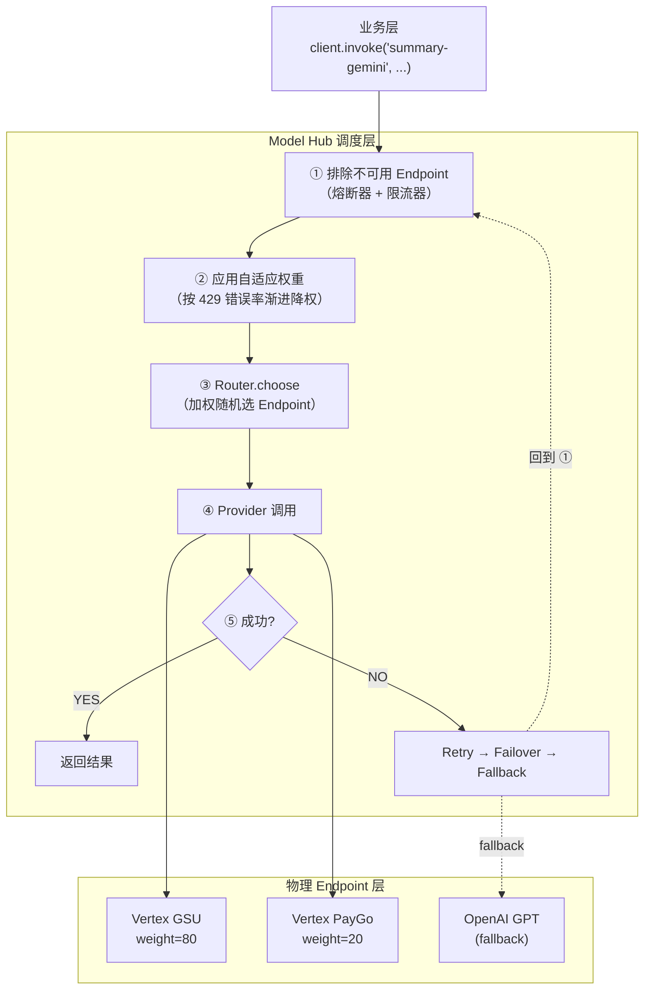
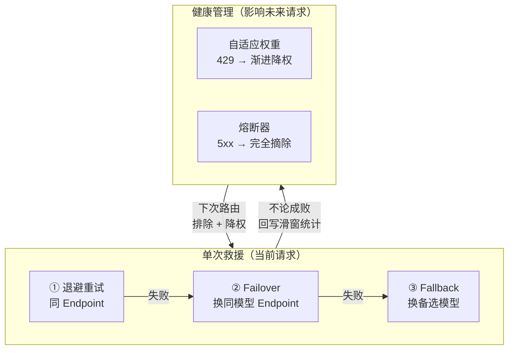
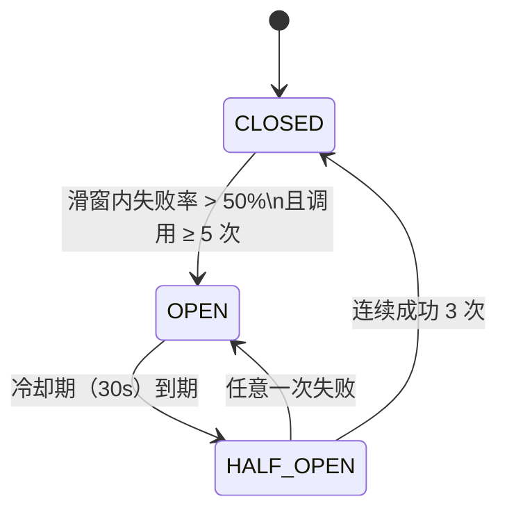
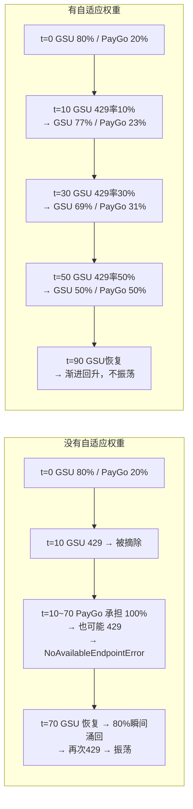

# Plaud Model Hub · 调度与容错

> **关联文档**：
> · [[PlaudModelHub架构介绍]]（整体架构，本文聚焦调度与容错子系统）
> · [[PlaudModelHub完全指南]]（按模块逐章讲解）
>
> **本文定位**：技术分享 / 方案宣讲用。覆盖流量分发、三层容错、自适应权重（含权重重分配与 recovery_rate）的完整设计。适合 30 分钟技术分享会使用。

---

## 一、要解决什么问题

业务侧同时接入多家 LLM（Gemini / GPT / Claude …），每家的配额、成本、稳定性差异大。三类约束必须在基础设施层统一处理：


| 约束          | 具体表现                        | 不处理的后果          |
| ----------- | --------------------------- | --------------- |
| **配额上限**    | 单 Endpoint RPM 固定，触顶即 429   | 业务直接报错          |
| **成本结构**    | GSU 预付费便宜但容量受限，PayGo 按量贵但弹性 | 全量走 PayGo 成本不可控 |
| **可用性 SLA** | 单点抖动、区域故障                   | 一个 429 打穿整条业务链  |


Model Hub 的调度层把这些问题一次性下沉：**业务只写 `client.invoke("summary-gemini", ...)`，路由、降权、重试、降级全部自动完成，YAML 驱动，代码零改动**。

---

## 二、整体架构




调度层在 CoreEngine 的路由循环内运行，每次重试都重新计算排除集和权重——上一次失败后的滑窗统计会立即影响下一次路由决策。

---

## 三、流量分发

业务面向逻辑模型编程，调度层按权重把流量分发到物理 Endpoint：

```
        ┌──────────────────────────────────────────┐
        │            业务层（无需改动）               │
        │   client.invoke("summary-gemini", ...)   │
        └──────────────────┬───────────────────────┘
                           │
        ┌──────────────────▼───────────────────────┐
        │          调度层 · 路由 + 健康管理           │
        └──────────────┬─────────────┬─────────────┘
                       │             │
                  ┌────▼────┐   ┌────▼────┐
                  │ Vertex  │   │ Vertex  │
                  │  GSU    │   │  PayGo  │
                  │ (80%)   │   │  (20%)  │
                  └─────────┘   └─────────┘
                   预付费配额      按量计费
```

### 配置示例

```yaml
models:
  summary-gemini:
    routing_policy: WEIGHTED_RANDOM
    endpoints:
      - id: vertex-gsu-us
        provider: vertex_ai
        model: gemini-2.5-pro
        weight: 80                # 优先消耗预付费配额
      - id: vertex-paygo-us
        provider: vertex_ai
        model: gemini-2.5-pro
        weight: 20                # 溢出走按量计费

policies:
  summary-gemini:
    fallback_model:
      - summary-gpt              # 一级降级：跨厂商
      - summary-claude           # 二级降级
```

---

## 四、三层容错体系

故障处理在两条独立轨道上同时运行，互相喂数据形成闭环：

- **单次救援**（针对当前请求）：让这一次调用尽量成功
- **健康管理**（针对未来请求）：调整路由权重与可用性，避免反复撞墙




### 4.1 单次救援链

按递进顺序串联，前一级失败才进入下一级：


| 阶段         | 触发                  | 动作                                              | 失败后                       |
| ---------- | ------------------- | ----------------------------------------------- | ------------------------- |
| ① 退避重试     | 当前 Endpoint 返回 429  | 按 `Retry-After` 退避（缺省指数退避 + 抖动），同 Endpoint 重试一次 | 进入 ②                      |
| ② Failover | 重试仍失败，或返回 5xx/超时    | 加入排除集，从同模型其他 Endpoint 选一个再试                     | 进入 ③                      |
| ③ Fallback | 同模型所有 Endpoint 均不可用 | 按 `fallback_model` 列表顺序切换到备选模型                  | 备选模型独立走完整 ①②；列表全部失败才向业务抛错 |


Fallback 切到的备选模型享受完整的前两级救援——切到 GPT 不会丢失重试与 Failover 能力。

### 4.2 Endpoint 健康管理

三种健康信号互不重叠，按错误类型分工：


| 机制        | 应对错误                 | 触发条件                   | 对路由的影响            | 恢复方式                                |
| --------- | -------------------- | ---------------------- | ----------------- | ----------------------------------- |
| **自适应权重** | 429 频发               | 滑动窗口内 429 比例上升         | 渐进降权，保留 ≥10% 探测流量 | 窗口内旧记录过期 → 权重自然回升                   |
| **熔断器**   | 5xx / 超时 / 连接异常      | 60s 内失败率 >50% 且调用 ≥5 次 | OPEN，Router 完全跳过  | 30s 后 HALF_OPEN 探测，连续成功 3 次回 CLOSED |
| **限流器**   | 单次 429 + Retry-After | 收到 429 响应              | 配合自适应权重（见 §5.5）   | Retry-After 到期自动解除                  |


```
信号        → 谁处理            → 怎么处理
────────────────────────────────────────────────
429 限流    → 自适应权重 + 限流器  → 渐进降权 + 解析 Retry-After
5xx 服务端错误 → 熔断器           → 完全熔断（CLOSED → OPEN → HALF_OPEN）
```

### 4.3 熔断器：状态机与恢复探测

熔断器采用经典的三状态模型，专门处理 5xx / 超时 / 连接异常（429 由自适应权重处理，通过 `exclude_429_from_circuit_breaker=true` 隔离）。

**状态机**：




**各状态行为**：


| 状态        | Router 行为      | 含义                   |
| --------- | -------------- | -------------------- |
| CLOSED    | 正常参与路由         | Endpoint 健康          |
| OPEN      | 完全排除，Router 跳过 | Endpoint 故障，停止向其发送请求 |
| HALF_OPEN | 放行少量探测请求       | 试探 Endpoint 是否恢复     |


**判定参数**：


| 参数                    | 默认值 | 说明                        |
| --------------------- | --- | ------------------------- |
| `failure_threshold`   | 0.5 | 失败率阈值（50%）                |
| `min_calls`           | 5   | 最少调用次数，防止 1 次失败就熔断        |
| `window_size_seconds` | 60  | 统计窗口                      |
| `cooldown_seconds`    | 30  | OPEN → HALF_OPEN 冷却期      |
| `success_threshold`   | 3   | HALF_OPEN 连续成功多少次回 CLOSED |


**与自适应权重的分工**：

熔断器是**二值的**（完全排除或完全放行），适合处理"Endpoint 真的坏了"的场景。自适应权重是**连续的**（渐进降权），适合处理"Endpoint 太忙了"的场景。两者通过错误类型隔离：

```
429（太忙）→ 自适应权重渐进降权，不触发熔断
5xx（故障）→ 熔断器完全摘除，不影响自适应权重
```

推荐配置：`exclude_429_from_circuit_breaker=true`，确保 429 不会被熔断器误判为故障。

### 4.4 一次完整失败的处理路径

```
请求进入
  │
  ├─ 路由层选 Endpoint：排除熔断中 Endpoint，应用自适应权重
  │
  ├─ 调用 → 成功？
  │     ├─ 是 → 回写滑动窗口 → 返回
  │     └─ 否 ↓
  │
  ├─ 429    → 按 Retry-After 退避重试 → 仍失败 → Failover
  ├─ 5xx    → Failover（不在原 Endpoint 重试）
  │            + 回写熔断器滑窗（可能触发 OPEN）
  │
  ├─ 同模型 Endpoint 全部失败
  │     └─ Fallback 至备选模型 → 备选模型再走完整救援
  │
  └─ 不论成败：错误统计回写自适应权重/熔断器，影响下一次路由
```

---

## 五、自适应权重：核心设计

### 5.1 设计理念：429 是"太忙"不是"坏了"


|      | 429 Too Many Requests | 5xx Server Error |
| ---- | --------------------- | ---------------- |
| 含义   | "我没坏，只是你请求太多了"        | "我出问题了"          |
| 正确应对 | 少给它流量（降权）             | 暂时别用了（熔断）        |
| 恢复预期 | 减少请求后很快恢复             | 需要等修复            |


朴素的"二值切换"（429 一来直接摘除、过期再放回）让流量在主备之间瞬间倾倒，备份很容易被洪峰击垮。自适应权重按错误率**渐进降权**，让备份有时间适应；下限探测流量保证主 Endpoint 配额恢复后能第一时间感知。

### 5.2 滑动窗口与权重公式

降权的依据是 error_rate，它不是历史累计值，而是**滑动窗口内的实时比值**——只统计最近 `window_size_seconds`（默认 120s）的调用，更早的记录自动淘汰。这样权重能跟随当前状况升降：429 刚开始密集时窗口比例迅速上升、触发降权；停止后旧记录逐条过期、比例回落、权重自然回升。

```
error_rate = 窗口内 429 次数 / 窗口内总调用次数
multiplier = max(min_weight_ratio, 1.0 - error_rate × penalty_factor)
effective_weight = base_weight × multiplier
```

**窗口怎么维护**：每个 Endpoint 维护一个 deque（双端队列），每次调用按 `(时间戳, 是否 429)` 追加到尾部；查询时先从头部清掉超出窗口的旧记录，再统计剩下的。

```
deque: [(90,F), (100,T), (120,F), (140,T), (160,F), (180,T), (190,F), (200,F)]
        ↑ 头部：最旧                                              尾部：最新 ↑
        过期记录从这端 popleft                              新记录 append 到这端
```

**一个具体例子**（window=120s，当前 t=200s，窗口范围 [80s, 200s]）：

```
t=50s  成功  ← 早于 80s，过期丢弃
t=70s  429   ← 早于 80s，过期丢弃
t=90s  成功  ✓
t=100s 429   ✓
t=120s 成功  ✓
t=140s 429   ✓
t=160s 成功  ✓
t=180s 429   ✓
t=190s 成功  ✓
t=200s 成功  ✓

窗口内: 8 次调用, 3 次 429
error_rate = 3 / 8 = 37.5%
multiplier = max(0.1, 1.0 - 0.375 × 1.5) = 0.4375
```

默认参数下（`penalty_factor=1.5`, `min_weight_ratio=0.1`）的降权曲线：


| 429 错误率 | multiplier | base=80 → effective | base=20 → effective |
| ------- | ---------- | ------------------- | ------------------- |
| 0%      | 1.0        | 80                  | 20                  |
| 10%     | 0.85       | 68                  | 17                  |
| 33%     | 0.50       | 40                  | 10                  |
| 50%     | 0.25       | 20                  | 5                   |
| 60%+    | 0.10（下限）   | 8                   | 2                   |


### 5.3 下限保护：为什么 multiplier 不降到 0

`min_weight_ratio=0.1` 这个下限是有意保留的——即便 Endpoint 100% 在 429，multiplier 也只压到 0.1，保留 10% 原始权重继续被 Router 选中。这 10% 流量充当**探测包**，让系统不需要专门的状态机就能感知恢复。

**对比"降到 0"的方案**：

```
方案 1：multiplier 可降到 0
  GSU 100% 429 → multiplier=0 → effective_weight=0 → Router 永不选 GSU
  → GSU 配额恢复了，没人知道，因为没有请求去试
  → 必须靠外部信号（定时探测 / 人工切回）才能发现

方案 2：保留下限（当前方案）
  GSU 100% 429 → multiplier=0.1 → effective_weight=8 → Router 仍小概率选 GSU
  → 少量请求充当探测包
  → GSU 配额一旦恢复，下次探测立刻成功 → 滑窗 429 比例下降 → multiplier 自动回升
```

**对比熔断器的恢复机制**：


|      | 熔断器                     | 自适应权重        |
| ---- | ----------------------- | ------------ |
| 故障期  | OPEN，完全不试               | 仍保留 10% 流量   |
| 恢复检测 | 30s 冷却 + HALF_OPEN 主动探测 | 业务流量本身就是探测   |
| 复杂度  | 需要专门的状态机                | 无状态机，靠权重连续变化 |


**代价**：配额没恢复时，那 10% 流量会被 429 拒掉，触发救援链（Retry → Failover）。这是值得的——业务请求被救援链兜住不丢失，同时为系统提供恢复信号。下限保护也是 §4 提到的"任一 Endpoint 重新可用即自动解除整模型熔断"能自动生效的前提。

### 5.4 有无自适应权重的效果对比

以 GSU(80%) + PayGo(20%) 配置为例：




|          | 没有自适应权重           | 有自适应权重             |
| -------- | ----------------- | ------------------ |
| 流量切换     | 0% ↔ 100% 突变      | 80% → 50% → 29% 渐进 |
| PayGo 压力 | 突然承担 5 倍流量        | 逐步增加，有缓冲           |
| GSU 恢复   | 限流过期瞬间涌回 → 再次 429 | 滑动窗口渐进恢复，不振荡       |
| 极端情况     | 两个都不可用 → 业务中断     | 两个都降权但保留 → **不中断** |


### 5.5 与限流器的联动（soft_limit_on_429）

自适应权重和限流器**同时生效**，不是二选一，各自处理 429 的不同方面：


| 插件        | 处理 429 的角度                                   | 作用时机         |
| --------- | -------------------------------------------- | ------------ |
| **限流器**   | 解析 Retry-After → 告诉 Engine 同 Endpoint 重试前等多久 | 当前请求收到 429 后 |
| **自适应权重** | 统计 429 频率 → 降低 Endpoint 权重                   | 下一次请求路由时     |


限流器收到 429 后默认会标记 `is_limited=True`，将 Endpoint 完全排除，和自适应权重的渐进降权矛盾。通过 `soft_limit_on_429` 解决——只关闭"排除"行为，Retry-After 退避不受影响：


| `soft_limit_on_429` | 429 时限流器行为         | 适用场景              |
| ------------------- | ------------------ | ----------------- |
| `false`（默认）         | 标记不可用，Router 跳过    | 未启用自适应权重          |
| `true`              | **不**标记不可用，仅记录配额信息 | 启用自适应权重，由降权机制平滑处理 |


当 `adaptive_weight.enabled=true` 且 `soft_limit_on_429=true` 时，工厂层自动联动，无需手动配两处。

### 5.6 生产典型配置下限流器的实际价值

`plaud-summary` 生产配置中限流器关键参数：

```yaml
rate_limit:
  enabled: true
  enable_token_bucket: false        # 令牌桶关闭
  soft_limit_on_429: true           # 不排除 Endpoint
  respect_retry_after: true         # 解析 Retry-After
```

三项职责在这套配置下实际生效情况：


| 职责                              | 是否生效    | 原因                            |
| ------------------------------- | ------- | ----------------------------- |
| ① 解析 Retry-After，告诉 Engine 退避多久 | **生效**  | `respect_retry_after=true`    |
| ② 令牌桶主动限流                       | **不生效** | `enable_token_bucket=false`   |
| ③ 标记 Endpoint 不可用               | **不生效** | `soft_limit_on_429=true` 关闭排除 |


**所以生产环境下限流器的唯一价值**：429 发生时，给当前 Endpoint 一次"按服务端建议精确退避后重试"的机会。

Engine 处理 429 的默认行为是"同 Endpoint 重试 1 次 → 失败则 Failover"：

```
第 1 次 429 → 问限流器拿 Retry-After → sleep(N 秒) → 重试同一个 Endpoint
              │
              ├─ 成功 → 省下一次 Failover
              └─ 仍 429 → Failover 到其他 Endpoint（此时自适应权重已经降权了）
```

无限流器的对比：

- **服务端建议等 5s**
  - 有限流器：sleep 5s → 大概率成功
  - 无限流器：盲猜 1s → 又 429；盲猜 10s → 浪费时间

**什么情况下限流器可以关掉**：如果配置成"429 直接 Failover、不重试同 Endpoint"（`rate_limit_backoff_strategy: failover_immediately`），限流器的最后一项价值也消失了，此时可以彻底不开。但代价是每次 429 都强制跨 Endpoint 切换，对配额恢复快的场景不划算。

---

## 六、权重重分配

### 6.1 为什么需要重分配

加权随机路由的本质：`Endpoint 被选中概率 = weight_i / Σ weight`。改变占比只有两条路：

1. 把**分子**变小 → 自己占比下降
2. 把**分母**变小 → 别人占比被动上升

如果只靠路径 1（各 Endpoint 自降权），剩下 Endpoint 的占比通过"分母变小"被动上升，**受 base weight 天花板限制**。

```
配置: gemini=66, gpt-5=34, gpt-4-1=1, o3=1
gemini 和 gpt-5 都打到 multiplier=0.1 时：

分母 = 6.6 + 3.4 + 1 + 1 = 12
gpt-4-1 占比 = 1 / 12 = 8.3%   ← base=1 的天花板
```

weight=1 的语义本应是"日常少用、应急可顶上"，但仅靠自降权，它永远到不了更高占比。**要让小 Endpoint 真正承接流量，必须显式把降权部分加到健康 Endpoint 的分子上**。

### 6.2 重分配公式

```
D = {i : multiplier_i < 1.0}    降权集合（贡献者）
H = {i : multiplier_i = 1.0}    健康集合（接收者）
```

> **H 严格用 `multiplier = 1.0` 判定**，不是 `> 0.5` 之类的宽松条件。原因：multiplier < 1.0 说明该 Endpoint 自身已经在 429，再把别人减少的流量分给它，只会加速把它也压到下限，引发连锁崩溃。只有 multiplier = 1.0（窗口内零 429）的 Endpoint 才有余量安全接收额外流量。
>
> 示例：gemini(m=0.10) 降权释放大量流量，gpt-5(m=0.60) 自身 40% 调用在 429——如果把 bonus 分给 gpt-5，涌入的流量会让它也打到下限。严格判定确保只有 gpt-4-1(m=1.0)、o3(m=1.0) 这类完全健康的 Endpoint 才接收重分配。

**减少总量**：

```
Δ = Σ_{i ∈ D} base_weight_i × (1 - multiplier_i)
```

**接收方加成**（按原权重比例分）：

```
bonus_j = Δ × base_weight_j / Σ_{k ∈ H} base_weight_k    （j ∈ H）
```

**最终 effective weight**：

```
降权方：effective_i = base_weight_i × multiplier_i
健康方：effective_j = base_weight_j + bonus_j
```

### 6.3 为什么按"原权重比例"分

配置者写下 `gpt-5: 34, gpt-4-1: 1` 时已经表达了"gpt-5 比 gpt-4-1 重要 34 倍"的偏好。应急时仍应尊重：


| 分配方式                 | bonus 比例       | 评价      |
| -------------------- | -------------- | ------- |
| 平均分                  | 1 : 1 : 1      | 抹平了配置偏好 |
| 按当前 effective 分      | 引入循环依赖         | 数学不闭合   |
| **按原 base weight 分** | **34 : 1 : 1** | 保留配置偏好  |


### 6.4 完整数值演练

输入：`gemini=66, gpt-5=34, gpt-4-1=1, o3=1`，gemini 和 gpt-5 同时 100% 429（multiplier=0.1）

```
Step 1 — 分组
  D = {gemini, gpt-5}
  H = {gpt-4-1, o3}

Step 2 — 减少总量
  gemini 贡献 = 66 × (1 - 0.10) = 59.4
  gpt-5  贡献 = 34 × (1 - 0.10) = 30.6
  Δ = 90

Step 3 — bonus（H 内 base 比例 = 1:1）
  bonus_gpt-4-1 = 90 × (1/2) = 45
  bonus_o3      = 90 × (1/2) = 45

Step 4 — effective weight
  gemini  = 66 × 0.10 = 6.6
  gpt-5   = 34 × 0.10 = 3.4
  gpt-4-1 = 1 + 45    = 46
  o3      = 1 + 45    = 46
  总和 = 102（= 原始总和，权重守恒）
```

效果对照：


|                    | gemini | gpt-5 | gpt-4-1   | o3        |
| ------------------ | ------ | ----- | --------- | --------- |
| 无重分配 effective     | 6.6    | 3.4   | 1         | 1         |
| 无重分配占比             | 55.0%  | 28.3% | **8.3%**  | **8.3%**  |
| **重分配后** effective | 6.6    | 3.4   | **46**    | **46**    |
| **重分配后**占比         | 6.5%   | 3.3%  | **45.1%** | **45.1%** |


gpt-4-1 / o3 从 8.3% 升到 45.1%，真正承接应急流量。

### 6.5 两个关键数学性质

**性质 1：总权重守恒（H 非空时）**

降权方减少的量 = 健康方接收的 bonus，`Σ effective = Σ base`。流量在 Endpoint 间转移，但**总流量不变**。

**性质 2：H 内相对比例不变**

对任意 j, k ∈ H：`(base_j + bonus_j) / (base_k + bonus_k) = base_j / base_k`。健康 Endpoint 之间在应急时**仍按原 base 比例分配新增流量**，配置者偏好被严格保留。

### 6.6 边界情况


| 情况       | 条件              | 表现                                    |
| -------- | --------------- | ------------------------------------- |
| D 空集     | 无 Endpoint 降权   | Δ=0, bonus=0，等同未启用                    |
| **H 空集** | 全部 Endpoint 都降权 | 不重分配，退回 effective = base × multiplier |
| D、H 都非空  | 正常情况            | 性质 1 + 2 成立                           |


---

## 七、recovery_rate：恢复速率限制

### 7.1 为什么需要限速恢复

重分配让恢复时刻同时双向变化——主力涨、备份跌，冲击比纯自降权更强：


| 时刻          | gemini multiplier | gemini 流量份额 | gpt-4-1 流量份额 |
| ----------- | ----------------- | ----------- | ------------ |
| t=180s 之前   | 0.10              | 6.5%        | 45.1%        |
| t=180s 瞬间恢复 | **1.00**          | **64.7%**   | **1.0%**     |
| 变化          | —                 | **×11**     | **÷45**      |


主力 ×11 瞬涌可能再次 429；备份 ÷45 瞬卸资源浪费。**recovery_rate 是重分配机制的必备配套**。

### 7.2 限速公式

```
核心规则：降权立即生效，恢复线性爬升

target = max(min_weight_ratio, 1.0 - error_rate × penalty_factor)

if target < prev_multiplier:
    multiplier = target                    # 下行：立即生效（出问题立刻减压）
else:
    cap = downgrade_start_multiplier + recovery_rate × elapsed
    multiplier = min(target, cap)          # 上行：限速爬升（怀疑式信任）
```

`recovery_rate` 的物理意义：multiplier 每秒最多上升的量。`recovery_rate=0.05` 时，从 0.1 爬到 1.0 需上升 0.9，最少 0.9 / 0.05 = **18 秒**。

### 7.3 限速效果

```
recovery_rate = 0.05 时的恢复曲线：

t=180s    m=0.10    gemini  6.5%, gpt-4-1 45.1%
t=183s    m=0.25    gemini 16.2%, gpt-4-1 37.7%
t=189s    m=0.55    gemini 35.6%, gpt-4-1 23.0%
t=198s    m=1.00    gemini 64.7%, gpt-4-1  1.0%

18 秒线性过渡，给上游配额真正恢复的时间，给备份平滑卸载的时间。
```

### 7.4 recovery_rate 取值参考


| 值          | 从 0.1 爬满耗时 | 适用           |
| ---------- | ---------- | ------------ |
| `0`        | 瞬间         | 仅测试          |
| `0.05`（默认） | 18 秒       | 大多数场景        |
| `0.02`     | 45 秒       | 上游配额恢复慢，需更保守 |
| `0.1`      | 9 秒        | 上游容量充足、恢复快   |


### 7.5 时间源设计

`elapsed` 基于"最近一次下行降权的起点"，不是"上次查询时间"。否则恢复速度会被查询频率污染：高频查询和低频查询得到不同恢复曲线，监控抓取甚至可能把恢复状态提前推进。时间源使用 `time.monotonic()`，避免系统时间回拨或 NTP 跳变。

---

## 八、完整行为推演

### 场景 1：单 Endpoint 故障（gemini 429）

配置：gemini(w=60) : gpt(w=30) : claude(w=10)

```
t=0s    正常: 60 : 30 : 10  →  60% : 30% : 10%

t=30s   gemini error_rate=20% → multiplier=0.70
        减少量=18, bonus 按 30:10 分配
        effective: 42 : 43.5 : 14.5  →  42% : 44% : 14%

t=60s   gemini error_rate=50% → multiplier=0.25
        ⚠ WARNING: gemini weight reduced to 25%
        effective: 15 : 63.75 : 21.25  →  15% : 64% : 21%

t=90s   gemini 恢复，multiplier 按 recovery_rate 限速爬升
t=210s  gemini 回到 1.0，effective: 60 : 30 : 10 ✓
```

### 场景 2：双 Endpoint 故障（重分配核心价值）

配置：gemini(w=66) : gpt-5(w=34) : gpt-4-1(w=1) : o3(w=1)

```
gemini + gpt-5 同时 100% 429（multiplier=0.1）

无重分配: gpt-4-1 占比 = 8.3%   → 撑不住
重分配:   gpt-4-1 占比 = 45.1%  → 真正承接应急流量
```

---

## 九、各机制协同总览


| 场景     | 自适应权重     | 限流器            | 熔断器        | Fallback | 结果               |
| ------ | --------- | -------------- | ---------- | -------- | ---------------- |
| 偶发 429 | 轻微降权      | soft_limit 不排除 | 不参与        | 不触发      | 流量微调             |
| 频繁 429 | 大幅降权 + 告警 | soft_limit 不排除 | 不参与        | 不触发      | 流量大幅转移           |
| 5xx 错误 | 不介入       | 不介入            | 统计失败率，可能熔断 | 不触发      | 熔断器处理            |
| 全部 429 | 全部降到下限    | 不排除任何 Endpoint | 不参与        | 不触发      | **按降权后比例分配，不中断** |
| 全部 5xx | 不介入       | 不介入            | 全部熔断       | 触发       | 切换到 fallback 模型  |


---

## 十、完整配置参考

```yaml
plugins:
  adaptive_weight:
    enabled: true
    window_size_seconds: 120        # 滑动窗口（秒）
    penalty_factor: 1.5             # 惩罚系数
    min_weight_ratio: 0.1           # 权重下限比例
    recovery_rate: 0.05             # multiplier 上行速率（每秒）
    error_codes: [429]              # 触发降权的状态码
    soft_limit_on_429: true         # 联动限流器
    alert_threshold: 0.5            # 降权告警阈值

  rate_limit:
    enabled: true
    exclude_429_from_circuit_breaker: true

  circuit_breaker:
    enabled: true
```

### 参数调优指南

**penalty_factor**


| 值   | 风格     | 效果             | 适用             |
| --- | ------ | -------------- | -------------- |
| 1.0 | 温和     | 50% 错误率时权重降到一半 | 429 偶发         |
| 1.5 | 均衡（推荐） | 33% 错误率时权重降到一半 | 大多数场景          |
| 2.0 | 激进     | 25% 错误率就降到一半   | 有充足备用 Endpoint |


**window_size_seconds**


| 值        | 效果        | 适用         |
| -------- | --------- | ---------- |
| 60s      | 快速响应，快速恢复 | 429 通常是短暂的 |
| 120s（推荐） | 均衡        | 大多数场景      |
| 300s     | 慢响应，慢恢复   | 429 持续较长时间 |


---

## 十一、向他人介绍时的讲解顺序（30 分钟）


| 步骤  | 讲什么                                | 配合材料              | 时间    |
| --- | ---------------------------------- | ----------------- | ----- |
| 1   | 痛点：多供应商 + 配额/成本/SLA 三重约束           | §一 表格             | 2 min |
| 2   | 整体架构：业务只写一行代码，调度层全自动               | §二 Mermaid 图      | 3 min |
| 3   | 流量分发：加权随机 + YAML 配置                | §三 配置示例           | 2 min |
| 4   | 三层容错总览：救援链 + 健康管理 + 闭环             | §四 Mermaid 图 + 表格 | 3 min |
| 5   | 熔断器：三状态机 + 与自适应权重的分工               | §四.3 状态图          | 3 min |
| 6   | 自适应权重：429 是"太忙"不是"坏了" + 降权公式       | §五 对比图            | 4 min |
| 7   | **★ 权重重分配**：为什么需要 + 公式 + 数值演练      | §六 数值表格           | 5 min |
| 8   | **★ recovery_rate**：为什么需要限速 + 恢复曲线 | §七 时间线            | 3 min |
| 9   | 完整行为推演：三个场景走一遍                     | §八                | 3 min |
| 10  | 协同总览 + 配置参考                        | §九 §十 表格          | 2 min |


**重点**：§7 权重重分配和 §8 recovery_rate 是本方案区别于常规负载均衡的核心设计，建议多花时间讲。§5 熔断器虽然是经典模式，但讲清"429 走降权、5xx 走熔断"的分工是理解整体设计的前提。

---

## 十二、综合效果

以"GSU 80% / PayGo 20% + GPT 兜底"为例：


| 场景                | 无 Model Hub | 有 Model Hub                      |
| ----------------- | ----------- | -------------------------------- |
| 正常运行              | 单点配额        | 80:20 分担，优先消耗预付费                 |
| GSU 触达配额          | 业务报错        | 自适应权重渐进切流，PayGo 平滑接管             |
| GSU + PayGo 同时不可用 | 全部超时        | 自动 Fallback 至 GPT；GPT 内部继续走完整救援链 |
| GSU 配额恢复          | 需人工切流       | 滑动窗口过期 + recovery_rate 限速，自动平滑回归 |
| 切换/扩展模型           | 改代码、重新部署    | 改 YAML，业务无感                      |


---

## 十三、实现涉及的文件


| 文件                                | 职责                                                    |
| --------------------------------- | ----------------------------------------------------- |
| `core/plugins/adaptive_weight.py` | 自适应权重核心：滑窗统计、multiplier 计算、权重重分配、recovery_rate 限速     |
| `core/engine.py`                  | `_apply_weight_adjustments()`：调用 adjuster、计算最终 weight |
| `core/plugins/base.py`            | `WeightAdjustmentProvider` Protocol 定义                |
| `core/plugins/rate_limit.py`      | `soft_limit_on_429` 联动                                |
| `core/config/models.py`           | `AdaptiveWeightPluginConfig` 配置模型                     |


> **源码路径缩写**：`core/` 代表 `packages/core/src/model_hub_core/`

---

## 十四、面试高频追问与参考回答

> 每题先给一句话结论，再用短句和要点展开，可直接当口头答题脚本。

### 14.1 参数怎么定

**Q1：窗口大小和 penalty_factor 是怎么定的？**

一句话：没有唯一最优值；做法是先按原理定一个合理默认值，做成按模型可调，再用线上数据校准。

窗口大小卡在两个边界之间：

- **不能太小**：窗口里样本太少，比例就不准。比如只看 10 秒，可能就几个请求，偶尔一个 429 就让错误率跳到 30%，权重乱抖。
- **不能太大**：429 一般持续几十秒到一两分钟，窗口比这还大，旧数据迟迟不过期，故障早恢复了权重还压着不放。
- 120 秒正好：样本够多，又贴着 429 的实际持续时间。

penalty_factor 控制"错误率到多少就大幅降权"：

- 10% 以下是正常波动，不该重罚；
- 30%~50% 说明真扛不住了，要把大部分流量挪走；
- 100% 之前就该降到底。
- 取 1.5 时，错误率 33% 权重砍一半、60% 降到下限，正好符合上面的判断。

最后拿真实的 429 日志重放一遍，看降权曲线平不平滑，再微调。

**Q2：min_weight_ratio 为什么留 10%，不直接降到 0？**

一句话：留 10% 是为了用真实流量持续探测它有没有恢复。

- 降到 0，Router 就再也不会选它。哪怕配额早就恢复了也没请求去试，系统永远不知道，只能靠定时探测或人工切回。
- 留 10%，就有少量请求一直去试探。配额一恢复，这些请求立刻成功，错误率掉下来，权重自动回升，不需要额外机制。
- 代价是没恢复时这 10% 会被拒，但这些请求会被重试 / 切换兜住，不丢业务。

**Q3：刚上线流量很少，一个 429 就把错误率打很高，怎么办？**

一句话：影响有限，而且有兜底。

- 窗口默认 120 秒，正常流量下样本一般够，不会被单个请求带偏。
- 真在极低流量下被误降权，也只是少给它流量；下限的 10% 和重试机制还在，不会有不可逆后果，几个正常请求后错误率就回正。
- 想更稳，可以加一个"最少调用次数"门槛（样本不够就先不降权）——熔断器已经这么做了，这边算可演进项。

### 14.2 机制为什么这么设计

**Q4：为什么 429 用降权、5xx 用熔断，不统一处理？**

一句话：这两种错误含义相反，应对方式也相反。

- 429 是"我没坏，只是你发太快了"——少给点流量、过会儿自己就好，适合**慢慢降权**。
- 5xx 是"我真出故障了"——先别用了、等修，适合**直接摘除**。
- 反过来会出问题：对 429 直接摘除，会因为一时拥塞就把整个节点踢掉，流量全压到备份、可能连锁崩；对 5xx 只降权，等于一直往坏节点送请求。
- 所以按错误类型分工，并让 429 不计入熔断统计，互不干扰。

**Q5：重分配为什么按原权重比例分，不平均分？**

一句话：原权重就是配置者写下的业务偏好，应急时也要尊重。

- 配 `gpt-5:34, gpt-4-1:1`，意思就是"gpt-5 比 gpt-4-1 重要 34 倍"。腾出来的流量也该按 34:1 分，不能一人一半。
- 平均分会把这个偏好抹平。
- 按"当前实时权重"分会出现自己分给自己的循环，算不闭合。
- 按原权重分还有个好处：几个健康节点之间的相对比例始终不变，配置意图完整保留。

**Q6：接收流量的节点为什么必须是"完全健康"（错误率为 0）？**

一句话：只有真正有余力的节点才扛得住额外流量。

- 把流量分给一个自己都已经 40% 在 429 的节点，等于火上浇油，它很快也会被压垮，引发连锁。
- 所以只挑窗口内零 429 的节点接收，确保流量导到真正有余力的地方。

**Q7：recovery_rate 为什么只限制"恢复变快"，降权却立刻生效？**

一句话：出问题要立刻减压，恢复要将信将疑地慢慢来。

- 降权必须快：节点在 429 就得马上少给它流量，慢一拍就是继续打它。
- 恢复必须慢："过去两分钟没 429"不代表上游真缓过来了。一下子把流量全灌回去，很可能立刻又 429、又降权，来回振荡。
- 配了重分配后这个冲击更猛（备份份额可能一瞬间从 46% 掉回 1%）。所以恢复时按固定速率线性爬升，给上游缓冲，也给备份平滑退场的时间。

**Q8：恢复进度为什么从"开始降权那一刻"算，而不是"距上次查询多久"？**

一句话：避免恢复速度被查询频率带偏。

- 按"距上次查询的时间"累加的话，查得越勤恢复越快、查得越少恢复越慢，连监控来抓一下状态都可能把恢复往前推。
- 锚定到"这次降权的起点"，恢复曲线只跟真实流逝的时间有关，谁来查、查多频繁都不影响。
- 时间用单调时钟（monotonic），系统时间回拨或对时跳变也不会乱。

### 14.3 工程落地

**Q9：多个副本一起跑，错误率统计是大家共享的吗？不一致怎么办？**

一句话：每个副本各统计各的，这是有意为之。

- 统计存在进程内存里，每个副本只看自己分到的那部分流量。
- 没必要全局共享：降权只是"概率性地少给点流量"，不是需要强一致的开关。各副本看到的是同一个上游的不同流量切片，趋势一致，最终都会收敛到同一方向。
- 做成全局共享反而要给每次路由加一次网络查询和一致性开销，不划算。
- 代价只是副本之间降权节奏略有快慢，但各自都在纠偏，不影响整体。

**Q10：每次请求都重算权重，性能和并发安全有问题吗？**

一句话：开销很小，并发用细粒度锁。

- 每次只对当前模型的几个节点各算一次，节点数通常是个位数；清理过期记录平均是常数时间，整体可忽略。
- 写统计（请求回调里）和读统计（路由前）对同一个节点的队列加锁，锁只锁到单个节点，不会卡住其它节点的路由。

**Q11：这种依赖时间的逻辑怎么测？**

一句话：把"当前时间"做成可注入的，测试就完全可控。

- 生产用真实时钟，测试塞一个假时钟。
- 这样可以直接构造一串带时间戳的请求喂进去，断言任意时刻的错误率、权重、重分配结果、恢复曲线，结果完全确定。
- 再用真实 429 日志重放做一遍端到端验证。

### 14.4 对比与边界

**Q12：这套跟服务网格（比如 Istio 的异常剔除）或普通负载均衡有什么区别？**

一句话：那些是"二值剔除"，这套是"渐进降权 + 懂业务语义"。

- 服务网格的异常检测本质还是"把坏节点踢掉 N 秒再放回"，没有渐进降权，也没有按业务权重的重分配。
- 它工作在网络层，分不清 429 和 5xx，更不懂"预付费便宜但有限、按量贵但弹性"这种成本结构。
- 这套在应用层、用配置驱动、按逻辑模型隔离，能表达"优先用便宜的、应急时按业务权重放大备份"的意图——通用负载均衡做不到。

**Q13：所有节点都在 429，会不会直接报"无可用节点"？**

一句话：不会。

- 下限保证每个节点至少留 10% 权重，权重永不为 0，Router 永远有得选。
- 全部 429 时退回原始比例，每个请求仍可能打中，再靠重试兜底。
- "无可用节点"只会在节点被显式踢掉时发生（熔断打开，或限流器把它标记为不可用）。而 429 这条路开了 soft_limit，从不踢节点。
- 这正是"渐进降权"比"二值剔除"在可用性上的根本优势。

---

> 关联文档：
> · [[PlaudModelHub架构介绍]]（整体架构）
> · [[PlaudModelHub完全指南]]（按模块逐章讲解）
> · [[参数透传机制详解]]（参数合并优先级）

