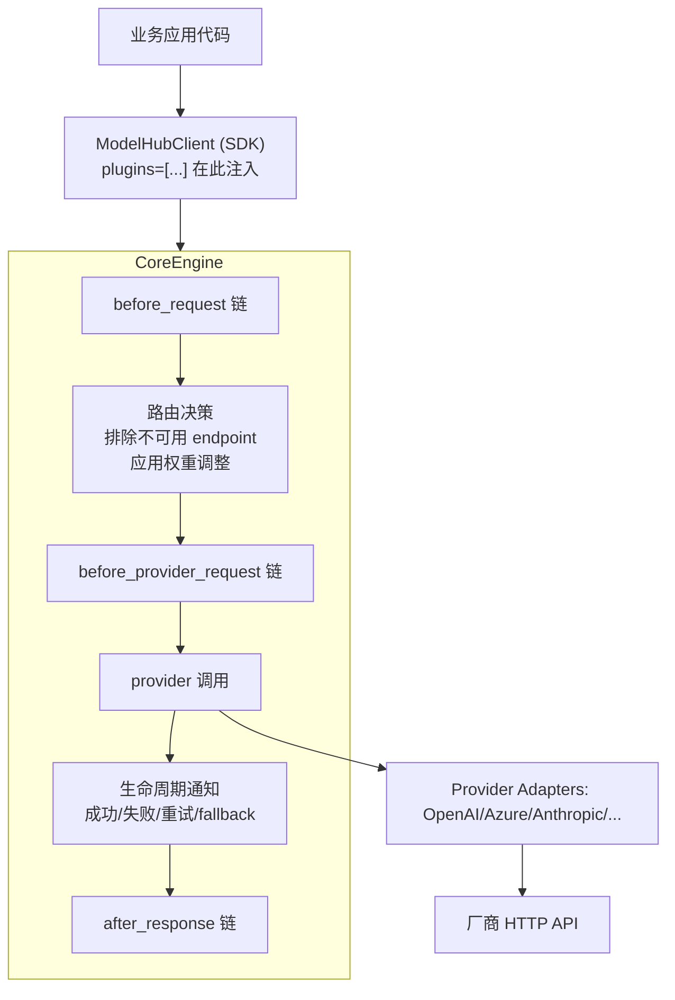

# Model Hub 插件机制学习笔记

> 这是一份**学习导向**的笔记，回答四个问题：**解决什么问题 → 用在哪里 → 怎么用 → 怎么实现**。
> 项目里另有一份 API 参考手册 `docs/plugin.md`，本笔记补齐它缺失的设计动机叙述和新增 hook（截至 2026-06）。

---

## 一、它要解决什么问题

Model Hub 是统一的大模型调用 SDK，核心职责是「一次调用，路由到多 provider / 多 endpoint，失败自动重试与降级」。但**可靠性逻辑和业务无关、却又彼此独立**：

- 熔断：某 endpoint 连续失败，要暂时摘掉，别再往坑里送请求。
- 限流：主动控速 + 被动消化 429（尊重 `Retry-After`）。
- 观测：每次调用上报 Langfuse / OTel。
- 流式容错：首 token 太慢就换、中途断了要续写、收到一堆垃圾字符要重试。
- 区域特例：CN provider 要注入私有 header。

如果把这些全塞进 `engine.py` 的主调用路径，会得到一个无法维护的巨型函数：每加一个可靠性特性都要改核心、改测试、互相耦合。

**插件机制就是把这些横切关注点（cross-cutting concerns）从主流程里剥离出来**，让 engine 只负责「在固定的生命周期节点上，依次询问/通知所有插件」。核心收益：

1. **可组合**：熔断 + 限流 + 观测 + 流式容错可任意叠加，互不感知。
2. **可扩展**：写新插件不动 engine 核心。
3. **职责单一**：每个插件只关心自己那一件事。

这是经典的**责任链 + 组合模式**，配合 Python 的 `Protocol`（鸭子类型接口）实现「一个插件按需实现多个能力接口」。

---

## 二、用在哪里（架构位置）



- **注入点**：`ModelHubClient(plugins=[...])`，或运行时 `engine.add_plugin()/remove_plugin()`。
- **执行点**：全部在 `CoreEngine`（[engine.py](packages/core/src/model_hub_core/engine.py)）。插件**对业务代码透明**——应用只管 `client.chat(...)`。
- **接口定义**：[plugins/base.py](packages/core/src/model_hub_core/plugins/base.py)。

---

## 三、七种能力接口（设计的骨架）

一个插件 = 继承 `Plugin` 基类（拿到 6 个生命周期方法的默认空实现）+ 按需实现若干 `Protocol` 能力接口。engine 在初始化时用 `isinstance` 把插件**按接口分类缓存**，运行时直接遍历对应缓存，避免每次 `isinstance`。

| 接口 | 类型 | 触发时机 | 典型用途 |
|---|---|---|---|
| `Plugin.before_request` | 基类方法 | 路由**前**，每次请求一次 | 改 prompt / 加通用参数 |
| `Plugin.before_provider_request` | 基类方法 | 路由**后**、provider dispatch 前 | 按目标 endpoint 差异化注入（CN header） |
| `Plugin.after_response` | 基类方法 | 成功响应后 | 改响应 / 业务错误识别 / 观测 |
| `Plugin.on_error` | 基类方法 | 最终失败时 | 记日志 |
| `Plugin.on_stream_provider_error` | 基类方法 | 流式**已 yield chunk 后**报错 | 中途续写 / 换端重跑 |
| `Plugin.wrap_async_stream` | 基类方法 | 迭代 async 流前包一层 | 首 token 超时 / 静默超时 / junk 过滤 |
| `EndpointFilterProvider` | Protocol | 路由选 endpoint 时 | 熔断器、限流器报告「哪些不可用」 |
| `InvocationLifecycleHook` | Protocol | **每次** provider 调用后（含每次重试） | 更新熔断统计、细粒度监控 |
| `RetryInfoProvider` | Protocol | 决定退避时长时 | 限流器给出 `Retry-After` 建议 |
| `RetryLifecycleHook` | Protocol | 重试 / 重试耗尽节点 | 观测重试事件 |
| `FallbackLifecycleHook` | Protocol | 跨 logical model 降级节点 | 观测降级（如 gpt-5 → gpt-5.5） |
| `WeightAdjustmentProvider` | Protocol | 路由计算权重时 | 自适应负载均衡 |

> 注意 `InvocationLifecycleHook`（每次尝试都触发）和 `after_response`（整体成功才触发一次）的区别——这是初学最容易混的点。熔断统计必须用前者，因为它要看到每一次失败。

### `Protocol` 而非 `ABC` 的用意

能力接口用 `@runtime_checkable Protocol`，意味着插件**不必显式继承**就能被识别——只要方法签名对得上即可。这让 `WeightAdjustmentProvider` 这类纯能力插件可以不继承 `Plugin` 基类（engine 用 `getattr(p, "order", 100)` 兜底取 order）。

---

## 四、engine 是怎么调度的（机制 + 源码）

### 4.1 排序与分类（构造时一次性完成）

[engine.py:199](packages/core/src/model_hub_core/engine.py#L199) 起：

```python
# 按 order 升序，越小越先；同 order 按注册顺序（sort 稳定）
self.plugins = sorted(plugins or [], key=_plugin_order)   # _plugin_order = getattr(p, "order", 100)
# 按接口分类缓存，运行时不再 isinstance
self._endpoint_filters     = [p for p in self.plugins if isinstance(p, EndpointFilterProvider)]
self._lifecycle_hooks      = [p for p in self.plugins if isinstance(p, InvocationLifecycleHook)]
self._retry_info_providers = [p for p in self.plugins if isinstance(p, RetryInfoProvider)]
self._retry_lifecycle_hooks= [p for p in self.plugins if isinstance(p, RetryLifecycleHook)]
self._fallback_lifecycle_hooks = [p for p in self.plugins if isinstance(p, FallbackLifecycleHook)]
self._weight_adjusters     = [p for p in self.plugins if isinstance(p, WeightAdjustmentProvider)]
```

`add_plugin()` 会 **append 后整体重排 + 重建全部缓存**（[engine.py:2329](packages/core/src/model_hub_core/engine.py#L2329)），保证后注册的插件也按 order 落到正确位置。

### 4.2 order 约定（数值越小越先）

| order | 插件 | 为什么是这个位置 |
|---|---|---|
| 5 | RateLimitPlugin | 限流要最先判断，没令牌直接挡 |
| 10 | CircuitBreakerPlugin / OTel | 熔断早于业务；观测要包住调用 |
| < 10 | PlaudModerationPlugin | **必须早于 OTel(10)/Langfuse(200) 的 after_response**，否则 header 注入时序错位 |
| 100 | 默认 | 普通插件 |
| 200 | LangfusePlugin | 最后跑，捕获最完整信息 |

### 4.3 非流式主流程（[engine.py:440](packages/core/src/model_hub_core/engine.py#L440) 起）

```
1. before_request 链（按 order）           # 改请求
2. 进入重试循环：
   a. _route()：排除 _get_excluded_endpoints() ∪ 熔断集合
                再 _apply_weight_adjustments() 调权重
   b. before_provider_request 链           # 路由后注入
   c. provider 调用
      ├─ 成功 → _notify_invocation_success() → after_response 链 → 返回
      └─ 失败 → _notify_invocation_failure()（带 should_circuit_break）
               → 要重试？ get_suggested_backoff() 取退避 → on_retry_attempt() → 退避 → 回到 a
               → 不重试/耗尽 → on_retry_exhausted() → on_error 链 → 抛错
```

关键细节：`after_response` 可以把 provider 的「成功响应」重新分类为业务错误并抛出，触发 failover（[engine.py:496](packages/core/src/model_hub_core/engine.py#L496)）。

### 4.4 权重合并算法（[engine.py:2390](packages/core/src/model_hub_core/engine.py#L2390)）

多个 `WeightAdjustmentProvider` 的乘数如何合并，是个值得记住的设计：

- **降权**（乘数 < 1.0）：所有降权取 **min**——最激进的获胜（出问题就该最快减压）。
- **加成**（乘数 > 1.0）：所有加成取 **max**——保留「方案 B」跨端点补偿。
- 同一 endpoint 同时有降权和加成：最终 = `penalty × bonus`。
- 最终权重 `max(1, round(weight × multiplier))`——**下限为 1**，永远保留探测流量，让降权的 endpoint 还能收到少量请求从而有机会恢复。彻底摘除应走熔断（`excluded_endpoints`），不是降权到 0。

### 4.5 流式的特殊处理

流式响应一旦把 chunk 发给调用方就**无法回滚**，所以流式有两套独立的容错 hook：

- **首 chunk 之前**出问题 → 走 `wrap_async_stream` 抛 `ProviderError` → engine 标准 failover（调用方还没收到任何东西，可无感换端）。
- **首 chunk 之后**出问题 → 走 `on_stream_provider_error`，返回 `ContinuationDecision`：
  - `ABORT`：放弃，抛错（默认）。
  - `RETRY_ORIGINAL`：换下一个 endpoint 重跑。
  - `RETRY_RESUME`：把已产出文本作为 assistant message 注入，让模型续写。

`_consult_stream_recovery()`（[engine.py:2617](packages/core/src/model_hub_core/engine.py#L2617)）**遍历插件返回第一个非 ABORT 决策**；若某插件自己抛错，会调 telemetry 插件的 `on_error` 上报后继续。

`wrap_async_stream` 链是**层层包裹**（[engine.py:1823](packages/core/src/model_hub_core/engine.py#L1831)）：`stream = plugin.wrap_async_stream(stream, ctx)` 依次套娃。注意它**只对原生 async provider 生效**——sync-only provider 被 `_sync_to_async_stream` 包过，不调此 hook（因为 `asyncio.wait_for` 取消不了底层阻塞线程）。

### 4.6 容错原则

Fallback 类 hook 的通知（[engine.py:2560](packages/core/src/model_hub_core/engine.py#L2560)）全部 `try/except` 包裹，插件抛错只 `logger.warning`，**绝不影响主调用**。这是插件机制的底线：观测/容错插件自己挂了，不能拖垮真正的请求。自定义插件也应遵守——见第六节。

---

## 五、内置插件全景

| 插件 | 文件 | 实现的接口 | 一句话 |
|---|---|---|---|
| **CircuitBreakerPlugin** | core/circuit_breaker.py | EndpointFilter + InvocationHook | 滑动窗口失败率超阈值 → OPEN，摘除 endpoint，超时后 HALF_OPEN 探测 |
| **RateLimitPlugin** | core/rate_limit.py | EndpointFilter + InvocationHook + RetryInfo | 令牌桶主动限流 + 解析 429/`Retry-After` 被动限流 |
| **AdaptiveWeightPlugin** | core/adaptive_weight.py | WeightAdjustment | 滑动窗口统计 429，动态降权；降权立即、恢复限速（防振荡） |
| **TTFTFailoverPlugin** | core/ttft_failover.py | wrap_async_stream | 首 token 超 N 秒未到 → failover 换端（空 chunk 不重置计时） |
| **PostChunkSilencePlugin** | core/post_chunk_silence.py | wrap_async_stream | 首 chunk 后相邻 chunk 静默超时 → raise 499 触发恢复 |
| **JunkStreamPlugin** | core/junk_stream.py | wrap_async_stream | 持续输出纯空白/标点累计超阈值 → raise 499 重试（junk 先 buffer） |
| **StreamRecoveryPlugin** | core/stream_recovery.py | on_stream_provider_error | 流中途失败的总调度：按 status code 决定续写/重跑/放弃 |
| **LangfusePlugin** | sdk/langfuse.py | after_response（order=200） | 调用上报 Langfuse |
| **OTelPlugin** | sdk/otel.py | after_response（order=10） | OpenTelemetry span / metrics |
| **PlaudModerationPlugin** | sdk/plaud_moderation.py | before_provider_request | CN provider 注入 moderation 关闭 header |

> 流式三件套（TTFT + PostChunkSilence + JunkStream + StreamRecovery）来自 plaud-ask 的 ADR-013/014，配合使用：TTFT 管首 token 前，后三者管首 token 后的不同故障形态。

### 熔断器状态机（记忆要点）

```
CLOSED --(失败率≥阈值 且 调用数≥min_calls)--> OPEN
OPEN --(过 open_duration)--> HALF_OPEN
HALF_OPEN --(连续成功)--> CLOSED
HALF_OPEN --(失败)--> OPEN
```
配置：`failure_threshold` / `min_calls` / `window_size_seconds` / `open_duration_seconds` / `half_open_max_calls`。

### 限流器两种模式

- 主动：令牌桶（`bucket_capacity` 容量 + `refill_rate` 每秒补充），无令牌就拒。
- 被动：解析服务端 429，提取 `Retry-After` / `X-RateLimit-*`，限流期内把 endpoint 报为不可用。
- 与熔断协作：`exclude_429_from_circuit_breaker=True`——429 是限流不是故障，不该计入熔断统计（双重惩罚）。这正是 `_notify_invocation_failure` 里 `should_circuit_break` 标志的来源。

---

## 六、怎么用

### 6.1 注册

```python
from model_hub_sdk import ModelHubClient
from model_hub_core.plugins.circuit_breaker import CircuitBreakerPlugin, CircuitBreakerConfig
from model_hub_core.plugins.rate_limit import RateLimitPlugin
from model_hub_sdk.plugins import LangfusePlugin

client = ModelHubClient(
    app_id="summary", env="prod",
    plugins=[
        RateLimitPlugin(),                                  # order=5
        CircuitBreakerPlugin(CircuitBreakerConfig(failure_threshold=0.3)),  # order=10
        LangfusePlugin(),                                   # order=200
    ],
)
# 顺序无所谓，engine 会按 order 重排
```

### 6.2 写一个自定义插件

继承 `Plugin`，按需实现能力接口。下面是一个「维护模式 + 指标」插件：

```python
from model_hub_core.plugins.base import Plugin, EndpointFilterProvider, InvocationLifecycleHook

class MyPlugin(Plugin, EndpointFilterProvider, InvocationLifecycleHook):
    @property
    def order(self) -> int:
        return 20

    def __init__(self):
        self._down: set[str] = set()
        self._stats: dict[str, dict] = {}

    # EndpointFilterProvider：告诉路由哪些不可用
    def get_unavailable_endpoints(self) -> set[str]:
        return self._down.copy()

    # InvocationLifecycleHook：每次调用后更新统计
    def on_invocation_success(self, endpoint_id, latency_ms):
        self._stats.setdefault(endpoint_id, {"ok": 0, "err": 0})["ok"] += 1

    def on_invocation_failure(self, endpoint_id, error, should_circuit_break):
        self._stats.setdefault(endpoint_id, {"ok": 0, "err": 0})["err"] += 1
```

### 6.3 自定义插件的三条铁律

1. **不要让插件异常炸穿主流程**：`before_request`/`after_response` 出错应 `try/except` 后返回原始对象。engine 对 fallback/telemetry hook 已兜底，但业务 hook 的容错由你负责。
2. **线程安全**：内置插件都用 `RLock` 保护可变状态，自定义插件持有共享状态时同理。
3. **持有外部资源就实现 `shutdown()` 清理**。

---

## 七、一句话总结

> Model Hub 的插件机制 = **责任链 + 组合模式 + Protocol 鸭子接口**。engine 在请求的固定生命周期节点（路由前/后、调用成功/失败、重试、降级、流式包裹）上，按 order 依次询问或通知所有插件；每个插件只实现自己关心的能力接口。可靠性（熔断/限流/自适应权重/流式容错）和可观测性（Langfuse/OTel）由此从核心剥离，做到可组合、可扩展、互不感知。

---

## 待深挖（TODO）

- [ ] 读 `circuit_breaker.py` 滑动窗口的具体数据结构（deque？环形？）
- [ ] `adaptive_weight.py` 方案 B 重分配的数学：降权释放的权重如何按比例补给健康端点
- [ ] `stream_recovery.py` 的 `max_continuations` 与 engine endpoint 池如何共同约束恢复次数
- [ ] passthrough 模式下 `raw_chunk` 与 `has_payload` 的判定差异
