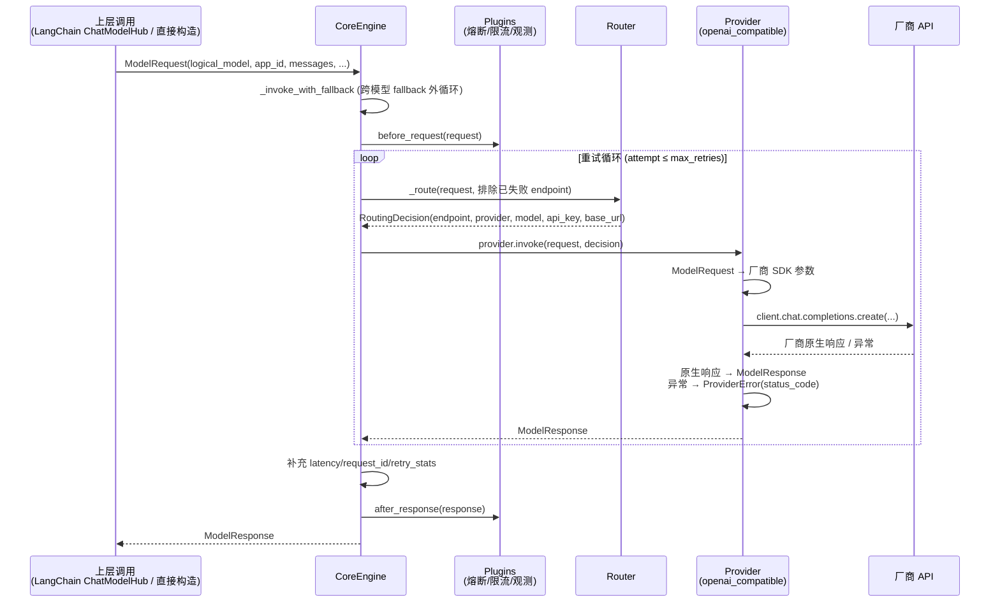

# Model Hub 统一模式数据链路详解

> 创建日期：2026-07-08
> 基于代码版本：core/sdk 0.20.0（master @ 1a85fb8）
> 相关笔记：[[PlaudModelHub架构介绍]]、[[PlaudModelHub调度与容错]]、[[model-hub-project-overview]]

## 0. 一图总览

统一模式的本质：**上层不管用什么姿势调用，最终都被翻译成一个 `ModelRequest`（统一字段），Engine 拿着它做路由和容错，Provider 在最后一米把它翻译成某家厂商 SDK 的调用，再把厂商响应翻译回 `ModelResponse`。** 格式转换只发生在两端，中间全程是统一数据结构。



## 1. 上层是如何被「统一」的

统一模式下，所有调用姿势最终都收敛到同一个数据结构。以 LangChain 集成为例（业务最常用的入口），`packages/sdk-python/src/model_hub_sdk/integrations/langchain/chat_model.py:509` 的 `_build_request` 做的就是这件翻译工作：

```python
def _build_request(self, messages, stop=None, **kwargs) -> ModelRequest:
    hub_messages = self._convert_messages_to_hub(messages)   # LangChain Message → 统一 Message
    temperature = kwargs.pop("temperature", self.temperature)
    ...
    if "tools" in kwargs:                                    # LangChain tool → OpenAI tool schema
        provider_params["tools"] = [convert_to_openai_tool(t) for t in tools]
    if tool_choice == "any":                                 # 归一化各框架的方言
        tool_choice = "required"
    return ModelRequest(
        logical_model=self.model,      # ← 逻辑模型名，不是物理模型
        app_id=self.app_id,
        messages=hub_messages,
        temperature=temperature,
        session_id=self.session_id,    # ← 粘性路由
        provider_params=provider_params,  # ← 认识的字段上浮，不认识的透传
    )
```

关键设计有三个：

1. **调用方只说「逻辑模型」**。`logical_model="gemini-2.5-pro"` + `app_id="project-summary"` 是路由的 key，具体打到哪个厂商哪个 region 由配置决定——这就是「换模型只改配置」在调用侧的体现。
2. **统一字段 + 逃生舱**。`messages / temperature / max_tokens` 是跨厂商语义一致的字段，被提升到 `ModelRequest`（`packages/core/src/model_hub_core/models.py:189`）顶层；其余厂商特有参数丢进 `provider_params` 字典原样带到 Provider。这是 v1 的教训——不试图统一所有参数。
3. **统一模式 = `passthrough_mode=DISABLED`**（默认值）。同一个 `ModelRequest` 结构还承载透传模式（`raw_request` 字段），但统一模式下这些字段为空，Provider 看 `passthrough_mode` 分流。

### 入口决定进出的数据类型（一进一出对称）

上面的 `_build_request` 只是 LangChain 集成层的**入向**翻译。既然进来时把 LangChain 类型翻成了 `ModelRequest`，回程就得把 `ModelResponse` 翻回 LangChain 类型——这两步是同一层的一进一出，必须成对看。**因此业务方最终拿到的返回类型不是固定的，取决于它从哪一层进入：**

- **走 LangChain 入口**（`ChatModelHub.invoke/stream`，业务最常用）：`_generate`（chat_model.py:627）先 `_build_request` 翻入，再 `_transport.invoke` 拿到 `ModelResponse`，最后经 `_convert_response_to_langchain`（chat_model.py:346）把它翻回 **LangChain `AIMessage`**（流式则是 `AIMessageChunk`）交给业务。`ModelResponse` 在这条路上只是**内部中间产物**，业务全程只跟 LangChain 类型打交道，看不到它。
- **跳过 LangChain 直接调 `engine.invoke()`**：没有集成层做回程翻译，业务**直接拿到 `ModelResponse`**；入向也一样，业务自己构造 `ModelRequest`，数据结构与 LangChain 翻出来的完全一致。

一句话：`ModelResponse` 是 Engine ↔ Provider 之间的**内部统一货币**，业务看到什么由入口决定——**从哪个门进，就从哪个门出**。

## 2. Engine：编排层（不碰格式，只管「打谁、挂了怎么办」）

入口 `packages/core/src/model_hub_core/engine.py:212` `invoke()`，实际是两层嵌套循环：

**外循环：跨模型 fallback**（`_invoke_with_fallback`，engine.py:252）——当前逻辑模型的所有 endpoint 都耗尽后（收到 `NoAvailableEndpointError`），按配置的 fallback 链换一个逻辑模型重来（如 `gpt-5` → `gemini-2.5-pro`）。

**内循环：单模型的重试 + endpoint failover**（`_invoke_internal`，engine.py:413），每一轮做六件事：

```python
while attempt <= current_max_retries:
    decision = self._route(request, context, tried_endpoints)   # ① 路由（排除已失败的）
    provider = self.provider_registry.get(decision.provider)    # ② 按名字取 Provider
    eff_request = self._effective_request(request, decision)    # ③ 合并 endpoint 级默认参数
    response = provider.invoke(eff_request, decision)           # ④ ★ 唯一一次真正调用
    response.latency_ms = ...; response.request_id = ...        # ⑤ 补调用侧信息
    for plugin in self.plugins:
        response = plugin.after_response(request, response, context)  # ⑥ 后置插件
    return response
```

失败路径是这段代码的灵魂（engine.py:501 起的 `except ProviderError`）：

- **可重试错误**（429/5xx/超时，按 `retry_on_status_codes` 配置）→ 退避后重试；其中 **429 特殊处理**：先在同 endpoint 退避重试一次（尊重 Retry-After），再失败才把 endpoint 加入 `tried_endpoints` 换下一个；
- **不可重试错误**（4xx 参数错）→ 不浪费重试次数，但仍标记该 endpoint 并 failover 到其他 endpoint；
- **所有 endpoint 耗尽** → 抛 `NoAvailableEndpointError`，触发外循环的跨模型 fallback。

注意 Engine 全程只操作 `ModelRequest`/`ModelResponse`/`ProviderError` 三个统一类型，**它不知道也不关心 OpenAI 和 Anthropic 的报文长什么样**——这是它能对所有厂商复用同一套重试/熔断/fallback 逻辑的前提。

## 3. Router：把逻辑名变成物理坐标

`engine.py:2072` `_route()` 是配置驱动的查表 + 决策：

```python
model_config = config.get_model_config(app_id, logical_model, env, region, request_type)
policy       = config.get_route_policy(app_id, logical_model)          # 加权/轮询/优先级
endpoints    = self._apply_weight_adjustments(model_config.endpoints)  # 自适应权重插件干预
endpoint     = self.router.choose(endpoints, policy,
                                  session_id=request.session_id,       # 会话粘性在这里生效
                                  excluded_endpoints=all_excluded)     # 熔断/已失败的被排除
credential   = config.get_credential(endpoint.credential_ref)          # 密钥单独一段配置
return RoutingDecision(endpoint_id, provider, model,      # ← model 是物理模型名
                       base_url, api_key, timeout_ms, extra)
```

产出的 `RoutingDecision` 是一张「物理坐标卡」：去哪个 provider、用什么物理模型名、什么 base_url、什么 key。**统一抽象（logical_model）到厂商现实（decision.model）的降维就发生在这一步。**

## 4. Provider：最后一米的「翻译官」

### 4.1 它在架构里的位置和职责边界

Provider 的抽象基类在 `packages/core/src/model_hub_core/providers/base.py:176`。它**只做四件事，且只做这四件事**：

| 职责 | 代码位置（以 openai_compatible 为例） |
|---|---|
| ① Client 构造与连接池化 | base.py:69 `ClientPool` + openai_compatible.py:230 `_get_pooled_client` |
| ② 统一请求 → 厂商原生请求 | openai_compatible.py:499 `_invoke_chat` |
| ③ 厂商原生响应 → 统一响应 | openai_compatible.py:1110 `_convert_response` |
| ④ 厂商异常 → 统一 `ProviderError`（含 status_code 提取） | base.py:689 `_extract_status_code` |

它**不做**：路由、重试、熔断、fallback（全在 Engine）；也不做密钥管理（Router 通过 `RoutingDecision` 递给它）。甚至各家 SDK 自带的重试都被显式关掉（`max_retries=0`），避免和 Engine 双重重试。

### 4.2 入口：三岔分派

`base.py:224` 的 `invoke()` 是 v2 架构的具象化——统一模式走第一个分支：

```python
def invoke(self, request, decision):
    if not request.is_passthrough:
        return self._invoke_unified(request, decision)      # ← 统一模式（本文主角）
    if request.source_style == self.api_style:
        return self._invoke_passthrough(request, decision)  # 同风格透传，零转换
    else:
        return self._invoke_adapted(request, decision)      # 跨风格适配
```

### 4.3 统一模式的具体实现（以 openai_compatible.py 为例）

**第一步：按请求类型二次分发**（openai_compatible.py:357）。这里有个厂商知识的好例子——Azure 上 GPT-5.5 的某些参数组合必须走 `/v1/responses` 而不是 `chat.completions`，否则直接 400。这种「坑」被封装在 Provider 内部，上层完全无感：

```python
def _invoke_unified(self, request, decision):
    if request.request_type == RequestType.CHAT:
        if _payload_needs_responses_api(request.provider_params):
            return self._invoke_chat_responses(request, decision)   # ADR-011
        return self._invoke_chat(request, decision)
    if request.request_type == RequestType.EMBEDDING:
        return self._invoke_embedding(request, decision)
```

**第二步：组装并发出真实调用**（openai_compatible.py:499）：

```python
def _invoke_chat(self, request, decision):
    client = self._get_pooled_client(decision)        # ① 按 (base_url, api_key) 复用连接
    messages = self._serialize_messages(request.messages)  # ② 统一 Message → OpenAI dict

    # ③ 厂商细节：None ≠ 省略。OpenAI SDK 里 None 会被序列化成 JSON null，
    #    gpt-5 系严格校验直接 400 —— 所以只在显式给值时才传
    opt_params = {}
    if request.temperature is not None:
        opt_params["temperature"] = request.temperature

    try:
        response = client.chat.completions.create(
            model=decision.model,          # ← 用路由决策里的【物理】模型名
            messages=messages,
            **opt_params,
            **provider_params,             # ← 逃生舱参数原样透传
        )
    except Exception as e:
        raise ProviderError(               # ④ 异常归一化：Engine 只认这个
            message=str(e), provider=self.name, original_error=e,
            status_code=self._extract_status_code(e),   # 429/500 → Engine 据此决定重试
            response_headers=self._extract_response_headers(e),  # Retry-After 在这里
        )
    return self._convert_response(response, decision)
```

**第三步：响应归一化**（openai_compatible.py:1110）——把 OpenAI 的 `choices/tool_calls/usage` 逐字段搬进统一的 `ModelResponse`，并盖上「这次实际是谁服务的」的戳：

```python
return ModelResponse(
    id=response.id,
    choices=choices,               # tool_calls 的 arguments 已从 JSON 字符串解析为 dict
    usage=Usage(prompt_tokens=..., completion_tokens=..., total_tokens=...),
    model=response.model,          # 物理模型名（观测时能看到真实命中）
    provider=self.name,
    endpoint_id=decision.endpoint_id,
)
```

### 4.4 为什么 Provider 值得单独一层：厂商方言的「隔离带」

对比不同 Provider 实现同一个 `_invoke_unified`，就能看清这层的价值——每家的方言差异被彻底关在各自文件里：

- **OpenAI 系**（openai_compatible.py）：`temperature` 的 None/省略语义、Chat vs Responses API 分流、`reasoning_content` vs `reasoning` 字段别名（豆包/DeepSeek/OpenRouter 各不同，见 `_convert_stream_chunk` 的注释）；
- **Anthropic**（anthropic.py）：`max_tokens` 必填、`system` 不在 messages 里、`tool_choice="required"` 要翻成 `{"type": "any"}`；
- **GenAI/Gemini**（genai.py）：`contents/parts` 结构、`function_call` parts、thought parts。

对照 legacy plaud-summary：这些方言知识当时以 `is_gemini_rate_limit_error` 这种字符串嗅探的形式散落在业务仓库里。Provider 层就是给它们安排的「集中收容所」——新接一家厂商，只需实现 `_invoke_unified` + `_convert_response` + 错误码映射三样，注册进 `providers/registry.py`，Engine 的路由/重试/熔断/fallback 自动对它生效。

## 5. 一次调用的数据形态变化（收尾串一遍）

| 阶段 | 数据形态 | 谁负责 |
|---|---|---|
| 业务代码 | LangChain messages / 原生风格参数 | 业务 |
| SDK 入口 | → `ModelRequest`（逻辑模型 + 统一字段 + provider_params） | `_build_request` |
| Engine | `ModelRequest` 原样流转，只附加路由/重试上下文 | engine.py |
| Router | + `RoutingDecision`（物理坐标：provider/model/base_url/key） | `_route` |
| Provider 入 | `ModelRequest` → 厂商 SDK 参数（唯一一次请求转换） | `_invoke_chat` |
| 厂商 API | HTTP 请求/响应 | 厂商 SDK |
| Provider 出 | 厂商响应 → `ModelResponse`；厂商异常 → `ProviderError` | `_convert_response` |
| Engine 回程 | + latency/request_id/retry_stats，过 after_response 插件链 | `_invoke_internal` |
| 业务代码 | LangChain 入口 → `AIMessage`；裸 Engine 入口 → `ModelResponse`（见 §1「入口决定进出的数据类型」） | SDK 集成层 / 业务自持 |

**记忆锚点：Engine 管「打谁、挂了怎么办」，Router 管「逻辑名→物理坐标」，Provider 管「两种语言互译 + 厂商方言隔离」。** 统一模式下转换恰好两次（进出各一次），这也正是 v2 相对 v1（四次转换）的核心改进在统一路径上的体现。
